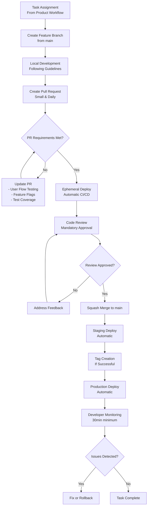

# Engineering Development Process

This document describes the engineering development process, focused on technical implementation and software delivery. For the product development process (strategy, discovery, and feature definition), see the [product workflow](/docs/product/workflow).

## Overview

Our engineering development process is based on agility and velocity, following the principles described in [First, We Aim for Velocity](/blog/2024/12/17/first-we-aim-for-velocity-driving-fast-and-adaptive-product-development). We use **Trunk-Based Development** as our branching model to ensure continuous integration and rapid deliveries.

<!-- truncate -->

## Development Workflow



## Development Process

### Task Assignment

Tasks come from the [product workflow](/docs/product/workflow) with defined requirements, acceptance criteria, and priority.

### Local Development

#### Trunk-Based Development

We follow the [Trunk-Based Development](https://trunkbaseddevelopment.com/) model, where:

- **Main branch (`main`)**: Always contains stable code ready for production
- **Feature branches**: Short-lived branches (maximum 1-2 days) created from `main`
- **Frequent integration**: Small and frequent commits to the main branch

#### Creating Pull Request

1. **Create branch** from `main`:

   ```bash
   git checkout main
   git pull origin main
   git checkout -b feature/feature-name
   ```

2. **Develop** following our [coding practices](/docs/engineering/guidelines)

3. **Create Pull Request** on GitHub when the feature is ready

#### Pull Request Requirements

Every PR must include:

- **User Flow Validation**: Complete the PR template checklist confirming which user flows were tested
- **Size Limitation**: PRs should be small and focused (ideally daily submissions)
- **Feature Flags**: New features must use [feature flags](/docs/engineering/guidelines/feature-flags) for controlled rollout
- **Test Coverage**: Maintain or improve package test coverage baseline

#### Small Daily Pull Requests

To ensure thorough code review and faster feedback:

- **Maximum one PR per developer per day**
- **Focus on single functionality** or bug fix
- **Limit scope** to 200-400 lines of code when possible
- **Break large features** into smaller, incremental changes
- **Frequent integration** reduces merge conflicts and review complexity

### 3. Ephemeral Deploy & Code Review

Each PR automatically gets an ephemeral deploy for testing before mandatory code review approval.

### 4. Deployment Pipeline

After merge to `main`: **Staging Deploy** → **Tag Creation** → **Production Deploy**

All deployments are automated through GitHub Actions.

## Developer Responsibilities

**Post-Deploy Monitoring**: Monitor production for 30+ minutes after deployment. Fix issues quickly or rollback if necessary.

**Complete Ownership**: Responsible for the entire cycle from development through post-deployment support.

## Tools and Technologies

- **GitHub Actions**: CI/CD automation
- **Ephemeral deploys**: Temporary PR environments
- **Monitoring**: Centralized logs, metrics, and alerts
- **Communication**: Slack (alerts), GitHub (reviews), ClickUp (tasks)

## Core Principles

- **Velocity with Quality**: Fast cycles, continuous testing, small incremental changes
- **Shared Responsibility**: Developer autonomy with full accountability from code to production
- **Continuous Improvement**: Regular retrospectives and process adaptation

## Product Integration

This engineering workflow integrates with the [product workflow](/docs/product/workflow) at the following points:

- **Task assignment**: Tasks defined in the product process
- **Implementation feedback**: Technical feedback on feasibility and effort
- **Delivery validation**: Confirmation that product criteria have been met
- **Metrics monitoring**: Tracking of KPIs defined by product

For more details on how tasks are created and prioritized, see the [product documentation](/docs/product/workflow).
