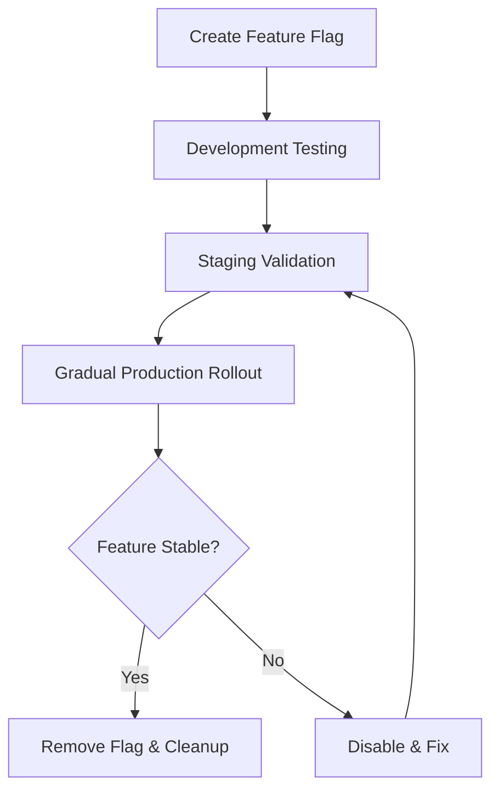

# Feature Flags Guidelines

Feature flags enable controlled rollout of new features, instant rollback capability, and decoupled deployment from feature activation. Every new feature must implement feature flags as part of our systematic approach to reducing production bugs.

## When to Use Feature Flags

**Required for all new features** to enable:

- **Risk mitigation**: Instant disable without deployment
- **Gradual rollouts**: Test with subset of users first
- **A/B testing**: Compare feature performance
- **Decoupled deployment**: Ship code without activating features

## Implementation Patterns

### React Applications

Use `@ttoss/react-feature-flags` for React applications:

```tsx
import { FeatureFlag } from '@ttoss/react-feature-flags';

const MyComponent = () => {
  return (
    <FeatureFlag name="new-checkout-flow" fallback={null}>
      <NewCheckoutComponent />
    </FeatureFlag>
  );
};
```

### Backend Services

For backend implementations, use environment variables or configuration:

```typescript
const isFeatureEnabled = (featureName: string): boolean => {
  return process.env[`FEATURE_${featureName.toUpperCase()}`] === 'true';
};

if (isFeatureEnabled('new_payment_processor')) {
  // New implementation
} else {
  // Existing implementation
}
```

## Best Practices

### Unique Entrypoints

Ensure all feature dependencies are contained within the feature flag boundary:

```tsx
// ✅ Correct: All dependencies inside feature flag
<FeatureFlag name="my-feature" fallback={null}>
  <MyNewComponent />
</FeatureFlag>;

// ❌ Incorrect: Dependencies outside feature flag
const data = useMyNewComponentHook(); // Executes even when disabled
<FeatureFlag name="my-feature" fallback={null}>
  <MyNewComponent data={data} />
</FeatureFlag>;
```

### Naming Conventions

- Use descriptive, kebab-case names: `new-checkout-flow`
- Include scope when needed: `admin-advanced-reporting`
- Avoid generic names: `feature-a`, `test-feature`

### Lifecycle Management



1. **Development**: Create flag, implement feature
2. **Staging**: Validate with flag enabled
3. **Production**: Gradual rollout (5% → 25% → 50% → 100%)
4. **Cleanup**: Remove flag after stable period (typically 2 weeks)

## Integration with Development Process

### Pull Request Requirements

Every PR with new features must:

- Include feature flag implementation
- Document flag name and purpose
- Provide rollback plan via flag disable

### Code Review Checklist

- [ ] Feature flag implemented for new functionality
- [ ] Unique entrypoint pattern followed
- [ ] Fallback behavior defined
- [ ] Flag name follows conventions
- [ ] Documentation updated

### Deployment Strategy

- Deploy code with flag **disabled** by default
- Enable flag in staging for testing
- Gradual production rollout via configuration
- Monitor metrics during rollout

## Flag Management

### Configuration

Manage flags through:

- **Environment variables** for backend services
- **Configuration files** for frontend builds
- **Runtime configuration** for dynamic updates

### Monitoring

Track flag usage:

- **Activation rates**: Percentage of users seeing new feature
- **Error rates**: Compare flagged vs. unflagged implementations
- **Performance metrics**: Monitor impact of new features

### Cleanup Process

Remove flags after features are stable:

1. **Monitor period**: 2 weeks minimum after 100% rollout
2. **Remove flag logic**: Replace with direct implementation
3. **Update tests**: Remove flag-related test scenarios
4. **Documentation**: Update feature documentation

## Examples

### Simple Toggle

```tsx
import { useFeatureFlag } from '@ttoss/react-feature-flags';

const Dashboard = () => {
  const showNewMetrics = useFeatureFlag('enhanced-metrics');

  return <div>{showNewMetrics ? <EnhancedMetrics /> : <BasicMetrics />}</div>;
};
```

### Complex Feature

```tsx
import { FeatureFlag } from '@ttoss/react-feature-flags';

const CheckoutPage = () => {
  return (
    <div>
      <FeatureFlag
        name="streamlined-checkout"
        fallback={<LegacyCheckoutFlow />}
      >
        <NewCheckoutFlow />
      </FeatureFlag>
    </div>
  );
};
```

## Related Documentation

- [Development Process](/docs/engineering/workflow/development-process) - Integration with PR workflow
- [Testing Guidelines](/docs/engineering/guidelines/tests) - Testing flagged features
- [@ttoss/react-feature-flags](/docs/modules/packages/react-feature-flags) - React implementation
