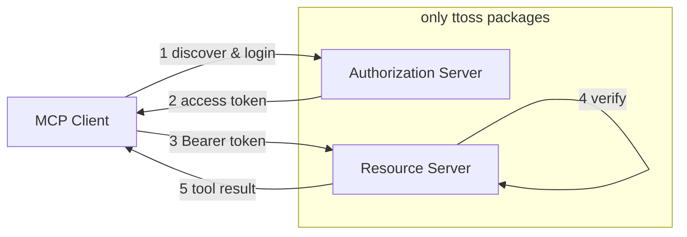

This guideline shows how to build a [Model Context Protocol (MCP)](https://modelcontextprotocol.io) server that authenticates MCP clients (Claude, Cursor, VS Code) with OAuth 2.1, using **only ttoss packages**. No external auth framework is required: [`@ttoss/http-server`](/docs/modules/packages/http-server) provides the Koa runtime, [`@ttoss/http-server-mcp`](/docs/modules/packages/http-server-mcp) provides both halves of MCP authorization, and [`@ttoss/auth-core`](/docs/modules/packages/auth-core) provides the token primitives. Your app keeps its own user model, signing keys, and login UI — ttoss owns only the protocol mechanics.

It is the MCP-specific application of two general patterns: issuing tokens ([OAuth Authorization Server](/docs/engineering/guidelines/oauth-authorization-server)) and consuming a third party's tokens ([OAuth Client](/docs/engineering/guidelines/oauth-third-party-client)).

## The two halves

OAuth for MCP splits into two independent responsibilities. A server can play either role, or both.



The **resource server** is the MCP endpoint itself: it verifies the Bearer token on every request and runs tools. The **authorization server** issues those tokens through the standard `/authorize` → `/token` flow. If you authenticate against an existing provider (Amazon Cognito, Auth0), you only need the resource-server half. If your app issues its own tokens, you add the authorization-server half too.

## Resource server: verifying tokens

`createMcpRouter` gates requests through its `auth` option. Invalid or missing tokens get `401 Unauthorized` before any tool runs — except for the MCP lifecycle methods `initialize` and `tools/list`, which stay public so a client can discover the server before it has a token (see [Client discovery](#client-discovery)).

### Against Amazon Cognito

Pass `cognitoUserPool` and the router builds a `CognitoJwtVerifier` (from `@ttoss/auth-core`) internally:

```typescript
import { App, bodyParser, cors } from '@ttoss/http-server';
import { createMcpRouter, McpServer, z } from '@ttoss/http-server-mcp';

const mcpServer = new McpServer({ name: 'my-mcp-server', version: '1.0.0' });

mcpServer.registerTool(
  'get-weather',
  { description: 'Get weather', inputSchema: { location: z.string() } },
  async ({ location }) => ({
    content: [{ type: 'text', text: `Weather in ${location}: Sunny` }],
  })
);

const mcpRouter = createMcpRouter(mcpServer, {
  auth: {
    cognitoUserPool: {
      userPoolId: process.env.COGNITO_USER_POOL_ID!,
      clientId: process.env.COGNITO_CLIENT_ID!,
    },
    // Advertise where clients should obtain tokens (OAuth discovery).
    resourceServerUrl: 'https://mcp.example.com',
    authorizationServerUrl: process.env.COGNITO_ISSUER_URL!,
  },
});

const app = new App();
app.use(cors());
app.use(bodyParser());
app.use(mcpRouter.routes());
app.listen(3000);
```

### Against your own tokens

When your app signs its own JWTs with `@ttoss/auth-core`, verify them with a custom `verifyToken`. The contract is minimal: resolve with an identity payload, or throw to reject.

```typescript
import { verifyJwt } from '@ttoss/auth-core';
import { createMcpRouter } from '@ttoss/http-server-mcp';

const mcpRouter = createMcpRouter(mcpServer, {
  auth: {
    verifyToken: async (token) => {
      const payload = verifyJwt({ token, secret: process.env.JWT_SECRET! });
      if (!payload) throw new Error('Invalid token');
      return payload;
    },
    resourceServerUrl: 'https://mcp.example.com',
    authorizationServerUrl: 'https://api.example.com',
  },
});
```

Opaque API tokens work the same way — hash the presented token with `@ttoss/auth-core` and look it up in your database, throwing when it is missing or revoked. See the [`@ttoss/http-server-mcp` README](/docs/modules/packages/http-server-mcp) for the opaque-token recipe and the `getIdentity()` / `checkScopes()` helpers used inside tool handlers.

### Client discovery

The [MCP authorization spec](https://spec.modelcontextprotocol.io/specification/2025-03-26/basic/authorization/) requires two behaviors so clients like Claude and Cursor can bootstrap OAuth without being pre-configured, and `createMcpRouter` handles both. The lifecycle methods `initialize` and `tools/list` bypass verification so the client can discover the server before authenticating — override the set with `publicMethods` (pass `[]` to require a token for every method). And when `resourceMetadataUrl` is set, a `401` advertises the [RFC 9728](https://www.rfc-editor.org/rfc/rfc9728) protected-resource document via `WWW-Authenticate: Bearer resource_metadata="…"`, pointing the client at the metadata that names the authorization server.

```typescript
const mcpRouter = createMcpRouter(mcpServer, {
  auth: {
    cognitoUserPool: { userPoolId: '...', clientId: '...' },
    resourceServerUrl: 'https://mcp.example.com',
    authorizationServerUrl: process.env.COGNITO_ISSUER_URL!,
    // Emit RFC 9728 discovery on 401.
    resourceMetadataUrl:
      'https://mcp.example.com/.well-known/oauth-protected-resource',
    // Defaults to ['initialize', 'tools/list'].
    publicMethods: ['initialize', 'tools/list'],
  },
});
```

Setting both `resourceServerUrl` and `authorizationServerUrl` also serves that metadata document at `/.well-known/oauth-protected-resource`, completing the discovery chain the `WWW-Authenticate` header points to.

## Authorization server: issuing tokens

To make your server first-party — so an MCP client discovers it, registers itself, and runs the full login flow against it — mount `oauthServer()` from `@ttoss/http-server` (also re-exported from `@ttoss/http-server-mcp`). It serves the discovery, `/authorize`, `/token`, and `/register` endpoints that MCP clients auto-discover, and you pair it with the `verifyToken` resource server above so one deployment both issues and verifies its tokens (set `scopesSupported: ['mcp:access']`).

These are general OAuth 2.1 primitives, not MCP-specific — the runner-agnostic engine is `createOAuthServer` in `@ttoss/auth-core`. The full setup — discovery, dynamic client registration, the authorize/PKCE flow, the token grants, and the ttoss-vs-app responsibility split — lives in the [OAuth Authorization Server](/docs/engineering/guidelines/oauth-authorization-server) guideline.

## Enforcing scopes

Gate the whole endpoint with `requiredScopes` (returns `403` before any tool runs), or call `checkScopes()` inside individual handlers for per-tool control:

```typescript
createMcpRouter(mcpServer, {
  auth: {
    cognitoUserPool: { userPoolId: '...', clientId: '...' },
    requiredScopes: ['mcp:access'],
  },
});
```

## Choosing your setup

| You authenticate against… | Use                                                          |
| ------------------------- | ------------------------------------------------------------ |
| Amazon Cognito            | `createMcpRouter({ auth: { cognitoUserPool } })`             |
| Another OAuth provider    | `createMcpRouter({ auth: { verifyToken } })` with `jose`     |
| Tokens your app issues    | `oauthServer` + `createMcpRouter({ auth: { verifyToken } })` |

In every case the only runtime dependencies are ttoss packages. Refer to the [`@ttoss/http-server-mcp`](/docs/modules/packages/http-server-mcp) and [`@ttoss/auth-core`](/docs/modules/packages/auth-core) documentation for the complete API surface.
