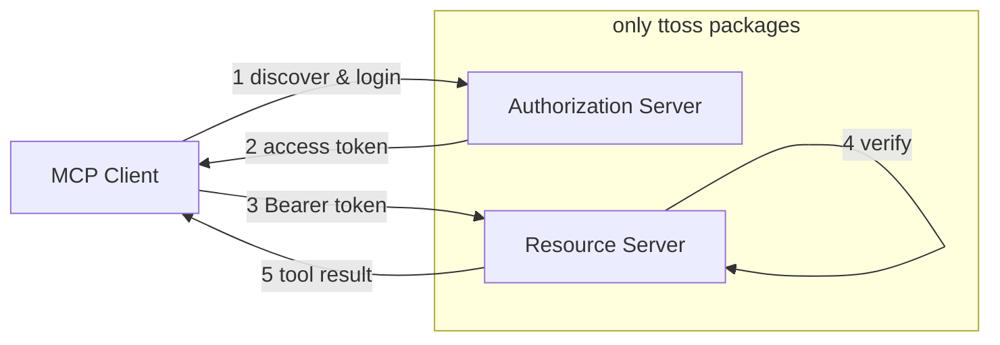

This guideline shows how to build a [Model Context Protocol (MCP)](https://modelcontextprotocol.io) server that authenticates MCP clients (Claude, Cursor, VS Code) with OAuth 2.1, using **only ttoss packages**. No external auth framework is required: [`@ttoss/http-server`](/docs/modules/packages/http-server) provides the Koa runtime, [`@ttoss/http-server-mcp`](/docs/modules/packages/http-server-mcp) provides both halves of MCP authorization, and [`@ttoss/auth-core`](/docs/modules/packages/auth-core) provides the token primitives. Your app keeps its own user model, signing keys, and login UI — ttoss owns only the protocol mechanics.

## The two halves

OAuth for MCP splits into two independent responsibilities. A server can play either role, or both.



The **resource server** is the MCP endpoint itself: it verifies the Bearer token on every request and runs tools. The **authorization server** issues those tokens through the standard `/authorize` → `/token` flow. If you authenticate against an existing provider (Amazon Cognito, Auth0), you only need the resource-server half. If your app issues its own tokens, you add the authorization-server half too.

## Resource server: verifying tokens

`createMcpRouter` gates every request through its `auth` option. Invalid or missing tokens get `401 Unauthorized` before any tool runs.

### Against Amazon Cognito

Pass `cognitoUserPool` and the router builds a `CognitoJwtVerifier` (from `@ttoss/auth-core`) internally:

```typescript
import { App, bodyParser, cors } from '@ttoss/http-server';
import { createMcpRouter, McpServer, z } from '@ttoss/http-server-mcp';

const mcpServer = new McpServer({ name: 'my-mcp-server', version: '1.0.0' });

mcpServer.registerTool(
  'get-weather',
  { description: 'Get weather', inputSchema: { location: z.string() } },
  async ({ location }) => ({
    content: [{ type: 'text', text: `Weather in ${location}: Sunny` }],
  })
);

const mcpRouter = createMcpRouter(mcpServer, {
  auth: {
    cognitoUserPool: {
      userPoolId: process.env.COGNITO_USER_POOL_ID!,
      clientId: process.env.COGNITO_CLIENT_ID!,
    },
    // Advertise where clients should obtain tokens (OAuth discovery).
    resourceServerUrl: 'https://mcp.example.com',
    authorizationServerUrl: process.env.COGNITO_ISSUER_URL!,
  },
});

const app = new App();
app.use(cors());
app.use(bodyParser());
app.use(mcpRouter.routes());
app.listen(3000);
```

### Against your own tokens

When your app signs its own JWTs with `@ttoss/auth-core`, verify them with a custom `verifyToken`. The contract is minimal: resolve with an identity payload, or throw to reject.

```typescript
import { verifyJwt } from '@ttoss/auth-core';
import { createMcpRouter } from '@ttoss/http-server-mcp';

const mcpRouter = createMcpRouter(mcpServer, {
  auth: {
    verifyToken: async (token) => {
      const payload = verifyJwt({ token, secret: process.env.JWT_SECRET! });
      if (!payload) throw new Error('Invalid token');
      return payload;
    },
    resourceServerUrl: 'https://mcp.example.com',
    authorizationServerUrl: 'https://api.example.com',
  },
});
```

Opaque API tokens work the same way — hash the presented token with `@ttoss/auth-core` and look it up in your database, throwing when it is missing or revoked. See the [`@ttoss/http-server-mcp` README](/docs/modules/packages/http-server-mcp) for the opaque-token recipe and the `getIdentity()` / `checkScopes()` helpers used inside tool handlers.

## Authorization server: issuing tokens

To make your server first-party — so an MCP client discovers it, registers itself, and runs the full login flow against it — add `createMcpAuthServer`. ttoss owns only PKCE, discovery metadata, code exchange, and dynamic client registration; everything app-specific stays behind pluggable hooks.

```typescript
import { signJwt, verifyJwt } from '@ttoss/auth-core';
import { App, bodyParser } from '@ttoss/http-server';
import { createMcpAuthServer } from '@ttoss/http-server-mcp';

const authServer = createMcpAuthServer({
  issuer: 'https://api.example.com',
  clientStore, // dynamic client register/lookup, in your datastore
  authCodeStore, // short-lived codes + PKCE challenge, in your datastore
  // App-owned token minting — ttoss never sees your signing keys.
  issueTokens: async ({ subject, scopes }) => ({
    accessToken: signJwt({
      payload: { sub: subject, scope: scopes.join(' ') },
      secret: process.env.JWT_SECRET!,
      expiresInSeconds: 3600,
    }),
    refreshToken: signJwt({
      payload: { sub: subject, scope: scopes.join(' ') },
      secret: process.env.JWT_REFRESH_SECRET!,
      expiresInSeconds: 60 * 60 * 24 * 30,
    }),
    expiresIn: 3600,
  }),
  // App-owned login/consent — render your own UI, then approve.
  onAuthorize: async ({ ctx, request }) => {
    const session = await getSession(ctx);
    if (!session) {
      ctx.redirect(`/login?return_to=${encodeURIComponent(ctx.url)}`);
      return { approved: false };
    }
    return { approved: true, subject: session.userId, scopes: request.scopes };
  },
  // App-owned refresh validation — enables the refresh_token grant.
  onRefreshToken: async ({ refreshToken }) => {
    const payload = verifyJwt({
      token: refreshToken,
      secret: process.env.JWT_REFRESH_SECRET!,
    });
    if (!payload) return undefined; // reject — client must re-authorize
    return { subject: payload.sub, scopes: payload.scope.split(' ') };
  },
  scopesSupported: ['mcp:access'],
});

const app = new App();
app.use(bodyParser());
app.use(authServer.routes());
```

This mounts the discovery (`/.well-known/oauth-authorization-server`), `/authorize`, `/token`, and `/register` endpoints that MCP clients auto-discover. Pair it with the `verifyToken` resource server above so the same deployment both issues and verifies its tokens. The endpoint table and store interfaces are documented in the [package README](/docs/modules/packages/http-server-mcp#oauth-21-authorization-server).

The `/token` endpoint handles two grants. The `authorization_code` grant runs once at the end of the login flow, verifying the PKCE `code_verifier` before calling `issueTokens`. The `refresh_token` grant lets a client renew an expired access token without sending the user back through login: it is enabled only when you supply `onRefreshToken`, which validates the presented refresh token and returns the `subject` and `scopes` to re-issue (return `undefined` to reject and force re-authorization). Omit `onRefreshToken` and refresh requests get `unsupported_grant_type`.

## Enforcing scopes

Gate the whole endpoint with `requiredScopes` (returns `403` before any tool runs), or call `checkScopes()` inside individual handlers for per-tool control:

```typescript
createMcpRouter(mcpServer, {
  auth: {
    cognitoUserPool: { userPoolId: '...', clientId: '...' },
    requiredScopes: ['mcp:access'],
  },
});
```

## Choosing your setup

| You authenticate against… | Use                                                                  |
| ------------------------- | -------------------------------------------------------------------- |
| Amazon Cognito            | `createMcpRouter({ auth: { cognitoUserPool } })`                     |
| Another OAuth provider    | `createMcpRouter({ auth: { verifyToken } })` with `jose`             |
| Tokens your app issues    | `createMcpAuthServer` + `createMcpRouter({ auth: { verifyToken } })` |

In every case the only runtime dependencies are ttoss packages. Refer to the [`@ttoss/http-server-mcp`](/docs/modules/packages/http-server-mcp) and [`@ttoss/auth-core`](/docs/modules/packages/auth-core) documentation for the complete API surface.
