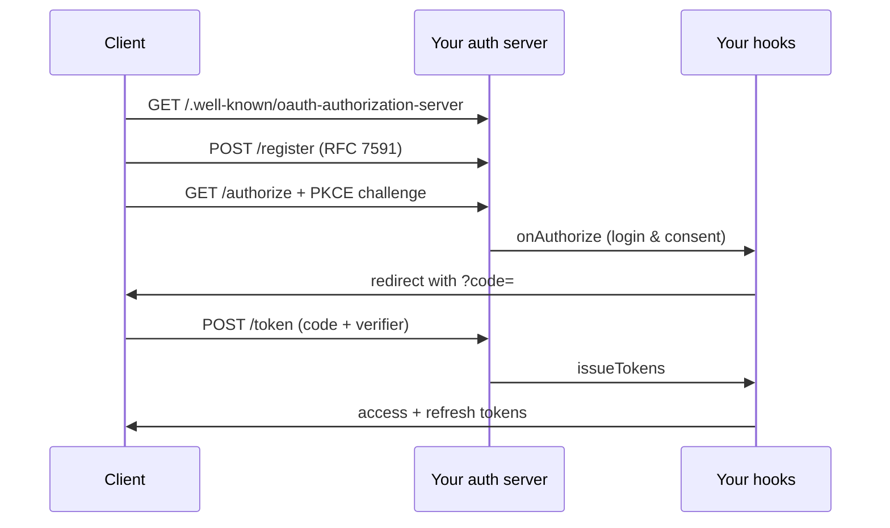

This guideline covers an app acting as an **OAuth 2.1 authorization server**: it lets clients register, runs the login/consent flow against your existing user model, and issues access and refresh tokens. [`@ttoss/http-server-mcp`](/docs/modules/packages/http-server-mcp)'s `createMcpAuthServer` provides the spec mechanics (RFC 8414, 7591, 7636, 6749, 9728); your app keeps its user model, signing keys, and login UI. Despite the `Mcp` prefix the primitives are transport-agnostic — any OAuth client can use them, not just MCP clients.

| Role             | You are…                                 | Covered by                                                             |
| ---------------- | ---------------------------------------- | ---------------------------------------------------------------------- |
| OAuth **server** | issuing tokens for your own app          | this guideline                                                         |
| OAuth **client** | obtaining tokens from a third party      | [OAuth Client](/docs/engineering/guidelines/oauth-third-party-client)  |
| MCP application  | the MCP-specific use of these primitives | [MCP Server with OAuth](/docs/engineering/guidelines/mcp-server-oauth) |

## What ttoss owns vs. what your app owns

ttoss owns only the protocol: discovery metadata, PKCE verification, code exchange, and dynamic client registration. Everything app-specific stays behind pluggable hooks, so your user model, signing keys, and authentication never leave your app.

| ttoss (`createMcpAuthServer`)               | Your app (hooks & stores)                                    |
| ------------------------------------------- | ------------------------------------------------------------ |
| `/authorize`, `/token`, `/register` wiring  | `clientStore`, `authCodeStore` — persistence                 |
| PKCE S256 verification, single-use codes    | `onAuthorize` — login + consent UI, bound to your user model |
| Discovery metadata (RFC 8414 / 9728)        | `issueTokens` — mint tokens with your signing keys           |
| `authorization_code` + `refresh_token` flow | `onRefreshToken` — validate refresh tokens                   |



## Setup

`createMcpAuthServer` returns a Koa router you mount on your `@ttoss/http-server` app. The four hooks below are the entire app-specific surface.

```typescript
import { signJwt, verifyJwt } from '@ttoss/auth-core';
import { App, bodyParser } from '@ttoss/http-server';
import { createMcpAuthServer } from '@ttoss/http-server-mcp';

const authServer = createMcpAuthServer({
  issuer: 'https://api.example.com',
  clientStore, // register/lookup clients in your datastore
  authCodeStore, // short-lived codes + PKCE challenge in your datastore
  scopesSupported: ['profile', 'write:posts'],

  // App-owned token minting — ttoss never sees your signing keys.
  issueTokens: async ({ subject, scopes }) => ({
    accessToken: signJwt({
      payload: { sub: subject, scope: scopes.join(' ') },
      secret: process.env.JWT_SECRET!,
      expiresInSeconds: 3600,
    }),
    refreshToken: signJwt({
      payload: { sub: subject, scope: scopes.join(' ') },
      secret: process.env.JWT_REFRESH_SECRET!,
      expiresInSeconds: 60 * 60 * 24 * 30,
    }),
    expiresIn: 3600,
  }),

  // App-owned login/consent — render your own UI, then approve.
  onAuthorize: async ({ ctx, request }) => {
    const session = await getSession(ctx);
    if (!session) {
      ctx.redirect(`/login?return_to=${encodeURIComponent(ctx.url)}`);
      return { approved: false };
    }
    return { approved: true, subject: session.userId, scopes: request.scopes };
  },

  // App-owned refresh validation — enables the refresh_token grant.
  onRefreshToken: async ({ refreshToken }) => {
    const payload = verifyJwt({
      token: refreshToken,
      secret: process.env.JWT_REFRESH_SECRET!,
    });
    if (!payload) return undefined; // reject — client must re-authorize
    return {
      subject: payload.sub as string,
      scopes: (payload.scope as string).split(' '),
    };
  },
});

const app = new App();
app.use(bodyParser());
app.use(authServer.routes());
```

## Discovery

Clients bootstrap by fetching metadata, so they need no manual configuration. The router serves `/.well-known/oauth-authorization-server` ([RFC 8414](https://www.rfc-editor.org/rfc/rfc8414)) advertising the `authorization_endpoint`, `token_endpoint`, `registration_endpoint`, supported grants, and `code_challenge_methods_supported: ['S256']`. Set `resource` to also serve `/.well-known/oauth-protected-resource` ([RFC 9728](https://www.rfc-editor.org/rfc/rfc9728)), which pairs a resource URL with this issuer as its authorization server.

## Dynamic client registration

`POST /register` ([RFC 7591](https://www.rfc-editor.org/rfc/rfc7591)) lets clients self-register: they post their `redirect_uris` and metadata, and the server issues a `client_id` (plus a `client_secret` for confidential clients) and persists it via `clientStore.register`. Your `ClientStore` only needs `get(clientId)` and `register(client)` — back it with DynamoDB, Postgres, or anything else.

## Authorization endpoint and PKCE

`GET /authorize` validates the `client_id` and `redirect_uri` against the store, then calls your `onAuthorize` hook. Return `{ approved: true, subject }` once the user is authenticated and has consented — the server issues a single-use code bound to the user, the requested scopes, and the PKCE challenge. Return `{ approved: false }` after taking over the response (e.g. redirecting to your own login page); the server does nothing further. **PKCE S256 is mandatory** ([RFC 7636](https://www.rfc-editor.org/rfc/rfc7636)): the `code_challenge` is bound to the code and verified at the token endpoint, so codes are useless if intercepted.

The `subject` you return is the only link between OAuth and your user model — it is whatever stable user identifier you put in the issued token.

## Token endpoint

`POST /token` handles two grants ([RFC 6749](https://www.rfc-editor.org/rfc/rfc6749)). The `authorization_code` grant runs once at the end of login, verifying the PKCE `code_verifier` against the stored challenge before calling `issueTokens` and deleting the single-use code. The `refresh_token` grant lets a client renew an expired access token without sending the user back through login; it is enabled only when you supply `onRefreshToken`, which validates the presented token and returns the `subject` and `scopes` to re-issue (return `undefined` to reject). Omit `onRefreshToken` and refresh requests get `unsupported_grant_type`.

## Scopes

Advertise the scopes your server issues via `scopesSupported`, and grant a subset per request in `onAuthorize`. Enforcement happens on the **resource server** that consumes the tokens: gate an endpoint with `requiredScopes`, or call `checkScopes()` inside a handler for per-route control. Both are documented in the [MCP Server with OAuth](/docs/engineering/guidelines/mcp-server-oauth#enforcing-scopes) guideline — the same `@ttoss/http-server-mcp` helpers apply to any resource server, MCP or not.

## Related

Pair this with [MCP Server with OAuth](/docs/engineering/guidelines/mcp-server-oauth) when the tokens you issue protect an MCP server, and with [OAuth Client](/docs/engineering/guidelines/oauth-third-party-client) for the inverse role — your app consuming a third-party provider's tokens.
