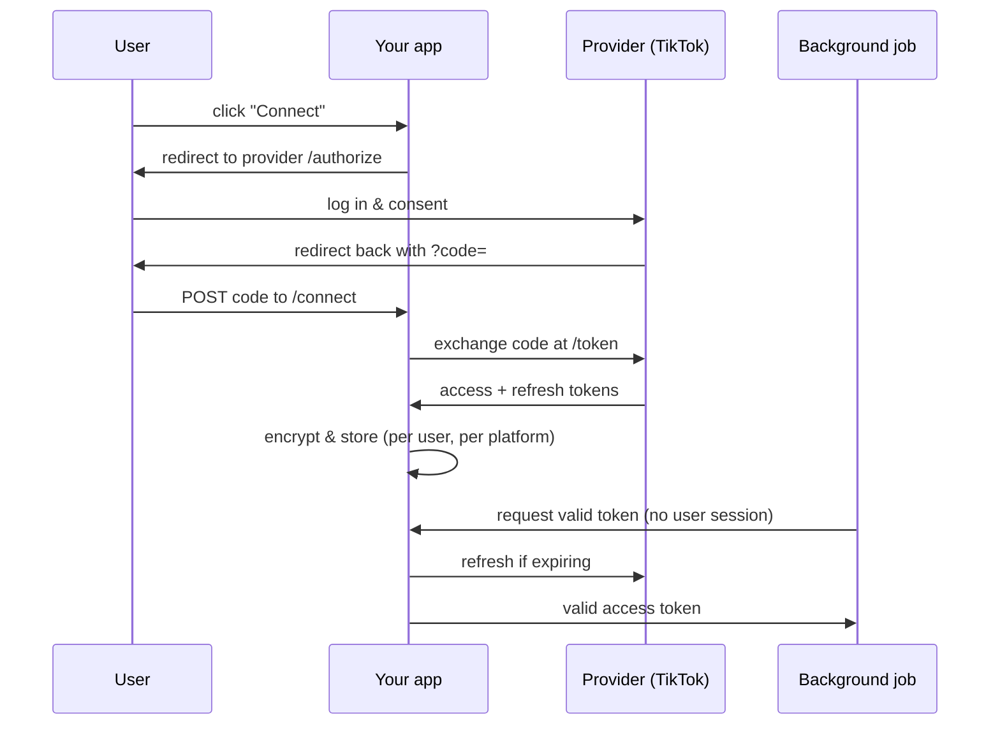

This guideline covers an app acting as an **OAuth client**: it sends a user to a third-party provider (TikTok, Instagram, YouTube, Google, …), receives an access token on their behalf, stores it, and uses it later — including from background jobs where no user is present. It is the inverse of [MCP Server with OAuth](/docs/engineering/guidelines/mcp-server-oauth), where _your_ app is the authorization/resource server that MCP clients authenticate against. Here a remote provider owns the tokens and your app is the one logging in.

| Role             | You are…                                 | Covered by                                                                            |
| ---------------- | ---------------------------------------- | ------------------------------------------------------------------------------------- |
| OAuth **client** | obtaining/storing tokens from a provider | this guideline                                                                        |
| OAuth **server** | issuing tokens for your own app          | [OAuth Authorization Server](/docs/engineering/guidelines/oauth-authorization-server) |
| MCP application  | the MCP-specific use of these primitives | [MCP Server with OAuth](/docs/engineering/guidelines/mcp-server-oauth)                |

The only runtime dependencies are ttoss packages: [`@ttoss/http-server`](/docs/modules/packages/http-server) for the endpoints and [`@ttoss/auth-core`](/docs/modules/packages/auth-core) for token encryption and the internal service token. The examples use TikTok, but the pattern is provider-agnostic — swap the URLs, scopes, and parameter names.



## 1. Authorization redirect

A `connect-url` endpoint builds the provider's `/authorize` URL and returns it (or redirects to it). Generate a random `state`, persist it against the session, and verify it on callback to prevent CSRF.

```typescript
import { Router } from '@ttoss/http-server';
import crypto from 'node:crypto';

const router = new Router();

router.get('/social/tiktok/connect-url', (ctx) => {
  const state = crypto.randomBytes(16).toString('hex');
  // Persist `state` against the user's session for later verification.
  saveOAuthState(ctx, state);

  const url = new URL('https://www.tiktok.com/v2/auth/authorize/');
  url.searchParams.set('client_key', process.env.TIKTOK_CLIENT_KEY!);
  url.searchParams.set('scope', 'user.info.basic,video.publish');
  url.searchParams.set('response_type', 'code');
  url.searchParams.set(
    'redirect_uri',
    `${process.env.APP_URL}/my/settings/social`
  );
  url.searchParams.set('state', state);

  ctx.body = { url: url.toString() };
});
```

## 2. Callback exchange

The provider redirects the user back to the settings page with `?code=`. The page posts that code to a `connect` endpoint, which verifies `state` and exchanges the code for tokens at the provider's `/token` endpoint.

```typescript
router.post('/social/tiktok/connect', async (ctx) => {
  const { code, state } = ctx.request.body as { code: string; state: string };
  assertOAuthState(ctx, state); // throws on mismatch

  const res = await fetch('https://open.tiktokapis.com/v2/oauth/token/', {
    method: 'POST',
    headers: { 'Content-Type': 'application/x-www-form-urlencoded' },
    body: new URLSearchParams({
      client_key: process.env.TIKTOK_CLIENT_KEY!,
      client_secret: process.env.TIKTOK_CLIENT_SECRET!,
      grant_type: 'authorization_code',
      code,
      redirect_uri: `${process.env.APP_URL}/my/settings/social`,
    }),
  });
  const data = await res.json();

  await saveSocialToken({
    userId: ctx.state.userId,
    platform: 'tiktok',
    accessToken: data.access_token,
    refreshToken: data.refresh_token,
    accessTokenExpiresAt: new Date(Date.now() + data.expires_in * 1000),
    openId: data.open_id,
  });

  ctx.body = { connected: true };
});
```

## 3. Token storage (encrypted at rest)

Store one record per user, per platform. Access and refresh tokens are credentials — **encrypt them at rest** with `encryptValue` / `decryptValue` from `@ttoss/auth-core` (AES-256-GCM). Generate the key once with `generateEncryptionKey` and keep it in your secret manager, never in the codebase.

```typescript
import { encryptValue, decryptValue } from '@ttoss/auth-core';

const KEY = process.env.TOKEN_ENCRYPTION_KEY!; // 64-char hex, from generateEncryptionKey()

// On write:
const stored = encryptValue({ plaintext: accessToken, key: KEY });
// On read:
const accessToken = decryptValue({ ciphertext: stored, key: KEY });
```

A minimal `SocialToken` record:

| Field                  | Purpose                                      |
| ---------------------- | -------------------------------------------- |
| `userId` + `platform`  | unique key — one connection per provider     |
| `accessToken`          | encrypted access token                       |
| `refreshToken`         | encrypted refresh token                      |
| `accessTokenExpiresAt` | drives lazy and scheduled refresh            |
| `openId` / `username`  | provider account id shown in the settings UI |

The ciphertext is a single base64 string (IV + auth tag + payload), so no extra columns are needed. Decryption throws if the key is wrong or the value was tampered with.

## 4. Auto-refresh

Access tokens are short-lived; refresh tokens last longer. Use two complementary strategies.

**Lazy refresh at call time** — `getValidToken` returns a usable access token, refreshing first if it expires within a safety window (e.g. 2 hours). Every code path that calls the provider goes through this helper, so callers never handle expiry.

```typescript
const REFRESH_WINDOW_MS = 2 * 60 * 60 * 1000; // 2h

export const getValidTikTokToken = async (userId: string): Promise<string> => {
  const token = await loadSocialToken({ userId, platform: 'tiktok' });
  const expiringSoon =
    token.accessTokenExpiresAt.getTime() - Date.now() < REFRESH_WINDOW_MS;
  if (expiringSoon) {
    return refreshTikTokToken(token); // calls /token with grant_type=refresh_token, re-stores
  }
  return decryptValue({ ciphertext: token.accessToken, key: KEY });
};
```

**Scheduled refresh** — a cron job refreshes tokens expiring within a wider window (e.g. 6 hours) so connections stay alive even for users who are inactive. This guards against refresh tokens that themselves expire if never used.

```typescript
// jobs/tiktokTokenRefresher.ts — scheduled (e.g. hourly) by your deploy infra
export const tiktokTokenRefresher = async () => {
  const soon = new Date(Date.now() + 6 * 60 * 60 * 1000);
  const tokens = await listSocialTokensExpiringBefore({
    platform: 'tiktok',
    before: soon,
  });
  for (const token of tokens) {
    await refreshTikTokToken(token).catch((error) =>
      logRefreshFailure(token, error)
    );
  }
};
```

## 5. Internal token access (no user session)

Background scripts — a publish pipeline, an analytics sync — need a valid access token but run with **no user session**. Expose a system-authenticated endpoint that returns a fresh token for a given user, guarded by a service credential rather than a login. Sign that credential with `signJwt` from `@ttoss/auth-core` and verify it on the way in; never expose this endpoint publicly.

```typescript
import { verifyJwt } from '@ttoss/auth-core';

router.post('/social/tiktok/internal-token', async (ctx) => {
  const auth = ctx.headers.authorization?.replace('Bearer ', '') ?? '';
  const claims = verifyJwt({
    token: auth,
    secret: process.env.SERVICE_JWT_SECRET!,
  });
  if (!claims || claims.aud !== 'internal') {
    ctx.status = 401;
    return;
  }

  const { userId } = ctx.request.body as { userId: string };
  ctx.body = { accessToken: await getValidTikTokToken(userId) };
});
```

The job mints a short-lived service token with the matching secret and calls this endpoint — keeping provider tokens encrypted in one place and out of every background script.

## 6. Status and disconnect

The settings UI needs two more endpoints. `status` reports whether a connection exists and surfaces the `username` / `openId` for display (never the tokens). `disconnect` revokes the token with the provider when supported, then deletes the local record.

```typescript
router.get('/social/tiktok/status', async (ctx) => {
  const token = await loadSocialToken({
    userId: ctx.state.userId,
    platform: 'tiktok',
  });
  ctx.body = token
    ? { connected: true, username: token.username }
    : { connected: false };
});

router.delete('/social/tiktok/disconnect', async (ctx) => {
  await revokeWithProvider(ctx.state.userId); // best-effort call to provider /revoke
  await deleteSocialToken({ userId: ctx.state.userId, platform: 'tiktok' });
  ctx.body = { connected: false };
});
```

## Summary

Build the provider `/authorize` URL with `state`, exchange the callback `code` for tokens, and store them **encrypted** per user and platform. Refresh both lazily (within a short window at call time) and on a schedule (within a wider window via cron), so tokens are always valid. Hand tokens to background jobs through a system-authenticated `internal-token` endpoint, and let the settings UI manage connection state through `status` and `disconnect`. Pair this with [MCP Server with OAuth](/docs/engineering/guidelines/mcp-server-oauth) when the same app must also _be_ an OAuth server.
