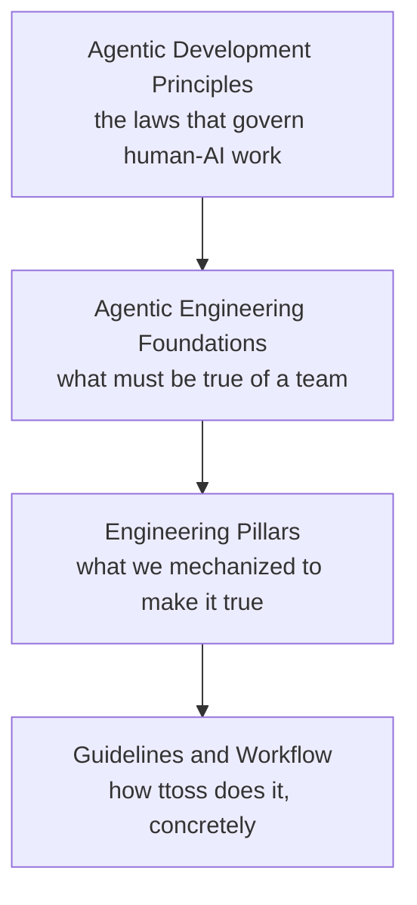

# Engineering at ttoss

Engineering at ttoss is being rebuilt around agents. Not as a tooling upgrade, but as a change in what engineers spend the day doing and what the delivery system has to guarantee on their behalf.

The premise is simple and uncomfortable: when generating code becomes cheap, code stops being the constraint. What stays scarce is knowing what to build, proving that what was built is correct, and being able to undo it when it is not. Every page in this section exists to make one of those three cheap enough to do at the speed agents now produce change.

This section is written to be portable. The examples are ours — our lint budgets, our pipelines, our coverage gates — but the pillars are meant to be lifted into any team's codebase. If you are here to build agentic engineering on your own team, the examples are illustrations, not requirements.

## How to Read This Section

[Why Software Engineering Is Changing](/docs/engineering/why-engineering-is-changing) makes the case that the shift is structural rather than fashionable, names the gap the discipline has to close, and maps the stages teams pass through on the way — including where most of them stall. The [Pillars](/docs/engineering/pillars) are the properties a delivery system needs before agentic execution pays off. [Guidelines](/docs/engineering/guidelines) and [Workflow](/docs/engineering/workflow) are the ttoss-specific layer: exactly how we implement all of it in this repository.

## Where This Sits Relative to the AI Section

The [AI section](/docs/ai) and this one describe the same shift at different altitudes, and the split is deliberate.

[Agentic Development Principles](/docs/ai/agentic-development-principles) state what is true whether or not you act on it. [Agentic Engineering Foundations](/docs/ai/agentic-engineering-foundations) state the preconditions those laws impose on a team. This section is the layer below: the mechanisms we actually built, with real thresholds and real pipelines, and the reasoning that would let you build different ones.

Read top-down if you want to understand why the practices are shaped this way. Read bottom-up if you have a codebase to change on Monday.
