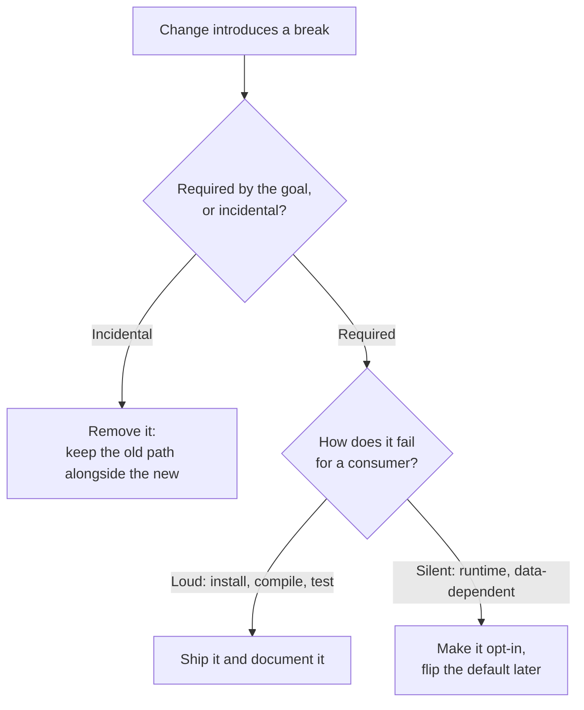

A breaking change is a cost we impose on every consumer of a package: they must read, understand, and act before they can take any other improvement we ship. That cost is sometimes worth paying. It is never free, and it is far more often avoidable than it first appears.

Declaring a break correctly is mechanical — a `BREAKING CHANGE:` footer, and `@lerna-lite/version` bumps the major. Deciding whether you should have one at all is the judgment this guideline covers.

## Separate the goal from its side effects

Most unnecessary breaks are not decisions anyone made. They fall out of _how_ a change was implemented, then get documented as though they were intended.

So enumerate every break the change introduces and ask of each one: **is this required by the goal, or incidental to the implementation?** Write the answer down. An incidental break is almost always avoidable, and you will not notice it is incidental unless you ask the question explicitly.

[#1171](https://github.com/ttoss/ttoss/pull/1171) is the worked example. The goal was to support a new MCP protocol revision. It arrived carrying four breaking changes, was documented thoroughly, and passed review on its own terms. None of the four were required by the goal. The one with the largest blast radius — arguments to a tool suddenly being validated — was a side effect of deleting an unrelated monkey-patch, and had not been recognised as a break at all.

## Classify breaks by how loudly they fail

Not all breaks cost the same, and the difference is not severity — it is **how a consumer finds out**.

| Fails at                  | Discovered by                | Treatment                                       |
| ------------------------- | ---------------------------- | ----------------------------------------------- |
| Install                   | Package manager, immediately | Ship it; the consumer cannot miss it            |
| Compile                   | `tsc`, before merge          | Ship it; the type error _is_ the migration note |
| Test                      | CI, before deploy            | Ship it; document the fix                       |
| Runtime, on every request | First smoke test             | Ship it with care                               |
| Runtime, on _some_ inputs | Production, eventually       | Make it opt-in                                  |

That last row is the one worth protecting against. A break that only fires on certain data survives code review, type checking, CI, and a manual smoke test, then fails for a real user weeks later. A consumer who reads the migration guide cover to cover can still miss it, because the guide cannot enumerate their data.

When strictness is the correct end state but would land silently, ship the mechanism disabled and let each consumer enable it once they have verified their own case. This is [Feature Flags](/docs/engineering/guidelines/feature-flags) reasoning applied to a package API: decouple shipping the capability from activating it. Flip the default in a later, deliberate major.

## Prefer an additive path over a replacement

When new behavior and old behavior can be distinguished at a boundary, serve both. Classify each request, input, or call at the edge, route old-shaped work down the existing path untouched, and route new-shaped work to the new implementation. Both can share the same underlying state and configuration, so the new capability costs consumers nothing.

This is usually cheaper than it sounds, and it converts a major release into a minor one. Be aware that a library's own convenience wrapper may not preserve the behavior you need — if it hardcodes an option you were relying on, own that branch yourself rather than accepting the regression as inevitable.

## Separate advertisement from enforcement

A contract that is merely **incomplete** becomes **wrong** the moment something starts enforcing it.

Schemas, types, and generated clients routinely describe less than what a system actually accepts — a field that may be sent as `null` to clear it, a property accepting several shapes, an optional argument nobody documented. While nothing validates against that description, the gap is invisible and harmless. Turn on validation and every gap becomes a rejected call that used to work.

So treat "what we publish to consumers" and "what we enforce on input" as separate decisions. Publishing a richer contract is safe and useful. Enforcing it is a behavior change that needs the loudness analysis above — and before enforcing anything generated, fix the generator so the contract describes reality.

## Verify against real consumers

Do not reason about whether a change breaks a consumer. Read the consumer's actual deployed contract and run it through the new code path.

Inference and empirical checks disagree more often than expected, and in the case above the empirical result was materially worse than the analysis: reading tool schemas off a live deployment showed the failure tracked a _documented, pervasive idiom_ rather than a handful of edge cases. That difference changed the decision. A short throwaway script against the real published dependency is worth more than any amount of careful reading.

## Divergence is evidence of an unstated invariant

When code diverges from a spec, a best practice, or the obvious simplification, treat it as evidence of an invariant nobody wrote down — not as a bug — until proven otherwise.

Workarounds attract deletion during upgrades, because the reason for them is rarely in a comment and often attributed to a dependency version that has since moved on. Before removing one, reproduce the problem it solved against the new version. In [#1171](https://github.com/ttoss/ttoss/pull/1171) a request-serialization queue looked like obsolete cruft from an old SDK; the constraint it worked around still existed, and removing it deadlocked under concurrent load. A hanging test was the only thing standing between that and production.

## When a break is genuinely necessary

Only once the steps above have failed to avoid it:

1. Add a `BREAKING CHANGE:` footer to the commit (see [How to version breaking changes?](https://github.com/ttoss/ttoss#how-to-version-breaking-changes) for the mechanics). A `!` in the type prefix works too; the footer carries the explanation.
2. Add a `MIGRATIONS.md` to the package, newest change first, covering only what requires consumer action. Show a diff for each change, and state the failure mode a consumer will observe if they miss it — not just what to edit.
3. Link it from the package `README.md`.
4. Cover the new behavior with tests, per [Tests](/docs/engineering/guidelines/tests). For a break that fails silently, the test asserting the _old_ behavior is the one that documents what you changed.

The presence of a `MIGRATIONS.md` should mean someone tried to avoid the break and could not. It is a last resort, not evidence of diligence.
