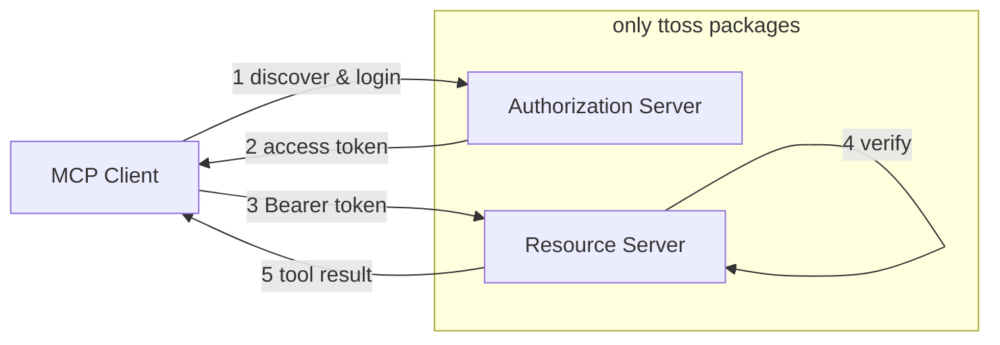

This guideline shows how to build a [Model Context Protocol (MCP)](https://modelcontextprotocol.io) server that authenticates MCP clients (Claude, Cursor, VS Code) with OAuth 2.1, using **only ttoss packages**. No external auth framework is required: [`@ttoss/http-server`](/docs/modules/packages/http-server) provides the Koa runtime, [`@ttoss/http-server-mcp`](/docs/modules/packages/http-server-mcp) provides both halves of MCP authorization, and [`@ttoss/auth-core`](/docs/modules/packages/auth-core) provides the token primitives. Your app keeps its own user model, signing keys, and login UI — ttoss owns only the protocol mechanics.

It is the MCP-specific application of two general patterns: issuing tokens ([OAuth Authorization Server](/docs/engineering/guidelines/oauth-authorization-server)) and consuming a third party's tokens ([OAuth Client](/docs/engineering/guidelines/oauth-third-party-client)).

## The two halves

OAuth for MCP splits into two independent responsibilities. A server can play either role, or both.



The **resource server** is the MCP endpoint itself: it verifies the Bearer token on every request and runs tools. The **authorization server** issues those tokens through the standard `/authorize` → `/token` flow. If you authenticate against an existing provider (Amazon Cognito, Auth0), you only need the resource-server half. If your app issues its own tokens, you add the authorization-server half too.

## Resource server: verifying tokens

`createMcpRouter` gates requests through its `auth` option. Invalid or missing tokens get `401 Unauthorized` before any tool runs — except for the MCP lifecycle methods `initialize` and `tools/list`, which stay public so a client can discover the server before it has a token (see [Client discovery](#client-discovery)).

### Against Amazon Cognito

Pass `cognitoUserPool` and the router builds a `CognitoJwtVerifier` (from `@ttoss/auth-core`) internally:

```typescript
import { App, bodyParser, cors } from '@ttoss/http-server';
import { createMcpRouter, McpServer, z } from '@ttoss/http-server-mcp';

const mcpServer = new McpServer({ name: 'my-mcp-server', version: '1.0.0' });

mcpServer.registerTool(
  'get-weather',
  { description: 'Get weather', inputSchema: { location: z.string() } },
  async ({ location }) => ({
    content: [{ type: 'text', text: `Weather in ${location}: Sunny` }],
  })
);

const mcpRouter = createMcpRouter(mcpServer, {
  auth: {
    cognitoUserPool: {
      userPoolId: process.env.COGNITO_USER_POOL_ID!,
      clientId: process.env.COGNITO_CLIENT_ID!,
    },
    // Advertise where clients should obtain tokens (OAuth discovery).
    resourceServerUrl: 'https://mcp.example.com',
    authorizationServerUrl: process.env.COGNITO_ISSUER_URL!,
  },
});

const app = new App();
app.use(cors());
app.use(bodyParser());
app.use(mcpRouter.routes());
app.listen(3000);
```

### Against your own tokens

When your app signs its own JWTs with `@ttoss/auth-core`, verify them with a custom `verifyToken`. The contract is minimal: resolve with an identity payload, or throw to reject.

```typescript
import { verifyJwt } from '@ttoss/auth-core';
import { createMcpRouter } from '@ttoss/http-server-mcp';

const mcpRouter = createMcpRouter(mcpServer, {
  auth: {
    verifyToken: async (token) => {
      const payload = verifyJwt({ token, secret: process.env.JWT_SECRET! });
      if (!payload) throw new Error('Invalid token');
      return payload;
    },
    resourceServerUrl: 'https://mcp.example.com',
    authorizationServerUrl: 'https://api.example.com',
  },
});
```

Opaque API tokens work the same way — hash the presented token with `@ttoss/auth-core` and look it up in your database, throwing when it is missing or revoked. See the [`@ttoss/http-server-mcp` README](/docs/modules/packages/http-server-mcp) for the opaque-token recipe and the `getIdentity()` / `checkScopes()` helpers used inside tool handlers.

### Client discovery

The [MCP authorization spec](https://spec.modelcontextprotocol.io/specification/2025-03-26/basic/authorization/) requires two behaviors so clients like Claude and Cursor can bootstrap OAuth without being pre-configured, and `createMcpRouter` handles both. The lifecycle handshake bypasses verification so the client can complete it before authenticating — one entry per protocol era, `initialize` on 2025 and `server/discover` on `2026-07-28`, which removed `initialize`. Override the set with `publicMethods` (pass `[]` to require a token for every method). And a `401` advertises the [RFC 9728](https://www.rfc-editor.org/rfc/rfc9728) protected-resource document via `WWW-Authenticate: Bearer resource_metadata="…"`, pointing the client at the metadata that names the authorization server.

```typescript
const mcpRouter = createMcpRouter(mcpServer, {
  auth: {
    cognitoUserPool: { userPoolId: '...', clientId: '...' },
    // Serves the metadata document and points 401s at it. The
    // resource_metadata URL is derived from these two — do not hand-write it.
    resourceServerUrl: 'https://mcp.example.com',
    authorizationServerUrl: process.env.COGNITO_ISSUER_URL!,
    // Set publicMethods: [] when you need OAuth clients to authenticate
    // before anything else (see note below). Defaults to ['initialize'].
    publicMethods: [],
  },
});
```

Setting both `resourceServerUrl` and `authorizationServerUrl` serves that metadata document — at the root and at the RFC 9728 §3.1 path-derived location — and derives the `WWW-Authenticate` URL from the same values, so the header cannot name a location the router does not serve. Completing the discovery chain takes no third field.

**One document per path.** `oauthServer({ resource })` serves `/.well-known/oauth-protected-resource` too, so a deployment that hosts both halves ends up with two routers answering the same path — whichever mounted first wins, and nothing breaks because the bodies agree, which is exactly why nobody notices there are now two sources for one contract. When the authorization server is in the same deployment, leave `resourceServerUrl` and `authorizationServerUrl` off the MCP router, let the authorization server serve the document, and set `resourceMetadataUrl` on the MCP router to the location it serves it at. This is the one case where hand-writing that URL is right: the MCP router is deliberately not serving the document, so it has nothing to derive from, and without the field a `401` falls back to a bare `Bearer` that never starts discovery. Point it at the RFC 9728 location for the resource — `protectedResourceMetadataUrl({ resource })` from [`@ttoss/auth-core`](/docs/modules/packages/auth-core) computes it, which keeps the two halves agreeing without copying the derivation rule by hand.

**Error envelopes swallow the `401`.** The router rejects with `ctx.throw(401, 'Unauthorized', { headers })`, and an app whose catch-all error middleware recognizes only its own error class turns that into a `500` with no `WWW-Authenticate` header. The client then gets an opaque server error where it expected the pointer to the authorization server, so discovery silently never starts and it reads like a client bug. Run caught values through `toHttpError` and `applyHttpErrorHeaders` from [`@ttoss/http-server`](/docs/modules/packages/http-server) before falling back to `500`.

**`publicMethods` and the OAuth flow.** The default is `['initialize', 'server/discover']` — the handshake of each protocol era — so the handshake answers `200` unauthenticated and everything after it carries the challenge. Some OAuth-aware clients (Claude connector, Cursor) have been observed to read that `200` as "this server is public" and never start the PKCE flow, while `notifications/initialized` still returns `401` — silently breaking the handshake, with the visible symptom "connected, no tools available, no sign-in prompt". Setting `publicMethods: []` makes the handshake itself return `401 + WWW-Authenticate`, which starts discovery on the very first request. Use the default when auth is handled outside the client-initiated OAuth flow (e.g. API keys or tokens injected by a gateway); set `publicMethods: []` whenever you want the client to authenticate itself before any other interaction.

**Do not add `tools/list` to the set.** It served the full tool catalogue — every name, description, and input schema — to unauthenticated callers, which for an OpenAPI-derived server is a map of the whole underlying API. It was removed from the default for that reason ([ttoss/ttoss#1176](https://github.com/ttoss/ttoss/issues/1176)) and buys an OAuth client nothing, since the `401` is what starts the flow and an anonymous caller still cannot invoke a tool.

## Authorization server: issuing tokens

To make your server first-party — so an MCP client discovers it, registers itself, and runs the full login flow against it — mount `oauthServer()` from `@ttoss/http-server-auth`. It serves the discovery, `/authorize`, `/token`, and `/register` endpoints that MCP clients auto-discover, and you pair it with the `verifyToken` resource server above so one deployment both issues and verifies its tokens (set `scopesSupported: ['mcp:access']`).

These are general OAuth 2.1 primitives, not MCP-specific — the runner-agnostic engine is `createOAuthHandlers` in `@ttoss/auth-core`. The full setup — discovery, dynamic client registration, the authorize/PKCE flow, the token grants, and the ttoss-vs-app responsibility split — lives in the [OAuth Authorization Server](/docs/engineering/guidelines/oauth-authorization-server) guideline.

## Enforcing scopes

Gate the whole endpoint with `requiredScopes` (returns `403` before any tool runs), or call `checkScopes()` inside individual handlers for per-tool control:

```typescript
createMcpRouter(mcpServer, {
  auth: {
    cognitoUserPool: { userPoolId: '...', clientId: '...' },
    requiredScopes: ['mcp:access'],
  },
});
```

**`requiredScopes` and first-party credentials.** An endpoint that accepts both OAuth tokens and the app's own API keys or session JWTs has a problem: those credentials carry no `scope` claim, so the scope check throws `verifyToken returned no scope/scopes but requiredScopes is set` and the caller gets a `403` for a claim it can never present. Report first-party credentials as holding the required scope in `verifyToken` — they already carry the user's full authority:

```typescript
verifyToken: async (token) => {
  const principal = await authenticateBearer(token);
  return {
    sub: principal.userId,
    // Session JWTs and API keys predate OAuth and hold the user's full
    // authority; without this they fail a scope check they cannot satisfy.
    scope: (principal.scopes ?? ['mcp:access']).join(' '),
  };
},
```

## Choosing your setup

| You authenticate against… | Use                                                          |
| ------------------------- | ------------------------------------------------------------ |
| Amazon Cognito            | `createMcpRouter({ auth: { cognitoUserPool } })`             |
| Another OAuth provider    | `createMcpRouter({ auth: { verifyToken } })` with `jose`     |
| Tokens your app issues    | `oauthServer` + `createMcpRouter({ auth: { verifyToken } })` |

In every case the only runtime dependencies are ttoss packages. Refer to the [`@ttoss/http-server-mcp`](/docs/modules/packages/http-server-mcp) and [`@ttoss/auth-core`](/docs/modules/packages/auth-core) documentation for the complete API surface.
