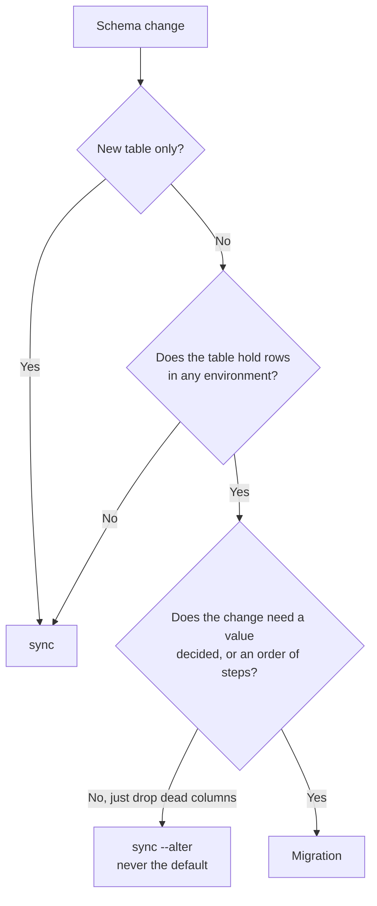

Our models are the schema. [`@ttoss/postgresdb`](/docs/modules/packages/postgresdb) syncs from the decorators, so most releases need nothing beyond `sync`.

The exception is narrow and sharp: **`sequelize.sync()` creates missing _tables_ and never alters an existing one.** It will not add a column, drop one, change a type, or backfill a value. A release that needs any of those against a populated table needs a migration.

The API reference lives in the [package docs](/docs/modules/packages/postgresdb).

## Decide: sync, `--alter`, or a migration



`sync --alter` is not a cheaper migration. It drops every column the models no longer declare, which makes it correct for removing something dead and dangerous for anything else. It is a tidy-up an operator runs deliberately, never a deploy step.

## The shape of one

Almost every migration that adds a constrained column follows four steps, and the order is what makes it work:

1. **Add the column nullable.** A `NOT NULL` column cannot be added to a table with rows.
2. **Sync.** Now the column exists, the sync can build the indexes the models declare over it.
3. **Backfill.** Give every existing row a value.
4. **Constrain.** Apply the `NOT NULL` once every row can satisfy it.

```typescript
import { defineMigration } from '@ttoss/postgresdb';

export const addProjectId = defineMigration({
  name: '2026-03-04-add-project-id',
  description: 'Gives every task a project.',
  isApplied: async (ctx) => {
    return ctx.columnExists({ table: 'tasks', column: 'project_id' });
  },
  up: async (ctx) => {
    await ctx.addColumnIfMissing({
      table: 'tasks',
      column: 'project_id',
      type: 'INTEGER',
    });

    await ctx.sync();

    await ctx.run({
      sql: 'UPDATE tasks SET project_id = $1 WHERE project_id IS NULL',
      values: [defaultProjectId],
    });

    await ctx.setNotNull({ table: 'tasks', column: 'project_id' });
  },
});
```

A migration runs **beside the ORM, not through it**. The models describe the schema the migration is in the middle of changing — they already say the column is `NOT NULL` when it is not yet. Never import a model into a migration.

### Name it with its date

`YYYY-MM-DD-kebab-case`, matching the file. `ls` and `migrate status` then read in the order they run. The prefix is a label, not the ordering — the exported array is what the runner applies, so keep the two in agreement.

## Atomicity is per `run`, not per migration

`ctx.run` executes through the Sequelize **pool**, so two calls can land on different connections. `BEGIN` in one and `COMMIT` in another is not a transaction.

What is atomic is a single `run`: Postgres wraps all the statements of one multi-statement simple query in an implicit transaction. So a step that must not half-land goes in **one** `run`, as one string:

```typescript
// Atomic: either the column exists and is populated, or neither happened.
await ctx.run({
  sql: `
    ALTER TABLE memories ADD COLUMN tags_jsonb jsonb;
    UPDATE memories SET tags_jsonb = ...;
    ALTER TABLE memories DROP COLUMN tags;
    ALTER TABLE memories RENAME COLUMN tags_jsonb TO tags;
  `,
});
```

**Multi-statement SQL and `values` are mutually exclusive.** Bind parameters put the query on the extended protocol, which carries exactly one statement. A multi-statement `run` takes no `values`, so anything interpolated into it must be a literal you control — never caller input.

A migration is not atomic as a whole, whatever you do; see idempotence below.

## Always write `isApplied`

This is the part people skip, and it is the part that makes migrations painless.

The ledger answers "has this run here?" only for databases that had the ledger when it ran. It cannot answer for a database migrated before we adopted the ledger, or for one `sync` has just built from the models — where the tables arrive already in their final shape.

`isApplied` reads the migration's own change back out of the schema: is the column it adds already present, is the column it drops already gone? A migration that can answer records itself instead of running, so both cases take care of themselves with no operator step.

Without it the runner refuses to run against a populated database with an empty ledger, because guessing "this database is new" replays history. That refusal is correct, but it is friction you can simply not have.

### Every probe runs before any `up()`

The runner evaluates all pending `isApplied` probes first, then applies what is left. So a probe answers for the database **as it stands now**, never as an earlier pending migration will leave it.

This bites when two pending migrations touch the same table. A probe that asks "does `memories.content` exist?" reads as _already applied_ on a database where the previous pending migration has not yet renamed `memory_entries` to `memories` — skipping the work on exactly the databases that need it. Distinguish the states explicitly:

```typescript
isApplied: async (ctx) => {
  // Not renamed yet: `memories` is still the old table, so this cannot have run.
  if (await ctx.tableExists({ table: 'memory_entries' })) {
    return false;
  }

  return !(await ctx.columnExists({ table: 'memories', column: 'content' }));
},
```

Answer only when the answer is certain. A probe that guesses wrong skips work that was never done — far worse than running an idempotent migration twice. Where the change leaves no trace to recognise, write no probe and let an operator `baseline` it.

## Four rules that bite

**Migrations must be idempotent, ledger or not.** The ledger records what _finished_: a migration that throws leaves no row and is retried from the top. Guard with `tableExists` and `columnExists`, and prefer the `IF NOT EXISTS` helpers.

**Names are the identity, and are permanent.** Renaming or deleting one that has already run anywhere leaves the ledger holding a name nothing declares, and the runner refuses to start. Treat the name as published the moment it merges.

**Order is a contract.** Migrations run in the order they are listed. A later one may assume an earlier one has happened; nothing may assume the reverse.

**There is no `down`.** Migrations that discard data cannot be reversed. Roll forward with a new one. This is also why a deploy should prove the image can boot _before_ it migrates: a release that migrates and then meets an image that will not start has moved the schema forward with nothing safe to go back to.

## Running them

```bash
migrate status                 # every migration, and when each was applied
migrate run --dry-run          # what a real run would do; writes nothing
migrate run                    # apply what is pending
```

Each finished migration is recorded in a `schema_migrations` table the runner creates and maintains itself, so `migrate run` is safe on **every** release rather than something to remember.

### Run it _before_ `sync`, never after

This is the one ordering mistake that costs a release, and it is easy to get backwards because the opposite reads so reasonably — "sync first, so the migrations meet the tables the models describe."

`sync` builds **today's** models, so it creates what today's models declare over columns and tables a pending migration has not made yet. Run first it does not skip them, it _fails_:

```text
# a database predating the migration that adds users.public_id

sync, then migrate run   →  Error at PostgresQueryInterface.addIndex
migrate run, then sync   →  applied ["public-ids"],  then sync: OK
```

The failure names an index, not a migration, so it reads as a broken model rather than a step in the wrong order.

A rename is worse than a failure. If a migration renames `memories` to `memory_stores` and the models already describe the new name, a `sync` running first creates an **empty** `memory_stores` beside the populated `memories` — and the migration then has two tables where it expected one.

```bash
migrate run    # first: bring the schema up to what this release expects
sync           # then: create whatever tables are simply missing
```

The sync a migration needs is the one it calls itself, at step 2 of its own four. The standalone `sync` is for the case no migration covers: a fresh database, where every `isApplied` answers true and nothing else would create the tables.

Hand the runner the **plain** sync, not an advisory-locked one. The runner already holds its own lock for the whole run, and nesting a second lock under it buys nothing.

### Reading the ledger is a write

`status()` and every ledger read call `CREATE TABLE IF NOT EXISTS` first, and that statement is not race-safe: concurrent creators collide on the system catalogue. Do not call it from something that runs on every instance, such as a boot-time check across a rolling deploy. Query the table directly instead, and treat "not there" as "nothing applied":

```sql
SELECT to_regclass('public.schema_migrations') IS NOT NULL AS present
```

An image should call `runMigrationsCli` from its own entrypoint, against its built `dist`. [`@ttoss/postgresdb-cli`](/docs/modules/packages/postgresdb-cli)'s `migrate` command bundles the project's sources on every run, which makes it the local-development face and the wrong thing to put in a container.

A dry run writes nothing, so a migration depending on a schema change an _earlier pending_ migration would have made will fail during it. A dry run answers for the next migration against the schema you have, not for a whole unapplied chain.

## Prove it before it ships

**Nothing runs your migration's `up()` until the deployment does.** A suite that only drives the ledger asks `isApplied`; `--dry-run` exercises the probe, not the change; there is no `down`. So the first time `up()` executes can be on the one database that matters.

Close that before it merges, against the schema the migration is written for:

1. **`sync` today's models**, so the schema is the one this release ships.
2. **Undo your own change** — drop the column you added, restore the default you removed. This is the state the deployment is in.
3. **Run `migrate run`, then `sync`**, in that order, which is the deploy's.
4. **Check four things**: it applied, the change is back, the write it was _for_ works against the migrated schema, and a second `migrate run` applies nothing.

Step 4's third item is the one people leave out, and it is the one that catches a migration that lands a column the application then cannot use.

A scratch database by hand is enough, and is the right cost for a one-off. Where the wind-back in step 2 is cheap to express — a fixture that builds the old schema — a throwaway container test does the same four checks and keeps doing them; that is worth it when several migrations share one shape of old schema, and not otherwise.

## Adopting the ledger on a database that predates it

Give every migration an `isApplied` and there is nothing to do: the runner recognises them and records them.

For the ones that cannot recognise themselves, `baseline` records them as applied without running anything, writing to the ledger and never touching the schema. Run it once per environment, as a step of the release that introduces the ledger.

```bash
migrate baseline --all           # they already ran: record them, run nothing
migrate run --allow-unbaselined  # they never ran: this database only looks old
```

Reach for `--allow-unbaselined` only when you are certain the migrations have genuinely never run against that database. It is an assertion, and the runner takes you at your word.

## Worked example

[ttoss/flow#97](https://github.com/ttoss/flow/pull/97) ports five hand-rolled one-off scripts onto this runner, and is worth reading for two things it found.

Every migration got an `isApplied`, and **neither database that exists needed an operator step**: the deployment, which had all five, recorded them; and a database `sync` had just built recorded them too, without ever being asked for the required `--owner-email`, because the migration that needs it was never pending.

It also shows the limit. Those five cannot be replayed from the beginning, because the ones that add a column call `sync`, and `sync` builds _today's_ models. That is not a flaw in the runner: a plain `sync` against that same old database fails on an index over a column it has not got, with no migration involved. Historical migrations are for being recognised, so the ledger tells the truth. Do not restructure them to chase a database state that no longer exists.
