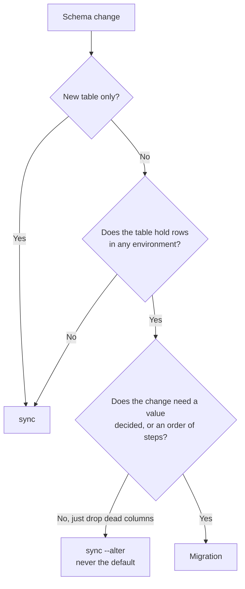

Our models are the schema. [`@ttoss/postgresdb`](/docs/modules/packages/postgresdb) syncs from the decorators, so there is no DDL to write and most releases need nothing beyond `sync`.

The exception is narrow and sharp: **`sequelize.sync()` creates missing _tables_ and never alters an existing one.** It will not add a column, drop one, change a type, or backfill a value. A release that needs any of those against a table that already holds rows needs a migration, and discovering that after the image is serving is expensive — a dropped-but-still-`NOT NULL` column fails every insert from the moment the new code starts.

This guideline is how we decide, write, and run them. The API reference lives in the [package docs](/docs/modules/packages/postgresdb); do not look for it here.

## Decide: sync, `--alter`, or a migration



`sync --alter` is not a cheaper migration. It drops every column the models no longer declare, which makes it correct for removing something dead and dangerous for anything else. It is a tidy-up an operator runs deliberately, never a deploy step.

Everything else is a migration: adding a `NOT NULL` column to a populated table, backfilling a value, renaming a stored vocabulary, or removing a column the new code stops writing.

## The shape of one

Almost every migration that adds a constrained column follows the same four steps, and the order is what makes it work:

1. **Add the column nullable.** A `NOT NULL` column cannot be added to a table with rows.
2. **Sync.** Now the column exists, the sync can build the indexes the models declare over it. Skipping this is what aborts a release half-applied.
3. **Backfill.** Give every existing row a value.
4. **Constrain.** Apply the `NOT NULL` once every row can satisfy it.

```typescript
import { defineMigration } from '@ttoss/postgresdb';

export const addProjectId = defineMigration({
  name: 'add-project-id',
  description: 'Gives every task a project.',
  isApplied: async (ctx) => {
    return ctx.columnExists({ table: 'tasks', column: 'project_id' });
  },
  up: async (ctx) => {
    await ctx.addColumnIfMissing({
      table: 'tasks',
      column: 'project_id',
      type: 'INTEGER',
    });

    await ctx.sync();

    await ctx.run({
      sql: 'UPDATE tasks SET project_id = $1 WHERE project_id IS NULL',
      values: [defaultProjectId],
    });

    await ctx.setNotNull({ table: 'tasks', column: 'project_id' });
  },
});
```

A migration runs **beside the ORM, not through it**. The models describe the schema the migration is in the middle of changing — they already say the column is `NOT NULL` when it is not yet — so the context gives you raw SQL on its own connection. Never import a model into a migration.

## Always write `isApplied`

This is the part people skip, and it is the part that makes migrations painless.

The ledger answers "has this migration run here?" only for databases that had the ledger when it ran. It cannot answer for a database migrated before we adopted the ledger, or for one `sync` has just built from the models — where the tables arrive already in their final shape and the migration is unnecessary by construction.

`isApplied` reads the migration's own change back out of the schema and answers from there: is the column it adds already present, is the column it drops already gone, does any row still carry the old value? A migration that can answer records itself instead of running, so both cases take care of themselves with no operator step.

Without it the runner refuses to run against a populated database with an empty ledger, because an empty ledger beside a populated schema is genuinely ambiguous and guessing "this database is new" replays history. That refusal is correct, but it is friction you can simply not have.

Answer only when the answer is certain. A probe that guesses wrong skips work that was never done — a far worse failure than running an idempotent migration twice. Where the change leaves no trace to recognise, such as a pure data rewrite with no marker, write no probe and let an operator `baseline` it.

## Four rules that bite

**Migrations must be idempotent, ledger or not.** The ledger records what _finished_, not what half-ran: a migration that throws leaves no row and is retried from the top. Guard with `tableExists` and `columnExists`, and prefer the `IF NOT EXISTS` helpers.

**Names are the identity, and are permanent.** Renaming or deleting a migration that has already run anywhere leaves the ledger holding a name nothing declares, and the runner refuses to start rather than silently skipping it. Treat the name as published the moment it merges.

**Order is a contract.** Migrations run in the order they are listed. A later one may assume an earlier one has happened; nothing may assume the reverse.

**There is no `down`.** Migrations that discard data cannot be reversed, and an API that implied otherwise would be a promise we cannot keep. Roll forward with a new migration.

## Running them

```bash
migrate status                 # every migration, and when each was applied
migrate run --dry-run          # what a real run would do; writes nothing
migrate run                    # apply what is pending
```

Each finished migration is recorded in a `schema_migrations` table the runner creates and maintains itself, so `migrate run` is safe on **every** release rather than something to remember — what has already run is skipped. Run it after `sync`, so migrations meet the tables the models describe.

An image should call `runMigrationsCli` from its own entrypoint, against its built `dist`. [`@ttoss/postgresdb-cli`](/docs/modules/packages/postgresdb-cli)'s `migrate` command bundles the project's sources on every run, which makes it the local-development face and the wrong thing to put in a container.

A dry run writes nothing, so a migration depending on a schema change an _earlier pending_ migration would have made will fail during it. A dry run answers for the next migration against the schema you have, not for a whole unapplied chain.

## Adopting the ledger on a database that predates it

Existing deployments have migrations that ran before any of this existed. Give every migration an `isApplied` and there is nothing to do: the runner recognises them and records them.

For the ones that cannot recognise themselves, `baseline` records them as applied without running anything, writing to the ledger and never touching the schema. Run it once per environment, as a step of the release that introduces the ledger.

```bash
migrate baseline --all         # they already ran: record them, run nothing
migrate run --allow-unbaselined  # they never ran: this database only looks old
```

Reach for `--allow-unbaselined` only when you are certain the migrations have genuinely never run against that database. It is an assertion, and the runner takes you at your word.

## Worked example

[ttoss/flow#97](https://github.com/ttoss/flow/pull/97) ports five hand-rolled one-off scripts onto this runner. It is worth reading for two things it found.

Every migration got an `isApplied`, and the result was that **neither database that exists needed an operator step**: the deployment, which had all five, recorded them; and a database `sync` had just built recorded them too, without ever being asked for the required `--owner-email`, because the migration that needs it was never pending.

It also shows the limit. Those five cannot be replayed from the beginning, because the ones that add a column call `sync`, and `sync` builds _today's_ models — a schema several releases ahead of where an early migration stands. That is not a flaw in the runner: a plain `sync` against that same old database fails on an index over a column it has not got, with no migration involved at all. Historical migrations are for being recognised, so the ledger tells the truth. Do not restructure them to chase a database state that no longer exists.
