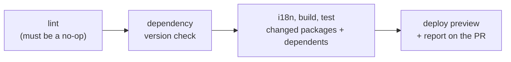

A check a human runs by hand does not exist to an agent.

This is the entire pillar. An agent cannot consult a wiki page it was not given, cannot infer a convention enforced only in review, and cannot ask whether this is one of the cases where the team makes an exception. It can run a command and read the output. Everything you want it to respect has to be reachable that way, or it is not a rule — it is a hope.

Automation is therefore not the productivity pillar. It is the pillar that makes the others enforceable, which is why it sits underneath both [Tests](/docs/engineering/pillars/tests) and [Complexity Reduction](/docs/engineering/pillars/complexity-reduction).

## Two Properties That Matter

**Machine-runnable from a fresh checkout.** One command, no undocumented setup, no "you also need to have the staging credentials exported". This is what lets an agent close its own loop: run the checks, read the failure, fix, run again. An agent that cannot run the checks must route every attempt through a human, which reinstates the bottleneck agents were supposed to remove. Reproducible environments are part of this pillar, not an infrastructure nicety.

**Mechanically blocking.** A warning is not a rule. If violating a constraint still allows the merge, the constraint is behavioral, and behavioral constraints are honored probabilistically — fine for style, useless for anything with an asymmetric downside. The distinction is developed further in [Deterministic Guardrails](/docs/ai/agentic-engineering-foundations/deterministic-guardrails).

## How This Works at ttoss

Our pull request pipeline is a single script, and its shape encodes a few decisions worth stealing.

**Lint runs, and CI fails if it changed anything.** The pipeline does not format your code for you. It runs the formatter and then refuses the build if the working tree is now dirty, on the grounds that committed code should already have been correct. This turns formatting from a negotiation into a fact, and it means an agent's output is held to exactly the same standard as a human's, with no reviewer spending attention on it.

**The blast radius is computed, not guessed.** Tests and builds run with turbo's `--filter=...[main]`, which selects every package changed since main _and every package that depends on them_. Change a component and the packages consuming it get tested too. Nobody has to know the dependency graph, which matters most when the author of the change is an agent that cannot be trusted to reason about repository topology it was never shown.

**Every pull request deploys.** Preview environments are provisioned by [carlin](/docs/carlin), and the deploy outputs are posted back as a comment on the pull request. This is what makes higher-level validation possible at all — the outer loops described in [Tests](/docs/engineering/pillars/tests) need something real to run against, not a local mock.

**Publishing is a consequence of merging.** The main branch versions, publishes and deploys on its own. Nobody decides to release, which removes the human step where batches accumulate.

## Failure Mode

The team has a convention — say, that recipes carry only color tokens — and it lives in a review checklist. Every human eventually internalizes it. Every agent violates it on first contact, because the rule was never in a form the agent could consume, and reviewers become the enforcement mechanism for something a linter could have caught.

The fix is not a better prompt. It is a lint rule, a type, or a gate — after which the agent complies on every task, forever, and no reviewer spends attention on it again. Repository instruction files help agents cooperate, but they are advisory; only the pipeline is binding.
