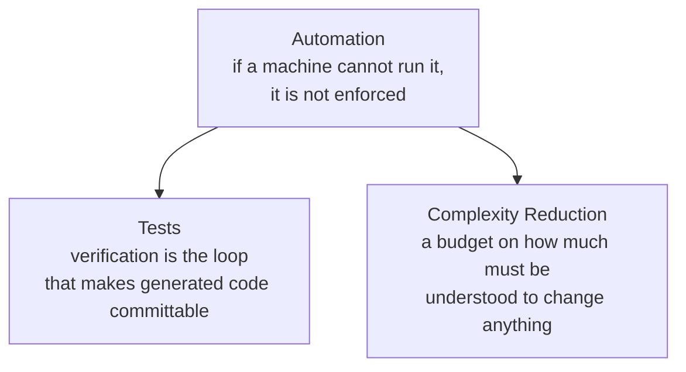

A pillar is not a practice. It is a property the delivery system has, together with the mechanism that makes it true whether or not anyone remembers to care.

That distinction is the whole point. "We write tests" is a practice, and practices decay under deadline pressure. "Coverage cannot decrease, and the pipeline refuses the merge if it does" is a mechanism, and mechanisms hold when attention does not. Agents make the difference urgent: an agent has no institutional memory, no fear of the reviewer who caught it last time, and no ability to feel that a shortcut is beneath the team's standards. It complies with what is enforced and interpolates the rest.

## The Three We Have Mechanized

**[Automation](/docs/engineering/pillars/automation)** comes first because the other two depend on it. A rule a human applies by hand does not exist to an agent, and a check that only runs on someone's laptop cannot be part of a feedback loop.

**[Tests](/docs/engineering/pillars/tests)** is where the agentic shift bites hardest. When code volume multiplies, reviewing every change stops being a strategy, and the team has to decide deliberately where its validation sits rather than defaulting to the loop it inherited.

**[Complexity Reduction](/docs/engineering/pillars/complexity-reduction)** is the least obvious and the most compounding. Agents replicate whatever patterns dominate the code they read, so complexity is not merely inherited by the next human — it is amplified by the next task.

## What These Pillars Are Not

They are not the complete set. [Agentic Engineering Foundations](/docs/ai/agentic-engineering-foundations) defines six preconditions for agentic work, and these three cover part of that ground: Automation and Tests together serve Testability and the enforcement half of Deterministic Guardrails, and Complexity Reduction serves Understandability.

The remaining foundations have no page here yet, which is a statement about our own maturity rather than about their importance:

- **Executable Intent** — we do this in practice, through acceptance criteria and typed contracts, but we have not reduced it to a mechanism worth documenting as a pillar.
- **Observability** — partially covered by service-level practice, not yet by a standard every package meets.
- **Reversibility** — the closest we have is mechanized in [feature flags](/docs/engineering/guidelines/feature-flags) and [breaking changes](/docs/engineering/guidelines/breaking-changes), plus trunk-based development and continuous deployment.
- **Deterministic Guardrails** — scoped agent permissions and graduated autonomy are still convention here, not structure.

A team building this from scratch should read the foundations for the full set of properties, and these pages for what mechanizing three of them actually looks like.
