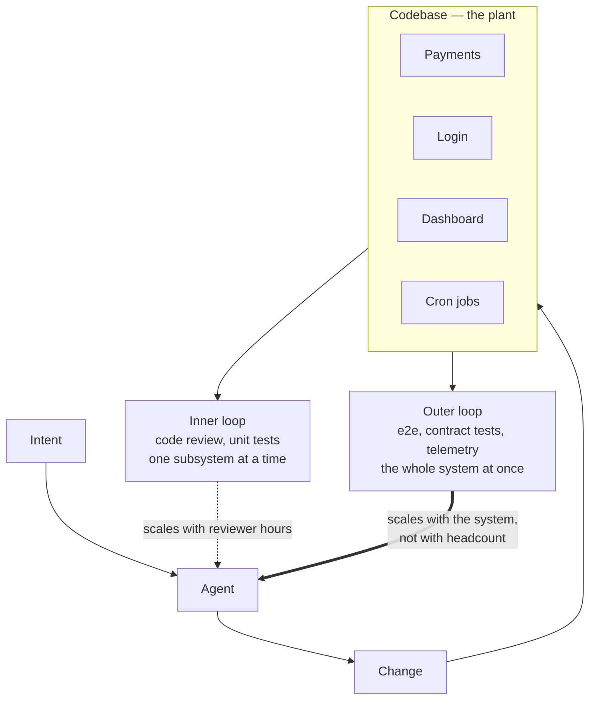

Borrow a frame from systems engineering: the codebase is the plant, and every mechanism that inspects its output is a sensor in a feedback loop. Code review is one such sensor. It is not the only one, and treating it as the default is what breaks when agents enter the system.

A real system has many subsystems — payments, login, dashboard, form submissions, cron jobs — and historically the team put a sensor on each one at the lowest possible layer: a human reading the diff. That worked because it had to. Before AI, the only way to make the plant produce faster was to hire more people, and each new person arrived with review capacity attached. Throughput and review capacity grew together.

That coupling is now broken. A team can multiply the code it produces without adding a single reviewer, and the old process quietly becomes the constraint.

## The Choice Nobody Makes Explicitly

So ask the question directly, because defaulting is also a choice: do you keep reviewing every change — accepting that your throughput is capped at reviewer hours, and forgoing most of what agents offer — or do you find other ways to establish that the system is correct?

Two moves make the second option real.

**Review only what is genuinely critical.** Schema migrations, authentication, anything touching money, anything irreversible. The point is not that other code matters less; it is that human attention is the scarcest sensor you have and should be pointed where failure is least recoverable. If your entire system is critical, you do not have many options — and knowing that is itself valuable, because it tells you your ceiling is real rather than accidental.

**Elevate the loop.** Instead of reviewing each subsystem at the diff level, validate at a higher layer: end-to-end tests, contract tests, integration suites running against a real deployed environment. The time that would have gone into reviewing one subsystem instead buys evidence about the whole system, on every change, forever.

The dotted arrow is the one that runs out. The thick one is the one worth investing in, because its cost is paid once per test and its value is collected on every future change.

## The Part That Is Easy to Get Wrong

Elevating the loop is not the same as loosening the inner one and hoping. If you stop reviewing a subsystem and do not build the outer loop that now covers it, you have not moved validation up — you have removed it. The teams that extract the most value from AI are not the ones that review least; they are the ones whose outer loops are strong enough to make reviewing less a defensible decision.

Two properties determine whether an outer loop can carry that weight.

**Latency.** Outer loops are slower and coarser by nature. An e2e suite tells you something is broken; it rarely tells you which line. That is an acceptable trade only when the loop is fast enough to run on every change, which is why suite speed is a correctness concern and not a convenience. A loop that runs nightly is not a loop an agent can iterate against.

**Determinism.** A flaky outer loop is worse than no outer loop, because it trains the team to ignore the only sensor still watching. When a failure sometimes means nothing, it soon means nothing. Every quarantined flake is a hole in the layer you just decided to depend on.

The loop also extends past the merge. Tests verify what the team predicted; telemetry verifies what it did not, which matters more when the person approving a change never built the mental model that writing it would have produced. See [Observability](/docs/ai/agentic-engineering-foundations/observability) for that half.

## How This Works at ttoss

Verification is Jest across both frontend and backend packages, with `@ttoss/test-utils` supplying the provider context React components need. Structure is scaffolded rather than hand-rolled — `npx @ttoss/monorepo setup-tests` for unit tests, `--e2e` when a package needs the outer layer too.

The mechanism that keeps this from eroding is the coverage ratchet: every package pins `coverageThreshold` in its Jest config, and it may never be lowered. Change code, and you update the threshold to match the new reality — upward only. This matters specifically because generated code accumulates faster than anyone audits it, and coverage that is merely observed will drift down one merge at a time. Coverage that is pinned cannot.

Every pull request also gets a real deployed environment, courtesy of the pipeline described in [Automation](/docs/engineering/pillars/automation). That is what gives outer-loop tests something honest to run against.

Implementation specifics — file layout, mocking conventions, `jest.mocked()` over casts — live in the [tests guideline](/docs/engineering/guidelines/tests).

## Failure Mode

An agent produces a week's worth of code in a day. The team keeps its inherited process and reviews all of it at the diff level. The review queue grows, reviewers start skimming, and the skimming is invisible because a skimmed approval looks exactly like a careful one. Regressions ship. The team concludes that agent output is low quality, when what actually failed was a sensor placed at a layer that no longer matches the volume of change flowing through it.
