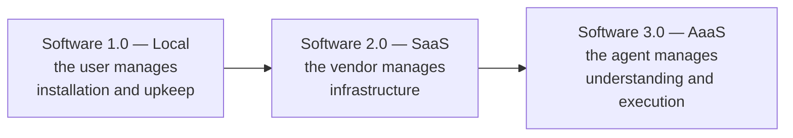
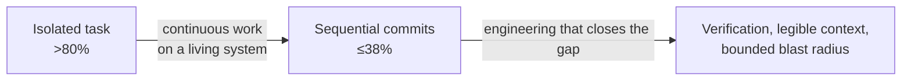

Every tooling wave in software has been sold as a paradigm shift, and most were not. The argument for treating this one differently is not that agents write code well. It is that they change which part of the delivery system is scarce, and scarcity is what determines how a discipline organizes itself.

The framing here follows [_The End of Software Engineering: How AI Agents Are Fundamentally Restructuring the Software Paradigm_](https://arxiv.org/html/2606.05608v1) (Cao, 2026). We reference it because it argues the structural case rather than the productivity case, and because it is honest about where the argument currently fails.

## Complexity Transfers, It Does Not Disappear

Each generation of software delivery moved complexity away from the person receiving the value, and toward the party better equipped to absorb it.

Installed software made the end user responsible for keeping it running. SaaS moved that to the vendor, and users stopped thinking about servers. The claim about agents is the same move applied one layer up: the artifact itself becomes optional. Where the chain used to run _AI → software → result_, it can now run _agent → result_, with code generated as ephemeral tooling in service of an outcome rather than shipped as a durable product.

The load-bearing observation underneath is about limits rather than convenience. Traditional systems require a human to pre-encode decision rules for situations the human anticipated, and the number of interaction paths in a system grows exponentially with its components. Human cognitive capacity does not grow at all. Agentic systems decouple solution capability from that fixed ceiling, because the reasoning is done by a model whose capacity scales with training compute rather than with anyone's working memory.

You do not have to accept the strong version of this — that software artifacts largely disappear — for the consequence to hold. Even in the weak version, the artifact stops being the thing engineers primarily produce.

## The Human Role Moves Up, Not Out

The paper maps a four-stage progression. The timelines are the author's projections and should be read as such; the useful column is the last one.

| Stage                        | Capability                            | Human role                      |
| ---------------------------- | ------------------------------------- | ------------------------------- |
| I. Tool-augmented            | Completion, single-issue fixes        | Author and reviewer             |
| II. Single-task autonomous   | End-to-end feature delivery           | Intent architect and auditor    |
| III. Multi-agent teams       | Coordinated work across the lifecycle | Coordinator, architect, auditor |
| IV. Self-evolving ecosystems | Autonomous adaptation                 | Goal setter and governor        |

Read down that column and the trajectory is unambiguous: the human contribution shifts from producing code to articulating intent, exercising architectural judgment, calibrating quality, and governing what the system is allowed to do. It is elevation, not removal — the same conclusion reached from a different direction by [The Principle of Role Elevation in Human-AI Hybridization](/docs/ai/agentic-development-principles/symbiosis-of-human-ai-agency#the-principle-of-role-elevation-in-human-ai-hybridization).

This is why "we use AI to write code faster" is a weak strategy. It optimizes stage I while the roles being described belong to stages II and III.

## The Gap That Makes Discipline Non-Optional

The most useful number in the paper is the one that undercuts its own thesis. On isolated, well-scoped tasks, agents score above 80%. Measured in continuous settings — sequences of commits, ongoing maintenance, errors that propagate across changes — performance falls to at most 38%.

That 42-point gap is the whole argument for engineering rigor. It says agents are already strong at the unit of work a benchmark can isolate, and weak at exactly what production software is: a long-lived system where today's change interacts with a year of prior decisions. The gap is not closed by a better model alone. It is closed by the system the agent operates inside — whether mistakes surface quickly, whether context survives between tasks, whether damage stays bounded.

An organization that adopts agents without building that system does not get 38% of the benefit. It gets the volume of a strong model and the reliability of its weakest loop.

## What This Means for a Team Today

Do not restructure around stage IV. Build the things that close the continuous-work gap, because they pay off at every stage and they are the same things good engineering always wanted — only now the cost of skipping them is charged immediately rather than deferred to the next maintainer.

That is what the [Pillars](/docs/engineering/pillars) are for. Each one is a property that makes agent output verifiable, legible, or containable across sequences of change rather than one task at a time.

One caution worth stating plainly: a team that celebrates no longer reading code, merging quickly and accumulating output nobody can explain, has not reached stage II. It has reached stage I with the reviewer removed. The role elevates; it does not vacate.
