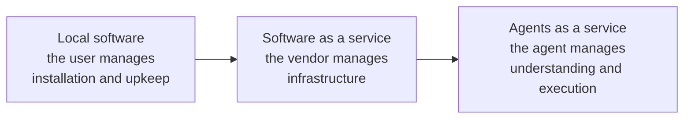
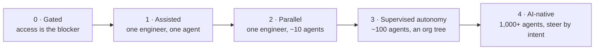

Every tooling wave in software has been sold as a paradigm shift, and most were not. The argument for treating this one differently is not that agents write code well. It is that they change which part of the delivery system is scarce, and scarcity is what determines how a discipline organizes itself.

## Complexity Transfers, It Does Not Disappear

Each generation of software delivery moved complexity away from the person receiving the value and toward the party better equipped to absorb it.

Installed software made the end user responsible for keeping it running. SaaS moved that to the vendor, and users stopped thinking about servers. Agents apply the same move one layer up: the artifact itself becomes optional. Where the chain used to run _AI → software → result_, it can now run _agent → result_, with code generated as ephemeral tooling in service of an outcome rather than shipped as a durable product.

The observation underneath is about limits, not convenience. Traditional systems require a human to pre-encode decision rules for every situation the human anticipated, and the number of interaction paths in a system grows exponentially with its components while human working memory does not grow at all. Agentic systems decouple solution capability from that fixed ceiling, because the reasoning is done by a model whose capacity scales with compute rather than with anyone's head.

You do not have to accept the strong version of this — that software artifacts largely disappear — for the consequence to hold. Even in the weak version, the artifact stops being the thing engineers primarily produce.

## The Gap That Makes Discipline Non-Optional

The most useful fact about current agents is the one that undercuts the hype. On isolated, well-scoped tasks — a single issue, a clean benchmark — they already perform strongly. Measured on continuous work — sequences of commits, ongoing maintenance, errors that propagate across changes — they lose most of that performance.

That gap is the whole argument for engineering rigor. Agents are already strong at the unit of work a benchmark can isolate, and weak at exactly what production software is: a long-lived system where today's change interacts with a year of prior decisions. A better model narrows the gap; it does not close it. What closes it is the system the agent operates inside — whether mistakes surface quickly, whether context survives between tasks, whether damage stays bounded.

An organization that adopts agents without building that system does not get a fraction of the benefit. It gets the volume of a strong model and the reliability of its weakest loop.

## The Steps of Adoption

Teams do not adopt agents in one move. They pass through recognizable steps, and each is defined less by the tools in use than by two things: how many agents one engineer can keep productive, and what is currently the bottleneck. The human role moves up the stack at every step — pair, then orchestrator, then manager of managers, then someone steering by intent — and it is elevation rather than removal, the same conclusion [The Principle of Role Elevation in Human-AI Hybridization](/docs/ai/agentic-development-principles/symbiosis-of-human-ai-agency#the-principle-of-role-elevation-in-human-ai-hybridization) reaches from a different direction.

| Step                    | Your role           | What it looks like                                                                                                                                                                                                                                                                                 | The bottleneck                                                                                                                                                                   |
| ----------------------- | ------------------- | -------------------------------------------------------------------------------------------------------------------------------------------------------------------------------------------------------------------------------------------------------------------------------------------------- | -------------------------------------------------------------------------------------------------------------------------------------------------------------------------------- |
| 0 · Gated               | Blocked             | Only older or lighter models are approved, access is process-heavy, and nothing an agent produces has a sanctioned place to live.                                                                                                                                                                  | Legacy approval processes, cost-per-token containment instead of outcomes, and no technical voice where the decisions are made.                                                  |
| 1 · Assisted            | Pair                | One engineer, one agent, mostly supervised. You run one session at a time and review almost every change before it merges. An afternoon's task becomes something finished between meetings.                                                                                                        | Your attention. With low trust in the output and no self-verification, you read everything and never look away. Work is synchronous.                                             |
| 2 · Parallel            | Orchestrator        | One engineer runs five to ten agents in isolated worktrees. Each agent checks its own work — tests, build, lint, security — before you see it. You review final diffs, not keystrokes, and the agent writes most of the code. A backlog that took the team weeks becomes one engineer's afternoon. | Reviewing output. You write less and check six streams instead, and steering that many sessions costs attention of its own.                                                      |
| 3 · Supervised autonomy | Manager of managers | Agents write nearly all the code, and some of it proactively — maintenance that used to wait for someone to find time now runs continuously. "Did you read the code?" becomes "what context was the model missing, and how do we fix that for next time?"                                          | Trust in the loop, and the team's decision throughput. The trap is scaling agent count before the loop has earned the trust to justify it. Token efficiency becomes a real cost. |
| 4 · AI-native           | Steering by intent  | The loop is fully closed and most agents are started by other agents. You steer by intent and monitor by exception. A quarter-long migration becomes a workflow you kick off and check on.                                                                                                         | Identifying which work to automate at scale, and enforcing the right guardrails for each kind of work.                                                                           |

Two of the transitions carry most of the engineering weight.

**From Assisted to Parallel** is where this section's [Pillars](/docs/engineering/pillars) enter. The unlock is a self-verification loop you trust — tests, build, lint, and end-to-end checks against a real development environment — plus automated review, so the agent's work is verified before a human sees it and permission prompts stop blocking the agent mid-task. Without that loop, running more agents multiplies the reading rather than the output. It cannot be bought: the work is in your own codebase and pipeline. [Tests](/docs/engineering/pillars/tests) is about exactly this moment.

**From Parallel to Supervised autonomy** is about context and authority. Agents need a way to pull in what they lack — code, decisions, discussions — rather than having it re-explained per task, which is the concern of [Understandability](/docs/ai/agentic-engineering-foundations/understandability). Work has to be decomposed into loops and routines an agent can start for another agent, and agents will touch code owned by other teams, so review speed and edit rights become organizational questions. What keeps this safe is not trust in the model but structural bounds on what each agent may reach — [Deterministic Guardrails](/docs/ai/agentic-engineering-foundations/deterministic-guardrails). Throughout, one rule does not change: the same quality bar applies to human and agent-generated code.

Read the steps as a map of bottlenecks rather than a ladder to climb quickly. A team that skips the building does not skip the step; it arrives at the next one with the previous bottleneck still in place, now hidden. "We use AI to write code faster" optimizes step 1 while the roles worth having belong to steps 2 and beyond.

At ttoss we are at Parallel, working toward Supervised autonomy — which is why the pillars that are mechanized are the verification ones, and the context and authority work is not yet.
