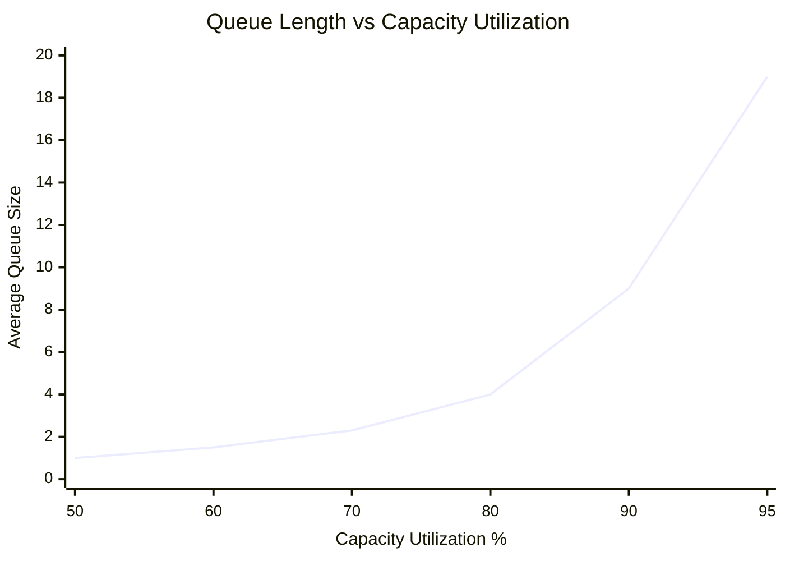

import TOCInline from '@theme/TOCInline';

In this section, we list the principles that we follow when developing products. We use these principles as a base to create all processes, tools, guidelines, and workflows of all departments—[product](/docs/product), [design](/docs/engineering), and [engineering](/docs/engineering).

_These principles are based on the book [The Principles of Product Development Flow](https://www.amazon.com/Principles-Product-Development-Flow-Generation-ebook/dp/B00K7OWG7O) by Donald G. Reinertsen._

## Table of Contents

<TOCInline toc={toc} />

## The Economic View

**Core Principle**: Make product development decisions based on economic impact to increase profits.

Transform all decisions into life-cycle profit comparisons rather than chasing popular [proxy variables](/docs/product/product-development/definitions#proxy-variable). This enables multivariable trade-offs that maximize economic value.

### E1: The Principle of Quantified Overall Economics: Select actions based on quantified overall economic impact.

Consider economic impact when making project decisions. Choose between releasing early with fewer tests versus testing more and releasing later based on economics, not philosophy.

### E2: The Principle of Interconnected Variables: We can't just change one thing.

Decisions simultaneously affect multiple variables. [Proxy variables](/docs/product/product-development/definitions#proxy-variable) are interconnected because they represent other variables.

### E3: The Principle of Quantified Cost of Delay: If you only quantify one thing, quantify the cost of delay.

Quantify the economic value of [cycle time](/docs/product/product-development/definitions#cycle-time) to make informed trade-offs. Cost of delay (COD) dominates Flow economics and provides the most eye-opening business insight.

### E4: The Principle of Economic Value-Added: The value added by an activity is the change in the economic value of the work product.

Value added equals the price difference an economically rational buyer would pay before and after the activity. Convert all waste to life-cycle profit terms for accurate comparisons.

### E5: The Inactivity Principle: Watch the work product, not the worker.

**Key insight**: The biggest waste isn't unproductive engineers—it's work products sitting idle in queues.

Eliminating inactivity creates more value than improving efficiency. When you increase value-added time in variable processes, you create queues whose costs exceed efficiency gains.

### E6: The U-curve Principle: Important trade-offs are likely to have U-curve optimizations.

U-curves combine hyperbolic and linear functions with two key properties:

- **Optimization never occurs at extremes** - requires balancing competing factors
- **Flat bottoms** - missing the exact optimum costs little

This makes the framework robust to imperfect information.

### E7: The Imperfection Principle: Even imperfect answers improve decision-making.

Without economic frameworks, intuition creates 50-to-1 variations in cycle time pricing. Economic frameworks reduce this to 2-to-1. The analysis process reveals critical assumptions, enabling continuous improvement of economic understanding.

### E8: The Principles of Small Decisions: Influence the many small decisions.

Companies often manage big decisions well but lack frameworks for numerous small decisions that have enormous cumulative economic impact. Focus on enabling good small decisions throughout the organization.

### E9: The Principle of Continuous Economic Trade-offs: Economic choices must be made continuously.

Product development requires many small, random trade-offs throughout the process as new information emerges from markets, design, customers, and engineering. Follow [Principle E1](#e1-the-principle-of-quantified-overall-economics-select-actions-based-on-quantified-overall-economic-impact) over original plans.

### E10: The First Perishability Principle: Many economic choices are more valuable when made quickly.

Opportunities shrink and obstacles grow over time. Measure and shorten decision-making time. Empower front-line workers to make decisions since they detect opportunities and obstacles first.

### E11: The Subdivision Principle: Inside every bad choice lies a good choice.

Decompose decisions into components with different economics. Use your economic framework to evaluate parts separately, keeping good components and improving or discarding bad ones.

### E12: The Principles of Early Harvesting: Create systems to harvest the early cheap opportunities.

Design processes to recognize and capture low-cost cycle time improvements early in development. Actions at the beginning cost less than at the end.

**Example**: Allow engineers to buy up to 4 weeks of schedule improvement at max $500/week, controlling by time and value to limit risk.

### E13: The First Decision Rule Principle: Use decision rules to decentralize economic control.

**Economic decision rules** accomplish four critical things:

1. Align all economic choices across the project
2. Ensure system-level optimization
3. Enable low-level control with limited risk
4. Streamline decision processes

**Example**: Boeing authorized engineers to increase unit cost by $300 to save one pound of weight, enabling system-level optimization without approval delays.

### E14: The First Market Principle. Ensure decision-makers feel both cost and benefit.

Decision-makers must experience both costs and benefits of their choices. Use pricing to control demand—when prices rise, demand falls. This enables decentralized control without decision delays.

### E15: The Principle of Optimum Decision Timing: Every decision has its optimum economic timing.

Time decisions based on economics, not broad concepts like "front-loading" or "responsible deferral." Make decisions when further delay no longer increases expected economic outcome. Waiting reduces uncertainty but delays benefits.

### E16: The Principle of Marginal Economics. Always compare marginal cost and marginal value.

Use marginal analysis for incremental decisions instead of comparing total costs and values. When marginal value exceeds marginal cost, the action improves economic value.

**Example**: A 100% complete feature may offer better marginal economics than an 80% complete feature, despite conventional wisdom favoring completion of planned objectives.

### E17: The Sunk Cost Principle. Do not consider money already spent.

Base decisions on [marginal economics](#e16-the-principle-of-marginal-economics-always-compare-marginal-cost-and-marginal-value), not sunk costs.

### E18: The Principle of Buying Information: The value of information is its expected economic value.

Information reduces uncertainty and creates economic value. Don't pay more than the economic value it creates. Product development investments create value even when products fail if they generate valuable information.

### E19: The Insurance Principle: Don't pay more for insurance than the expected loss.

Backup solutions trade development expenses for risk reduction. The economic benefit of risk reduction must exceed insurance costs.

**Parallel development economics**: If one solution has 10% failure rate, n parallel solutions have 0.1^n failure rate. Incremental value decreases geometrically while incremental cost remains constant, creating U-curve optimization where the optimum may equal one solution.

### E20: The Newsboy Principle: High probability of failure does not equal bad economics.

Uncertain opportunities have large payoff asymmetries, making them excellent sources of innovation. Filtering out high-failure-probability opportunities also eliminates the best asymmetric opportunities, reducing economic value.

### E21: The Show Me the Money Principle: To influence financial decisions, speak the language of money.

Influence financial decision-makers by speaking economics, not [proxy variables](/docs/product/product-development/definitions#proxy-variable). This enables fast decisions and enthusiastic support.

## Managing Queues

**[Q1](#q1-the-principle-of-invisible-inventory-product-development-inventory-is-physically-and-financially-invisible) to [Q2](#q2-the-principle-of-queueing-waste-queues-are-the-root-cause-of-the-majority-of-economic-waste-in-product-development) - Why Queues Matter?** Queues matter because they're economically important, poorly managed, and they have the potential to be much better managed. They profoundly affect the economics of product development.

**[Q3](#q3-the-principle-of-queueing-capacity-utilization-capacity-utilization-increases-queues-exponentially) to [Q8](#q8-the-principle-of-linked-queues-adjacent-queues-see-arrival-or-service-variability-depending-on-loading) - The Behavior of Queues.** To understand the behavior of queues, you need to understand how capacity utilization and variability affect the size of queues, the relative frequency of high-queue states, and how the structure of a queueing system affects their performance.

**[Q9](#q9-the-principle-of-queue-size-optimization-optimum-queue-size-is-an-economic-trade-off) to [Q10](#q10-the-principle-of-queueing-discipline-queue-cost-is-affected-by-the-sequence-in-which-we-handle-the-jobs-in-the-queue) - The Economics of Queues.** Optimizing queues brings a problem because the higher you utilize capacity, the more you pay for queues, but the less you pay for excess capacity. How to make quantitative trade-offs between them? How can you use queueing discipline to reduce the economic cost without reducing the queue size?

**[Q11](#q11-the-cumulative-flow-principle-use-cfds-to-monitor-queues) to [Q16](#q16-the-intervention-principle-we-cannot-rely-on-randomness-to-correct-a-random-queue) - Managing Queues.** Six principles to help you manage queues. First is the cumulative flow diagram (CFD). Second, the Little's Formula. Then, two important principles for controlling queue size. Finally, the counterintuitive nature of random processes.

### Q1: The Principle of Invisible Inventory: Product development inventory is physically and financially invisible.

Inventory in product development isn't physical objects but information. Then, it's virtually invisible, both physically and financially. Product development inventory's effects: increased [cycle time](/docs/product/product-development/definitions#cycle-time), delayed feedback, constantly shifting priorities, and status reporting.

### Q2: The Principle of Queueing Waste: Queues are the root cause of the majority of economic waste in product development.

### Q3: The Principle of Queueing Capacity Utilization: Capacity utilization increases queues exponentially.

As teams approach 100% capacity utilization, queue lengths grow exponentially, not linearly. This creates a dramatic impact on cycle times and team velocity.

For an M/M/1 queue system, where ρ (rho) represents capacity utilization as a decimal (0.75 = 75% utilization):

**Core Queueing Formulas**:

- $\text{Percent Capacity Utilization} = \rho$
- $\text{Percent Unblocked Time} = 1 - \rho$
- $\text{Number of Items in Queue} = \cfrac{\rho^2}{1-\rho}$
- $\text{Numbers of Items in System} = \cfrac{\rho}{1-\rho}$
- $\text{Percent Queue Time} = \rho$
- $\cfrac{\text{Cycle Time}}{\text{Value-Added Time}} = \cfrac{1}{1-\rho}$

Here's how capacity utilization affects average queue size:

| Capacity Utilization | Average Queue Size | Relative Delay | Cycle Time Multiplier |
| -------------------- | ------------------ | -------------- | --------------------- |
| 50%                  | 1.0                | 1x             | 2x                    |
| 60%                  | 1.5                | 1.5x           | 2.5x                  |
| 70%                  | 2.3                | 2.3x           | 3.3x                  |
| 80%                  | 4.0                | 4x             | 5x                    |
| 90%                  | 9.0                | 9x             | 10x                   |
| 95%                  | 19.0               | 19x            | 20x                   |

Note that as you halve the amount of excess capacity, you roughly double the average queue size. From 70% to 80%, you double the queue size. From 80% to 90%, you double it again. From 90% to 95%, you double it once more.

In practice, it's hard to measure capacity utilization directly. As you shall see in this principles, you find more practical ways to estimate it, like queue size and WIP (work in process).

### Q4: The Principle of High-Queues States: Most of the damage done by a queue is caused by high-queues states.

Queues spend more time in low-queue states, but high-queue states cause the most harm. When a queue is overloaded, it delays more tasks, increases cycle times, and leads to greater economic waste. Even though high-queue states are less frequent, they have a much bigger impact on overall performance and efficiency.

The State Probability of an $M/M/1/\infty$ queue to have $n$ jobs in the system is:

$$
\text{State Probability} = \frac{1-\rho}{\rho^n}
$$

For example, for a queue with at 75% utilization, the probabilities of having $n$ jobs in the system are:

| Number of Jobs in the System | Probability |
| ---------------------------- | ----------- |
| 0                            | 25%         |
| 1                            | 18.8%       |
| 2                            | 14.1%       |
| 3                            | 10.5%       |

This means that the probability of having two jobs are 75% of the probability of having one job in the system. However, delaying two units creates twice the economic waste (see [The Hidden Costs of Queues in Product Development](/blog/2024/09/24/the-hidden-costs-of-queues-in-product-development) for more details) of delaying one unit.

### Q5: The Principle of Queueing Variability: Variability increases queues linearly.

### Q6: The Principle of Variability Amplification: Operating at high levels of capacity utilization increases variability.

### Q7: The Principle of Queueing Structure: Serve pooled demand with reliable high-capacity servers.

### Q8: The Principle of Linked Queues: Adjacent queues see arrival or service variability depending on loading.

In systems where one queue feeds into another, the output of one queue becomes the input for the next. The way each queue performs depends on how busy it is—its output may either mirror the rate at which tasks arrive or the speed at which they are completed.

In a process with several linked queues, one queue usually slows down the entire system (the bottleneck). To improve the flow and speed up the whole process, it's important to reduce delays and unpredictability at the bottleneck by managing how tasks arrive from the previous queue. By controlling what happens before the bottleneck, you can improve the flow through it and make the system more efficient.

### Q9. The Principle of Queue Size Optimization: Optimum queue size is an economic trade-off.

### Q10. The Principle of Queueing Discipline: Queue cost is affected by the sequence in which we handle the jobs in the queue.

### Q11: The Cumulative Flow Principle: Use CFDs to monitor queues.

### Q12: Little's Formula: Wait Time = Queue Size/Processing Rate

### Q13: The First Queue Size Control Principle: Don't control capacity utilization, control queue size.

### Q14: The Second Queue Size Control Principle: Don't control cycle time, control queue size.

### Q15: The Diffusion Principle: Over time, queues will randomly spin seriously out of control and will remain in this state for long periods.

### Q16: The Intervention Principle: We cannot rely on randomness to correct a random queue.

When a queue builds up into a sustained high-load state, it won't easily or quickly revert to a low-load state on its own. Just like flipping 10 heads in a row doesn't increase the chance of flipping 10 tails to balance it out, randomness won't fix the problem.

You need to intervene quickly and decisively in such situations. Set limits on maximum queue size, and act before the system hits those limits. The more closely you monitor queues and intervene early, the less they will cost you in the long run.

## Exploiting Variability

### V1: The Principle of Beneficial Variability: Variability can create economic value.

Which choice is the best economic choice? Which option has the minimum uncertainty in its outcome?

| Choice | Stakes   | Payoff    | Probability | EMV     |
| ------ | -------- | --------- | ----------- | ------- |
| A      | \$15,000 | \$100,000 | 50%         | $35,000 |
| B      | \$15,000 | \$20,000  | 90%         | $3,000  |
| C      | \$15,000 | \$16,000  | 100%        | $1,000  |

_EMV = Expected Monetary Value_

Choice A is the best economic choice and the most uncertain. Choice C has zero uncertainty, yet it isn't the best economic choice.

The economics of each discrete choice depends on two factors: the probability and the payoff function. We can't make good economic choices if we only pay attention to probabilities. So you need to pay attention to both probability and payoff functions.

### V2: The Principle of Asymmetric Payoffs: Payoff asymmetries enable variability to create economic value.

### V3: The Principle of Optimum Variability: Variability should neither be minimized nor maximized.

### V4: The Principle of Optimum Failure Rate: Fifty percent failure rate is usually optimum for generating information.

### V5: The Principle of Variability Pooling: Overall variation decreases when uncorrelated random tasks are combined.

### V6: The Principle of Short-Term Forecasting: Forecasting becomes exponentially easier at short time-horizons.

### V7: The Principle of Small Experiments: Many small experiments produce less variation than one big one.

This principle emphasizes that breaking a large risk into many smaller, independent risks reduces the overall variation in outcomes. This idea stems from statistics, where repeated small trials (a binomial distribution) result in a smaller coefficient of variation compared to a single large trial. This is because, as the number of trials increases, the mean grows faster than the standard deviation, lowering the overall risk of failure.

For example, dividing a single high-risk bet (e.g., a 50% chance of losing $15,000) into multiple smaller bets significantly decreases the chance of total loss. Similarly, in product development, launching several smaller innovations rather than one blockbuster product reduces the risk of complete failure, offering more consistent and stable outcomes.

### V8: The Repetition Principle: Repetition reduces variation.

### V9: The Reuse Principle: Reuse reduces variability.

### V10: The Principle of Negative Covariance: We can reduce variance by applying a counterbalancing effect.

### V11: The Buffer Principle: Buffers trade money for variability reduction.

### V12: The Principle of Variability Consequence: Reducing consequences is usually the best way to reduce the cost of variability.

### V13: The Nonlinearity Principle: Operate in the linear range of system performance.

### V14: The Principle of Variability Substitution: Substitute cheap variability for expensive variability.

### V15: The Principle of Iteration Speed: It is usually better to improve iteration speed then defect rate.

### V16: The Principle of Variability Displacement: Move variability to the process stage where its cost is lowest.

## Reducing Batch Size

### B1: The Batch Size Queueing Principle: Reducing batch size reduces cycle time.

### B2: The Batch Size Variability Principle: Reducing batch sizes reduces variability in flow.

### B3: The Batch Size Feedback Principle: Reducing batch sizes accelerates feedback.

### B4: The Batch Size Risk Principle: Reducing batch size reduces risk.

### B5: The Batch Size Overhead Principle: Reducing batch size reduces overhead.

### B6: The Batch Size Efficiency Principle: Large batches reduce efficiency.

### B7: The Psychology Principle of Batch Size: Large batches inherently lower motivation and urgency.

### B8: The Batch Size Slippage Principle: Large batches cause exponential cost and schedule growth.

### B9: The Batch Size Death Spiral Principle: Large batches lead to even larger batches.

### B10: The Least Common Denominator Principle of Batch Size: The entire batch is limited by its worst element.

### B11: The Principle of Batch Size Economics: Economic batch size is a U-curve optimization.

### B12: The Principle of Low Transaction Cost: Reducing transaction cost per batch lowers overall costs.

### B13: The Principle of Batch Size Diseconomies: Batch size reduction saves much more than you think.

### B14: The Batch Size Packing Principle: Small batches allow finer tuning of capacity utilization.

### B15: The Fluidity Principle: Loose coupling between product subsystems enables small batches.

### B16: The Principle of Transport Batches: The most important batch is the transport batch.

### B17: The Proximity Principle: Proximity enables small batch sizes.

Proximity reduces the cost of transporting or communicating in small batches, making processes faster and more efficient. In manufacturing, close distances enable one-piece flow and greater flexibility, while in product development, colocated teams benefit from real-time, face-to-face communication. This eliminates delays inherent to asynchronous communication, unlocking the full advantages of small batch sizes and enhancing responsiveness to emerging needs.

### B18: The Run Length Principle: Short run lengths reduce queues.

### B19: The Infrastructure Principle: Good infrastructure enables small batches.

### B20: The Principle of Batch Content: Sequence first that which adds value most cheaply.

### B21: The Batch Size First Principle: Reduce batch size before you attack bottlenecks.

### B22: The Principle of Dynamic Batch Size: Adjust batch size dynamically to respond to changing economics.

## Applying WIP Constraints

### W1: The Principle of WIP Constraints: Constrain WIP to control cycle time and flow.

### W2: The Principle of Rate-Matching: WIP constraints force rate-matching.

### W3: The Principle of Global Constraints: Use global constraints for predictable and permanent bottlenecks.

### W4: The Principle of Local Constraints: If possible, constrain local WIP pools.

### W5: The Batch Size Decoupling Principle: Use WIP ranges to decouple the batch sizes of adjacent processes.

### W6: The Principle of Demand Blocking: Block all demand when WIP reaches its upper limit.

### W7: The Principle of WIP Purging: When WIP is high, purge low-value projects.

### W8: The Principle of Flexible Requirements: Control WIP by shedding requirements.

### W9: The Principle of Resource Pulling: Quickly apply extra resources to an emerging queue.

### W10: The Principle of Part-Time Resources: Use part-time resources for high variability tasks.

### W11: The Big Gun Principle: Pull high-powered experts to emerging bottlenecks.

### W12: The Principle of T-Shaped Resources: Develop people who are deep in one area and broad in many.

### W13: The Principle of Skill Overlap: Cross-train resources at adjacent processes.

### W14: The Mix Change Principle: Use upstream mix changes to regulate queue size.

### W15: The Aging Principle: Watch the outliers.

### W16: The Escalation Principle: Create a preplanned escalation process for outliers.

### W17: The Principle of Progressive Throttling: Increase throttling as you approach the queue limit.

### W18: The Principle of Differential Service: Differentiate quality of service by workstream.

### W19: The Principle of Adaptive WIP Constraints: Adjust WIP constraints as capacity changes.

### W20: The Expansion Control Principle: Prevent uncontrolled expansion of work.

### W21: The Principle of the Critical Queue: Constrain WIP in the section of the system where the queue is most expensive.

### W22: The Cumulative Reduction Principle: Small WIP reductions accumulate.

### W23: The Principle of Visual WIP: Make WIP continuously visible.

## Controlling Flow Under Uncertainty

### F1: The Principle of Congestion Collapse: When loading becomes too high, we will see a sudden and catastrophic drop in output.

### F2: The Peak Throughput Principle: Control occupancy to sustain high throughput in systems prone to congestion.

### F3: The Principle of Visible Congestion: Use forecasts of expected flow time to make congestion visible.

### F4: The Principle of Congestion Pricing: Use pricing to reduce demand during congested periods.

### F5: The Principle of Periodic Resynchronization: Use a regular cadence to limit the accumulation of variance.

### F6: The Cadence Capacity Margin Principle: Provide sufficient capacity margin to enable cadence.

### F7: The Cadence Reliability Principle: Use cadence to make waiting times predictable.

### F8: The Cadence Batch Size Enabling Principle: Use a regular cadence to enable small batch sizes.

### F9: The Principle of Cadenced Meetings: Schedule frequent meetings using a predictable cadence.

### F10: The Synchronization Capacity Margin Principle: To enable synchronization, provide sufficient capacity margin.

### F11: The Principle of Multiproject Synchronization: Exploit scale economies by synchronizing work from multiple projects.

### F12: The Principle of Cross-Functional Synchronization: Use synchronized events to facilitate cross function trade-offs.

### F13: The Synchronization Queueing Principle: To reduce queues, synchronize the batch size and timing of adjacent processes.

### F14: The Harmonic Principle: Make nested cadences harmonic multiples.

### F15: The SJF Scheduling Principle: When delay costs are homogeneous, do the shortest job first.

### F16: The HDCF Scheduling Principle: When job durations are homogeneous, do the high cost-of-delay job first.

### F17: The WSJF Scheduling Principle: When job durations and delay costs are not homogeneous, use WSJF.

### F18: The Local Priority Principle: Priorities are inherently local.

### F19: The Round-Robin Principle: When task duration is unknown, share time among tasks.

When scheduling a task with an unknown duration, you can't predict how long it will occupy a resource. Worse, the task could take an infinite amount of time.

The [round-robin scheduling](/docs/product/product-development/definitions#round-robin-scheduling) method from operating system design addresses this by allocating a fixed time slice (quantum) to each task. After the quantum ends, the task returns to the queue, and the next task starts. This ensures shorter tasks are completed sooner, even if their duration is unknown.

The key decision is setting the quantum size. If too large, the system behaves like FIFO; if too small, frequent context switching increases overhead. A useful heuristic is setting the quantum so that 80% of tasks are completed within a single time slice.

### F20: The Preemption Principle: Only preempt when switching costs are low.

### F21: The Principle of Work Matching: Use sequence to match jobs to appropriate resources.

### F22: The Principle of Tailored Routing: Select and tailor the sequence of subprocesses to the task at hand.

### F23: The Principle of Flexible Routing: Route work based on the current most economic route.

### F24: The Principle of Alternate Routes: Develop and maintain alternate routes around points of congestion.

### F25: The Principle of Flexible Resources: Use flexible resources to absorb variation.

### F26: The Principle of Late Binding: The later we bind demand to resources, the smoother the flow.

### F27: The Principle of Local Transparency: Make tasks and resources reciprocally visible at adjacent processes.

### F28: The Principle of Preplanned Flexibility: For fast responses, preplan and invest in flexibility.

Flexibility comes from early decisions and careful planning. By preparing in advance, teams can respond quickly to changes.

For instance, if maintaining schedules is crucial, pre-identify nonessential requirements, classifying them as mandatory, important, or optional. This way, optional features are loosely coupled with the core architecture, making it easier to drop them if needed.

Similarly, if you anticipate needing to reallocate resources quickly, invest in keeping backup resources informed and ready. This reduces their response time and ensures they can become productive on short notice.

### F29: The Principle of Resource Centralization: Correctly managed, centralized resources can reduce queues.

### F30: The Principle of Flow Conditioning: Reduce variability before a bottleneck.

## Using Fast Feedback

### FF1: The Principle of Maximum Economic Influence: Focus control on project and process parameters with the highest economic influence.

Control measures that have the greatest impact on economic success. Use an economic framework to identify these parameters. For example, if a 10% increase in project expenses reduces profits by 1%, but a 10% increase in unit cost reduces profits by 50%, prioritize controlling unit cost over project expenses.

### FF2: The Principle of Efficient Control: Control parameters that are both influential and efficient.

A parameter's strong economic influence does not guarantee efficient control. For instance, average sales price significantly impacts life cycle economics but is difficult to control directly. On the other hand, unit cost has a similar influence and is more manageable.

To identify effective control variables, find the intersection of economic influence and control efficiency. Conduct sensitivity analysis to determine which [proxy variables](/docs/product/product-development/definitions#proxy-variable) have economic impact, then rank these variables based on their control efficiency to identify the most effective ones.

### FF3: The Principle of Leading Indicators: Select control variables that predict future system behavior.

[Leading indicators](/docs/product/product-development/definitions#leading-indicators) are valuable for efficient control because they enable early interventions, which are economically beneficial. As development progresses, intervention costs rise exponentially, while the value of acting early increases significantly. These combined effects make early interventions highly efficient.

For instance, a manager focused on monitoring task start times instead of completion times. He observed a strong correlation: when the right person started a task on time, it usually finished on schedule. Conversely, tasks that started late or with incorrect resources often finished late. By using start times as a leading indicator, he could intervene early—adjusting resources or priorities—before delays became costly.

However, these conditions—predictive [leading indicators](/docs/product/product-development/definitions#leading-indicators) and the potential for impactful early interventions—may not always be present. When absent, the benefits of using [leading indicators](/docs/product/product-development/definitions#leading-indicators) can diminish or even become counterproductive.

### FF4: The Principle of Balanced Set Points: Set tripwires at points of equal economic impact.

### FF5: The Moving Target Principle: Know when to pursue a dynamic goal.

Many companies create harmful control systems by failing to distinguish between static and dynamic goals. They assume that following the plan is always correct and any deviation is negative. In stable environments, like manufacturing, this can be true, where frameworks like Six Sigma prevent deviations to optimize efficiency.

However, in product development, goals constantly shift as better information emerges. Stable goals require preventing deviations and avoiding risk, while dynamic goals demand quick adjustments and reduced inertia to close the gap between the current state and the desired outcome.

Recognizing when your goals are dynamic or stable is crucial, especially in the highly variable world of product development. For example, in developing a new software feature, user feedback may shift priorities, requiring the team to pivot and adjust the goal to meet evolving customer needs.

### FF6: The Exploitation Principle: Exploit unplanned economic opportunities.

### FF7: The Queue Reduction Principle of Feedback: Fast feedback enables smaller queues.

Fast feedback loops not only provide insights more quickly but also reduce the need for work-in-progress (WIP) in a system. By rapidly addressing variability, these loops allow processes to operate with smaller buffers, minimizing delays caused by excessive WIP. Smaller WIP, in turn, reduces overall system delays, enabling even faster feedback. This creates a positive feedback cycle: faster feedback reduces WIP, which lowers delays, further accelerating feedback and improving system efficiency. This principle highlights the compounding benefits of designing systems with rapid feedback mechanisms.

### FF8: The Fast-Learning Principle: Use fast feedback to make learning faster and more efficient.

Fast feedback is essential for accelerating learning and making it more precise. It achieves this by shortening the time between cause and effect, reducing noise, and improving clarity in the results. Investing in environments that enhance feedback, like Team New Zealand's (they designed the yacht that won the America's Cup) use of two boats for direct comparison, allows for more cycles of testing and better insights in each iteration. This approach demonstrates that faster feedback not only provides quicker answers but also leads to more efficient and reliable learning processes.

### FF6: The Exploitation Principle: Exploit unplanned economic opportunities.

### FF10: The First Agility Principle: We don't need long planning horizons when we have a short turning radius.

In product development, agility is the ability to quickly shift focus or direction without needing to plan too far ahead. A smaller, more focused project is much easier to adapt than a large, rigid one. Just like turning a small object is easier than moving a massive one, agile teams can change direction quickly when they have fewer moving parts.

To maintain this agility, it's important to have enough resources ready to make these changes as soon as needed. Organizations operating at full capacity often struggle because they can't reallocate resources quickly enough. This delays response times and makes it harder to shift direction.

When teams are set up to pivot quickly—by working on manageable projects and keeping resources flexible—they can move faster and more confidently, even in uncertain environments. This short "turning radius" means you don't need to plan everything in detail far into the future, because you can make quick adjustments as new information emerges. This approach reduces the complexity of managing changes and allows teams to operate at a higher speed without losing control.

### FF11: The Batch Size Principle of Feedback: Small batches yield fast feedback.

### FF12: The Signal to Noise Principle: To detect a smaller signal, reduce the noise.

### FF13: The Second Decision Rule Principle: Control the economic logic behind a decision, not the entire decision.

### FF14: The Locality Principle of Feedback: Whenever possible, make feedback local.

### FF15: The Relief Valve Principle: Have a clear, predetermined relief valve.

### FF16: The Principle of Multiple Control Loops: Embed fast control loops inside slow loops.

### FF17: The Principle of Controlled Excursions: Keep deviations within the control range.

### FF18: The Feedforward Principle: Provide advance notice of heavy arrival rates to minimize queues.

### FF19: The Principle of Colocation: Colocation improves almost all aspects of communication.

Colocation accelerates feedback by fostering real-time, face-to-face communication, which is more efficient and includes both verbal and nonverbal cues (the principle [B17: The Proximity Principle](#b17-the-proximity-principle-proximity-enables-small-batch-sizes) discussed the value of physical proximity). It reduces communication costs, enabling frequent, small-batch interactions and immediate issue resolution. Beyond speed, colocation strengthens team cohesion through informal, non-task-related interactions, helping team members see each other as complex individuals and reducing negative biases. This leads to more cohesive and effective teams. Despite its proven benefits, colocation remains underutilized, but it is one of the simplest and most impactful ways to boost team performance and development speed.

### FF20: The Empowerment Principle of Feedback: Fast feedback gives a sense of control.

### FF21: The Hurry-Up-and-Wait Principle: Large queues make it hard to create urgency.

### FF22: The Amplification Principle: The human element tends to amplify large excursions.

### FF23: The Principle of Overlapping Measurement: To align behaviors, reward people for the work of others.

### FF24: The Attention Principle: Time counts more than money.

## Achieving Decentralized Control

### D1: The Second Perishability Principle: Decentralize control for problems and opportunities that age poorly.

Certain problems and opportunities are highly perishable, requiring swift action—like putting out a fire before it spreads. On the other hand, some issues, like a bad stock investment, have self-limiting impacts.

To handle problems that worsen over time or seize fleeting opportunities, decentralize control. This means empowering individuals with the authority and resources to act quickly. Centralized planning can set tasks, but decentralized control ensures flexibility, enabling immediate responses to minor issues without delays.

### D2: The Scale Principle: Centralize control for problems that are infrequent, large, or have significant economies of scale.

Some problems require large-scale responses—big fires need fire trucks, not garden hoses. Centralized control is ideal for infrequent but significant demands, especially when economies of scale are at play. In contrast, frequent, small, and low-variability issues are better handled by decentralized resources ([D1: The Second Perishability Principle](#d1-the-second-perishability-principle-decentralize-control-for-problems-and-opportunities-that-age-poorly)).

Centralizing resources can delay response due to their size and complexity, so prioritizing these resources is crucial to ensure timely action. In product development, instead of placing an expert on every project, centralizing their expertise can be more efficient.

### D3. The Principle of Layered Control: Adapt control based on emerging information.

When it's unclear whether to centralize or decentralize control, two approaches can help: triage and escalation.

Triage, as used in hospitals, prioritizes resources by addressing solvable, potentially critical issues and avoiding those that are unsolvable or less urgent. This method is effective when enough information is available at the outset to make informed decisions.

Alternatively, when it's uncertain which task will take the most time, a [round-robin scheduling](/docs/product/product-development/definitions#round-robin-scheduling) approach discussed in [F19: The Round-Robin Principle](#f19-the-round-robin-principle-when-task-duration-is-unknown-share-time-among-tasks) ensures fair resource distribution. Each task is given a time slice, and unfinished tasks return to the queue, preventing long tasks from blocking shorter ones.

In systems with layered priorities, escalation ensures low-priority tasks don't get neglected. Problems are escalated after waiting too long, striking a balance between keeping important issues from being overlooked and avoiding overloading centralized resources.

### D4. The Opportunistic Principle: Adjust the plan for unplanned obstacles and opportunities.

In line with [Principle FF5: The Moving Target Principle: Know When to Pursue a Dynamic Goal](#ff5-the-moving-target-principle-know-when-to-pursue-a-dynamic-goal), static goals call for conformance, but dynamic goals require continuous adaptation. Plans should not enforce rigid conformance; instead, they should be used to maintain alignment and synchronize complex activities, such as coordinating multiple tasks for a product launch.

Adaptive plans allow teams to seize opportunities, adding significant value in product development. For instance, if a feature turns out to be far more costly and less valuable to customers than expected, a flexible process will recognize this and adjust. Similarly, if an easier-to-implement feature is discovered to provide greater customer value, adaptive plans make it simple to pivot, something much harder in rigid, conformance-focused processes.

### D5. The Principle of Virtual Centralization: Quickly reorganize decentralized resources to create centralized power.

It's often inefficient to keep centralized resources idle for rare large demands. Instead, these resources can be used for routine tasks and mobilized when needed to tackle big problems, allowing organizations to benefit from both centralized and decentralized resources, as discussed in [F28: The Principle of Preplanned Flexibility: For Fast Responses, Preplan and Invest in Flexibility](#f28-the-principle-of-preplanned-flexibility-for-fast-responses-preplan-and-invest-in-flexibility).

For example, cities can train civilians in firefighting and collaborate with nearby fire departments for mutual aid, providing centralized response capacity without maintaining a large permanent fire department.

In product development, some companies use "tiger teams"—highly skilled, experienced employees who handle critical crises but perform their regular duties during normal times. This strategy enables the company to mobilize expert resources quickly in emergencies.

### D6: The Inefficiency Principle: The inefficiency of decentralization can cost less than the value of faster response time.

### D7: The Principle of Alignment: More value is created with overall alignment than local excellence.

While one barbarian might defeat a Roman soldier, 1,000 Roman soldiers would always overcome 1,000 barbarians due to superior coordination and alignment of their forces.

In war, the principle of mass refers to concentrating effort and resources on a decisive point to achieve maximum impact. Economy of force means allocating minimal resources to secondary tasks, ensuring most resources are focused on the main objective. Together, these principles demonstrate the power of alignment.

In product development, small gains across many features don't impress, but a significant advantage in a key area can sway customer preference. Aligning resources to focus on a single area can create a competitive advantage, even if it means sacrificing excellence in other areas.

### D8: The Principle of Mission: Specify the end state, its purpose, and the minimal possible constraints.

In maneuver warfare, missions align teams through mission orders, which focus on the operation's intent—its end state—rather than prescribing specific actions. They communicate the "why," not the "what" or "how."

When the intent is clear, those executing the mission can adapt to obstacles or opportunities, choosing the best course of action. A well-crafted mission statement is a powerful tool for maintaining coordination, with the "why" being its most crucial element.

For example, in product development, rather than prescribing detailed features, a mission might be "create a seamless user experience that reduces churn by 20%." The team is free to explore the best solutions to achieve this goal, whether through UX improvements, better onboarding, or new product features. The key is the clear end state (reduce churn) and its purpose (improve retention), with minimal constraints on how to achieve it.

### D9. The Principle of Boundaries: Establish clear roles and boundaries.

In decentralized control, clearly defined roles and boundaries are crucial to avoid confusion. Too much overlap leads to inefficiency, while gaps leave tasks undone. In product development, unclear roles increase the need for communication and meetings. For instance, without clear roles, many people may need to approve simple decisions, slowing progress. Well-defined roles streamline teamwork. Additionally, it's important to identify and address gaps between roles to ensure all tasks are covered.

### D10. The Main Effort Principle: Designate a main effort and subordinate other activities.

In product development, it's essential to focus on the few key features that drive success. While customers may request hundreds of features, only a handful—typically four to six—truly influence their decision. These are the “main effort” of the project, where the team should concentrate the most resources. Other features should take a back seat, allowing the team to excel in the areas that really matter. By prioritizing these core features, you maximize the impact and effectiveness of the product, much like focusing on a key point in a mission.

### D11. The Principle of Dynamic Alignment: The main effort may shift quickly when conditions change.

In product development, priorities can change as new information arises. Initially, one feature or aspect of the project may be the main focus, with all resources aligned to support it. However, as the project progresses, new insights may reveal better opportunities or shifts in market needs. When this happens, it's essential to be flexible and quickly redirect focus to areas that offer the greatest value. Adapting swiftly ensures that resources are always aligned with the most impactful objectives, optimizing the project's success.

### D12. The Second Agility Principle: Develop the Ability to Quickly Shift Focus.

It's not enough to decide to change direction quickly—you must be able to execute that change rapidly. In product development, you can pivot faster by:

- Having a small, skilled team instead of a large, slower one.
- Focusing on a streamlined feature set rather than managing unnecessary features.
- Maintaining some reserve capacity, as overworked teams struggle to adapt quickly.

Additionally, designing flexible product architecture helps absorb changes. For example, segregating uncertainty into specific parts of the design allows for adjustments without affecting the entire system. This enables swift changes without disrupting overall progress.

This ties directly into [Principle FF10: The First Agility Principle](#ff10-the-first-agility-principle-we-dont-need-long-planning-horizons-when-we-have-a-short-turning-radius), which emphasizes that you don't need long-term planning when you can quickly adjust course. A short "turning radius" allows teams to adapt to changing conditions and maintain control, even at high speeds.

### D13: The Principle of Peer-Level Coordination: Tactical coordination should be local.

### D14: The Principle of Flexible Plans: Use simple modular plans.

### D15: The Principle of Tactical Reserves: Decentralize a portion of reserves.

### D16: The Principle of Early Contact: Make early and meaningful contact with the problem.

### D17: The Principle of Decentralized Information: For decentralized decisions, disseminate key information widely.

### D18: The Frequency Response Principle: We can’t respond faster than our frequency response.

### D19: The Quality of Service Principle: When response time is important, measure response time.

### D20: The Second Market Principle: Use internal and external markets to decentralize control.

### D21: The Principle of Regenerative Initiative: Cultivating initiative enables us to use initiative.

### D22: The Principle of Face-to-Face Communication: Exploit the speed and bandwidth of face-to-face communications.

### D23: The Trust Principle: Trust is built through experience.
