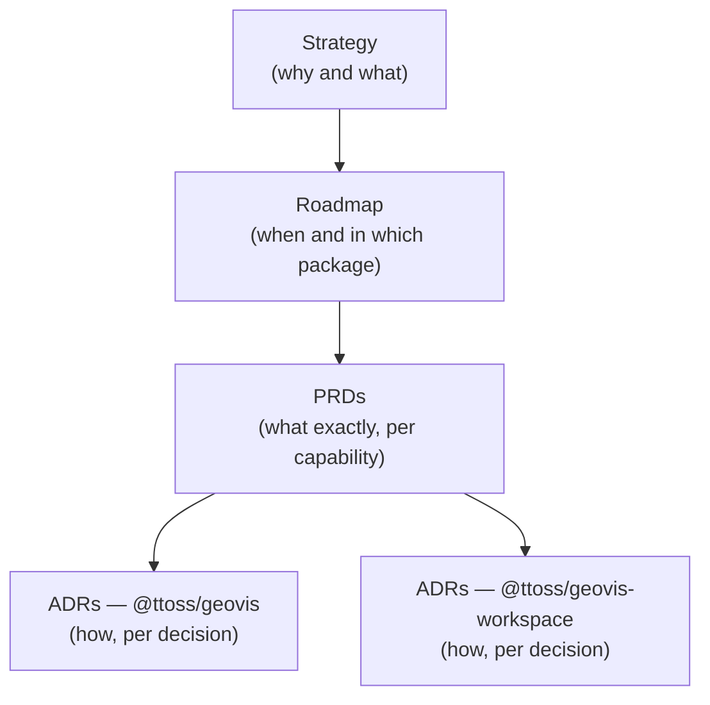

# GeoVis

GeoVis is the AI-native analytical mapping layer for product applications. It turns user intent into trustworthy, inspectable maps through constrained intent, a trusted catalog, deterministic resolution, safe actions, compact context, and evaluation.

This is the product hub for the GeoVis system. Product-level artifacts (strategy, roadmap, PRDs, research) live here because they span multiple packages; architecture decisions live next to the code they govern.

| Artifact                  | Answers                                          | Location                                                                                                                                                                                                               |
| ------------------------- | ------------------------------------------------ | ---------------------------------------------------------------------------------------------------------------------------------------------------------------------------------------------------------------------- |
| [Strategy](./strategy.md) | Why GeoVis exists and its boundaries             | This hub                                                                                                                                                                                                               |
| [Roadmap](./roadmap.md)   | Delivery phases across packages                  | This hub                                                                                                                                                                                                               |
| [PRDs](./prds/)           | Requirements per product capability, by priority | This hub                                                                                                                                                                                                               |
| [Research](./research/)   | Exploratory studies feeding PRDs (not contracts) | This hub                                                                                                                                                                                                               |
| ADRs                      | Architecture decisions per package               | [`packages/geovis/docs/adr/`](https://github.com/ttoss/ttoss/tree/main/packages/geovis/docs/adr), [`packages/geovis-workspace/docs/adr/`](https://github.com/ttoss/ttoss/tree/main/packages/geovis-workspace/docs/adr) |

## Packages

- **`@ttoss/geovis`** — the spec-driven rendering runtime: `VisualizationSpec`, validation, engine adapters, React bindings.
- **`@ttoss/geovis-workspace`** — the human operation surface: layout, panels, and controls around a GeoVis map.

Future layers defined by the strategy (catalog, intent, resolution, evals) are planned in the [roadmap](./roadmap.md) and will land in these packages or new ones as their PRDs decide.
