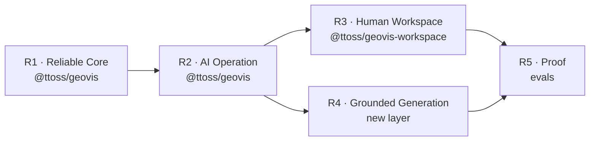

# GeoVis Roadmap

Delivery plan for the [strategy](./strategy.md)'s capabilities across packages, ordered by highest initial return at lowest complexity: each phase makes the previous one more valuable and unlocks the next. Dates are deliberately absent — sequencing is the commitment, scheduling belongs to the team's planning cycle.

## Where we are

`@ttoss/geovis` renders validated specs (choropleth, dot density, proportional circles) with MapLibre, patches them incrementally, and enforces one cartography policy. `@ttoss/geovis-workspace` provides the layout shell (sidebars, provider, context). Everything AI-facing — structured errors, enforced capabilities, semantic actions, context packet, catalog, intent, resolution, evals — is designed ([ADRs 0001–0004](https://github.com/ttoss/ttoss/tree/main/packages/geovis/docs/adr), [research](./research/)) but not built.

## R1 — Reliable Core

Failures become structured and capabilities become honest. This is the foundation every later phase reports through.

| Deliverable                                               | Package         | Basis                |
| --------------------------------------------------------- | --------------- | -------------------- |
| Typed, repairable result taxonomy replacing string errors | `@ttoss/geovis` | ADR-0001             |
| `CapabilitySet` enforced by validation, declared = tested | `@ttoss/geovis` | ADR-0002             |
| Spec schema versioning                                    | `@ttoss/geovis` | ADR-0001 consequence |

Exit criteria: no code path fails silently; a spec requesting an unsupported capability is rejected before mount with repair options.

## R2 — AI Operation

An existing map becomes steerable and explainable by AI at bounded cost.

| Deliverable                                          | Package         | Basis    |
| ---------------------------------------------------- | --------------- | -------- |
| Semantic action vocabulary with `dispatch()`         | `@ttoss/geovis` | ADR-0003 |
| Context packet (`getContextPacket()`), metadata-only | `@ttoss/geovis` | ADR-0004 |
| React hooks migrated to dispatch the same actions    | `@ttoss/geovis` | ADR-0003 |

Exit criteria: an LLM can change metric, filter, layer, selection, and view through validated actions and explain the map from the packet — without reading the full spec.

## R3 — Human Workspace

The workspace becomes the default human surface for GeoVis maps, converging with AI steering on the same actions.

| Deliverable                                                       | Package                   | Basis                     |
| ----------------------------------------------------------------- | ------------------------- | ------------------------- |
| Map, legend, warnings, and inspection panels wired to the runtime | `@ttoss/geovis-workspace` | Strategy §5.5             |
| Workspace controls dispatch R2 semantic actions                   | `@ttoss/geovis-workspace` | Strategy §8 (convergence) |
| Policy violations and structured errors surfaced in the UI        | `@ttoss/geovis-workspace` | R1 taxonomy               |

Exit criteria: an application embeds the workspace without rebuilding common map UI; every UI mutation is a logged semantic action.

## R4 — Grounded Generation

Natural language becomes a validated map through catalog and deterministic resolution. This layer is new — its PRDs decide whether it lands in existing packages or a new one (e.g. `@ttoss/geovis-catalog`).

| Deliverable                                                 | Package   | Basis         |
| ----------------------------------------------------------- | --------- | ------------- |
| Catalog contract (metrics, geographies, joins, permissions) | new layer | Strategy §5.2 |
| Constrained intent schema                                   | new layer | Strategy §5.1 |
| Deterministic resolver: intent → validated spec             | new layer | Strategy §5.3 |

Exit criteria: an AI can only reference catalog entries; the resolver produces a valid map or a structured failure — never a guess.

## R5 — Proof

Quality stops being asserted and starts being measured.

| Deliverable                                        | Package    | Basis        |
| -------------------------------------------------- | ---------- | ------------ |
| Eval suite for generate / steer / explain / repair | repo-level | Strategy §13 |
| Token cost and repair-success tracking per mode    | repo-level | Strategy §13 |

Exit criteria: the strategy's readiness question — "the right map, cheaply, safely, with a recoverable failure path" — has numbers.

## Capability coverage

| Strategy capability         | Phase                     | PRD                                                   |
| --------------------------- | ------------------------- | ----------------------------------------------------- |
| 7. Repairable errors        | R1                        | [PRD-001](./prds/prd-001-repairable-errors.md)        |
| 4. Renderable map document  | shipped (hardening in R1) | —                                                     |
| 6. AI operation surface     | R2                        | [PRD-002](./prds/prd-002-ai-operation-surface.md)     |
| 5. Human workspace          | R3                        | [PRD-003](./prds/prd-003-human-workspace.md)          |
| 2. Trusted catalog          | R4                        | [PRD-004](./prds/prd-004-trusted-catalog.md)          |
| 1. Constrained map intent   | R4                        | [PRD-005](./prds/prd-005-constrained-intent.md)       |
| 3. Deterministic resolution | R4                        | [PRD-006](./prds/prd-006-deterministic-resolution.md) |
| Evaluation (strategy §13)   | R5                        | [PRD-007](./prds/prd-007-evaluation-suite.md)         |
