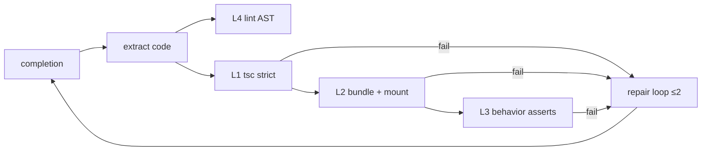

# @ttoss/fsl-bench

AI-executability benchmark harness for [`@ttoss/fsl-ui`](../fsl-ui) — the
execution of **ROADMAP §D1** (STRATEGIC_EVAL criterion 6). It measures
whether an LLM, given a library and its docs, produces **correct UI code on
the first pass** — the falsifiable half of fsl-ui's "AI-first" thesis.

Private, never published. Lives beside `fsl-ui` (not inside it) so the
benchmark consumes the library exactly as an external app would and its
dependencies (baseline libraries, model SDKs) never touch the measured
package.

## What it measures

| Metric                  | Definition                                                        | Source         |
| ----------------------- | ----------------------------------------------------------------- | -------------- |
| **First-pass success**  | compile + render + behavior green with zero repairs               | gauntlet L1–L3 |
| **Semantic error rate** | mechanical lint findings per first completion                     | gauntlet L4    |
| **Rounds-to-green**     | repair-loop rounds until green (≤ 2), proxy for human corrections | repair loop    |

Reported with Wilson 95% intervals (cells are small — no over-claiming).

## Conditions

| Condition     | Cohort          | Docs context                                                             |
| ------------- | --------------- | ------------------------------------------------------------------------ |
| `fsl-ui`      | candidate       | the **shipped** `packages/fsl-ui/llms.txt`                               |
| `fsl-ui-bare` | candidate (A/B) | export list only — isolates the grammar's contribution from model priors |
| `react-aria`  | baseline        | `contexts/react-aria.md`                                                 |
| `radix`       | baseline        | `contexts/radix.md`                                                      |
| `mui`         | **control**     | `contexts/mui.md`                                                        |

Cohort design follows `fsl-ui/INTERNAL/BENCHMARK_EVAL.md`: the fair cohort
is headless (React Aria, Radix); MUI — fully styled and massively
represented in training data — is a separate _control_ column, never mixed
into the cohort. The decisive comparison is the **A/B**: fsl-ui with vs
without llms.txt, same library, same model.

## The gauntlet (objective grading)



- **L1** compiles against the real installed packages — for fsl-ui, illegal
  `evaluation`s, missing required labels and invented props die here
  mechanically.
- **L2/L3** run in a **dedicated child Node process** per sample: a fresh
  jsdom + React world (zero cross-sample leakage) driven by Testing Library
  user-event, asserting user-observable behavior only (roles, accessible
  names, fixed copy) — never library API shape.
- **L4** counts mechanically decidable semantic errors. fsl profile:
  `style`/`className` on fsl-ui components, invented `size`,
  `evaluation` on data-entry surfaces, raw color literals. generic profile:
  raw colors hardcoded at the point of use (defining tokens in a
  `themeTokens`/`createTheme` constant is legal — headless libraries must
  define tokens somewhere).

### Calibration (fairness proof)

`golden/` holds a hand-written, correct implementation of **every scenario ×
every library** (20 files). The test suite requires each to pass the full
gauntlet with zero lint findings — if a golden fails, the harness is broken
and no campaign number is valid. Run: `pnpm run test`.

## The frozen prompt suite

Five scenarios (`src/scenarios/`), the fixed D1 suite: `dialog`,
`field-validation`, `menu`, `destructive-confirm`, `themed-composite`.
Prompts are library-neutral (behavior + fixed copy, zero API vocabulary)
and **frozen**: any edit after a campaign invalidates comparability —
change them only with a suite-version bump recorded here, and never between
a campaign's start and its report.

The freeze is enforced, not just stated: `registry.test.ts` pins each
prompt's text by sha256, so any wording change fails the suite. A
deliberate change means updating `FROZEN_PROMPT_HASHES` there **and**
bumping the suite version in this section — never a silent edit.

**Current suite version: 1** (this line is the single definition site —
campaign reports compare only within a suite version).

## Providers and models

Two orthogonal choices: the **model family** (Claude, Gemini — what the
report compares) and the **transport channel** (how you reach it — whichever
auth you have). Pick any subset per run with `--providers`:

| Provider    | Channel                   | Auth (env)                                                                           | Default model               |
| ----------- | ------------------------- | ------------------------------------------------------------------------------------ | --------------------------- |
| `anthropic` | Anthropic API             | `ANTHROPIC_API_KEY`                                                                  | `claude-opus-4-8`           |
| `gemini`    | Google AI API             | `GEMINI_API_KEY`                                                                     | `gemini-pro-latest`¹        |
| `vertex`    | Claude via Vertex AI      | `GOOGLE_APPLICATION_CREDENTIALS` + `ANTHROPIC_VERTEX_PROJECT_ID` + `CLOUD_ML_REGION` | `claude-opus-4-8`           |
| `bedrock`   | Claude via Amazon Bedrock | AWS credentials chain + `AWS_REGION`                                                 | `anthropic.claude-opus-4-8` |

¹ Google-maintained alias resolving to the current pro-tier model — pinned
snapshots (e.g. `gemini-2.5-pro`) get retired for new keys/projects and 404.

**Model override**, highest precedence first: inline spec
(`--providers vertex:claude-opus-4-8`) → env (`FSL_BENCH_<PROVIDER>_MODEL`)
→ the default above. The channel is transport, not model choice: the three
Claude channels share one default model (Bedrock spells it with its
`anthropic.` prefix), and any Claude model your project/account has enabled
on that channel is reachable via override. A channel may be repeated with
different models in one run — `--providers vertex:claude-opus-4-8,vertex:claude-sonnet-5`
benchmarks both. For a frozen campaign, pin exact model ids via inline spec
or env and record them with the report. The D1 A/B needs one Claude + one
Gemini, whichever channel is available to you.

Vertex and Bedrock catalogs host other model families too; these entries
speak the Anthropic Messages API, so they cover the Claude family only.
Another family through those channels would be a new registry entry
(`src/providers/index.ts`) — one entry + one factory.

## Running a campaign

```bash
pnpm run bench                 # full matrix: 5 scenarios x 5 conditions x default providers (anthropic,gemini) x 5 reps
pnpm run bench -- --dry        # print the matrix, no API calls
pnpm run bench -- --providers vertex,gemini            # Claude via Vertex instead of the direct API
pnpm run bench -- --providers bedrock:anthropic.claude-sonnet-5 --reps 3 --scenarios dialog,menu
pnpm run bench:report -- <runId>   # re-render a past run's report
```

Every completion, extracted code and gauntlet verdict is appended to
`results/<runId>/samples.jsonl` (the audit trail; content hashes of prompt
and context included per sample). Raw run data under `results/` is
gitignored; each run's `report.md` is trackable — the campaign
**report** is committed deliberately and its headline lands in
`fsl-ui/INTERNAL/ROADMAP.md` §D1, gating D2.

## Honesty rules (binding)

1. **Freeze before running.** Prompts, contexts and rubric rules are
   committed before a campaign; the report references the commit.
2. **Same harness for everyone.** One prompt suite, one gauntlet, one
   repair budget. Library-specific acceptance is expressed as
   user-observable behavior, never API shape.
3. **Comparable context budgets.** Baseline docs excerpts are honest
   best-effort digests of comparable size to llms.txt. They are versioned
   here — improvements welcome before a campaign, never during.
4. **No cherry-picking.** A campaign's matrix is declared up front
   (`--dry` prints it); every sample lands in the JSONL, including failures
   and provider errors.
5. **Human spot-check.** Before publishing a headline number, manually
   review ≥20% of failing samples for harness artifacts (a failure caused
   by the harness, not the model, voids the cell and is fixed + rerun).
