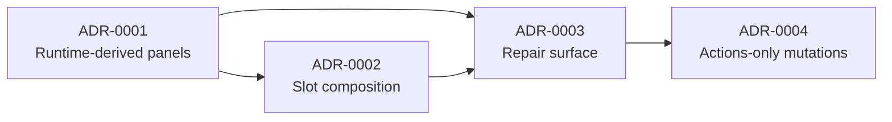

# GeoVis Workspace Architecture Decision Records

Decision records for `@ttoss/geovis-workspace`, following the same [MADR](https://adr.github.io/madr/)-inspired format and entry gate as [`packages/geovis/docs/adr/`](../../../geovis/docs/adr/README.md): write an ADR only when a reasonable alternative was rejected, the chosen path has a visible cost, and a reviewer without context would propose the alternative.

Product-level context lives in the [GeoVis product hub](https://ttoss.dev/docs/product/geovis) (strategy, roadmap, PRDs). This package implements the strategy's **human workspace** capability.

## Sequence

Ordered by implementation sequence. ADR-0001–0003 depend only on the GeoVis R1 foundation ([GeoVis ADR-0001/0002](../../../geovis/docs/adr/README.md)), so they can proceed in parallel with GeoVis R2; ADR-0004 requires the semantic action surface (GeoVis ADR-0003) and closes the human/AI convergence loop.

| ADR                                                     | Decision                                                     | Why this position                                                                                               |
| ------------------------------------------------------- | ------------------------------------------------------------ | --------------------------------------------------------------------------------------------------------------- |
| [0001](./0001-runtime-derived-panels.md)                | Panels derive from the runtime; config describes layout only | Fixes drift that exists today (hand-authored legend, provider below the layout); every panel renders through it |
| [0002](./0002-slot-based-composition.md)                | Named slots with runtime-bound, overridable defaults         | Where ADR-0001's panels mount; makes "embed without rebuilding" compatible with "extend without forking"        |
| [0003](./0003-structured-failures-as-repair-surface.md) | Structured failures render as a code-keyed repair surface    | Needs ADR-0001's provider position and a slot to live in; consumes the GeoVis R1 taxonomy                       |
| [0004](./0004-semantic-action-mutations.md)             | Workspace mutations compile to semantic actions              | Needs GeoVis ADR-0003 (`dispatch`); rejected dispatches feed ADR-0003's repair surface                          |
