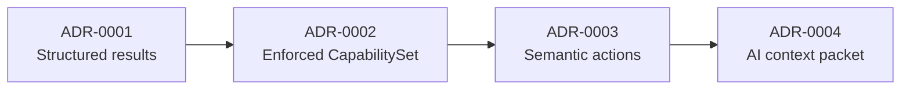

# GeoVis Architecture Decision Records

Decision records for evolving `@ttoss/geovis` from a schema-driven rendering library into the AI-native analytical mapping layer described in the [GeoVis strategy](../../../../docs/website/docs/product/geovis/strategy.md). Product-level artifacts (strategy, roadmap, PRDs, research) live in the [GeoVis product hub](https://ttoss.dev/docs/product/geovis); ADRs stay here, next to the code they govern. Each record captures one architecturally significant decision using a [MADR](https://adr.github.io/madr/)-inspired format: context, decision drivers, considered options, outcome, and consequences.

ADRs live next to the code they govern and are immutable once accepted — a changed decision produces a new ADR that supersedes the old one (`Status: superseded-by ADR-NNNN`). Micro trade-offs that only need one line of justification belong in JSDoc, following the same entry gate as `packages/fsl-theme/CONTRIBUTING.md`: write an ADR only when a reasonable alternative was rejected, the chosen path has a visible cost, and a reviewer without context would propose the alternative.

## Sequence

The records are ordered by implementation sequence: lowest complexity first, each one unlocking the next. Together they close the gap between the current runtime (validated spec rendering with raw patches) and the strategy's operating model (generate, steer, explain, repair).

| ADR                                               | Decision                                                       | Why this position                                                                  |
| ------------------------------------------------- | -------------------------------------------------------------- | ---------------------------------------------------------------------------------- |
| [0001](./0001-structured-resolution-results.md)   | Replace string errors with a typed, repairable result taxonomy | Lowest complexity (reshapes existing checks); every later layer reports through it |
| [0002](./0002-capabilityset-enforced-contract.md) | Turn the dead `CapabilitySet` flags into an enforced contract  | Needs 0001's error codes to reject unsupported specs explicitly                    |
| [0003](./0003-semantic-action-surface.md)         | Add a closed vocabulary of semantic actions above `SpecPatch`  | Actions are validated against 0002 and report through 0001                         |
| [0004](./0004-ai-context-packet.md)               | Derive a compact, metadata-only context packet for AI          | Summarizes state, allowed actions (0003), and last error (0001) in one artifact    |
