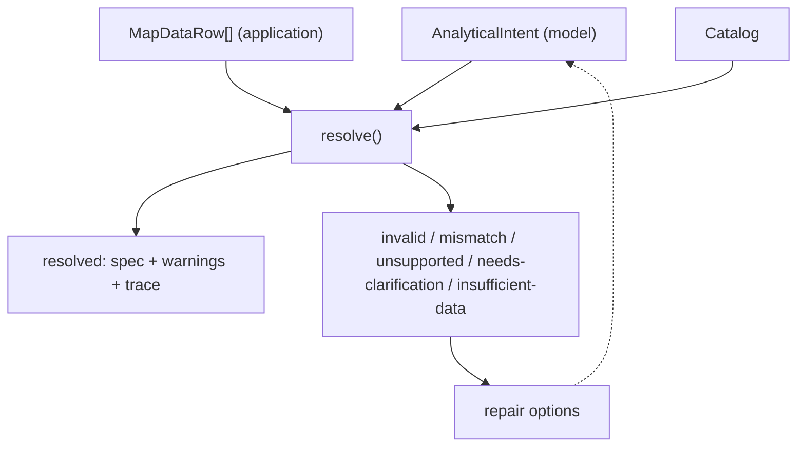
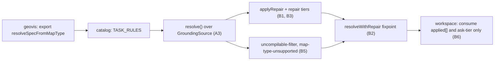
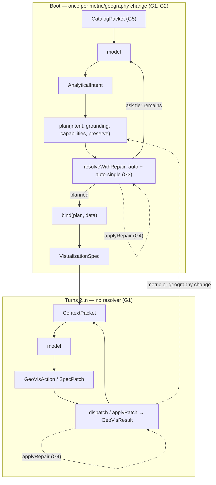
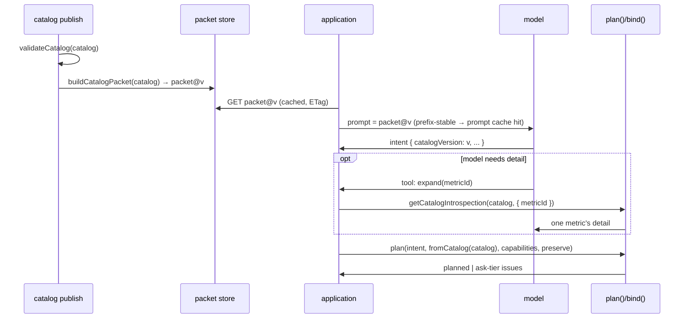
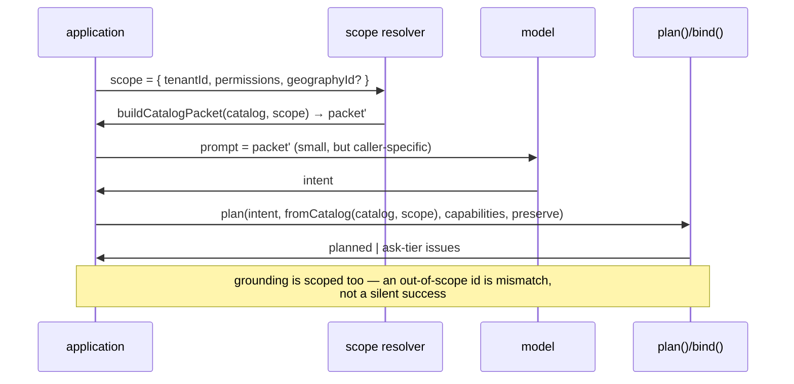
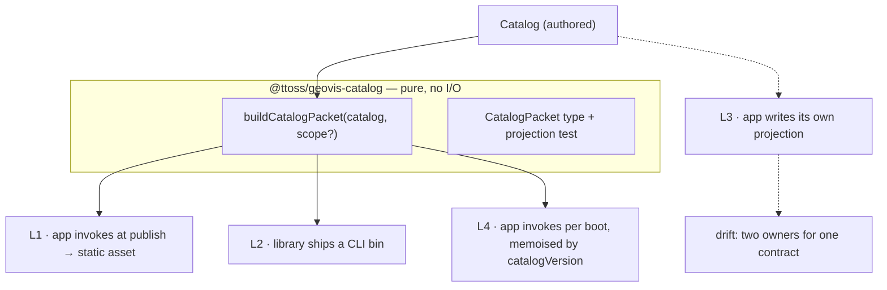
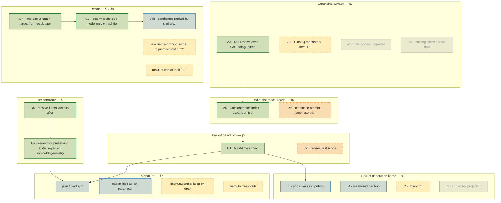

# Exploration: deterministic resolution of AI requests

Scope: `@ttoss/geovis`, `@ttoss/geovis-catalog`, `@ttoss/geovis-workspace`. Reads PRD-004 (implemented), PRD-005 (draft), PRD-006 (draft) and their plans. Nothing here supersedes a plan decision; it enumerates the choices those plans left open and recommends one path per choice.

## 1. What is already confirmed (do not re-litigate)

| Fact                                                                                                                     | Source                                                    | Consequence                                                                                      |
| ------------------------------------------------------------------------------------------------------------------------ | --------------------------------------------------------- | ------------------------------------------------------------------------------------------------ |
| `Catalog`, `catalogSchema`, `validateCatalog`, `CatalogIssue`, `getCatalogIntrospection`, `getFilterControls` ship today | `packages/geovis-catalog/src`                             | PRD-005/006 have their grounding surface                                                         |
| `CatalogResultStatus` is only `'mismatch' \| 'invalid'`                                                                  | `src/catalogResult.ts`                                    | `needs-clarification` / `insufficient-data` enter via PRD-005 D4 and PRD-006 D7                  |
| `RepairOption` has exactly two kinds: `allowed-values`, `set-value`, and values are **never invented**                   | `packages/geovis/src/spec/result.ts`                      | any repair automation must stay inside these two kinds or extend the union deliberately          |
| `GeoVisResultStatus` already reserves `insufficient-data` and `needs-clarification`                                      | same                                                      | the catalog layer widens toward a shape `@ttoss/geovis` already has                              |
| Workspace already renders repairs as buttons and expands `allowed-values` into one `set-value` per candidate             | `geovis-workspace/src/components/IssueList.tsx`           | the human repair loop exists; the missing half is the _machine_ applying the same `RepairOption` |
| `resolveSpecFromMapType` is not exported from `@ttoss/geovis`                                                            | `src/index.ts` line 14 only exports `SEQUENTIAL_PALETTES` | PRD-006 Phase 0 is a real gate                                                                   |
| `resolve()` cannot fetch data; the caller supplies `MapDataRow[]`                                                        | PRD-006 plan D3                                           | resolution is a pure function, so repair can be a fixpoint loop                                  |
| Zod is the only schema-validation dependency                                                                             | PRD-004 plan D14                                          | schema-level repairs must be derived from Zod issues, not Ajv keywords                           |

Still open and deliberately untouched here: `TASK_RULES` threshold values (PRD-006 D4), bivariate intents (PRD-005 D3), the absent strategy document.

## 2. Alternative A — the role of the catalog in `resolve()`

The PRDs assume one entry point. In practice there are two callers with opposite trust levels: a model (must be grounded) and a developer or the workspace (already holds a spec). The choice is how much of `resolve()` is catalog-dependent.



### A1 — Catalog mandatory (literal PRD-006 plan D3)

`resolve(intent, catalog, data)`; no catalog, no resolution. Every id in the intent is grounded, so `mismatch` issues always carry `allowed-values` computed from real catalog entries.

Cost: a team with a working `VisualizationSpec` and no catalog cannot use the resolver at all, and the only way to get the task-rule judgment (`TASK_RULES`) is to author a catalog first. That judgment — task → map type → legend — has no catalog dependency of its own.

### A2 — Catalog-free degraded mode

A second entry point resolving from an intent plus data columns alone, inferring nothing from a catalog. Deterministic, but it deletes the anti-hallucination guarantee PRD-004 exists for: `unknown-metric` is undetectable when there is no closed metric list, so every id error surfaces later as `insufficient-data` (empty join) with no repair candidates. This is the option to reject explicitly rather than leave implicit.

### A3 — One core, a grounding provider (recommended)

Keep exactly one `resolve()`, but make the grounding source an explicit, small interface rather than the `Catalog` type:

```ts
interface GroundingSource {
  metricIds(): readonly string[];
  geographyIds(): readonly string[];
  datasetsFor(args: {
    metricId: string;
    geographyId: string;
  }): readonly string[];
  fieldsFor(datasetId: string): readonly { name: string; sensible?: boolean }[];
  cameraFraming(geographyId: string): CameraFraming | undefined;
  mapTypesFor(metricKind: MetricKind): readonly MapType[];
}

const fromCatalog = (catalog: Catalog): GroundingSource => {
  /* ... */
};
```

`resolve(intent, grounding, data, options?)`. The catalog is the only implementation this package ships, and `fromCatalog` is the only route the AI-facing path may use — but the task-rule and map-type/legend half of the resolver becomes independently testable, and PRD-006's "extension points" open question (D5) gains a second, larger answer than `extraTaskRules`: an application with its own dictionary implements six functions instead of forking.

Cost: one indirection layer, and a temptation to ship a non-catalog implementation that reintroduces A2. Mitigation: `GroundingSource` is exported as a **type only**, with `fromCatalog` the sole exported constructor, and the AI-facing README documents the catalog as mandatory for model input.

### A4 — Catalog inferred from the data

Derive a catalog from `MapDataRow[]` column names at call time. Deterministic in the strict sense, and appealing because it removes the authoring step — but it makes every column the model guesses "real", which is precisely the failure PRD-004 was written against. Reject.

### Recommendation

A3, with A1 as the shipped default and the documented AI path. A2/A4 are recorded as rejected so a later reader does not rediscover them as improvements.

## 3. Alternative B — how automatic the repair loop can get

Today repair is _presentable_ (workspace buttons) but not _applicable_: nothing in either package turns a `RepairOption` back into a corrected input. That missing function is what makes automation possible, and it is small.

### B1 — The applier (prerequisite for every option below)

```ts
// pure, total, no I/O — the inverse of an issue
export const applyRepair = <T>(input: T, repair: RepairOption): T
```

`set-value` writes `repair.value` at `repair.path`; `allowed-values` is not directly applicable (it is a choice, not a decision) and must first be narrowed to one `set-value` — exactly the flattening `IssueList.tsx` already does in the UI. Extracting that flattening into the catalog/geovis layer removes the duplicate the workspace currently owns alone.

### B2 — Bounded fixpoint: `resolveWithRepair`

```ts
resolveWithRepair(intent, grounding, data, { maxRounds: 3, policy })
  → { result: ResolveResult; applied: AppliedRepair[]; remaining: CatalogIssue[] }
```

Each round: validate → select auto-applicable repairs by `policy` → apply → re-validate. Termination is guaranteed by two independent guards: `maxRounds`, and the requirement that the issue multiset strictly shrinks (an unchanged or grown issue set aborts the loop and returns the last result). Determinism holds because `resolve()` is pure and repair selection is a pure function of the issue list.

This is the single highest-value addition beyond the three PRDs: it converts "structured failure" into "corrected input" without a model in the loop, and it is testable as a table (input intent, expected applied repairs, expected final status).

### B3 — Auto-apply policy tiers

Not every repair should fire without a human or a model. Three tiers, decided by the issue code and the candidate count, never by heuristics:

| Tier          | Condition                                                                                                                           | Behaviour                                                                |
| ------------- | ----------------------------------------------------------------------------------------------------------------------------------- | ------------------------------------------------------------------------ |
| `auto`        | `set-value` whose value the check site already knows to be correct — e.g. `invalid-intent-schema-version` → `INTENT_SCHEMA_VERSION` | applied silently, recorded in `applied[]` and in the resolution trace    |
| `auto-single` | `allowed-values` with exactly one candidate                                                                                         | applied, recorded, and surfaced as a warning on the resolved result      |
| `ask`         | `allowed-values` with ≥2 candidates, or any `needs-clarification`                                                                   | never applied; returned as the repair set for the model or the workspace |
| `never`       | `sensitive-filter-field` (PRD-005 D4 step 6), `policy-violation`                                                                    | no repair is offered at all — the correct fix is not a substitution      |

The tier is a property of the issue code, so it lives in the same table that already maps code → status (`CATALOG_ISSUE_CODE_STATUS`), and gains the same exhaustiveness test. That test is the real deliverable: every code is classified, so a new code cannot ship undecided.

### B4 — Making candidate selection deterministic

`allowed-values` today has no ordering contract, so a model or a UI reading `values[0]` gets whatever iteration order the catalog happened to have. Two sub-choices:

- **B4a — stable lexicographic order.** Candidates sorted by id. Trivially deterministic, but ranks an unrelated id first as often as not.
- **B4b — ranked by similarity to the rejected value, ties broken lexicographically.** Still fully deterministic and still grounded (it _orders_ real catalog ids, it never invents one), and it makes `auto-single` far more often correct. It is also what turns a one-candidate `allowed-values` into a genuinely safe auto-apply.

Recommend B4b, with the ordering documented as part of the contract so the workspace's button order and a model's first choice agree.

### B5 — Closing the two issue codes PRD-001 left pending

PRD-001's open question names exactly two codes owed by PRD-006, and both are repair-bearing:

- a filter that cannot compile to a native engine filter → `uncompilable-filter`, `unsupported`, repair = the operator subset the adapter's `CapabilitySet.dataFeatures.filter` does support;
- a map type the catalog declares adequate but the adapter does not support → `map-type-unsupported-by-adapter`, `unsupported`, repair = `allowed-values` over the intersection of `Catalog.mapTypes` and the `CapabilitySet`.

Both intersections are computed anyway by PRD-006's Must items; emitting them as `RepairOption` is the difference between a dead end and one more `auto-single` round in B2.

### B6 — Where the loop runs

`resolveWithRepair` is pure, so all three callers get the same behaviour: the workspace runs it before rendering `IssueList` (so the panel only ever shows `ask`-tier issues a human must actually decide), a server-side generation path runs it before returning to the model, and the eval harness of PRD-007 measures `applied.length` as the automation rate. No caller-specific logic is added to the package.

## 4. Consolidated recommendation and sequencing



PRD-006's plan already covers P0–P2. The additions this exploration proposes are P3–P6, and none of them require a change to `VisualizationSpec`, `ContextPacket`, or `spec.metadata` — they extend the result taxonomy and add two pure functions.

The ordering choice that must be made first is A3 vs A1, because it fixes `resolve()`'s signature and every later phase consumes it. The repair automation (B) is independent of that choice and can be specified in parallel.

## 5. Questions that need a product answer before P3

- Is `auto-single` acceptable without confirmation for an **AI-originated** intent, or must every substitution be visible to the model as a corrected-intent echo? (Recommendation: apply, and echo via `applied[]` and the resolution trace, so the model learns the correct id for the next turn.)
- Does the workspace show auto-applied repairs at all, or only the `ask` tier? (Recommendation: show them as resolved warnings — a silent correction the human cannot see is a trust cost, not a convenience.)
- `maxRounds` default: 3 is proposed on the grounds that no realistic intent carries more than three independent grounding errors; if evals (PRD-007) show otherwise it is a one-line change.

## 6. Two further options, framed by prompt cost

§2 asked _whether_ the catalog grounds `resolve()`. It never asked **how much of the catalog reaches the model**, and that is a separate axis with a separate cost. `getCatalogIntrospection` today returns `Omit<Catalog, 'permissions'>` — the entire catalog minus one field and the `sensible` columns. It is safe, but it is unbounded: its size grows with `metrics × datasets × geographies × series × filters`, and every token of it is paid on every turn. A catalog large enough to be worth building is a catalog too large to paste into a prompt.

The reuse is already sitting in the repo. `@ttoss/geovis` solved exactly this problem one layer down, in ADR-0004's `ContextPacket`: a **versioned, metadata-only, aggregate-only projection** of `VisualizationSpec` — `legends[].domain` is `[min, max]` and never the full break list; `viewPresets[]` is id/label and never camera coordinates; `sources[]` is id/type and never the URL. Its docstring even states the intent: "cheap enough to call on every turn". Neither PRD-004 nor PRD-005 applies that discipline to the catalog, and `@ttoss/geovis-catalog` re-derived the _other_ half of `@ttoss/geovis` (the whole result taxonomy in `catalogResult.ts` mirrors `result.ts` line for line) while skipping this one.

### A5 — `CatalogPacket`: apply the `ContextPacket` projection to the catalog

Two payloads with two different jobs, instead of one payload doing both badly:

|                  | reaches the resolver                                                 | reaches the model |
| ---------------- | -------------------------------------------------------------------- | ----------------- |
| `Catalog` (full) | yes — grounding needs `joins`, `fields[]`, `cameraFraming`, `domain` | never             |
| `CatalogPacket`  | no                                                                   | yes, every turn   |

```ts
export const CATALOG_PACKET_SCHEMA_VERSION = 1;

export interface CatalogPacket {
  schemaVersion: number;
  catalogVersion: string;
  metrics: { id: string; label: string; kind: MetricKind; unit?: string }[];
  geographies: { id: string; label: string; kind: GeographyKind }[];
  /** Metric+geography pairs that actually join — the model's true option space. */
  pairs: { metricId: string; geographyId: string; datasetCount: number }[];
  filters: { id: string; label: string; ops: LayerFilterOperator[] }[];
  mapTypes: MapType[];
}
```

Everything the resolver needs and the model does not is dropped by construction, not by author discipline: no `artifact`, no `columns`, no `fields[]`, no `cameraFraming` numbers, no `domain`, no `description` prose, no category lists beyond the count. `datasetCount` replaces the dataset array entirely — the model never names a `datasetId`, it only learns whether a pair is ambiguous, which is the only fact about datasets that changes its behaviour (PRD-005 D4 step 5).

`getFilterControls`/`computeFilterDomain` already perform this exact "catalog + rows → bounded, label-resolved UI payload" reduction for filters; the packet's `filters[]` is that function's output with the computed domain dropped, not a new derivation.

**Progressive disclosure** is what makes it scale past a few hundred entries: the packet is the _index_, and `getCatalogIntrospection(catalog, { metricId })` becomes a **tool the model calls** for the one entry it chose, rather than a blob it reads for all of them. Prompt cost goes from O(catalog) per turn to O(packet) + O(1) per expansion, and the expansions are cached across turns because the catalog is static.

**Trade-offs.** Cost: a second versioned contract to keep in sync with `Catalog` — mitigated the same way `ContextPacket` is, with a projection function and a test asserting every packet field traces to a catalog field. Cost: a model that needs a metric's `description` to choose correctly now needs an extra tool round-trip, so descriptions must be short enough to fit in the packet or the choice degrades. Benefit: the packet is the natural unit for `allowed-values` repairs — every candidate a repair suggests is already an id the model has seen, so B3's `ask` tier stops being a list of unfamiliar strings.

### A6 — Nothing in the prompt: deterministic name resolution as the grounding mechanism

The opposite corner. The model receives **no catalog at all** — not the full one, not a packet. It emits an intent whose `metric`/`geography` are free text (`"renda média"`, `"municípios do RJ"`), and a deterministic resolver maps text → catalog id server-side, using the same ranked-candidate machinery §3's B4b already requires. Prompt cost becomes constant in catalog size.

```ts
resolveNames(draft, catalog) →
  | { status: 'valid'; intent: AnalyticalIntent }                        // exactly one match per field
  | { status: 'needs-clarification'; issues: [{ code: 'ambiguous-metric-name',
      repair: [{ kind: 'allowed-values', values: [...ranked ids] }] }] }
```

This inverts the anti-hallucination strategy: instead of _preventing_ an invalid id by never showing the model any other option, it _detects and corrects_ one, deterministically, after the fact. The B2 fixpoint stops being an optimisation and becomes the grounding mechanism itself — `resolveWithRepair` is where the intent actually gets grounded.

**Trade-offs.** Benefit: constant prompt cost, and the catalog can be arbitrarily large without any prompt-engineering work. Benefit: it degrades gracefully — an unmatched name is a `needs-clarification` with real candidates, never a silent wrong map. Cost: every ambiguity is a round-trip, and a round-trip is itself a prompt, so the savings evaporate on any catalog whose labels collide often (two `"população"` metrics at different grains is the common case, not the exotic one). Cost: match quality is now product-critical — string similarity over labels and `aliases` (PRD-004 already requires aliases in the contract, and they exist precisely for this) is the whole correctness surface, and it must be tested as such. Cost: `needs-clarification` rate, which PRD-007 measures, will be structurally higher than under A5 — that is the honest trade, not a defect.

### Which, and when

They compose rather than compete: **A5 for the first turn, A6 for the correction turns.** The packet gives the model a bounded, real option space so most intents ground on the first attempt; name resolution catches the rest without re-sending anything. A6 alone is the right choice only when the catalog is genuinely too large for even a packet — and if that is true, `pairs[]` is the field that made it true, so measure it before deciding.

## 7. How essential is each input, and to whom

The signature question and the prompt-cost question keep getting conflated because both are called "input". They are not the same input. `resolve()`'s parameters are what the _function_ cannot work without; the prompt carries what the _model_ cannot decide without. Only `intent` is genuinely both.

| Parameter                     | Essential to the resolver                                                                                                                                                                          | Must reach the model                                                                                                 | If absent                                                                                                                                        | Prompt cost                                                                                                                   |
| ----------------------------- | -------------------------------------------------------------------------------------------------------------------------------------------------------------------------------------------------- | -------------------------------------------------------------------------------------------------------------------- | ------------------------------------------------------------------------------------------------------------------------------------------------ | ----------------------------------------------------------------------------------------------------------------------------- |
| `intent.task`                 | **Yes** — indexes `TASK_RULES`; nothing downstream is decidable without it                                                                                                                         | **Yes** — it is the one thing only the user's request contains                                                       | no map type, no legend hint, no warnings                                                                                                         | ~7 enum values, negligible                                                                                                    |
| `intent.metric`               | **Yes** — selects the join, the metric kind, and therefore the adequate map types                                                                                                                  | **Yes**                                                                                                              | unresolvable                                                                                                                                     | one id                                                                                                                        |
| `intent.geography`            | **Yes** — selects the join and the `cameraFraming` that becomes `viewPresets`                                                                                                                      | **Yes**                                                                                                              | unresolvable                                                                                                                                     | one id                                                                                                                        |
| `intent.datasetId`            | No — inferable from the metric+geography join                                                                                                                                                      | **No** — the model should never name one                                                                             | ambiguity becomes `needs-clarification` instead of a wrong pick; that is the _correct_ failure                                                   | should be absent from the packet entirely (A5)                                                                                |
| `intent.time`                 | No — only `change-over-time` reads it                                                                                                                                                              | Only for that task                                                                                                   | `missing-temporal-range` warning (PRD-006 D4)                                                                                                    | two strings                                                                                                                   |
| `intent.filters`              | No                                                                                                                                                                                                 | Yes when the request contains one                                                                                    | filters silently dropped, which is worse than rejecting — so an unsupported filter must be `uncompilable-filter`, never omitted                  | grows with request, not with catalog                                                                                          |
| `intent.rationale`            | **No — never read**                                                                                                                                                                                | No                                                                                                                   | nothing                                                                                                                                          | pure output-token cost; keep it only if the trace or evals actually consume it, otherwise it is a per-turn tax with no reader |
| `catalog` / `GroundingSource` | **Yes** — it is the definition of "grounded"                                                                                                                                                       | **No** — this is the whole point of §6                                                                               | every `mismatch` becomes an undetectable wrong answer                                                                                            | O(catalog) if sent raw; O(packet) under A5; zero under A6                                                                     |
| `data: MapDataRow[]`          | **For a renderable spec, yes. For a valid resolution, no.**                                                                                                                                        | **Never** — strategy principle, and it is rows                                                                       | without it the resolver can still decide map type, legend, join, and warnings; it just cannot emit a spec that renders                           | never sent                                                                                                                    |
| `capabilities: CapabilitySet` | **Yes**, and PRD-006's D3 signature omits it — the same omission class D3 itself corrected for `data`. Both `map-type-unsupported-by-adapter` and `uncompilable-filter` are undecidable without it | **No** — but `ContextPacket.allowedActions` already exposes its _consequences_, which is the right level for a model | those two checks silently pass, and the failure resurfaces at mount time as an `unsupported` result — after the model has been told it succeeded | zero                                                                                                                          |
| `options.extraTaskRules`      | No — per-call override (D5)                                                                                                                                                                        | No                                                                                                                   | built-in rules apply                                                                                                                             | zero                                                                                                                          |

Two consequences follow directly from the `data` row, and both are worth acting on:

**Split the function along the parameter that is only sometimes essential.** `plan(intent, grounding, capabilities, options?)` decides everything decidable without rows — task rule, join, map type, legend, filters, view presets, trace, and every `mismatch`/`unsupported`/`needs-clarification` failure. `bind(plan, data)` produces the renderable `VisualizationSpec` and is the only path that can return `insufficient-data`. `resolve()` stays as the composition of both, so PRD-006's stated surface is unchanged. The gain is not tidiness: the entire AI repair loop (§3's B2) runs against `plan`, needs no data, and therefore costs no data fetch per round — an application can iterate the model to a valid plan before reading a single row.

**`capabilities` belongs in the signature.** Adding it is the same correction D3 made for `data`, for the same reason: PRD-006's Must items require an intersection the function is not given the inputs to compute.

## 8. Architecture fixed by the grilling session (2026-08-21)

Five answers close the topology. They are recorded here as decisions, not options, and the sections above are read through them.

| #   | Decision                                                                                                                                                                               | Consequence for §2–§7                                                                                         |
| --- | -------------------------------------------------------------------------------------------------------------------------------------------------------------------------------------- | ------------------------------------------------------------------------------------------------------------- |
| G1  | **R5** — `resolve()` boots the map; later turns act on the live map via `ContextPacket` → `GeoVisAction`/`SpecPatch`                                                                   | the resolver is a boot function, not a per-turn engine; PRD-002's vocabulary is the per-turn surface          |
| G2  | **Re-resolve preserving state** — a metric/geography change re-boots, carrying the previous map's state forward; no `set-metric` action, no catalog inside the `@ttoss/geovis` runtime | rejects the dependency inversion; keeps one grounding owner                                                   |
| G3  | **Deterministic repair loop** — `resolveWithRepair` applies `auto`/`auto-single`; the model is re-prompted only for the `ask` tier                                                     | §3's B2/B3 confirmed; R4 (resolver-as-tool) rejected                                                          |
| G4  | **One `applyRepair` over `RepairOption`** — two taxonomies, one mechanism                                                                                                              | `RepairOption` is not extended; see G4's path rule below                                                      |
| G5  | **Catalog: tens of metrics heading to hundreds**                                                                                                                                       | A5 (packet) confirmed; A6 not needed yet; `pairs[]` as drafted in §6 is wrong at this scale — corrected below |

### G2 — state preservation is the existing merge, not a new one

The instinct is to write a state-merge function: carry viewport, visible layers, selection and active legend across the re-boot. That function already exists, twice, inside `@ttoss/geovis`'s `mapTypeDefaults.ts`, and it is the whole point of that module: `resolveSpecFromMapType` takes a **partially authored spec** and fills in only what is missing, with `injectResolvedFields` refusing to overwrite anything the caller already declared and `mergeLegends` reconciling authored legends against resolved ones.

So preserving state is: seed the re-boot with the previous spec's user-facing fields and let the existing merge do the rest.

The one non-obvious detail is the matching key. Layer `id`s are derived, so they are not stable across a metric change — but `matchLayer` in that same module already keys on `sourceId + geometry`, which _is_ stable, precisely because it was written for this problem one layer down. State preservation must use that key and nothing else; matching by layer id would silently drop the preserved visibility the first time a re-boot renamed a layer.

```ts
plan(intent, grounding, capabilities, {
  preserve?: {
    viewPresetId?: string;
    hidden?: { sourceId: string; geometry: GeoVisGeometryType }[]; // matchLayer's key
    selection?: GeoVisSelection | null;
  };
});
```

`selection` is the exception that must **not** be preserved blindly: a selected feature id belongs to the previous metric's dataset and may not exist in the new one. Carrying it forward is an `unknown-feature-id` waiting to happen — the honest behaviour is to preserve it only when the geography is unchanged, and drop it (with a trace entry, not a warning) when the geography changes. That is a deterministic rule, so it belongs in the resolver rather than in each application.

### G4 — the repair target is a property of the result, not of the repair

`RepairOption` carries `path` and `value` and nothing else, and it must stay that way: it is exported from `@ttoss/geovis` and consumed by both other packages. Adding a `target` field to disambiguate "path into the intent" from "path into the spec" would be a breaking change to the shared type for information the caller already has:

- repairs on a `CatalogResult` → paths into the **catalog** (authoring-time fix)
- repairs on a `ResolveResult`/`IntentResult` → paths into the **intent** (the AI repair loop)
- repairs on a `GeoVisResult` → paths into the **spec** (the per-turn loop, what `IssueList` already renders)

Three result types, three targets, zero type changes. `applyRepair<T>(input, repair)` stays generic and total, and each loop calls it with the document its own result refers to. The rule to write down and test: **a repair's `path` is always relative to the document the result's producer consumed**, never to some absolute address space.

This is what makes G3's loop reusable at both ends of G1's split — the boot loop applies repairs to an `AnalyticalIntent`, the per-turn loop applies the same-shaped repairs to a `VisualizationSpec`, and neither knows about the other.

### G5 — `CatalogPacket` corrected: `pairs[]` is quadratic, drop it

§6's `pairs[]` was O(metrics × geographies). At the confirmed scale — hundreds of metrics against a geography hierarchy — that is thousands of entries in a payload whose entire justification was fitting in a prompt. `metrics[]` grows linearly; `pairs[]` grows quadratically; only one of them belongs in an index.

The sparse form carries the same information, because the interesting facts are sparse:

```ts
export interface CatalogPacket {
  schemaVersion: number;
  catalogVersion: string;
  metrics: {
    id: string;
    label: string;
    kind: MetricKind;
    unit?: string;
    /** The grains this metric actually exists at — normally 1–3, not every geography. */
    geographyIds: string[];
  }[];
  geographies: {
    id: string;
    label: string;
    kind: GeographyKind;
    parentId?: string;
  }[];
  /** Only the pairs that resolve to >1 dataset — the model needs no other dataset fact. */
  ambiguousPairs: { metricId: string; geographyId: string }[];
  filters: { id: string; label: string; ops: LayerFilterOperator[] }[];
  mapTypes: MapType[];
}
```

Size is now O(Σ grains per metric) + O(ambiguous pairs), both of which stay small for the same reason a real data warehouse stays navigable: a metric exists at two or three grains, not at all of them. `parentId` is added to `geographies[]` because it costs one field and lets the model narrow "municípios do RJ" without an expansion round-trip — the hierarchy is the cheapest thing in the catalog and the most useful.

A6 stays documented and unbuilt. The trigger to revisit it is measurable rather than a judgment call: when `Σ geographyIds` across `metrics[]` stops fitting the prompt budget, name resolution over `aliases` becomes the alternative, and not before.

### Resulting shape



The dotted edges are the two places `applyRepair` is called and the one place a turn escapes back into the boot path. Everything else in the diagram already exists in the repo except `plan`, `bind`, `resolveWithRepair`, `applyRepair` and `buildCatalogPacket` — five functions, all pure.

### What is still not decided

- Where the `ask`-tier re-prompt lives. G3 fixes _that_ the model is asked; it does not fix whether the application re-prompts inside one request or returns the issue set and lets the caller drive the next turn. This only matters for latency, so it is an application choice and should be documented as one.
- Whether the boot path re-sends the full `CatalogPacket` on a re-resolve (G2) or relies on prompt caching. The packet is static per catalog version, so caching is the obvious answer, but it is a per-provider claim this document should not make.
- `maxRounds` and the `warnOn` thresholds remain measurement items for PRD-007, unchanged from §4.

## 9. Two variations on the catalog ↔ packet interaction

None of §8's open items blocks this section. The `ask`-tier re-prompt location only moves latency, the thresholds are PRD-007 measurements, and the third — re-send the packet or rely on prompt caching — is not an open question at all once the packet's _derivation moment_ is chosen. It is the consequence, not the input.

Both variations share the same three roles, and the reason to separate them is that today one function plays all three (`getCatalogIntrospection` returns the whole catalog minus `permissions`):

| Role          | Payload                                          | Reader                         | Lifetime                            |
| ------------- | ------------------------------------------------ | ------------------------------ | ----------------------------------- |
| **Index**     | `CatalogPacket` (§8 G5)                          | the model, every boot turn     | per catalog version, or per request |
| **Detail**    | `getCatalogIntrospection(catalog, { metricId })` | the model, on demand as a tool | per call                            |
| **Grounding** | full `Catalog` via `GroundingSource`             | `plan()`, never the model      | server process                      |

### C1 — Packet as a build-time artifact (index is static)

`buildCatalogPacket(catalog)` runs once when the catalog is published, not when a request arrives. The output is an immutable, `catalogVersion`-keyed document — a static asset with an ETag, byte-identical for every caller.



**Interactions this pins down.**

The packet is a _projection with a version_, so packet↔catalog consistency becomes a build-time gate rather than a runtime hope: publishing runs `validateCatalog` first, and a projection test asserts every packet field traces to a catalog field and that no `sensible: true` column or `permissions` value can reach it — the same guarantee `getCatalogIntrospection` gives today, but enforced on a payload small enough to eyeball in a snapshot test.

Because the packet is byte-identical across callers and turns, it sits at the **stable prefix** of the prompt. That is the whole cost argument: with hundreds of metrics the index is the largest constant in the prompt, and a constant that never changes is the one thing prompt caching pays for. A re-boot (§8 G2) re-sends it and pays almost nothing.

It also introduces one genuinely new failure mode, and it is deterministic to detect. A model grounded on packet@v1 can emit an intent naming a metric the catalog dropped in v2. `IntentResult` already records `catalogVersion`; the intent should optionally carry the version it was grounded against, and a mismatch is a new issue code:

```ts
| 'stale-catalog-packet'  // mismatch: intent.catalogVersion !== catalog.version
```

with the repair being "re-read the index" rather than a value substitution — the one case where the correct `RepairOption` is a `set-value` on nothing and the fix is a protocol step. That argues for it being an `ask`-tier code (§3 B3) that never auto-applies.

**Cost.** The index cannot be narrowed. Every model sees every metric the catalog holds, so `permissions` (PRD-004's reserved, opaque slot) does nothing at the index level — a tenant that may only see three metrics still reads all of them, which is a disclosure question the packet cannot answer and the application must answer _after_ the model has already chosen. At the confirmed scale (§8 G5) that is acceptable; in a multi-tenant catalog it is not.

### C2 — Packet built per request from a scope (index is narrowed)

`buildCatalogPacket(catalog, scope)` runs on each boot turn, where `scope` is a deterministic, explicit narrowing — tenant, permission set, and optionally the geography the previous turn was already looking at.



**Interactions this pins down.**

`permissions` stops being decorative. Today introspection strips it wholesale, which is the safe default and also the reason it can never _do_ anything; here it is the input that shapes the index, so "the model cannot reference what the caller may not see" becomes a property of the payload instead of a check somewhere downstream. That is a strictly stronger version of PRD-004's anti-hallucination claim: not just "in the catalog", but "in the catalog _and_ visible to this caller".

The critical constraint is that scoping must apply to **both** the index and the grounding, and via the same `scope` value. A packet narrowed to three metrics against a `GroundingSource` that still accepts all three hundred is worse than no scoping: the model would be prevented from _seeing_ an id it is still permitted to _use_, so a hallucinated id could validate. `fromCatalog(catalog, scope)` and `buildCatalogPacket(catalog, scope)` therefore take the same argument and must be tested as a pair — one fixture per scope asserting that the set of ids in the packet equals the set of ids the grounding accepts. That equality is the invariant this variation lives or dies on.

Narrowing by the previous turn's `geographyId` also makes the re-boot cheaper than the first boot, which inverts C1's economics: the index shrinks as the conversation gets more specific, exactly when the metric list matters least.

**Cost.** The prompt prefix is no longer shared, so prompt caching degrades to per-scope rather than global — and if `scope` includes the previous turn's geography, it changes mid-conversation and the cache is invalidated at precisely the re-boot C1 made free. Determinism also becomes a property of the scope resolver, which is application code: two calls with the same intent and different scopes legitimately produce different results, so `resolve()` remains pure but the _system_ stops being reproducible from `(intent, catalog)` alone. Every trace and every eval must record the scope, or a failure cannot be replayed.

### Choosing, and why they are not symmetric

C1 is the default at the confirmed scale, and C2 is what a tenant boundary forces. The asymmetry worth stating plainly: **C1 can be migrated to C2, and C2 cannot be migrated back cheaply.** Adding a `scope` parameter to two projection functions is additive; removing the scope after evals, traces, and repair candidates have all been recorded against caller-specific indexes means every recorded ground truth becomes unreplayable.

So the sequencing that costs least is C1 now with `scope` reserved but unimplemented — `buildCatalogPacket(catalog, scope?)`, `fromCatalog(catalog, scope?)`, both ignoring the argument in v1, with the paired-equality test written from day one against the trivial "scope = everything" case. The test is the part that is expensive to add later, not the parameter.

What both variations remove from §7's table: `getCatalogIntrospection`'s current signature, which serves all three roles at once, stops being an AI-facing entry point and becomes the **detail** role only. That is a breaking change to a shipped export of `@ttoss/geovis-catalog`, so it belongs in the same PR as `buildCatalogPacket` rather than trailing it — one deliberate surface change instead of two.

## 10. Where C1's packet generation lives, and the current decision map

### The question splits in two, and the two halves have different answers

"Generating the packet" is one phrase covering two things: the **projection** (a pure `Catalog → CatalogPacket` function) and the **artifact** (running it, versioning the output, storing and serving it). PRD-004's Won't list already settles the second half — no ETL, no pipelines, no runtime fetching in the package — and PRD-006 plan's D3 settled the analogous case for `resolve()`: the function is pure and the application owns access. The same split applies here, and it is the answer:

> **The projection belongs to the library. The artifact belongs to the catalog owner.**

The projection cannot live outside `@ttoss/geovis-catalog` without recreating the exact failure PRD-004 was written to prevent. Its Must list requires the package to publish "the spatio-temporal dimension contract that the applications' own data dictionaries import, **so the catalog and the dictionary cannot drift apart**". A projection of `Catalog` re-implemented by each application is a second definition of what the model may see — two owners for one contract, which is the defect workspace ADR-0001 already named elsewhere in this product. When `Catalog` gains a field, the library's projection decides once whether it is model-facing; four applications' projections decide four times, and three of them will decide late.

The artifact cannot live inside the library for the mirror reason: storing and serving it is I/O, versioning it is a publish concern, and both are explicitly out of scope.

### Four viable homes for the invocation



**L1 — the application invokes it at catalog-publish time (recommended).** The library exports the function; the publish step calls `validateCatalog` then `buildCatalogPacket`, and writes the result next to the catalog keyed by `catalogVersion`. Zero new surface beyond one export, and it matches how the package is already consumed. Cost: every application writes its own small publish step — which is correct, because every application publishes differently.

**L2 — the library ships a CLI.** `geovis-catalog packet ./catalog.json > packet.v3.json`. The monorepo has the pattern (`@ttoss/i18n-cli`, `carlin`), so it is not novel. Worth it only if more than one application ends up writing the same publish step; before that it is a `bin` entry, a `build-config` ordering concern, and a second tested surface for a call that is one line.

**L3 — the application writes the projection itself.** The library ships only the `CatalogPacket` type and a validator. Rejected, for the drift reason above — this is the one option that has a named prior failure in this repo's own ADRs.

**L4 — no artifact: compute per boot, memoised on `catalogVersion`.** Collapses C1's static asset into an in-process cache. Cheapest to build (no publish pipeline at all) and behaviourally identical to L1 _provided_ the output is byte-stable. Cost: the first boot in each process pays the projection, and there is no shared artifact for evals or traces to pin against — a recorded eval references a packet that no longer exists anywhere except as a function of a catalog version.

**L1 with L4 as the fallback** is the shape that costs least: export the function, let an application that has a publish pipeline write the artifact, and let one that does not memoise it. Both call the same function, so neither forecloses the other.

### One invariant that holds regardless of the home

C1's entire cost argument is that the packet occupies the prompt's stable prefix. That requires **byte-identical output for the same input**, which is a property of the projection, not of where it runs: array order must be sorted by id, and object keys emitted in a fixed order. An unsorted `metrics[]` that follows the catalog's authoring order silently breaks prompt caching the first time an entry is inserted in the middle, and nothing fails loudly. This is a one-line implementation detail with a large cost attached, so it belongs in the projection test as an explicit assertion, not as a comment.

### Current decision map



Legend: solid green — decided in a grilling session and recorded as such; blue — recommended by this document, not yet confirmed by anyone; dashed amber — deliberately deferred with a named trigger; dotted yellow — genuinely open, needs an answer or a measurement; grey — considered and rejected, recorded so it is not rediscovered as an improvement.

Reading the map, only four items are actually open, and they sort into two kinds. `Q1`, `S3` are decisions someone can make in a sentence. `Q2`, `S4` cannot be decided at all before PRD-007 produces numbers — putting a value on them now would be a guess dressed as a default, which is what this whole exploration exists to avoid.

`A1` is drawn as open rather than rejected on purpose: it is A3 minus the indirection, so if `GroundingSource` is never given a second implementation, A1 is what A3 collapses into — and that is a fine outcome, not a regression.
