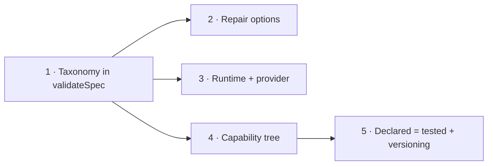

# Implementation Plan: PRD-001 Repairable Errors

Source: [PRD-001](../prds/prd-001-repairable-errors.md) · Basis: [ADR-0001](../adr/0001-structured-resolution-results.md), [ADR-0002](../adr/0002-capabilityset-enforced-contract.md) · Package: `@ttoss/geovis`

This plan turns the PRD into five vertical slices, each demoable end-to-end (types → checks → runtime → tests → docs). The durable decisions below resolve the PRD's open questions about `GeoVisResult`: what the union contains, the initial closed list of issue `code` values, and the only cases where a `repair` field is cheap enough to be honest.

## Durable decisions

### D1 — `GeoVisResult` shape

```ts
interface GeoVisIssue {
  /** Closed enum — see D2. Never parse `message`. */
  code: GeoVisIssueCode;
  /** Machine-locatable subject: a path into the spec, plus the offending id when one exists. */
  subject: { path: string; id?: string };
  /** Human-readable explanation. Presentation only, never driving logic. */
  message: string;
  /** Present only when alternatives are computable — see D3. */
  repair?: RepairOption[];
}

type GeoVisResult =
  | { status: 'resolved'; spec: VisualizationSpec; warnings: GeoVisIssue[] }
  | {
      status:
        | 'invalid'
        | 'mismatch'
        | 'unsupported'
        | 'insufficient-data'
        | 'needs-clarification';
      issues: GeoVisIssue[];
    };
```

Three rules complete the shape:

1. **Aggregate, don't fail fast.** Today `validateSpec` returns only the first failing category; the migration collects every issue in one pass so a repair loop fixes everything in one round trip.
2. **Status precedence.** When issues span categories, the result status is the highest-precedence one: `invalid` > `mismatch` > `unsupported` > `insufficient-data` > `needs-clarification`. A malformed spec makes every downstream category unreliable, so the caller repairs in that order. Individual issues keep their own category via `code` prefix.
3. **Reserved statuses.** `insufficient-data` and `needs-clarification` are part of the closed enum (ADR-0001) but no v1 code path emits them — the join check and multi-resolution cases arrive with R2/R4. They are declared now so the union never changes shape; evals must not count them until a producer exists.

### D2 — Initial closed list of issue codes

Every code maps 1:1 to a check that exists today (ADR-0001: "a reshaping, not a rewrite"). The code prefix is the category.

| Code                       | Category      | Existing check it reshapes                                                       |
| -------------------------- | ------------- | -------------------------------------------------------------------------------- |
| `invalid-schema`           | `invalid`     | AJV schema errors (one issue per error, `subject.path` = instancePath)           |
| `invalid-threshold-order`  | `invalid`     | legend / sizeBy thresholds not strictly ascending                                |
| `invalid-threshold-value`  | `invalid`     | non-finite threshold values                                                      |
| `invalid-size-range`       | `invalid`     | sizeBy range not finite / min ≥ max / min ≤ 0                                    |
| `invalid-size-mode`        | `invalid`     | stepped without thresholds or legend; sqrt in stepped                            |
| `duplicate-map-data-id`    | `mismatch`    | non-unique `mapDataId`                                                           |
| `unknown-map-data-id`      | `mismatch`    | layer references undeclared `mapDataId`                                          |
| `unknown-source`           | `mismatch`    | mapData references undeclared `mapId`                                            |
| `source-scope-conflict`    | `mismatch`    | layer source ≠ mapData source (feature-state scoping)                            |
| `duplicate-dimension`      | `mismatch`    | two mapData entries claim the same dimension                                     |
| `state-key-collision`      | `mismatch`    | dimensioned datasets share a `stateKey`                                          |
| `unsupported-source-type`  | `unsupported` | mapData on non-geojson source (hardcoded today; capability-driven after Phase 4) |
| `unsupported-layer-type`   | `unsupported` | new — from capability tree (Phase 4)                                             |
| `unsupported-data-feature` | `unsupported` | new — sizeBy / featureState / companion per source type (Phase 4)                |
| `unsupported-view-feature` | `unsupported` | new — pitch / bearing / projection (Phase 4)                                     |
| `unsupported-engine`       | `unsupported` | provider `resolveAdapter` throw                                                  |
| `unsupported-patch-target` | `unsupported` | runtime / adapter unknown-target `log.warn`                                      |
| `policy-violation`         | warning       | `PolicyViolation` from spec metadata                                             |

Adding a code is cheap; renaming or removing one is breaking. New codes require a line in this table via PR review — that process answers the PRD's open question about the final list.

### D3 — `repair` only where the fix is already in hand

The rule that keeps repair honest and cheap: **a `repair` is attached only when the correct alternatives already exist at the check site — no inference, no search, no guessed values.** That yields exactly these cases:

| Code                                      | Repair payload                                                                       | Why it costs nothing                                       |
| ----------------------------------------- | ------------------------------------------------------------------------------------ | ---------------------------------------------------------- |
| `unknown-map-data-id`                     | allowed values: the declared `mapDataId`s                                            | the check already builds that set                          |
| `unknown-source`                          | allowed values: the declared source ids                                              | same                                                       |
| `source-scope-conflict`                   | set value: point the layer at the mapData's source                                   | the correct id is the other side of the comparison         |
| `unsupported-source-type`                 | allowed values: `['geojson']` (hardcoded today; adapter-declared list after Phase 4) | the only supported source type is already known statically |
| `unsupported-*` (Phase 4)                 | allowed values: the adapter's declared list                                          | the capability tree is the input to the check              |
| `unsupported-patch-target`                | allowed values: `layer` / `source` / `mapData`                                       | static; message directs `view`/`style` to `update()`       |
| `policy-violation` (raw-count choropleth) | set value: the normalized field                                                      | already computed into metadata today                       |

Everything else ships **without** repair, deliberately: schema errors (a fix generator would re-implement the schema; path + message is enough for a caller), threshold ordering (auto-sorting can mask a data error — that's guessing intent), duplicates (which copy to rename is unknowable), numeric ranges (any suggested number is invented). An absent `repair` is the honest signal that alternatives are not computable.

**Correction found during Phase 1 implementation:** the sqrt+stepped `sizeBy` combination is rejected by the JSON Schema's own `not` constraint (`schema.json`'s `sizeBy.allOf[1].not`) before any custom check runs — it surfaces as `invalid-schema`, not a custom `invalid-size-mode` issue, so it never had a computable repair to attach. The originally planned `invalid-size-mode` (sqrt+stepped) repair row is removed; `invalid-size-mode` now covers only the "stepped without thresholds or an active legend" case, which has no repair (thresholds depend on the data distribution and cannot be invented).

The payload is a closed union of two kinds — enough for every case above:

```ts
type RepairOption =
  | {
      kind: 'allowed-values';
      path: string;
      values: ReadonlyArray<string | number>;
    }
  | { kind: 'set-value'; path: string; value: unknown; label?: string };
```

A third kind (choose-one-of-N-resolutions for `needs-clarification`) is anticipated but not added until a producer exists.

### D4 — Policy violations are warnings on the resolved branch

Today policy violations never block rendering; this plan preserves that. They flow through the same `GeoVisIssue` shape as `warnings` on a `resolved` result — one reporting channel, zero behavior change. Per-policy blocking (moving a violation to the `issues` side) becomes a per-policy flag decided when the second policy is written, answering the PRD's other open question.

### D5 — Nothing renders on failure

`validateSpec`, `runtime.update`, and `runtime.applyPatch` return `GeoVisResult`. On failure the runtime does not call the adapter and `runtime.spec` keeps its last accepted value — a failed result never produces a mounted or guessed map. This is a breaking change to `ValidationResult` and the runtime signatures, accepted by ADR-0001 (pre-1.0).

## Phases



### Phase 1 — `GeoVisResult` lands in `validateSpec`

Define `GeoVisResult`, `GeoVisIssue`, `GeoVisIssueCode`, `RepairOption` and migrate every existing check to emit coded issues (D2), aggregated instead of fail-fast (D1.1), with status precedence (D1.2). Public contract and README updated.

**Demo:** validating a broken fixture returns every issue at once, each with `code` and `subject`.
**Acceptance:** no `string[]` errors remain; all existing checks emit a code from D2; one call reports issues from multiple categories; public-contract test updated deliberately; coverage does not decrease.

### Phase 2 — Repair options on the computable set

Attach `repair` to exactly the D3 cases that exist after Phase 1 (referential codes and policy; capability codes join in Phase 4).

**Demo:** an unknown `mapDataId` failure lists the declared ids; applying the suggested fix validates cleanly.
**Acceptance:** every D3 code present in the codebase carries `repair`; a round-trip test proves each repair honest — applying it produces a spec that passes validation; codes outside D3 have no `repair`.

### Phase 3 — Runtime and provider honor the taxonomy

`runtime.update` and `runtime.applyPatch` validate first and return `GeoVisResult`; on failure the adapter is never called (D5). The unknown-patch-target warning becomes an `unsupported-patch-target` issue. `GeoVisProvider` consumes results and exposes them through context; policy violations join the warnings channel (D4), retiring the separate `PolicyViolation` path.

**Demo:** pushing a broken spec at a mounted map leaves the map untouched and returns structured issues.
**Acceptance:** zero silent failures — every resolution-affecting entry point returns the taxonomy; failed update/patch provably leaves `runtime.spec` and the rendered map unchanged; `useGeoVis` surfaces the last result.

### Phase 4 — `CapabilitySet` becomes the enforced tree

Expand `CapabilitySet` to the ADR-0002 structure (source types, layer geometries, data features keyed by source type, view features). The MapLibre adapter declares honestly; `validateSpec` accepts the active capabilities and emits `unsupported-*` issues with allowed-values repair straight from the tree; the provider rejects before mount.

**Demo:** a spec requiring feature-state on a vector-tiles source is rejected pre-mount, repair listing the source types that do support it.
**Acceptance:** an unsupported capability never reaches the engine; the hardcoded geojson-only check is replaced by the capability path; `getCapabilities()` is consumed, not dead code.

### Phase 5 — Declared = tested, plus versioning

One official fixture per declared capability entry; entries that cannot get a fixture are declared `false` (ADR-0002 — the advertised surface may shrink). Add spec schema versioning so results can report version mismatch (PRD "should").

**Demo:** the capability table in the docs is backed 1:1 by fixtures; a spec with a stale version returns a versioned `invalid` issue with the supported version as repair.
**Acceptance:** no capability entry is declared but untested; version mismatch reports through the taxonomy; PRD success metrics all check green.

## Sequencing notes

Phase 1 is the entry gate for everything and requires accepting ADR-0001/0002. Phases 2, 3, and 4 are independent of each other after Phase 1 and can proceed in parallel or in any order; Phase 5 needs Phase 4. Each phase is one PR following the package workflow (tests → dependents → build → coverage threshold → README).
