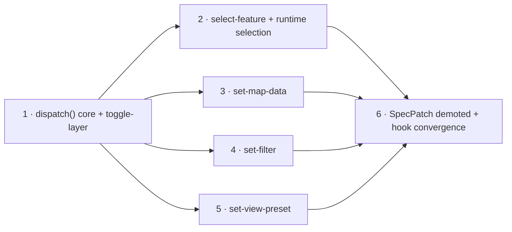

# Implementation Plan: PRD-002 AI Operation Surface

Source: [PRD-002](../prds/prd-002-ai-operation-surface.md) · Basis: [ADR-0003](../adr/0003-semantic-action-surface.md), [ADR-0004](../adr/0004-ai-context-packet.md) · Package: `@ttoss/geovis`

This plan turns the PRD into six vertical slices, each cutting through the full path (validation → compilation to existing mechanisms → action log → context packet → tests). The durable decisions below resolve the PRD's open question about the v1 action vocabulary — fixed to the five actions ADR-0003 already names — and define the `ContextPacket` shape up front (D5) even though it is filled in incrementally, one field per phase, so every phase stays independently demoable instead of landing as one late "packet" phase.

## Durable decisions

### D1 — Closed action vocabulary and `dispatch()`

```ts
type GeoVisAction =
  | { type: 'set-map-data'; layerId: string; mapDataId: string; rationale?: string }
  | { type: 'set-filter'; layerId: string; filter: LayerFilter | null; rationale?: string }
  | { type: 'toggle-layer'; layerId: string; visible?: boolean; rationale?: string }
  | { type: 'select-feature'; layerId: string; featureId: string | number | null; rationale?: string }
  | { type: 'set-view-preset'; presetId: string; rationale?: string };

interface GeoVisRuntime {
  dispatch(action: GeoVisAction): GeoVisResult;
  getContextPacket(): ContextPacket;
  getActionLog(): ReadonlyArray<ActionLogEntry>;
}
```

Every `layerId` / `mapDataId` / `presetId` / `featureId` is a stable id already present in the spec — the same ids `getContextPacket()` names (ADR-0004's requirement that packet ids and action ids coincide). `dispatch()` follows the same discipline `update`/`applyPatch` already use: resolve the action against the current spec and `CapabilitySet`, and only on success compile to an existing mechanism (`SpecPatch`, `setView`) and commit — on failure nothing mutates and the adapter is never called.

The union is declared in full in Phase 1; variants land one per phase (1: `toggle-layer`, 2: `select-feature`, 3: `set-map-data`, 4: `set-filter`, 5: `set-view-preset`). This mirrors PRD-001's precedent of declaring a closed enum before every member has a producer (`insufficient-data`/`needs-clarification` in `GeoVisResultStatus`) — the type never changes shape across phases, only its handling grows.

Two new referential issue codes are needed (added to the closed `GeoVisIssueCode` list, `mismatch` category): `unknown-layer-id` and `unknown-view-preset`, each with an `allowed-values` repair listing the declared ids — the same pattern as `unknown-map-data-id`/`unknown-source`. `set-map-data` reuses `unknown-map-data-id` as-is. `set-filter`'s capability gate reuses `unsupported-data-feature`, a code PRD-001 declared but left without a producer — this plan is its first producer, not a new code.

### D2 — Selection becomes runtime state

Today the only record of "what's selected" is `GeoVisClickContext`, populated by MapLibre `click`/`keydown` handlers inside `useMapClick` that call `setFeatureState` directly (`hooks.builders.ts`). Neither `dispatch()` nor `getContextPacket()` can be framework-agnostic while selection lives only in React.

Selection is promoted to the runtime: `GeoVisRuntime` gains `getSelection(): { layerId: string; featureId: string | number } | null`, and the feature-state mutation currently duplicated inside `useMapClick`'s handlers moves down to one adapter-level method the runtime calls from `dispatch({ type: 'select-feature', ... })`. `useMapClick`/`GeoVisClickContext` become a subscriber: click, outside-click, and `Escape` all dispatch `select-feature` (with `featureId: null` for deselect) instead of touching feature-state themselves, so a human click and an AI-dispatched selection produce the identical action-log entry (Phase 2 delivers PRD-002's "Should: hooks migrated to dispatch" for this hook specifically).

`select-feature` validates `layerId` against the spec (`unknown-layer-id`). `featureId` is validated against `mapData` rows when the target layer has a `mapDataId` (cheap — the rows are already loaded); layers without a `mapData` join accept any `featureId` unchecked, since verifying it would require touching feature geometry, which the packet/action surface deliberately never does.

### D3 — Two new spec concepts: layer `filter` and named `viewPresets`

Neither exists today. Both follow the PRD's "intent over implementation" rule: the AI targets a stable id or a small typed predicate, never a raw engine expression or camera coordinates.

```ts
interface LayerFilter {
  property: string;
  operator: 'eq' | 'neq' | 'gt' | 'gte' | 'lt' | 'lte' | 'in' | 'not-in';
  value: string | number | Array<string | number>;
}
// VisualizationLayer.filter?: LayerFilter
```

Compiles to the adapter's native filter expression (MapLibre `setFilter`), gated by a new `CapabilitySet.dataFeatures.filter: DataSource['type'][]` entry — declared for `geojson` only at first, fixture-backed per ADR-0002's "declared means tested". `filter: null` clears it.

```ts
interface ViewPreset {
  id: string;
  label?: string;
  view: ViewState;
}
// VisualizationSpec.viewPresets?: ViewPreset[]
```

`set-view-preset` resolves `presetId` against `spec.viewPresets` and calls the existing `runtime.setView()` path — no new engine-level code. Presets are declared in the spec itself (not an external catalog — catalog knowledge is PRD-004's explicit non-goal here), keeping the AI bounded to camera positions the application actually curated.

### D4 — Action log is the audit substrate, undo/redo is out of scope

```ts
interface ActionLogEntry {
  action: GeoVisAction;
  result: GeoVisResult;
  timestamp: number;
}
```

Every `dispatch()` call appends one entry — accepted or rejected — so the log is a complete audit trail with `rationale` preserved on the action, satisfying the PRD's "every dispatched action is logged" outcome. Computing an inverse action and an undo/redo stack from this log is the PRD's "Should" item; this plan delivers the substrate (the log itself) but does not build undo/redo — that remains open, tracked against PRD-008 where workspace UI would consume it.

### D5 — `ContextPacket` shape

```ts
interface ContextPacket {
  schemaVersion: number;
  mapType?: MapType;
  sources: Array<{ id: string; type: DataSource['type'] }>;
  layers: Array<{
    id: string;
    geometry: GeoVisGeometryType;
    visible: boolean;
    mapDataId?: string;
    dimension?: 'color' | 'size';
    filter?: LayerFilter;
  }>;
  legends: Array<{
    id: string;
    scaleKind?: 'categorical' | 'threshold';
    domain?: number[];
    unit?: string;
  }>;
  viewPresets: Array<{ id: string; label?: string }>;
  selection: { layerId: string; featureId: string | number } | null;
  allowedActions: GeoVisAction['type'][];
  warnings: GeoVisIssue[];
  lastResult: GeoVisResult;
}
```

Metadata and aggregates only — never `mapData[].data` rows, GeoJSON geometry, full color/threshold lists, or raw `viewPresets[].view` camera numbers (an id + label is enough for the model to choose one; the packet is not the place to hand back coordinates). `allowedActions` is the ADR-0003 vocabulary filtered by what the current spec and adapter actually support: `toggle-layer`/`select-feature` need ≥1 layer, `set-map-data` needs ≥1 compatible `mapData` entry, `set-filter` needs the adapter to declare the filter capability for a present source type, `set-view-preset` needs a non-empty `spec.viewPresets`.

The packet is filled in incrementally — Phase 1 ships `schemaVersion`/`mapType`/`sources`/`layers` (visibility only)/`legends`/`warnings`/`lastResult`/`allowedActions` (with only `toggle-layer` possibly allowed); each later phase adds the field its action needs (`selection` in Phase 2, `layers[].mapDataId`/`dimension` in Phase 3, `layers[].filter` in Phase 4, `viewPresets` in Phase 5) and extends `allowedActions`' gating accordingly. The shape above is fixed now so no phase has to reshape what a previous phase already shipped.

### D6 — `SpecPatch` demoted, remaining hooks converge

`SpecPatch`/`applyPatch` stay public but are reclassified in docs as the low-level escape hatch — mirroring how `getNativeInstance()` is documented today: available, not primary. `dispatch()` is the path documented first. Hooks that still mutate the spec/feature-state directly for a shape `dispatch()` now covers (`useBoundaryToggle`'s visibility toggling, beyond the selection hook already converged in Phase 2) migrate to dispatching `toggle-layer`, so a human control and an AI turn produce identical, loggable operations end to end.

## Phases



### Phase 1 — `dispatch()` core and `toggle-layer`

Add `GeoVisAction` (D1, full union declared, only `toggle-layer` handled — other variants return a structured `unsupported` result until their own phase), `GeoVisRuntime.dispatch()`, the action log (D4), and `getContextPacket()` with its Phase-1 fields (D5). `toggle-layer` validates `layerId` (new `unknown-layer-id` issue + repair) and compiles to the existing layer-visibility `SpecPatch`.

**Demo:** `runtime.dispatch({ type: 'toggle-layer', layerId, rationale })` hides/shows a layer on a live, already-mounted map; `runtime.getActionLog()` shows the entry with its `rationale`; `runtime.getContextPacket()` reports the layer's `visible` state and lists `toggle-layer` in `allowedActions`.
**Acceptance:** an unknown `layerId` is rejected before touching the adapter, with the declared layer ids as repair; a rejected dispatch is still appended to the action log; the packet never includes geometry, `mapData` rows, or full color/threshold lists; public-contract test updated; coverage does not decrease.

### Phase 2 — `select-feature` and runtime-level selection

Promote selection to the runtime (D2): `getSelection()`, one adapter-level selection method shared by `dispatch()` and the click hook. Migrate `useMapClick`/`GeoVisClickContext` to dispatch `select-feature` on click, outside-click, and `Escape` instead of mutating feature-state directly. Packet gains `selection`.

**Demo:** dispatching `select-feature` highlights a feature exactly as a click does; clicking the map now produces the same shape of action-log entry a dispatched call would; `packet.selection` reflects the current selection and clears to `null` on deselect.
**Acceptance:** no feature-state selection code remains duplicated between the click hook and `dispatch()`; `select-feature` with `featureId: null` deselects; an unknown `layerId` is rejected (`unknown-layer-id`); a `featureId` checked against a `mapData`-joined layer's rows is rejected when absent.

### Phase 3 — `set-map-data`

`dispatch({ type: 'set-map-data', layerId, mapDataId, rationale })` validates `mapDataId` (`unknown-map-data-id`) and compiles to the existing `mapData`-target patch (`applyMapDataPatchToSpec`) that rebinds which dataset drives a layer's dimension. Packet's `layers[].mapDataId`/`dimension` are derived through the same resolution the adapter already uses for `stateKey` lookup, not re-implemented.

**Demo:** dispatching `set-map-data` swaps the dataset coloring a choropleth layer without remounting the map; `packet.layers[].mapDataId` reflects the new binding.
**Acceptance:** an invalid `mapDataId` is rejected pre-apply with the declared ids as repair; an accepted dispatch produces the identical spec/adapter result as the equivalent manual `SpecPatch`; view and selection survive the change (no remount).

### Phase 4 — `set-filter`

Add `VisualizationLayer.filter` (D3) plus its schema entry, and `CapabilitySet.dataFeatures.filter` (declared for `geojson`, fixture-backed). The MapLibre adapter compiles `filter` to a native `setFilter` expression. `dispatch({ type: 'set-filter', ... })` validates `layerId` and the capability (first producer of `unsupported-data-feature`) before compiling; `filter: null` clears it.

**Demo:** dispatching `set-filter` hides non-matching features on a live layer, no source/geometry touched; dispatching it against a source type that doesn't declare the filter capability is rejected pre-apply, repair naming the source types that do.
**Acceptance:** schema/type/capability additions are fixture-covered; `packet.layers[].filter` round-trips what was set; `filter: null` restores all features.

### Phase 5 — `set-view-preset`

Add `VisualizationSpec.viewPresets` (D3). `dispatch({ type: 'set-view-preset', presetId, rationale })` resolves `presetId` (new `unknown-view-preset` issue + repair listing declared preset ids) and calls the existing `runtime.setView()` path. Packet gains `viewPresets` (id/label only).

**Demo:** dispatching `set-view-preset` with a declared id flies the camera there and updates `spec.view`; an unknown id is rejected with the declared preset ids as repair.
**Acceptance:** presets are resolved from `spec.viewPresets`, never invented from raw coordinates the action carries; `packet.viewPresets` lists exactly the declared presets, never their raw `view` camera values.

### Phase 6 — Convergence: `SpecPatch` demoted, remaining hooks migrated

Reclassify `SpecPatch`/`applyPatch` in the README/JSDoc as the documented escape hatch (D6); migrate `useBoundaryToggle` to dispatch `toggle-layer`; finalize `allowedActions`' gating across all five actions now that every action exists; document the action log as the audit/undo substrate with undo/redo explicitly out of scope (D4).

**Demo:** `useBoundaryToggle`'s toggle produces an action-log entry identical in shape to an AI-dispatched `toggle-layer`; the README's `SpecPatch` section reads as a low-level escape hatch, not the primary mutation API.
**Acceptance:** every PRD-002 "Must" item is green — closed vocabulary + `dispatch()` validated against the capability tree and spec, `getContextPacket()` versioned/read-only/metadata-only with allowed actions and last structured error, packet ids identical to action ids, `SpecPatch` demoted; the "Should" hook-convergence item is satisfied for boundary toggling and selection; undo/redo is documented as an explicit follow-up, not silently dropped.

## Sequencing notes

Phase 1 is the entry gate: it builds `dispatch()`, the action log, and the packet skeleton every later phase extends. Phases 2–5 are independent of each other once Phase 1 lands — each adds exactly one action and one packet field — and can proceed in any order or in parallel. Phase 6 depends on all of 1–5, since it finalizes cross-action `allowedActions` gating and only then migrates the remaining hook. Each phase is one PR following the package workflow (tests → dependents → build → coverage threshold → README).
