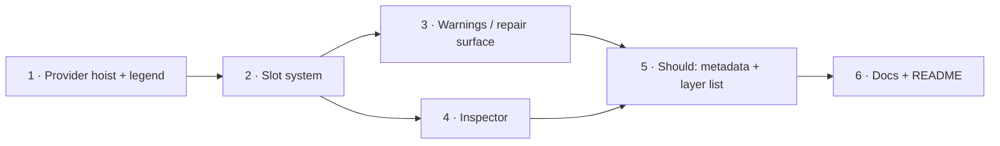

# Implementation Plan: PRD-003 Human Workspace Foundation

Source: [PRD-003](../prds/prd-003-human-workspace.md) · Basis: [Workspace ADR-0001](https://github.com/ttoss/ttoss/blob/main/packages/geovis-workspace/docs/adr/0001-runtime-derived-panels.md), [ADR-0002](https://github.com/ttoss/ttoss/blob/main/packages/geovis-workspace/docs/adr/0002-slot-based-composition.md), [ADR-0003](https://github.com/ttoss/ttoss/blob/main/packages/geovis-workspace/docs/adr/0003-structured-failures-as-repair-surface.md) · Package: `@ttoss/geovis-workspace`

This plan turns the PRD into six vertical slices, each cutting through the full path (config → provider wiring → default panel → Storybook → tests). The durable decisions below resolve both of the PRD's open questions — which panels are v1 (D4) and whether accessibility gates or follows (D5) — and fix the slot config shape up front (D2) even though slots fill in one at a time, so no later phase reshapes what an earlier one already shipped.

## Durable decisions

### D1 — Provider hoist and config narrowing (ADR-0001)

`GeoVisProvider` moves from inside the map slot to the root of `GeovisWorkspace`, wrapping `GeovisWorkspaceProvider` and `Layout` so every panel — not just the canvas — can call `useGeoVis()`, `useGeoVisClick()`, and `useGeoVisHover()`:

```tsx
export const GeovisWorkspace = ({
  config,
  visualizationSpec,
  variables,
  onVariableChange,
}: GeovisWorkspaceProps) => {
  return (
    <GeoVisProvider spec={visualizationSpec}>
      <GeovisWorkspaceProvider
        config={config}
        selection={variables}
        onSelectionChange={onVariableChange}
      >
        <Layout />
      </GeovisWorkspaceProvider>
    </GeoVisProvider>
  );
};
```

The `map` slot's default panel narrows to `<GeoVisCanvas style={{ width: '100%', height: '100%' }} />` — `GeovisWorkspaceMap` no longer mounts its own provider. `GeovisWorkspaceConfig.rightSidebar.legendWithColor.legend` (hand-authored `{ color, label }[]` swatches) is removed: the legend panel renders `<GeoVisLegend legendId />` per entry in `spec.legends`, which already resolves classes/stops/circles from the committed spec. `description` and `sources` are not runtime-derivable (the spec has no notion of a citation), so they survive as annotation config, relocated under the `legend` slot's own settings in D2 rather than under `rightSidebar`.

This is a breaking `GeovisWorkspaceConfig` change, acceptable pre-1.0 per the ADR. It has no dependency on GeoVis R2 (ADR-0001's own consequence) — this plan proceeds independently of PRD-002.

### D2 — Slot vocabulary and config shape (ADR-0002)

```ts
export type GeovisWorkspaceSlotName =
  | 'map'
  | 'legend'
  | 'warnings'
  | 'inspector'
  | 'metadata'
  | 'controls';

export interface GeovisWorkspaceSlotConfig {
  /** Replaces the slot's default panel. Renders inside the same provider tree, so it gets runtime access through the public contexts exactly like the default it replaces. */
  component?: React.ComponentType;
  /** Hides the slot's region entirely instead of rendering its default. */
  hidden?: boolean;
}

export interface GeovisWorkspaceConfig {
  slots?: Partial<Record<GeovisWorkspaceSlotName, GeovisWorkspaceSlotConfig>>;
  controls?: { menus: GeovisWorkspaceMenu[] };
  legend?: { description?: string; sources?: GeovisWorkspaceSources };
  leftSidebar?: { initialState?: 'open' | 'closed' };
  rightSidebar?: { initialState?: 'open' | 'closed' };
}
```

The six names are the closed, versioned vocabulary ADR-0002 calls for — adding one is additive, renaming one is breaking, exactly like `GeoVisIssueCode`. **Placement stays fixed in v1**: `controls` renders in the left sidebar; `legend`, `warnings`, `inspector`, and `metadata` stack in that order in the right sidebar; `map` fills the main area. Only a slot's _content_ (override or hide) is configurable — rearranging which physical region hosts which slot is not exposed, since neither the PRD's exit criterion nor its Should items ask for it, and it can be added later as a purely additive `region` field without breaking the name vocabulary. `Layout` becomes a slot renderer: for each of the six names it reads `config.slots?.[name]`, renders `component` if given, nothing if `hidden`, otherwise the slot's own default panel — the same override-or-default resolution `Layout` already does per-sidebar, generalized from two regions to six slots.

`controls`' menu groups and `legend`'s description/sources are not slot overrides — they configure the _default_ panel's content (the same distinction ADR-0001 draws between "layout" and "annotations"), so they live as sibling top-level config, not nested inside `slots`.

### D3 — Repair surface: severity, i18n keying, and repair application (ADR-0003)

The `warnings` slot's default panel subscribes to `useGeoVis().result`. Severity comes from `GeoVisResultStatus`, not a separate field: `resolved` warnings (policy violations) render as `'warning'`; every other status (`invalid`, `mismatch`, `unsupported`, `insufficient-data`, `needs-clarification`) renders as `'error'` — a two-level severity is enough for v1 and matches the PRD's "blocking failure vs. warning" language exactly.

```ts
const warningMessages = defineMessages({
  'unknown-map-data-id': { defaultMessage: '...', description: '...' },
  // one entry per GeoVisIssueCode, plus a closed fallback key
  fallback: {
    defaultMessage: '{message}',
    description:
      'Untranslated issue message, used for a code with no catalog entry yet.',
  },
});
```

Each `GeoVisIssue` renders: the i18n message for `issue.code` (falling back to the raw `issue.message` when a future code has no catalog entry yet — the forward-compatibility obligation ADR-0003 names), `subject.path`/`subject.id` as a monospace reference, and `repair` candidates as buttons: `allowed-values` renders one button per value, `set-value` renders a single button labeled with `repair.label` or the value itself.

Applying a repair does not attempt a generic patch-by-path engine: `RepairOption.path` can target `metadata.*` or spec-level fields `applyPatch`'s `SpecPatch` (`'layer' | 'source' | 'mapData'` only) cannot express. Instead `GeovisWorkspace` gains `onRepair?: (repair: RepairOption) => void`, called when a repair button is pressed — the same delegation-to-the-application shape `onVariableChange` already uses, so the workspace never re-implements the app's `buildSpec`. When `onRepair` is omitted, issues still render fully (code, message, subject) with repair buttons disabled rather than absent — visibility, not action-wiring, is what "no dead-end" requires; this satisfies the ADR without forcing every consumer to wire repair immediately.

A blocking failure with no prior committed spec (cold start — `runtime` exists but `result.status !== 'resolved'` and nothing has ever resolved) renders an empty-state repair view in the `map` slot instead of an uninitialized canvas. Once any resolve succeeds, `GeoVisProvider`'s own "nothing renders on failure" contract takes over — the map keeps showing the last good spec while the `warnings` panel surfaces the new failure — so this plan only has to handle the cold-start case, not re-implement stale-spec handling GeoVis already owns.

### D4 — V1 panel scope (resolves PRD's "which panels are v1" open question)

The Outcome names five things an application must get "with the workspace and no custom map UI": map, legend, tooltip, warnings, inspection. `GeoVisHoverTooltip` already auto-mounts inside `GeoVisProvider` (spec-driven `hoverTooltip`), so it needs no workspace-level work. That leaves four default panels this plan must build: `map` (D1), `legend` (D1), `warnings` (D3), and **`inspector`** — even though the Must/Should list never names "inspector" as its own bullet, the Outcome requires "inspection" and ADR-0002 names the slot, so it is in scope as a Must, not deferred. `metadata` and `controls`'-menu-list variant (Should: "Metadata panel and layer list") are the two explicitly-Should items and are scheduled last (Phase 5) — buildable, but not gating the PRD's exit criterion.

### D5 — Keyboard operability is continuous, not a gate (resolves PRD's second open question)

The outcome lists "core flows are keyboard-operable" as a v1 quality criterion, not a Must/Should bullet with its own deliverable — so it does not gate or follow the PRD as a separate phase. Instead every phase that ships a new interactive surface (repair buttons in Phase 3, inspector dismissal in Phase 4, metadata/layer-list controls in Phase 5) includes keyboard operability in its own acceptance criteria, the same way the existing sidebar toggle buttons already manage focus (blur-before-hide, `aria-hidden`/`tabIndex` pairing) — extending an established pattern rather than auditing it separately at the end.

## Phases



### Phase 1 — Provider hoist and runtime-bound legend

Hoist `GeoVisProvider` above `GeovisWorkspaceProvider`/`Layout` (D1). Remove `legendWithColor.legend` from `GeovisWorkspaceConfig`; `RightSidebar` renders `<GeoVisLegend legendId noPositionWrap />` for each `spec.legends` entry plus the surviving `description`/`sources` annotations.

**Demo:** the same `GeovisWorkspace` story now shows a legend whose swatches change when `visualizationSpec`'s metric changes, with no config edit — previously the hand-authored `items` would silently go stale.
**Acceptance:** no panel-level `GeoVisProvider` remains in `GeovisWorkspace.tsx`; `RightSidebar` has zero hand-authored color/label pairs; existing `GeovisWorkspace.test.tsx` updated for the new tree shape; coverage does not decrease; Storybook story updated to demonstrate a metric change reflecting in the legend.

### Phase 2 — Named slot system

Introduce the six-slot vocabulary and `Layout`-as-slot-renderer (D2). Migrate today's two default panels into the new shape: `controls` (existing menu-driven `LeftSidebar`) and `legend` (Phase 1's runtime-bound panel). `warnings`, `inspector`, and `metadata` slots exist in the vocabulary and can be hidden/overridden from Phase 2 onward, but ship with an empty default panel until their own phase lands.

**Demo:** an application hides the `legend` slot (`config.slots.legend = { hidden: true }`) or replaces `controls` with a custom component that still reads `useGeoVis()`, without touching `Layout`.
**Acceptance:** `Layout` resolves all six slots through one override-or-default path; hiding a slot collapses its region (no empty gap); a custom slot component receives runtime access identical to the default it replaces; public-contract/export test updated for the new config types; Storybook stories cover both a default-panels story and a custom-override story.

### Phase 3 — Warnings panel and repair surface

Build the `warnings` slot's default panel (D3): severity-from-status, code-keyed i18n with fallback, `subject` reference, and `repair` buttons wired through the new `onRepair` prop. Add the cold-start empty-state view to the `map` slot's default.

**Demo:** feeding an invalid `visualizationSpec` on first mount shows a repair-affordance empty state in the map area, not a blank canvas; an `unknown-map-data-id` failure after a successful mount keeps the last good map visible while the warnings panel lists the issue with an `allowed-values` repair as buttons; pressing one calls `onRepair` with the chosen value.
**Acceptance:** every `GeoVisIssueCode` has an i18n catalog entry or hits the documented fallback (test asserts no code silently renders empty); repair buttons are keyboard-reachable and labeled (D5); `onRepair` omitted still renders full issue text with disabled repair buttons, never hidden ones; Storybook stories cover a resolved-with-warnings state, a blocking-failure state, and the cold-start empty state.

### Phase 4 — Inspector panel

Build the `inspector` slot's default panel: subscribes to `useGeoVisClick()` and renders the selected feature's `value`/`layerId`, with a dismiss control (mirrors the existing click-context `Escape`/outside-click clearing, so the panel's dismiss button and those two paths stay in sync).

**Demo:** clicking a feature on the map populates the inspector panel; pressing `Escape` or clicking outside clears both the map's selection highlight and the panel simultaneously, since both read the same `useGeoVisClick()` snapshot.
**Acceptance:** the panel renders nothing (not an empty box) when `useGeoVisClick()` is `null`; dismiss is keyboard-operable (D5); Storybook story demonstrates select → inspect → dismiss.

### Phase 5 — Should: metadata panel and layer list

Build the two explicitly-Should default panels named in the PRD: a `metadata` slot panel (spec-level annotations — map type, source count) and a layer-list variant of the `controls` panel (visibility/legend-id per layer, reading `spec.layers` instead of `config.controls.menus`).

**Demo:** an application enables the layer-list variant and toggles a layer's visibility from the sidebar; the metadata panel shows the current `mapType` and source count without any config authored for it beyond enabling the slot.
**Acceptance:** both panels are opt-in defaults (hidden unless the application supplies the data they need, e.g. no metadata panel content with zero sources) rather than always-on placeholders; keyboard-operable (D5); Storybook stories added for both.

### Phase 6 — Docs and package workflow close-out

No new runtime behavior. Update `README.md`'s API tables for the full `GeovisWorkspaceConfig` shape (`slots`, `controls`, `legend`, `onRepair`), update `jest.config.ts` `coverageThreshold` to the final coverage figure, and confirm every exported component from Phases 1–5 has the required JSDoc.

**Demo:** `pnpm storybook` shows every default panel (including custom-override and hidden variants) with `autodocs`, matching the README's field tables one-to-one.
**Acceptance:** `README.md` has no stale reference to `legendWithColor.legend` or `leftSidebar.menus`; `pnpm turbo run test --filter=...@ttoss/geovis-workspace` and `pnpm turbo run build --filter=...@ttoss/geovis-workspace` are green; coverage threshold reflects final numbers, never lower than before Phase 1.

## Sequencing notes

Phase 1 is the entry gate: nothing else can subscribe to the runtime until the provider is hoisted. Phase 2 depends only on Phase 1 (it needs the hoisted tree to generalize two panels into six slots) and is itself the gate for everything slot-shaped. Phases 3 and 4 are independent of each other once Phase 2 lands — one adds the `warnings` slot's panel, the other the `inspector` slot's — and can proceed in parallel or either order. Phase 5 depends on both, since the metadata/layer-list panels are additional slot content on the same `Layout` and its Storybook sweep is easiest done once every other default panel already exists for comparison. Phase 6 is documentation and coverage bookkeeping only, run last per the package workflow (tests → dependents → build → coverage threshold → README). Each phase is one PR.

## Verification against current codebase (2026-07-15)

Re-derived from PRD-003 and cross-checked against `packages/geovis-workspace/src` and `packages/geovis/src`: no phase below has landed yet.

- `GeovisWorkspace.tsx` still mounts `GeoVisProvider` inside the map-only `GeovisWorkspaceMap` (Phase 1 not started).
- `GeovisWorkspaceContext.ts` still models two named regions (`leftSidebar`, `rightSidebar`) with hand-authored `legendWithColor.legend` swatches, not the six-slot vocabulary (Phases 1–2 not started).
- `GeoVisLegend`, `useGeoVisClick`, `useGeoVisHover`, `GeoVisResultStatus`, and `RepairOption` all exist as public `@ttoss/geovis` exports today, so D1/D3/D4 can build directly on them without any upstream PRD-001/PRD-002 work.

No changes to the phase breakdown were needed — the plan already matches the codebase and the PRD's Must/Should/Won't scope.
