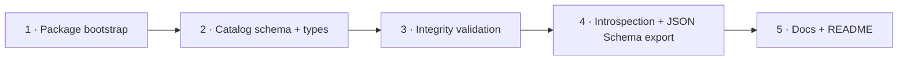

# Implementation Plan: PRD-004 Trusted Catalog

Source: [PRD-004](../prds/prd-004-trusted-catalog.md) · Basis: strategy §5.2 (product-hub doc not present in this repo — see Verification) · Package: new `@ttoss/geovis-catalog`

This is the first of three plans (PRD-004 → PRD-005 → PRD-006) that all land in the same new package, `@ttoss/geovis-catalog`, per each PRD's own "Package: same layer as PRD-004" line. This plan bootstraps the package and ships the catalog contract and its integrity validation; PRD-005's plan adds the intent schema on top, and PRD-006's plan adds the resolver on top of both.

## Durable decisions

### D1 — Package bootstrap

New package `packages/geovis-catalog`, non-React, modeled on `@ttoss/logger` (the repo's minimal non-UI package): `package.json` with `exports: { ".": "./src/index.ts" }`, `scripts.build = tsdown`, `scripts.test = jest --projects tests/unit`, `type-check` script, `tsdown.config.ts` using `tsdownConfig({ format: ['esm'] })` from `@ttoss/config`, `tests/unit/jest.config.ts` + `tests/tsconfig.json` mirroring `geovis-workspace`'s unit setup (no React/jsdom environment needed — this package has no components), root `tsconfig.json`, `README.md`, `CHANGELOG.md`. No Storybook stories and no `i18n` script: the package has no user-facing text — every string it produces is a machine `code`, translated downstream by `@ttoss/geovis-workspace` (ADR-0003), exactly like `@ttoss/geovis`'s own issue codes today.

`package.json` dependencies: `zod` (`^4.4.3`, matching `@ttoss/forms`/`@ttoss/http-server-mcp` — repo forms rule mandates Zod for new schemas) and `@ttoss/geovis` (for `RepairOption` reuse now, and `VisualizationSpec`/`resolveSpecFromMapType` reuse in PRD-006's plan — declared once here so later plans don't reshape `package.json`).

### D2 — Result taxonomy: mirrored, not literally reused

`@ttoss/geovis`'s `GeoVisIssue`/`GeoVisResult` (ADR-0001) hardcode a closed `GeoVisIssueCode` union scoped to spec/runtime concerns (`unknown-map-data-id`, `unsupported-layer-type`, …) — none of which describe catalog failures (unknown metric, unknown geography, no join path, ambiguous intent). Generalizing `@ttoss/geovis`'s public type to be generic over the code union is a breaking, cross-package change that no PRD requests. This plan instead defines a **structurally identical, independently-closed** taxonomy local to `@ttoss/geovis-catalog`:

```ts
export type CatalogResultStatus = 'mismatch' | 'invalid';
// 'needs-clarification' is added by PRD-005's plan when intent validation lands;
// the union stays open to that addition by design, matching ADR-0001's own
// "insufficient-data"/"needs-clarification" reserved-but-unused precedent.

export type CatalogIssueCode =
  | 'invalid-catalog-schema' // invalid: fails the Zod schema
  | 'duplicate-metric-id' // invalid: two metrics share an id
  | 'duplicate-dataset-id'
  | 'duplicate-geography-id'
  | 'unknown-join-dataset' // mismatch: join references a dataset id not in catalog.datasets
  | 'unknown-join-geography' // mismatch: join references a geography id not in catalog.geographies
  | 'unresolvable-join-field'; // mismatch: join.on references a field the dataset/geography doesn't declare

export interface CatalogIssue {
  code: CatalogIssueCode;
  subject: { path: string; id?: string };
  message: string;
  repair?: RepairOption[]; // reused as-is from @ttoss/geovis — already code-agnostic
}

export type CatalogResult =
  | { status: 'valid'; catalog: Catalog }
  | { status: CatalogResultStatus; issues: CatalogIssue[] };
```

"Reporting through the PRD-001 taxonomy" (both PRD-004 and PRD-005's own words) is satisfied by shape-and-vocabulary parity — the same discriminated-union/status/code/subject/message/repair contract — not by importing a union that would have to grow unrelated entries.

### D3 — Catalog schema shape (Zod)

Seeded directly from PRD-004's own field enumeration (metrics, datasets, geographies, joins, units, formatters, time ranges, filters, allowed map types, permissions, aliases, descriptions) and the `Catalog` interface already sketched in [`docs/ai-integration-readiness.md`](../ai-integration-readiness.md) — reused as the shape seed, not redesigned:

```ts
const Metric = z.object({
  id: z.string(),
  label: z.string(),
  description: z.string(),
  aliases: z.array(z.string()).optional(),
  unit: z.string().optional(),
  kind: z.enum(['count', 'rate', 'ratio', 'index']),
  formatter: z.enum(['number', 'percent', 'currency', 'compact']).optional(),
  nullPolicy: z.enum(['hide', 'zero', 'explain']),
});

const Dataset = z.object({
  id: z.string(),
  label: z.string(),
  description: z.string(),
  geometry: z.enum(['point', 'polygon', 'line']),
  geographyIds: z.array(z.string()),
  metricIds: z.array(z.string()),
  temporal: z.object({ start: z.string(), end: z.string() }).optional(),
});

const Geography = z.object({
  id: z.string(),
  label: z.string(),
  description: z.string(),
  aliases: z.array(z.string()).optional(),
});

const Join = z.object({
  from: z.string(), // dataset id
  to: z.string(), // geography id
  on: z.object({ left: z.string(), right: z.string() }),
  cardinality: z.enum(['1:1', '1:m']),
});

const FilterField = z.object({
  field: z.string(),
  kind: z.enum(['categorical', 'numeric', 'temporal']),
  domain: z.unknown().optional(),
});

const MapTypeCatalogEntry = z.object({
  name: z.enum(['choropleth', 'dotDensity', 'proportionalCircles']),
  supportedGeometries: z.array(z.enum(['point', 'polygon', 'line'])),
  metricKinds: z.array(z.enum(['count', 'rate', 'ratio', 'index'])),
});

export const CatalogSchema = z.object({
  version: z.string(),
  domain: z.string().optional(),
  datasets: z.array(Dataset),
  metrics: z.array(Metric),
  geographies: z.array(Geography),
  joins: z.array(Join),
  mapTypes: z.array(MapTypeCatalogEntry),
  filters: z.array(FilterField),
  // Opaque by design (PRD-004's open question — governance is org/product work,
  // not a schema-shape blocker). Typed as a bag, never interpreted here.
  permissions: z.record(z.string(), z.unknown()).optional(),
});

export type Catalog = z.infer<typeof CatalogSchema>;
```

JSON Schema for LLM/tool consumption is derived via Zod v4's native `z.toJSONSchema(CatalogSchema)` — no extra dependency (`zod-to-json-schema`) needed, matching the version already pinned repo-wide.

### D4 — Integrity validation scope

`validateCatalog(input: unknown): CatalogResult` runs, in order: (1) `CatalogSchema.safeParse` → `invalid-catalog-schema` with Zod's issue paths mapped to `subject.path` on failure; (2) id-uniqueness checks per collection → `duplicate-*-id`; (3) referential checks — every `join.from`/`join.to` resolves to a known dataset/geography id, every `join.on.left`/`right` names a field the referenced dataset/geography actually declares (datasets/geographies carry no explicit field list in D3's shape beyond `metricIds`/`geographyIds`, so `unresolvable-join-field` is scoped to what's checkable: the join's endpoints exist and the cardinality is one of the two allowed values — full column-level validation against a live warehouse is explicitly the Should-item helper's job, not this Must). No `repair` is computed for `invalid-catalog-schema` (the fix is "correct the input", not a suggerable value); `duplicate-*-id` and `unknown-join-*` issues attach `repair: [{ kind: 'allowed-values', path: ..., values: <the known ids> }]` since the correct set is already in hand — mirroring ADR-0001's own rule that repair values are never invented.

### D5 — Introspection surface

`getCatalogIntrospection(catalog: Catalog)` returns the catalog with any `permissions` field stripped — the curated-metadata contract PRD-004's Must item requires ("never raw data") applies here too: nothing in `Catalog` is raw data (no rows), but `permissions` is the one field that could carry org-internal detail not meant for a model, so introspection omits it by construction rather than trusting every future catalog author to keep it model-safe.

## Phases



### Phase 1 — Package bootstrap

Create `packages/geovis-catalog` with the scaffold in D1: `package.json`, `tsdown.config.ts`, `tsconfig.json`, `tests/tsconfig.json`, `tests/unit/jest.config.ts`, empty `src/index.ts`, `README.md` stub, `CHANGELOG.md`. Add the package to root `pnpm-workspace.yaml` coverage (already matched by the `packages/*` glob — no change needed there) and confirm `pnpm install` links it.

**Demo:** `pnpm turbo run build --filter=@ttoss/geovis-catalog` and `pnpm turbo run test --filter=@ttoss/geovis-catalog` both succeed against an empty package.
**Acceptance:** package builds, tests run (zero tests, zero failures), `pnpm run -w lint` passes with the new package present.

### Phase 2 — Catalog schema and types

Implement `CatalogSchema` and `Catalog` (D3) in `src/schema.ts`, exported from `src/index.ts`. One fixture catalog (`tests/unit/fixtures/sampleCatalog.ts`) covering every field, used by this phase's and later phases' tests.

**Demo:** `CatalogSchema.parse(sampleCatalog)` succeeds; a deliberately malformed fixture (missing required field) fails `safeParse` with a path pointing at the missing field.
**Acceptance:** one test per field group (metrics, datasets, geographies, joins, mapTypes, filters, permissions-optionality); `Catalog` type exported from `src/index.ts`; public-contract test (mirroring `@ttoss/geovis`'s `publicContract.test.ts` pattern) locks the export surface.

### Phase 3 — Integrity validation and the catalog result taxonomy

Implement `CatalogResult`/`CatalogIssue`/`CatalogIssueCode` (D2) and `validateCatalog` (D4) in `src/validateCatalog.ts`.

**Demo:** the sample fixture validates to `{ status: 'valid' }`; a fixture with a duplicate metric id returns `{ status: 'invalid', issues: [{ code: 'duplicate-metric-id', repair: [...] }] }`; a fixture whose join references a non-existent geography returns `{ status: 'mismatch', issues: [{ code: 'unknown-join-geography', repair: [{ kind: 'allowed-values', values: [...] }] }] }`.
**Acceptance:** one fixture and one test per `CatalogIssueCode`; `resolveOverallStatus`-equivalent precedence (`invalid` over `mismatch` when both present) tested; no `repair` computed for `invalid-catalog-schema`.

### Phase 4 — Introspection surface and JSON Schema export

Implement `getCatalogIntrospection` (D5) and `getCatalogJSONSchema()` (`z.toJSONSchema(CatalogSchema)`), both exported from `src/index.ts`.

**Demo:** `getCatalogIntrospection(catalogWithPermissions)` returns a catalog with no `permissions` key; `getCatalogJSONSchema()` produces a JSON Schema object whose `properties` match `CatalogSchema`'s top-level keys.
**Acceptance:** test asserts `permissions` is absent from introspection output even when present on input; JSON Schema snapshot test guards against accidental shape drift.

### Phase 5 — Docs and package workflow close-out

Write `README.md` (catalog contract field tables, `validateCatalog` usage, `getCatalogIntrospection`/`getCatalogJSONSchema` examples — following `@ttoss/geovis`'s README as the reference style for field-table documentation). Set `tests/unit/jest.config.ts` `coverageThreshold` to the final measured coverage (0.01–0.1% below actual).

**Demo:** README's examples are copy-pasteable and run against the fixture catalog.
**Acceptance:** `pnpm turbo run test --filter=...@ttoss/geovis-catalog` and `pnpm turbo run build --filter=...@ttoss/geovis-catalog` green; coverage threshold set; `pnpm run -w lint` clean.

## Sequencing notes

Phase 1 is the entry gate — nothing else can be written until the package exists. Phase 2 depends only on Phase 1. Phase 3 depends on Phase 2's types and fixture. Phase 4 depends on Phase 2 (schema) but not Phase 3 — could run in parallel with it if split across two people; kept sequential here since one person authoring both keeps the fixture reuse simple. Phase 5 runs last per the standard package workflow (tests → dependents → build → coverage → README). Each phase is one PR.

This plan's package (`@ttoss/geovis-catalog`) and its exports (`Catalog`, `CatalogSchema`, `CatalogResult`, `validateCatalog`, `getCatalogIntrospection`, `getCatalogJSONSchema`) are the foundation PRD-005's plan builds the intent schema on top of, and PRD-006's plan builds the resolver on top of both.

## Open questions carried forward (not resolved by this plan)

- **Catalog governance** (PRD-004's own open question): who approves catalog entries and how `permissions` integrates with application auth is explicitly out of scope — the schema reserves an opaque slot (D3) and this plan does not design an authorization system.
- The strategy document (`docs/website/docs/product/geovis/strategy.md`) referenced by this PRD, the roadmap, and every ADR does not exist in this repository (see Verification below). This plan proceeded from the PRD's own self-contained requirements text, which is sufficient to implement against, but strategy §5.2's full rationale is unavailable for cross-check.

## Verification against current codebase (2026-07-21)

- No `packages/geovis-catalog` directory exists yet — this plan starts from nothing, unlike PRD-001/002/003 whose plans re-derived against partially-built code.
- `packages/geovis/docs/ai-integration-readiness.md`'s `Catalog` interface (lines ~466–519) is the closest existing artifact to a catalog shape and was used as the seed for D3.
- `packages/geovis/src/spec/result.ts` confirms `GeoVisIssueCode` is a hardcoded closed union (not generic), which is why D2 mirrors rather than reuses it.
- `zod@^4.4.3` is already the pinned version in `@ttoss/forms` and `@ttoss/http-server-mcp`; `z.toJSONSchema` is available natively in that major version, so D3's JSON Schema export needs no new dependency.
- `docs/website/docs/product/geovis/` does not exist — the strategy document every PRD/ADR links to is missing from the repo. Flagged to the user; does not block this plan since the PRD text is self-contained.
