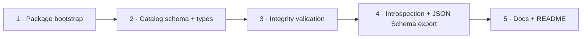

# Implementation Plan: PRD-004 Trusted Catalog

Source: [PRD-004](../prds/prd-004-trusted-catalog.md) · Basis: strategy §5.2 (product-hub doc not present in this repo — see Verification) · Package: new `@ttoss/geovis-catalog`

This is the first of three plans (PRD-004 → PRD-005 → PRD-006) that all land in the same new package, `@ttoss/geovis-catalog`, per each PRD's own "Package: same layer as PRD-004" line. This plan bootstraps the package and ships the catalog contract and its integrity validation; PRD-005's plan adds the intent schema on top, and PRD-006's plan adds the resolver on top of both.

## Durable decisions

### D1 — Schema validation: Ajv + hand-authored JSON Schema, not Zod

The first version of this plan specified the catalog contract as a Zod schema, citing the repo-wide forms rule ("Use Zod for all new form validation schemas"). That rule is scoped to `@ttoss/forms` — **UI form validation** — and is the wrong precedent here: this package's actual sibling, `@ttoss/geovis`, already validates its own AI-facing contract (`VisualizationSpec`) with a hand-authored JSON Schema (`src/spec/schema.json`, draft 2020-12) compiled by `Ajv2020` (`import Ajv2020 from 'ajv/dist/2020'`) in `validateSpec.ts`, with a hand-written TypeScript interface (`VisualizationSpec` in `types.ts`) kept in sync alongside it — no codegen, no runtime-schema-to-type derivation. `@ttoss/geovis-catalog` is the same kind of artifact (a machine-facing data contract, not a UI form), one layer up the same product stack, so it follows the same established pattern:

- `catalog.schema.json` — hand-authored JSON Schema, `$id`/`$schema: 2020-12`/`additionalProperties: false`, styled exactly like `spec/schema.json`.
- `Catalog` — a hand-written TypeScript interface in `types.ts`, kept in sync with the schema by the author (the same manual discipline `@ttoss/geovis` already accepts for `VisualizationSpec`/`schema.json`).
- `Ajv2020` (from the same `ajv` package and import path `@ttoss/geovis` already depends on) compiles and validates it at runtime.

This is a straightforward win over Zod here beyond precedent-matching: since the source of truth is already a JSON Schema document, there is no derivation step (no `zod-to-json-schema`, no `z.toJSONSchema()`) to expose it to an LLM tool schema — `getCatalogJSONSchema()` (D6) just returns the imported document. PRD-005's and PRD-006's plans adopt the same choice for consistency within one package; see each plan's own D1.

`package.json` dependencies: `ajv` (`^8.18.0`, the exact version already pinned by `@ttoss/geovis`) and `@ttoss/geovis` (for `RepairOption` reuse now, and `VisualizationSpec`/`resolveSpecFromMapType` reuse in PRD-006's plan — see that plan's Verification section for a caveat on the latter). No `zod` dependency.

### D2 — Package bootstrap

New package `packages/geovis-catalog`, non-React, modeled on `@ttoss/logger` (the repo's minimal non-UI package): `package.json` with `exports: { ".": "./src/index.ts" }`, `scripts.build = tsdown`, `scripts.test = jest --projects tests/unit`, `type-check` script, `tsdown.config.ts` using `tsdownConfig({ format: ['esm'] })` from `@ttoss/config`, `tests/unit/jest.config.ts` + `tests/tsconfig.json` mirroring `geovis-workspace`'s unit setup (no React/jsdom environment needed — this package has no components), root `tsconfig.json`, `README.md`, `CHANGELOG.md`. No Storybook stories and no `i18n` script: the package has no user-facing text — every string it produces is a machine `code`, translated downstream by `@ttoss/geovis-workspace` (ADR-0003), exactly like `@ttoss/geovis`'s own issue codes today. `tsdown`'s config must tell rolldown to bundle `catalog.schema.json` as a JSON asset (`resolve.json` behavior already default in the tsdown/rolldown toolchain `@ttoss/geovis` uses for its own `schema.json` import — confirm during Phase 1 rather than assume, since `@ttoss/geovis`'s `tsdown.config.ts` takes no extra JSON option and the import already works there today).

### D3 — Result taxonomy: mirrored, not literally reused

`@ttoss/geovis`'s `GeoVisIssue`/`GeoVisResult` (ADR-0001) hardcode a closed `GeoVisIssueCode` union scoped to spec/runtime concerns (`unknown-map-data-id`, `unsupported-layer-type`, …) — none of which describe catalog failures (unknown metric, unknown geography, no join path, ambiguous intent). Generalizing `@ttoss/geovis`'s public type to be generic over the code union is a breaking, cross-package change that no PRD requests. This plan instead defines a **structurally identical, independently-closed** taxonomy local to `@ttoss/geovis-catalog`:

```ts
export type CatalogResultStatus = 'mismatch' | 'invalid';
// 'needs-clarification' is added by PRD-005's plan when intent validation lands;
// the union stays open to that addition by design, matching ADR-0001's own
// "insufficient-data"/"needs-clarification" reserved-but-unused precedent.

export type CatalogIssueCode =
  | 'invalid-catalog-schema' // invalid: fails the JSON Schema (Ajv)
  | 'duplicate-metric-id' // invalid: two metrics share an id
  | 'duplicate-dataset-id'
  | 'duplicate-geography-id'
  | 'unknown-join-dataset' // mismatch: join references a dataset id not in catalog.datasets
  | 'unknown-join-geography' // mismatch: join references a geography id not in catalog.geographies
  | 'unresolvable-join-field'; // mismatch: join.on references a field the dataset/geography doesn't declare

export interface CatalogIssue {
  code: CatalogIssueCode;
  subject: { path: string; id?: string };
  message: string;
  repair?: RepairOption[]; // reused as-is from @ttoss/geovis — already code-agnostic
}

export type CatalogResult =
  | { status: 'valid'; catalog: Catalog }
  | { status: CatalogResultStatus; issues: CatalogIssue[] };
```

"Reporting through the PRD-001 taxonomy" (both PRD-004 and PRD-005's own words) is satisfied by shape-and-vocabulary parity — the same discriminated-union/status/code/subject/message/repair contract — not by importing a union that would have to grow unrelated entries.

### D4 — Catalog schema shape (JSON Schema)

Seeded directly from PRD-004's own field enumeration (metrics, datasets, geographies, joins, units, formatters, time ranges, filters, allowed map types, permissions, aliases, descriptions) and the `Catalog` interface already sketched in [`docs/ai-integration-readiness.md`](../ai-integration-readiness.md) — reused as the shape seed, not redesigned. Authored as `src/schema/catalog.schema.json`, styled like `@ttoss/geovis`'s `spec/schema.json` (`$schema: "https://json-schema.org/draft/2020-12/schema"`, `$id`, `additionalProperties: false`, `$defs` for the repeated sub-shapes):

```json
{
  "$schema": "https://json-schema.org/draft/2020-12/schema",
  "$id": "https://ttoss.dev/geovis-catalog/catalog.schema.json",
  "title": "Catalog",
  "type": "object",
  "additionalProperties": false,
  "required": [
    "version",
    "datasets",
    "metrics",
    "geographies",
    "joins",
    "mapTypes",
    "filters"
  ],
  "properties": {
    "version": { "type": "string" },
    "domain": { "type": "string" },
    "datasets": { "type": "array", "items": { "$ref": "#/$defs/Dataset" } },
    "metrics": { "type": "array", "items": { "$ref": "#/$defs/Metric" } },
    "geographies": {
      "type": "array",
      "items": { "$ref": "#/$defs/Geography" }
    },
    "joins": { "type": "array", "items": { "$ref": "#/$defs/Join" } },
    "mapTypes": {
      "type": "array",
      "items": { "$ref": "#/$defs/MapTypeCatalogEntry" }
    },
    "filters": { "type": "array", "items": { "$ref": "#/$defs/FilterField" } },
    "permissions": { "type": "object" }
  },
  "$defs": {
    "Metric": {
      "type": "object",
      "additionalProperties": false,
      "required": ["id", "label", "description", "kind", "nullPolicy"],
      "properties": {
        "id": { "type": "string" },
        "label": { "type": "string" },
        "description": { "type": "string" },
        "aliases": { "type": "array", "items": { "type": "string" } },
        "unit": { "type": "string" },
        "kind": {
          "type": "string",
          "enum": ["count", "rate", "ratio", "index"]
        },
        "formatter": {
          "type": "string",
          "enum": ["number", "percent", "currency", "compact"]
        },
        "nullPolicy": { "type": "string", "enum": ["hide", "zero", "explain"] }
      }
    },
    "Dataset": {
      "type": "object",
      "additionalProperties": false,
      "required": [
        "id",
        "label",
        "description",
        "geometry",
        "geographyIds",
        "metricIds"
      ],
      "properties": {
        "id": { "type": "string" },
        "label": { "type": "string" },
        "description": { "type": "string" },
        "geometry": { "type": "string", "enum": ["point", "polygon", "line"] },
        "geographyIds": { "type": "array", "items": { "type": "string" } },
        "metricIds": { "type": "array", "items": { "type": "string" } },
        "temporal": {
          "type": "object",
          "additionalProperties": false,
          "required": ["start", "end"],
          "properties": {
            "start": { "type": "string" },
            "end": { "type": "string" }
          }
        }
      }
    },
    "Geography": {
      "type": "object",
      "additionalProperties": false,
      "required": ["id", "label", "description"],
      "properties": {
        "id": { "type": "string" },
        "label": { "type": "string" },
        "description": { "type": "string" },
        "aliases": { "type": "array", "items": { "type": "string" } }
      }
    },
    "Join": {
      "type": "object",
      "additionalProperties": false,
      "required": ["from", "to", "on", "cardinality"],
      "properties": {
        "from": { "type": "string" },
        "to": { "type": "string" },
        "on": {
          "type": "object",
          "additionalProperties": false,
          "required": ["left", "right"],
          "properties": {
            "left": { "type": "string" },
            "right": { "type": "string" }
          }
        },
        "cardinality": { "type": "string", "enum": ["1:1", "1:m"] }
      }
    },
    "FilterField": {
      "type": "object",
      "additionalProperties": false,
      "required": ["field", "kind"],
      "properties": {
        "field": { "type": "string" },
        "kind": {
          "type": "string",
          "enum": ["categorical", "numeric", "temporal"]
        },
        "domain": {}
      }
    },
    "MapTypeCatalogEntry": {
      "type": "object",
      "additionalProperties": false,
      "required": ["name", "supportedGeometries", "metricKinds"],
      "properties": {
        "name": {
          "type": "string",
          "enum": ["choropleth", "dotDensity", "proportionalCircles"]
        },
        "supportedGeometries": {
          "type": "array",
          "items": { "type": "string", "enum": ["point", "polygon", "line"] }
        },
        "metricKinds": {
          "type": "array",
          "items": {
            "type": "string",
            "enum": ["count", "rate", "ratio", "index"]
          }
        }
      }
    }
  }
}
```

`permissions` stays an untyped, unconstrained object (`{ "type": "object" }`, no `properties`) in v1: PRD-004's own open question ("governance: who approves entries, how permissions integrate with application auth") is explicitly product/org work, not a schema-shape blocker — the schema reserves the slot, this plan does not design an authz engine. The matching hand-written interface, in `src/schema/types.ts`:

```ts
export interface Metric {
  id: string;
  label: string;
  description: string;
  aliases?: string[];
  unit?: string;
  kind: 'count' | 'rate' | 'ratio' | 'index';
  formatter?: 'number' | 'percent' | 'currency' | 'compact';
  nullPolicy: 'hide' | 'zero' | 'explain';
}

export interface Dataset {
  id: string;
  label: string;
  description: string;
  geometry: 'point' | 'polygon' | 'line';
  geographyIds: string[];
  metricIds: string[];
  temporal?: { start: string; end: string };
}

export interface Geography {
  id: string;
  label: string;
  description: string;
  aliases?: string[];
}

export interface Join {
  from: string; // dataset id
  to: string; // geography id
  on: { left: string; right: string };
  cardinality: '1:1' | '1:m';
}

export interface FilterField {
  field: string;
  kind: 'categorical' | 'numeric' | 'temporal';
  domain?: unknown;
}

export interface MapTypeCatalogEntry {
  name: 'choropleth' | 'dotDensity' | 'proportionalCircles';
  supportedGeometries: Array<'point' | 'polygon' | 'line'>;
  metricKinds: Array<'count' | 'rate' | 'ratio' | 'index'>;
}

export interface Catalog {
  version: string;
  domain?: string;
  datasets: Dataset[];
  metrics: Metric[];
  geographies: Geography[];
  joins: Join[];
  mapTypes: MapTypeCatalogEntry[];
  filters: FilterField[];
  permissions?: Record<string, unknown>;
}
```

A schema/type parity test (Phase 2) asserts every `Catalog` field the TypeScript interface declares has a matching JSON Schema property — the manual-sync discipline `@ttoss/geovis` accepts implicitly is made explicit and testable here from day one, rather than left to reviewer attention alone.

### D5 — Integrity validation scope

`validateCatalog(input: unknown): CatalogResult` runs, in order, mirroring `validateSpec.ts`'s own structure: (1) `Ajv2020.compile(catalogSchema)` run against `input` → `invalid-catalog-schema`, mapping each Ajv error the same way `validateSpec.ts` already does (`e.instancePath || '(root)'` → `subject.path`, `${path} ${e.message}` → `message`); (2) id-uniqueness checks per collection → `duplicate-*-id`; (3) referential checks — every `join.from`/`join.to` resolves to a known dataset/geography id, every `join.on.left`/`right` names a field the referenced dataset/geography actually declares (datasets/geographies carry no explicit field list in D4's shape beyond `metricIds`/`geographyIds`, so `unresolvable-join-field` is scoped to what's checkable: the join's endpoints exist and the cardinality is one of the two allowed values — full column-level validation against a live warehouse is explicitly the Should-item helper's job, not this Must). No `repair` is computed for `invalid-catalog-schema` (the fix is "correct the input", not a suggerable value); `duplicate-*-id` and `unknown-join-*` issues attach `repair: [{ kind: 'allowed-values', path: ..., values: <the known ids> }]` since the correct set is already in hand — mirroring ADR-0001's own rule that repair values are never invented.

### D6 — Introspection surface

`getCatalogIntrospection(catalog: Catalog)` returns the catalog with any `permissions` field stripped — the curated-metadata contract PRD-004's Must item requires ("never raw data") applies here too: nothing in `Catalog` is raw data (no rows), but `permissions` is the one field that could carry org-internal detail not meant for a model, so introspection omits it by construction rather than trusting every future catalog author to keep it model-safe. `getCatalogJSONSchema()` returns the imported `catalog.schema.json` document as-is — no derivation step, since D1 made the schema itself the source of truth.

## Phases



### Phase 1 — Package bootstrap

Create `packages/geovis-catalog` with the scaffold in D2: `package.json` (with the `ajv`/`@ttoss/geovis` dependencies from D1), `tsdown.config.ts`, `tsconfig.json`, `tests/tsconfig.json`, `tests/unit/jest.config.ts`, empty `src/index.ts`, `README.md` stub, `CHANGELOG.md`. Add the package to root `pnpm-workspace.yaml` coverage (already matched by the `packages/*` glob — no change needed there) and confirm `pnpm install` links it. Confirm a trivial `.json` import builds cleanly through `tsdown` before Phase 2 needs it for real (D2's caveat).

**Demo:** `pnpm turbo run build --filter=@ttoss/geovis-catalog` and `pnpm turbo run test --filter=@ttoss/geovis-catalog` both succeed against an empty package.
**Acceptance:** package builds, tests run (zero tests, zero failures), `pnpm run -w lint` passes with the new package present.

### Phase 2 — Catalog schema and types

Implement `catalog.schema.json` and the `Catalog`/`Metric`/`Dataset`/`Geography`/`Join`/`FilterField`/`MapTypeCatalogEntry` interfaces (D4) in `src/schema/`, exported from `src/index.ts`. One fixture catalog (`tests/unit/fixtures/sampleCatalog.ts`) covering every field, used by this phase's and later phases' tests.

**Demo:** `new Ajv2020({ strict: false }).compile(catalogSchema)(sampleCatalog)` succeeds; a deliberately malformed fixture (missing required field) fails with an Ajv error pointing at the missing field.
**Acceptance:** one test per field group (metrics, datasets, geographies, joins, mapTypes, filters, permissions-optionality); `Catalog` type exported from `src/index.ts`; a schema/type parity test asserts the JSON Schema and the hand-written interface declare the same field set (D4); public-contract test (mirroring `@ttoss/geovis`'s `publicContract.test.ts` pattern) locks the export surface.

### Phase 3 — Integrity validation and the catalog result taxonomy

Implement `CatalogResult`/`CatalogIssue`/`CatalogIssueCode` (D3) and `validateCatalog` (D5) in `src/validateCatalog.ts`.

**Demo:** the sample fixture validates to `{ status: 'valid' }`; a fixture with a duplicate metric id returns `{ status: 'invalid', issues: [{ code: 'duplicate-metric-id', repair: [...] }] }`; a fixture whose join references a non-existent geography returns `{ status: 'mismatch', issues: [{ code: 'unknown-join-geography', repair: [{ kind: 'allowed-values', values: [...] }] }] }`.
**Acceptance:** one fixture and one test per `CatalogIssueCode`; `resolveOverallStatus`-equivalent precedence (`invalid` over `mismatch` when both present) tested; no `repair` computed for `invalid-catalog-schema`.

### Phase 4 — Introspection surface and JSON Schema export

Implement `getCatalogIntrospection` and `getCatalogJSONSchema` (D6), both exported from `src/index.ts`.

**Demo:** `getCatalogIntrospection(catalogWithPermissions)` returns a catalog with no `permissions` key; `getCatalogJSONSchema()` returns an object reference-equal (or deep-equal) to the imported `catalog.schema.json`.
**Acceptance:** test asserts `permissions` is absent from introspection output even when present on input; a snapshot test on `getCatalogJSONSchema()`'s output guards against accidental schema drift.

### Phase 5 — Docs and package workflow close-out

Write `README.md` (catalog contract field tables, `validateCatalog` usage, `getCatalogIntrospection`/`getCatalogJSONSchema` examples — following `@ttoss/geovis`'s README as the reference style for field-table documentation). Set `tests/unit/jest.config.ts` `coverageThreshold` to the final measured coverage (0.01–0.1% below actual).

**Demo:** README's examples are copy-pasteable and run against the fixture catalog.
**Acceptance:** `pnpm turbo run test --filter=...@ttoss/geovis-catalog` and `pnpm turbo run build --filter=...@ttoss/geovis-catalog` green; coverage threshold set; `pnpm run -w lint` clean.

## Sequencing notes

Phase 1 is the entry gate — nothing else can be written until the package exists. Phase 2 depends only on Phase 1. Phase 3 depends on Phase 2's types and fixture. Phase 4 depends on Phase 2 (schema) but not Phase 3 — could run in parallel with it if split across two people; kept sequential here since one person authoring both keeps the fixture reuse simple. Phase 5 runs last per the standard package workflow (tests → dependents → build → coverage → README). Each phase is one PR.

This plan's package (`@ttoss/geovis-catalog`) and its exports (`Catalog`, `catalogSchema`, `CatalogResult`, `validateCatalog`, `getCatalogIntrospection`, `getCatalogJSONSchema`) are the foundation PRD-005's plan builds the intent schema on top of, and PRD-006's plan builds the resolver on top of both.

## Open questions carried forward (not resolved by this plan)

- **Catalog governance** (PRD-004's own open question): who approves catalog entries and how `permissions` integrates with application auth is explicitly out of scope — the schema reserves an opaque slot (D4) and this plan does not design an authorization system.
- The strategy document (`docs/website/docs/product/geovis/strategy.md`) referenced by this PRD, the roadmap, and every ADR does not exist in this repository (see Verification below). This plan proceeded from the PRD's own self-contained requirements text, which is sufficient to implement against, but strategy §5.2's full rationale is unavailable for cross-check.

## Verification against current codebase (2026-07-22)

- No `packages/geovis-catalog` directory exists yet — this plan starts from nothing, unlike PRD-001/002/003 whose plans re-derived against partially-built code.
- `packages/geovis/src/spec/validateSpec.ts` and `packages/geovis/src/spec/schema.json` confirm the actual established pattern in this product family is Ajv + hand-authored JSON Schema, not Zod — `ajv@^8.18.0` (`Ajv2020` from `ajv/dist/2020`) is a plain `dependencies` entry in `packages/geovis/package.json`, not a devDependency, so `@ttoss/geovis-catalog` matches that by depending on `ajv` at runtime too, not `zod`. The repo's "use Zod for new schemas" rule (`.github/instructions/forms.instructions.md` / CLAUDE.md) is scoped to `@ttoss/forms`-style UI form validation and does not extend to this data-contract package — D1 documents why the closer, package-family precedent wins here.
- `packages/geovis/docs/ai-integration-readiness.md`'s `Catalog` interface (lines ~466–519) is the closest existing artifact to a catalog shape and was used as the seed for D4.
- `packages/geovis/src/spec/result.ts` confirms `GeoVisIssueCode` is a hardcoded closed union (not generic), which is why D3 mirrors rather than reuses it.
- `docs/website/docs/product/geovis/` does not exist — the strategy document every PRD/ADR links to is missing from the repo. Flagged to the user; does not block this plan since the PRD text is self-contained.
