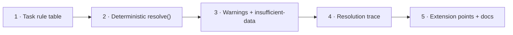

# Implementation Plan: PRD-006 Deterministic Resolution

Source: [PRD-006](../prds/prd-006-deterministic-resolution.md) · Basis: strategy §5.3, §12 (product-hub doc not present in this repo) · Package: `@ttoss/geovis-catalog` (same package as [PRD-004's plan](./plan-prd-004-trusted-catalog.md) and [PRD-005's plan](./plan-prd-005-constrained-intent.md), both of which must land first)

## Durable decisions

### D1 — `resolve()` needs a third input the PRD's own signature omits: the data itself

PRD-006's Outcome states `resolve(intent, catalog)` returns "a renderable spec" — but PRD-004 explicitly excludes runtime data fetching from the catalog ("Won't: … runtime data fetching"), and `@ttoss/geovis`'s own `resolveSpecFromMapType` (the reuse target this PRD names) only fills layers/legends from a `VisualizationSpec` whose `mapData[].data` **already holds real feature values** — it never fetches anything itself. Two deterministic functions cannot conjure data neither of them is allowed to fetch. This is the one gap in the PRD's own text that must be closed before this plan is buildable, and the fix is additive to the signature, not a redesign:

```ts
export const resolve = (
  intent: AnalyticalIntent,
  catalog: Catalog,
  data: MapDataRow[] // caller-supplied rows for the resolved dataset+metric+geography; @ttoss/geovis's existing MapDataRow shape, reused as-is
): ResolveResult => {
  /* ... */
};
```

The application remains the sole owner of data access (matching the strategy's "model never sees raw data" principle one level further: the _resolver_ doesn't see raw data either, until the caller who already has read access hands over exactly the rows the resolved intent asked for). `resolve()` stays a pure function: same `(intent, catalog, data)` in, same `ResolveResult` out, no I/O — which is what "deterministic" in the PRD's title actually requires; a version that fetched data itself could not make that claim.

### D2 — Task → map-type/legend/warning rules, encoded as a lookup table

PRD-006's Must item requires each of PRD-005's seven analytical tasks to have "expected metric kind, geography, map type, legend, and warnings" and to be "encoded and testable". A plain data table (not a class hierarchy — there is no per-task behavior beyond these five fields) keeps the rules inspectable and matches the flat, declarative style `@ttoss/geovis`'s own `mapTypeDefaults/*.ts` modules already use:

```ts
interface TaskRule {
  task: AnalyticalTask;
  allowedMetricKinds: MetricKind[]; // e.g. distribution allows all kinds; ranking/comparison too; change-over-time requires a temporal dataset
  mapType: 'choropleth' | 'dotDensity' | 'proportionalCircles';
  legendHint: 'quantitative' | 'categorical' | 'proportional';
  warnOn: Array<'sparse-data' | 'missing-temporal-range' | 'small-sample'>;
}

export const TASK_RULES: Record<AnalyticalTask, TaskRule> = {
  distribution: { mapType: 'choropleth', legendHint: 'quantitative', ... },
  comparison: { mapType: 'choropleth', legendHint: 'quantitative', ... },
  ranking: { mapType: 'proportionalCircles', legendHint: 'proportional', ... },
  'change-over-time': { mapType: 'choropleth', legendHint: 'quantitative', warnOn: ['missing-temporal-range'], ... },
  'outlier-detection': { mapType: 'choropleth', legendHint: 'quantitative', warnOn: ['small-sample'], ... },
  'feature-lookup': { mapType: 'dotDensity', legendHint: 'categorical', ... },
  coverage: { mapType: 'dotDensity', legendHint: 'categorical', warnOn: ['sparse-data'], ... },
};
```

Concrete `allowedMetricKinds`/`warnOn` thresholds are a product-judgment detail filled in during implementation (this plan fixes the _shape_ of the table and that it is exhaustive over all seven tasks — the specific values are a Phase-2 acceptance item, reviewed against the fixture catalog rather than decided abstractly here).

### D3 — Extension points: a registry, not a fork

Resolves PRD-006's first open question. `TASK_RULES` (D2) is the built-in, closed core; applications needing a rule the core doesn't have register additional ones through a config object rather than by forking the resolver:

```ts
export const resolve = (
  intent: AnalyticalIntent,
  catalog: Catalog,
  data: MapDataRow[],
  options?: { extraTaskRules?: Partial<Record<AnalyticalTask, TaskRule>> }
): ResolveResult => {
  /* extraTaskRules, when given, override the matching built-in entry for that call only — no global mutable registry, so concurrent resolve() calls with different options never interfere */
};
```

This is deliberately narrower than a plugin system: it lets an application override _values_ in the existing five-field table (e.g. its own `mapType` preference for `ranking`), not add new tasks or new rule dimensions — new tasks are `AnalyticalIntent`/`AnalyticalTask` schema changes (PRD-005), out of this plan's scope.

### D4 — Client vs. server execution

Resolves PRD-006's second open question. `resolve()` (D1) takes `data: MapDataRow[]` as a plain argument and does no I/O of its own — it is equally valid to call from a server (with `data` fetched from a warehouse) or a browser (with `data` already in memory), and large-catalog scaling is a `Catalog`-introspection concern PRD-004 already owns (paginating/filtering `getCatalogIntrospection`'s output), not something the resolver needs to special-case. No decision is needed beyond confirming the function stays side-effect-free — which D1 already establishes.

### D5 — Result shape and resolution trace

```ts
export type ResolveResultStatus = IntentResultStatus | 'insufficient-data';
// 'insufficient-data' is the one CatalogResultStatus-family member neither
// PRD-004 nor PRD-005's plans needed — it belongs here: a join and intent can
// be fully valid and still produce zero usable rows once `data` is filtered.

export interface ResolutionTraceEntry {
  decision: string; // e.g. 'mapType', 'legend', 'joinedDataset'
  choice: string;
  reason: string;
}

export type ResolveResult =
  | {
      status: 'resolved';
      spec: VisualizationSpec;
      warnings: CatalogIssue[];
      trace: ResolutionTraceEntry[]; // Should item: exposed via spec.metadata, feeds the explain mode (ADR-0004's context packet, consumed one layer up by the application)
    }
  | { status: ResolveResultStatus; issues: CatalogIssue[] };
```

`trace` is attached under `spec.metadata` (an existing free-form field on `VisualizationSpec` — confirmed against `packages/geovis/src/spec/types.ts`) rather than as a new top-level `VisualizationSpec` field, so this plan needs no `@ttoss/geovis` schema change to ship the Should item.

## Phases



### Phase 1 — Task rule table

Implement `TaskRule`/`TASK_RULES` (D2) in `src/resolve/taskRules.ts`, with concrete values for all seven tasks reviewed against PRD-004 plan's sample catalog and PRD-005 plan's seven task fixtures.

**Demo:** `TASK_RULES.ranking.mapType === 'proportionalCircles'`; a table-completeness test iterates `AnalyticalTask` and asserts every value has an entry.
**Acceptance:** one test per task confirming its rule's `mapType`/`legendHint` are one of `@ttoss/geovis`'s valid enum values (compile-time via shared types, runtime via a fixture-backed test).

### Phase 2 — Deterministic `resolve()`, happy path

Implement `resolve(intent, catalog, data)` (D1) in `src/resolve/resolve.ts`: validates via `validateIntent` (reusing PRD-005 plan's function — a `resolve()` call on an already-invalid intent short-circuits to that same `IntentResult` failure, no duplicate validation logic), looks up the task rule, builds a minimal `VisualizationSpec` (`mapType`, one `mapData` entry from `data`, engine defaulted to `maplibre`), and calls `resolveSpecFromMapType` (reused directly from `@ttoss/geovis`) to fill layers/legends — this is the "encoding seed" reuse PRD-006's Must item names explicitly.

**Demo:** a valid `distribution` intent against the sample catalog and a small `data` fixture produces `{ status: 'resolved', spec }` whose `spec.mapType === 'choropleth'` and whose legend matches `TASK_RULES.distribution.legendHint`.
**Acceptance:** one end-to-end fixture per task (seven total) producing a `resolved` result with the rule-mandated `mapType`; every `IntentResult` failure status from PRD-005's plan (`invalid`, `mismatch`, `needs-clarification`) is confirmed to pass through `resolve()` unchanged, proving no duplicate validation.

### Phase 3 — Warnings and `insufficient-data`

Implement `warnOn` rule application (D2) and the `insufficient-data` status (D5) for the case where `data` is empty or every row fails the join key.

**Demo:** a `coverage`-task intent with a `data` array of one row (below the `sparse-data` threshold) resolves with `status: 'resolved'` but a non-empty `warnings` array; a `data` array with zero matching rows for the resolved geography returns `{ status: 'insufficient-data', issues: [...] }`.
**Acceptance:** one fixture and test per `warnOn` category actually populated in Phase 1's table; `insufficient-data` never coexists with a `spec` (matches ADR-0001's "nothing renders on failure" contract, reused here at the resolver layer).

### Phase 4 — Resolution trace

Implement `ResolutionTraceEntry`/`trace` (D5), populated with one entry per decision `resolve()` makes: task-rule lookup, dataset join selection (surfacing PRD-005's `datasetId` resolution when it was inferred rather than supplied), map-type choice, legend choice.

**Demo:** `result.spec.metadata.trace` for a `distribution` intent lists at least a `'mapType'` and a `'joinedDataset'` entry, each with a human-readable `reason`.
**Acceptance:** every Phase 2 fixture's resolved result has a non-empty `trace`; trace entries never reference raw `data` values (metadata/decisions only, consistent with the packet's metadata-only rule from `@ttoss/geovis` ADR-0004).

### Phase 5 — Extension points and docs

Implement `options.extraTaskRules` (D3). Update `README.md` with `resolve()`'s full signature, one worked example per task, the extension-point override example, and a note on client/server neutrality (D4). Update `coverageThreshold`.

**Demo:** calling `resolve(intent, catalog, data, { extraTaskRules: { ranking: { ...override, mapType: 'choropleth' } } })` produces a choropleth instead of the built-in proportional-circles default for that one call, while a concurrent call without `options` still gets the built-in rule.
**Acceptance:** override is call-scoped (a second `resolve()` call without `options` is unaffected by a prior call's override — test asserts no shared mutable state); `pnpm turbo run test --filter=...@ttoss/geovis-catalog` and `pnpm turbo run build --filter=...@ttoss/geovis-catalog` green; `pnpm run -w lint` clean.

## Sequencing notes

This plan cannot start until PRD-004's plan ships `Catalog`/`validateCatalog` and PRD-005's plan ships `AnalyticalIntent`/`validateIntent` — Phase 2 here calls `validateIntent` directly and Phase 1's task-rule review uses both prior plans' fixtures. Phase 1 has no runtime dependency on Phase 2 and could be drafted in parallel with PRD-005's later phases, but is sequenced here for a single implementer. Phase 2 depends on Phase 1 (needs the table) and both prior plans (needs `validateIntent`/`Catalog`). Phase 3 depends on Phase 2. Phase 4 depends on Phase 2 (could run parallel to Phase 3 — both extend `resolve()`'s output independently — but is sequenced after Phase 3 here since the warnings and trace tests share the same fixture set and are easiest to review together). Phase 5 depends on Phases 1–4. Each phase is one PR.

R4's exit criterion ("an AI can only reference catalog entries; the resolver produces a valid map or a structured failure — never a guess") is met once this plan's Phase 3 ships: Phases 4–5 are the Should item and hardening, not gating.

## Open questions carried forward (not resolved by this plan)

- Concrete `allowedMetricKinds`/`warnOn` threshold values in `TASK_RULES` are left as a Phase-1 implementation-time judgment call, reviewed against real fixtures rather than fixed in this planning document.
- The strategy document (`docs/website/docs/product/geovis/strategy.md`) is absent from the repo (see PRD-004 plan's Verification section) — strategy §5.3 and §12's full rationale for task-rule specifics is unavailable beyond what PRD-006's own text states.
- PRD-007 (Evaluation Suite) is the consumer that will exercise `resolve()`'s resolver-success and zero-guess-rate metrics; this plan does not build any eval harness itself (out of scope per PRD-006's own Won't and PRD-007's separate PRD).

## Verification against current codebase (2026-07-21)

- Depends on `packages/geovis-catalog` shipping both prior plans' exports (`Catalog`, `CatalogIssue`, `validateCatalog`, `AnalyticalIntent`, `IntentResult`, `validateIntent`) — none of this exists until those plans land.
- `packages/geovis/src/spec/mapTypeDefaults.ts`'s `resolveSpecFromMapType(spec: VisualizationSpec): VisualizationSpec` confirmed as a pure function operating on a spec whose `mapData[].data` already holds real values — it does not fetch data, which is why D1 adds a `data` parameter to this plan's `resolve()` rather than matching PRD-006's literal two-argument text.
- `packages/geovis/src/spec/types.ts`'s `MapData.data: MapDataRow[]` and `VisualizationSpec`'s free-form `metadata` field (used by D5's `trace`) confirmed present, so no `@ttoss/geovis` type changes are required by this plan.
