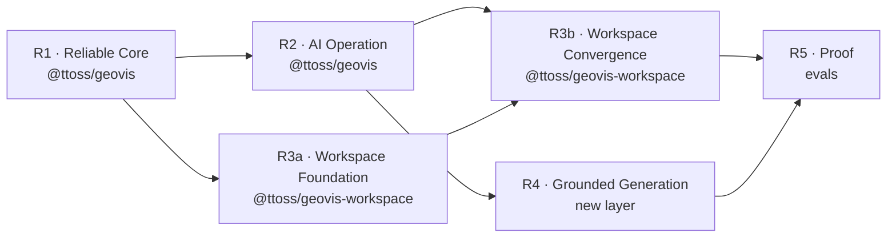

# GeoVis Roadmap

Delivery plan for the [strategy](./strategy.md)'s capabilities across packages, ordered by highest initial return at lowest complexity: each phase makes the previous one more valuable and unlocks the next. Dates are deliberately absent — sequencing is the commitment, scheduling belongs to the team's planning cycle.

## Where we are

`@ttoss/geovis` renders validated specs (choropleth, dot density, proportional circles) with MapLibre, patches them incrementally, and enforces one cartography policy. `@ttoss/geovis-workspace` provides the layout shell (sidebars, provider, context). Everything AI-facing — structured errors, enforced capabilities, semantic actions, context packet, catalog, intent, resolution, evals — is designed ([GeoVis ADRs 0001–0004](https://github.com/ttoss/ttoss/tree/main/packages/geovis/docs/adr), [workspace ADRs 0001–0004](https://github.com/ttoss/ttoss/tree/main/packages/geovis-workspace/docs/adr), [research](./research/)) but not built.

## R1 — Reliable Core

Failures become structured and capabilities become honest. This is the foundation every later phase reports through.

| Deliverable                                               | Package         | Basis                |
| --------------------------------------------------------- | --------------- | -------------------- |
| Typed, repairable result taxonomy replacing string errors | `@ttoss/geovis` | ADR-0001             |
| `CapabilitySet` enforced by validation, declared = tested | `@ttoss/geovis` | ADR-0002             |
| Spec schema versioning                                    | `@ttoss/geovis` | ADR-0001 consequence |

ADR-0001 and ADR-0002 are **unconditionally essential**: [PRD-001](./prds/prd-001-repairable-errors.md) names their acceptance as its entry gate, they fix defects that exist regardless of AI (string errors block the repair loop; `CapabilitySet` is dead code while unsupported specs render partially), and every later phase depends on them — actions (R2), workspace error surfacing (R3), and the resolver (R4) all report through the result taxonomy and validate against the capability tree, and evals (R5) count its failure categories.

Exit criteria: no code path fails silently; a spec requesting an unsupported capability is rejected before mount with repair options.

## R2 — AI Operation

An existing map becomes steerable and explainable by AI at bounded cost.

| Deliverable                                          | Package         | Basis    |
| ---------------------------------------------------- | --------------- | -------- |
| Semantic action vocabulary with `dispatch()`         | `@ttoss/geovis` | ADR-0003 |
| Context packet (`getContextPacket()`), metadata-only | `@ttoss/geovis` | ADR-0004 |
| React hooks migrated to dispatch the same actions    | `@ttoss/geovis` | ADR-0003 |

ADR-0003 and ADR-0004 are additive rather than corrective — `dispatch()` compiles to the existing `SpecPatch`/`update` mechanisms and the packet is a derived artifact, so the library operates without them. They are **essential conditional on the AI-native path**: [PRD-002](./prds/prd-002-ai-operation-surface.md) makes them mandatory from R2 onward, since this phase's and R3b's exit criteria depend on them and R5 measures what they produce (logged actions, packet token cost).

Exit criteria: an LLM can change metric, filter, layer, selection, and view through validated actions and explain the map from the packet — without reading the full spec.

## R3 — Human Workspace

The workspace becomes the default human surface for GeoVis maps, converging with AI steering on the same actions. It splits into two stages because their dependencies differ: the foundation needs only R1's taxonomy and runs **in parallel with R2** (different package, no shared code), while convergence needs R2's action surface.

### R3a — Foundation (parallel with R2)

| Deliverable                                                                    | Package                   | Basis                                                                                                                                           |
| ------------------------------------------------------------------------------ | ------------------------- | ----------------------------------------------------------------------------------------------------------------------------------------------- |
| `GeoVisProvider` hoisted; panels derive from the runtime; config = layout only | `@ttoss/geovis-workspace` | [Workspace ADR-0001](https://github.com/ttoss/ttoss/blob/main/packages/geovis-workspace/docs/adr/0001-runtime-derived-panels.md)                |
| Named slots with runtime-bound, overridable default panels                     | `@ttoss/geovis-workspace` | [Workspace ADR-0002](https://github.com/ttoss/ttoss/blob/main/packages/geovis-workspace/docs/adr/0002-slot-based-composition.md)                |
| R1 taxonomy rendered as a repair surface (code-keyed i18n, repair affordances) | `@ttoss/geovis-workspace` | [Workspace ADR-0003](https://github.com/ttoss/ttoss/blob/main/packages/geovis-workspace/docs/adr/0003-structured-failures-as-repair-surface.md) |

### R3b — Convergence (after R2)

| Deliverable                                                            | Package                   | Basis                                                                                                                               |
| ---------------------------------------------------------------------- | ------------------------- | ----------------------------------------------------------------------------------------------------------------------------------- |
| Workspace controls compile to R2 semantic actions; action log surfaced | `@ttoss/geovis-workspace` | [Workspace ADR-0004](https://github.com/ttoss/ttoss/blob/main/packages/geovis-workspace/docs/adr/0004-semantic-action-mutations.md) |

Workspace ADR-0001 is **unconditionally essential**: it fixes drift that exists today (hand-authored legend config duplicating resolved state; the provider mounted below the layout, blocking any runtime-bound panel), and every other workspace deliverable renders through it. ADR-0002 and ADR-0003 are essential to [PRD-003](./prds/prd-003-human-workspace.md)'s exit criteria — embed without rebuilding, no dead-end failures. ADR-0004 is **essential conditional on the AI-native path**, the same class as GeoVis ADR-0003/0004: [PRD-008](./prds/prd-008-workspace-ai-convergence.md) makes it mandatory once R2 ships.

Exit criteria — R3a: an application embeds the workspace without rebuilding common map UI, and no failure is invisible. R3b: every UI mutation is a logged semantic action identical to its AI equivalent.

## R4 — Grounded Generation

Natural language becomes a validated map through catalog and deterministic resolution. This layer is new — its PRDs decide whether it lands in existing packages or a new one (e.g. `@ttoss/geovis-catalog`).

| Deliverable                                                 | Package   | Basis         |
| ----------------------------------------------------------- | --------- | ------------- |
| Catalog contract (metrics, geographies, joins, permissions) | new layer | Strategy §5.2 |
| Constrained intent schema                                   | new layer | Strategy §5.1 |
| Deterministic resolver: intent → validated spec             | new layer | Strategy §5.3 |

Exit criteria: an AI can only reference catalog entries; the resolver produces a valid map or a structured failure — never a guess.

## R5 — Proof

Quality stops being asserted and starts being measured.

| Deliverable                                        | Package    | Basis        |
| -------------------------------------------------- | ---------- | ------------ |
| Eval suite for generate / steer / explain / repair | repo-level | Strategy §13 |
| Token cost and repair-success tracking per mode    | repo-level | Strategy §13 |

Exit criteria: the strategy's readiness question — "the right map, cheaply, safely, with a recoverable failure path" — has numbers.

## Capability coverage

| Strategy capability         | Phase                     | PRD                                                   |
| --------------------------- | ------------------------- | ----------------------------------------------------- |
| 7. Repairable errors        | R1                        | [PRD-001](./prds/prd-001-repairable-errors.md)        |
| 4. Renderable map document  | shipped (hardening in R1) | —                                                     |
| 6. AI operation surface     | R2                        | [PRD-002](./prds/prd-002-ai-operation-surface.md)     |
| 5. Human workspace          | R3a                       | [PRD-003](./prds/prd-003-human-workspace.md)          |
| Human/AI convergence (§8)   | R3b                       | [PRD-008](./prds/prd-008-workspace-ai-convergence.md) |
| 2. Trusted catalog          | R4                        | [PRD-004](./prds/prd-004-trusted-catalog.md)          |
| 1. Constrained map intent   | R4                        | [PRD-005](./prds/prd-005-constrained-intent.md)       |
| 3. Deterministic resolution | R4                        | [PRD-006](./prds/prd-006-deterministic-resolution.md) |
| Evaluation (strategy §13)   | R5                        | [PRD-007](./prds/prd-007-evaluation-suite.md)         |
