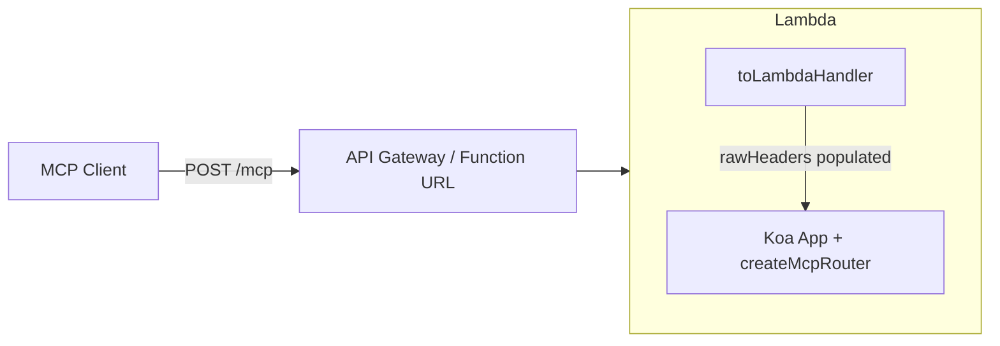

# @ttoss/http-server-mcp

[Model Context Protocol (MCP)](https://modelcontextprotocol.io) server integration for [@ttoss/http-server](https://ttoss.dev/docs/modules/packages/http-server).

## Installation

```bash
pnpm add @ttoss/http-server-mcp
```

## Quick Start

```typescript
import { App, bodyParser, cors } from '@ttoss/http-server';
import { createMcpRouter, McpServer, z } from '@ttoss/http-server-mcp';

// Create MCP server
const mcpServer = new McpServer({
  name: 'my-mcp-server',
  version: '1.0.0',
});

// Register tools
mcpServer.registerTool(
  'get-weather',
  {
    description: 'Get weather information for a location',
    inputSchema: {
      location: z.string().describe('City name'),
    },
  },
  async ({ location }) => ({
    content: [
      {
        type: 'text',
        text: `Weather in ${location}: Sunny, 72°F`,
      },
    ],
  })
);

// Create HTTP server
const app = new App();
app.use(cors());
app.use(bodyParser());

// Mount MCP router
const mcpRouter = createMcpRouter(mcpServer);
app.use(mcpRouter.routes());

app.listen(3000, () => {
  console.log('MCP server running on http://localhost:3000/mcp');
});
```

## `apiCall` — Generic HTTP Helper

`apiCall` is a generic HTTP helper for use inside MCP tool handlers. It works with any URL — your own REST API, third-party APIs, public APIs, or services using `x-api-key` or any other header scheme.

Use `getApiHeaders` in `createMcpRouter` to configure which headers from the incoming MCP request are automatically forwarded to every `apiCall`. Tool handlers stay clean and auth-agnostic.

### Bearer token forwarding

```typescript
import { apiCall, createMcpRouter, McpServer } from '@ttoss/http-server-mcp';

const mcpServer = new McpServer({ name: 'my-server', version: '1.0.0' });

mcpServer.registerTool(
  'list-portfolios',
  { description: 'List all portfolios', inputSchema: {} },
  async () => {
    // Bearer token is forwarded automatically — no manual wiring
    const data = await apiCall('GET', '/portfolios');
    return { content: [{ type: 'text', text: JSON.stringify(data) }] };
  }
);

const mcpRouter = createMcpRouter(mcpServer, {
  apiBaseUrl: `http://localhost:${process.env.PORT}/api/v1`,
  // Extract the caller's Bearer token and inject it into every apiCall
  getApiHeaders: (ctx) => ({ Authorization: ctx.headers.authorization ?? '' }),
});
```

### x-api-key forwarding

```typescript
const mcpRouter = createMcpRouter(mcpServer, {
  apiBaseUrl: 'https://internal-service/api',
  getApiHeaders: (ctx) => ({
    'x-api-key': ctx.headers['x-api-key'] as string,
  }),
});
```

### Third-party or public APIs (full URL, no context required)

```typescript
mcpServer.registerTool(
  'get-rates',
  { description: 'Currency rates', inputSchema: {} },
  async () => {
    // Full URL — works entirely outside any context
    const rates = await apiCall('GET', 'https://api.exchangerate.host/latest');
    return { content: [{ type: 'text', text: JSON.stringify(rates) }] };
  }
);
```

### POST with a body

```typescript
const result = await apiCall('POST', '/portfolios', {
  body: { name: 'Growth Fund' },
});
```

### Per-call header override

```typescript
// Context-injected headers are merged; per-call headers take precedence
const data = await apiCall('GET', 'https://partner.api.com/data', {
  headers: { Authorization: 'Bearer fixed-service-token' },
});
```

`apiCall` throws with a clear message when called with a relative path and no `apiBaseUrl` is configured in the context.

## Authentication

`createMcpRouter` supports OAuth 2.0 Bearer token authentication via the `auth` option. Incoming MCP requests must include a valid `Authorization: Bearer <token>` header — invalid or missing tokens receive a `401 Unauthorized` response. The MCP lifecycle methods `initialize` and `tools/list` are exempt by default so clients can discover the server before authenticating (see [Public methods and discovery](#public-methods-and-discovery)).

```mermaid
sequenceDiagram
    participant Client
    participant MCP Server
    participant Verifier

    Client->>MCP Server: POST /mcp + Authorization: Bearer &lt;token&gt;
    MCP Server->>Verifier: verify(token)
    alt valid token
        Verifier-->>MCP Server: identity payload
        MCP Server->>MCP Server: run tool (identity available via getIdentity())
        MCP Server-->>Client: 200 OK
    else invalid or missing token
        Verifier-->>MCP Server: error
        MCP Server-->>Client: 401 Unauthorized
    end
```

### Amazon Cognito

Pass `cognitoUserPool` and the router creates a `CognitoJwtVerifier` (from `@ttoss/auth-core`) internally:

```typescript
import { createMcpRouter, McpServer } from '@ttoss/http-server-mcp';

const mcpRouter = createMcpRouter(mcpServer, {
  auth: {
    cognitoUserPool: {
      userPoolId: process.env.COGNITO_USER_POOL_ID!,
      clientId: process.env.COGNITO_CLIENT_ID!,
      tokenUse: 'access', // default
    },
  },
});
```

### Custom verifier

Pass an async `verifyToken` function for any provider — JWT-based or opaque. The contract is simply: resolve with an identity payload on success, or throw on failure.

```typescript
import { createMcpRouter } from '@ttoss/http-server-mcp';
import { jwtVerify, createRemoteJWKSet } from 'jose';

const JWKS = createRemoteJWKSet(
  new URL('https://your-auth-server/.well-known/jwks.json')
);

const mcpRouter = createMcpRouter(mcpServer, {
  auth: {
    verifyToken: async (token) => {
      const { payload } = await jwtVerify(token, JWKS);
      return payload;
    },
  },
});
```

**Opaque token (database lookup):** `verifyToken` does not have to be JWT-based — a plain API-key lookup works equally well:

```typescript
const mcpRouter = createMcpRouter(mcpServer, {
  auth: {
    verifyToken: async (token) => {
      // Look up the hashed token in your database
      const record = await db.apiKeys.findByHash(sha256(token));
      if (!record || record.revokedAt) {
        throw new Error('Invalid API key');
      }
      return { sub: record.userId, scope: record.scopes.join(' ') };
    },
  },
});
```

The router emits `401 Unauthorized` whenever `verifyToken` throws, regardless of whether you are using JWTs or opaque tokens.

### Accessing the verified identity

Inside any tool handler, call `getIdentity()` to retrieve the verified JWT payload:

```typescript
import {
  getIdentity,
  createMcpRouter,
  McpServer,
} from '@ttoss/http-server-mcp';

mcpServer.registerTool(
  'get-profile',
  { description: "Return the caller's profile", inputSchema: {} },
  async () => {
    const identity = getIdentity<{ sub: string; email: string }>();
    return {
      content: [{ type: 'text', text: `Hello, ${identity?.email}` }],
    };
  }
);
```

### Scope enforcement

Scopes can be enforced at two levels.

**Router-level** — gate the entire MCP endpoint. Any token missing a required scope receives a `403 Forbidden` before any tool runs:

```typescript
createMcpRouter(mcpServer, {
  auth: {
    cognitoUserPool: { userPoolId: '...', clientId: '...' },
    requiredScopes: ['mcp:access'],
  },
});
```

**Per-tool** — use `checkScopes()` inside individual handlers for fine-grained control. It throws an error that the MCP SDK returns as a tool error to the client:

```typescript
import { checkScopes, getIdentity } from '@ttoss/http-server-mcp';

mcpServer.registerTool(
  'delete-user',
  { description: 'Delete a user', inputSchema: { userId: z.string() } },
  async ({ userId }) => {
    checkScopes(['admin', 'write:users']); // throws if either scope is missing

    const identity = getIdentity<{ sub: string }>();
    // proceed with deletion...
    return { content: [{ type: 'text', text: `Deleted ${userId}` }] };
  }
);
```

Cognito encodes scopes as a space-separated string in `payload.scope` (e.g. `"openid mcp:access admin"`).

### OAuth Protected Resource Metadata

MCP clients (Claude, Cursor, etc.) fetch `/.well-known/oauth-protected-resource` to discover which authorization server issues tokens for your MCP server. The endpoint must be **unauthenticated** — MCP clients call it before they have a token.

**With the built-in `auth` option** — add `resourceServerUrl` and `authorizationServerUrl`:

```typescript
createMcpRouter(mcpServer, {
  auth: {
    cognitoUserPool: { userPoolId: '...', clientId: '...' },
    resourceServerUrl: 'https://mcp.example.com',
    authorizationServerUrl:
      'https://cognito-idp.us-east-1.amazonaws.com/us-east-1_xxx',
  },
});
```

The `resource` field in the metadata document is automatically set to `resourceServerUrl + path` (e.g. `https://mcp.example.com/mcp` for the default path). This means MCP clients that follow `resource` to connect will land on the actual MCP endpoint rather than the bare origin.

**With your own auth middleware** — use `createProtectedResourceMetadataMiddleware` as a standalone middleware, mounted _before_ your auth layer so discovery stays unauthenticated:

```typescript
import {
  createProtectedResourceMetadataMiddleware,
  getWwwAuthenticateHeader,
} from '@ttoss/http-server-mcp';

// Mount the discovery endpoint before your own auth middleware
app.use(
  createProtectedResourceMetadataMiddleware({
    resource: 'https://mcp.example.com',
    authorizationServers: ['https://api.example.com'],
  })
);

// Your own auth middleware — emit the spec-compliant WWW-Authenticate header on 401s
app.use(async (ctx, next) => {
  const token = ctx.headers.authorization?.replace('Bearer ', '');
  if (!token || !(await myVerify(token))) {
    ctx.status = 401;
    ctx.set(
      'WWW-Authenticate',
      getWwwAuthenticateHeader({ resource: 'https://mcp.example.com' })
    );
    ctx.body = 'Unauthorized';
    return;
  }
  await next();
});

app.use(createMcpRouter(mcpServer).routes());
```

The `WWW-Authenticate: Bearer resource_metadata="…"` header is how MCP clients bootstrap OAuth discovery after their first unauthorized request.

### Public methods and discovery

The two behaviors the [MCP authorization spec](https://spec.modelcontextprotocol.io/specification/2025-03-26/basic/authorization/) requires for client bootstrapping are built into the `auth` option, so you no longer need the hand-rolled middleware shown above:

- **`publicMethods`** — JSON-RPC methods that bypass verification, read from the request body's `method` field. Defaults to `['initialize', 'tools/list']` so clients can discover the server before authenticating. Pass `[]` to require a token for every method, or a custom list to change the exempt set.
- **`resourceMetadataUrl`** — when set, a `401` responds with `WWW-Authenticate: Bearer resource_metadata="<resourceMetadataUrl>"` (RFC 9728) instead of a bare `Bearer`, pointing MCP clients at the protected-resource metadata document. When omitted, the header falls back to `Bearer`.

```typescript
createMcpRouter(mcpServer, {
  auth: {
    cognitoUserPool: { userPoolId: '...', clientId: '...' },
    // Serve the metadata document (unauthenticated)...
    resourceServerUrl: 'https://mcp.example.com',
    authorizationServerUrl:
      'https://cognito-idp.us-east-1.amazonaws.com/us-east-1_xxx',
    // ...and point 401s at it for auto-discovery.
    resourceMetadataUrl:
      'https://mcp.example.com/.well-known/oauth-protected-resource',
    // publicMethods defaults to ['initialize', 'tools/list'].
  },
});
```

Both fields are optional. Omitting `resourceMetadataUrl` keeps the bare `Bearer` header, and the `publicMethods` default matches what MCP clients expect for discovery.

### Supporting clients that connect to the bare origin

Some MCP clients always POST to the bare origin (`/`) regardless of the `resource` value in the metadata. To serve both behaviors from the same router, use the `aliases` option:

```typescript
createMcpRouter(mcpServer, {
  // The primary endpoint — also the value advertised as `resource` in metadata.
  path: '/mcp',
  // Additionally handle requests at the bare root for clients that ignore `resource`.
  aliases: ['/'],
  auth: {
    verifyToken: async (token) => myVerify(token),
    resourceServerUrl: 'https://mcp.example.com',
    authorizationServerUrl: 'https://auth.example.com',
  },
});
```

The discovery endpoint (`/.well-known/oauth-protected-resource`) remains publicly accessible even when `aliases` includes `'/'`.

## Gated Tool Registrar

`createGatedToolRegistrar` wraps `server.registerTool` with a consistent authentication and authorization pipeline so you don't repeat the same boilerplate in every handler.

Every registered tool automatically:

1. Resolves the caller's identity (defaults to `getIdentity()` from the request context).
2. Checks that the caller holds a required OAuth scope — returns an `isError` result (not a throw) when the scope is absent.
3. Runs any extra `gates` in order; a throwing gate rejects the call.
4. Merges `buildContext` output into the handler args.
5. Wraps `null`/`undefined` results in a "Not found" error result.
6. Calls `onError` on throw before rethrowing, for telemetry.

```typescript
import {
  createGatedToolRegistrar,
  getIdentity,
  McpServer,
} from '@ttoss/http-server-mcp';
import { z } from 'zod';

const { register } = createGatedToolRegistrar({
  server,
  resolveIdentity: () => {
    const jwt = getIdentity<{ sub: string; scope: string }>();
    const scopes = jwt?.scope?.split(' ') ?? [];
    return { userId: jwt!.sub, scopes };
  },
  buildContext: ({ userId }) => ({ tenantId: lookupTenant(userId) }),
  onError: (err, { handler, identity }) => {
    logger.error({ err, handler, userId: identity.userId });
  },
});

register({
  name: 'list-campaigns',
  description: 'List all ad campaigns for the caller.',
  requiredScope: 'campaigns:read',
  inputSchema: { limit: z.number().optional() },
  method: async ({ userId, tenantId, limit }) =>
    fetchCampaigns(tenantId, limit),
});
```

**`resolveIdentity`** is called once per invocation. Omit it to use the default `getIdentity()` from the MCP request context.

**`gates`** are async functions that receive the resolved identity and throw to reject. Use them for additional checks that span multiple tools (rate limiting, IP allowlists, etc.).

**`buildContext`** injects request-scoped values (DB clients, tenant IDs) into every handler call without threading them through each individual tool.

## Issuing tokens for MCP clients

The `auth` option above covers the **resource-server** half of MCP authorization — it verifies tokens issued by an external authorization server (Cognito, Auth0, …). To make your own first-party server _issue_ the tokens an MCP client runs the full OAuth flow against, add the [`@ttoss/http-server-auth`](https://ttoss.dev/docs/modules/packages/http-server-auth) plugin's `oauthServer()` and pair it with `createMcpRouter({ auth: { verifyToken } })` so one deployment both issues and verifies tokens. See the [OAuth Authorization Server](https://ttoss.dev/docs/engineering/guidelines/oauth-authorization-server) guideline.

## API Reference

### `createMcpRouter(server, options?)`

Creates a Koa router configured to handle MCP protocol requests.

**Parameters:**

- `server` (`McpServer`) — MCP server instance with registered tools and resources
- `options` (`McpRouterOptions`) — Optional configuration
  - `path` (`string`) — HTTP path for MCP endpoint (default: `'/mcp'`)
  - `aliases` (`string[]`) — Additional paths where the MCP handler is also mounted; use `['/']` to also handle requests at the bare root (default: `[]`)
  - `sessionIdGenerator` (`() => string`) — Session ID generator for stateful servers (default: `undefined` for stateless)
  - `apiBaseUrl` (`string`) — Base URL prepended to relative paths in `apiCall`
  - `getApiHeaders` (`(ctx: Context) => Record<string, string>`) — Return headers to inject into every `apiCall` for this request
  - `auth` (`McpAuthOptions`) — OAuth/JWT authentication; see [Authentication](#authentication)
    - `auth.cognitoUserPool` — Cognito user pool config (`userPoolId`, `clientId`, `tokenUse`)
    - `auth.verifyToken` — Custom async token verifier `(token: string) => Promise<unknown>`
    - `auth.requiredScopes` — Router-level scope guard; returns 403 if any scope is missing
    - `auth.resourceServerUrl` + `auth.authorizationServerUrl` — Enable `/.well-known/oauth-protected-resource`; the metadata `resource` is set to `resourceServerUrl + path` so clients following `resource` land on the actual MCP endpoint
    - `auth.publicMethods` — JSON-RPC methods that bypass verification (default `['initialize', 'tools/list']`)
    - `auth.resourceMetadataUrl` — Emit RFC 9728 `WWW-Authenticate: Bearer resource_metadata="…"` on 401

**Returns:** `Router` — Koa router instance

### `apiCall(method, url, options?)`

Generic HTTP helper for use inside MCP tool handlers.

**Parameters:**

- `method` (`string`) — HTTP method (`'GET'`, `'POST'`, `'PUT'`, `'DELETE'`, …)
- `url` (`string`) — Full URL **or** a path starting with `/` (prepended with `apiBaseUrl`)
- `options.body` (`unknown`, optional) — Request body, serialised as JSON
- `options.headers` (`Record<string, string>`, optional) — Per-call header overrides; merged on top of context-injected headers

**Returns:** `Promise<unknown>` — Parsed JSON response body

### `getIdentity<T>()`

Returns the verified JWT payload for the current MCP request. Only available inside a tool handler when `auth` is configured. Returns `undefined` when called outside an authenticated context.

Accepts an optional type parameter so tool handlers can avoid manual casts:
`getIdentity<{ sub: string; scope: string }>()` returns `T | undefined` instead of `unknown`.

**Returns:** `T | undefined` — Verified token payload typed as `T` (defaults to `unknown`)

### `checkScopes(required)`

Asserts that the current request token contains all required scopes. Throws `Error: Insufficient scopes. Required: …` if any scope is missing — the MCP SDK catches this and returns a tool error to the client.

**Parameters:**

- `required` (`string[]`) — Scope strings that must all be present in `payload.scope`

### `createProtectedResourceMetadataMiddleware(args)`

Creates a standalone Koa middleware that serves `GET /.well-known/oauth-protected-resource` (RFC 9728). Use this when you have your own auth middleware and don't want to tie the discovery endpoint to the built-in `auth` option.

**Parameters:**

- `args.resource` (`string`) — The protected resource's identifier URI (your MCP server URL)
- `args.authorizationServers` (`string[]`) — Issuer URIs of the authorization servers that protect this resource

**Returns:** `Koa.Middleware`

### `getWwwAuthenticateHeader(args)`

Returns the `WWW-Authenticate` header value for a 401 response, formatted per the MCP auth spec: `Bearer resource_metadata="<resource>/.well-known/oauth-protected-resource"`.

**Parameters:**

- `args.resource` (`string`) — The protected resource URL (trailing slash is stripped automatically)

**Returns:** `string` — The full `WWW-Authenticate` header value

### `createGatedToolRegistrar(options)`

Factory that returns a `register` helper for tools that require authentication and a specific OAuth scope.

**Parameters (`options`):**

- `server` (`McpServer`) — The MCP server to register tools on.
- `resolveIdentity` (`() => ToolIdentity`, optional) — Called once per invocation to resolve `{ userId, scopes? }`. Defaults to `getIdentity()` from the request context.
- `gates` (`Array<(identity: ToolIdentity) => void | Promise<void>>`, optional) — Additional guards run after the scope check, in order. Throw to reject the call.
- `buildContext` (`(identity: ToolIdentity) => Record<string, unknown>`, optional) — Produces extra key-value pairs merged into every handler's args.
- `onError` (`(error, ctx) => void | Promise<void>`, optional) — Called when a handler throws, before the error is rethrown. Use for logging/telemetry.

**Returns:** `{ register: (def: GatedToolDef) => void }`

The `GatedToolDef` passed to `register` has:

- `name` — Tool name.
- `description` — Human-readable description.
- `requiredScope` — Single scope that must appear in `identity.scopes`.
- `inputSchema` — Zod field map or `ZodObject`, forwarded to `server.registerTool`.
- `method` — Async handler. Receives merged call args + `buildContext` output.

### `registerToolFromSchema(server, params)`

Registers a tool using a **plain JSON Schema** object for `inputSchema` instead of a Zod shape.

Use this when tool definitions are shared between the MCP server and an AI SDK agent (e.g. Vercel AI SDK's `tool()` helper). Both consumers accept plain JSON Schema at runtime, so a single definition can feed both without any lossy conversion.

**Parameters:**

- `server` (`McpServer`) — The MCP server instance
- `params.name` (`string`) — Unique tool name
- `params.description` (`string`, optional) — Human-readable description
- `params.inputSchema` (`JsonObjectSchema`, optional) — Plain JSON Schema object (defaults to `{ type: 'object', properties: {} }`)
- `params.handler` (`(args: Record<string, unknown>) => CallToolResult | Promise<CallToolResult>`) — Tool handler receiving the raw request arguments

**Returns:** `void`

## Examples

### Plain JSON Schema Tool (`registerToolFromSchema`)

Use `registerToolFromSchema` when you share tool definitions across the MCP server **and** an AI SDK agent. The plain JSON Schema is forwarded verbatim over the MCP wire protocol — `anyOf`, `$ref`, `pattern`, and other features not supported by Zod v3 are preserved without loss.

```typescript
import {
  createMcpRouter,
  McpServer,
  registerToolFromSchema,
} from '@ttoss/http-server-mcp';

const server = new McpServer({ name: 'my-server', version: '1.0.0' });

registerToolFromSchema(server, {
  name: 'get-project',
  description: 'Get a project by ID',
  inputSchema: {
    type: 'object',
    properties: {
      id: { type: 'string', description: 'Project public ID' },
      // anyOf is preserved — Zod v3 has no direct equivalent
      status: { anyOf: [{ type: 'string' }, { type: 'null' }] },
    },
    required: ['id'],
  },
  handler: async ({ id }) => {
    const data = await apiCall('GET', `/projects/${id}`);
    return { content: [{ type: 'text', text: JSON.stringify(data) }] };
  },
});
```

**Single source of truth across MCP and AI SDK:**

```typescript
// lib/tools.ts — shared tool definition
export const getProjectTool = {
  name: 'get-project',
  description: 'Get a project by ID',
  inputSchema: {
    type: 'object' as const,
    properties: { id: { type: 'string' } },
    required: ['id'],
  },
};

// MCP server
import { registerToolFromSchema } from '@ttoss/http-server-mcp';
registerToolFromSchema(mcpServer, {
  ...getProjectTool,
  handler: async ({ id }) => {
    /* ... */
  },
});

// AI SDK agent
import { tool } from 'ai';
import { jsonSchema } from 'ai';
const agentTool = tool({
  description: getProjectTool.description,
  parameters: jsonSchema(getProjectTool.inputSchema),
  execute: async ({ id }) => {
    /* same logic */
  },
});
```

### Basic Tool

```typescript
import { McpServer, z } from '@ttoss/http-server-mcp';

const server = new McpServer({
  name: 'calculator',
  version: '1.0.0',
});

server.registerTool(
  'add',
  {
    description: 'Add two numbers',
    inputSchema: {
      a: z.number().describe('First number'),
      b: z.number().describe('Second number'),
    },
  },
  async ({ a, b }) => ({
    content: [
      {
        type: 'text',
        text: `${a} + ${b} = ${a + b}`,
      },
    ],
  })
);
```

### Multiple Tools

```typescript
server.registerTool(
  'multiply',
  {
    description: 'Multiply two numbers',
    inputSchema: {
      a: z.number(),
      b: z.number(),
    },
  },
  async ({ a, b }) => ({
    content: [{ type: 'text', text: String(a * b) }],
  })
);

server.registerTool(
  'divide',
  {
    description: 'Divide two numbers',
    inputSchema: {
      a: z.number(),
      b: z.number(),
    },
  },
  async ({ a, b }) => {
    if (b === 0) {
      throw new Error('Division by zero');
    }
    return {
      content: [{ type: 'text', text: String(a / b) }],
    };
  }
);
```

### Custom Path

```typescript
const router = createMcpRouter(server, {
  path: '/api/mcp',
});
```

### Resources

```typescript
server.resource(
  'config://app',
  'Application configuration',
  'application/json',
  async () => ({
    contents: [
      {
        uri: 'config://app',
        mimeType: 'application/json',
        text: JSON.stringify({ version: '1.0.0', env: 'production' }),
      },
    ],
  })
);
```

### With CORS and Multiple Endpoints

```typescript
import { App, bodyParser, cors, Router } from '@ttoss/http-server';
import { createMcpRouter } from '@ttoss/http-server-mcp';

const app = new App();
app.use(cors());
app.use(bodyParser());

// Health check endpoint
const healthRouter = new Router();
healthRouter.get('/health', (ctx) => {
  ctx.body = { status: 'ok' };
});

// MCP endpoint
const mcpRouter = createMcpRouter(mcpServer);

app.use(healthRouter.routes());
app.use(mcpRouter.routes());

app.listen(3000);
```

## Protocol Details

This package implements the [Model Context Protocol](https://spec.modelcontextprotocol.io/) over HTTP using JSON responses (no SSE streaming). It uses the `StreamableHTTPServerTransport` from the MCP SDK with `enableJsonResponse: true` and adapts Koa's context-based middleware to work with the MCP SDK's Node.js request/response expectations.

**Supported HTTP methods:**

- `POST /mcp` - Send JSON-RPC requests/notifications
- `DELETE /mcp` - Terminate session (optional)

**Client requirements (per MCP spec):**

- `Content-Type: application/json`
- `Accept: application/json, text/event-stream`

### Stateless vs stateful mode

The router runs **stateless by default**: each request creates a fresh transport, and no `Mcp-Session-Id` is issued. This is the right mode for Bearer/API-token auth, serverless functions, and any multi-instance deployment, because every request carries its own identity through `auth.verifyToken` — there is no session to coordinate across instances.

Pass `sessionIdGenerator` only when you have a genuine session requirement: server-initiated events over SSE, or streaming that must preserve context across multiple requests. Stateful mode keeps a single shared transport per session, so it needs session affinity (or shared state) when running behind more than one instance.

If you authenticate with `auth.verifyToken`, you do not need `sessionIdGenerator`. The identity is resolved from the token on every request, so adding session tracking only adds coordination cost. Mixing the two — stateful transport plus per-request token auth — is the common source of "tools/call fails after initialize" bugs: the client binds to a session the auth layer never consults.

| Mode                            | When                                          | Trade-off                             |
| ------------------------------- | --------------------------------------------- | ------------------------------------- |
| Stateless (default)             | Bearer/API tokens, serverless, multi-instance | DB/verify hit per request             |
| Stateful (`sessionIdGenerator`) | SSE events, context-preserving streams        | Needs session affinity / shared state |

## Testing an MCP server

MCP requests are plain JSON-RPC POSTs to the router path. The `initialize` and `tools/list` methods are public by default, so they need no auth header; `tools/call` runs through `auth.verifyToken`. The client must send `Accept: application/json, text/event-stream` — the transport rejects requests that do not accept the event-stream media type.

```typescript
const res = await request(app.callback())
  .post('/mcp')
  .set('Content-Type', 'application/json')
  .set('Accept', 'application/json, text/event-stream')
  .send({
    jsonrpc: '2.0',
    id: 1,
    method: 'initialize',
    params: {
      protocolVersion: '2025-06-18',
      capabilities: {},
      clientInfo: { name: 'test', version: '1.0.0' },
    },
  });
expect(res.status).toBe(200);
// Stateless mode (default): no session header is issued.
// Stateful mode (sessionIdGenerator set): assert the header instead.
expect(res.headers['mcp-session-id']).toBeUndefined();

// A tool call carries identity through the Authorization header, not a session.
const call = await request(app.callback())
  .post('/mcp')
  .set('Content-Type', 'application/json')
  .set('Accept', 'application/json, text/event-stream')
  .set('Authorization', `Bearer ${token}`)
  .send({
    jsonrpc: '2.0',
    id: 2,
    method: 'tools/call',
    params: { name: 'my-tool', arguments: {} },
  });
expect(call.status).toBe(200);
```

### `publicMethods` and OAuth clients

`auth.publicMethods` defaults to `['initialize', 'tools/list']`, which lets clients discover the server before they have a token. This default has an important effect on OAuth-aware clients (e.g. a Claude connector):

- With the default, `initialize` returns `200` unauthenticated, so an OAuth client concludes the server is public and never starts the OAuth flow — while `notifications/initialized` still returns `401`, breaking the handshake. The visible symptom is "connected, no tools available, no sign-in prompt".
- Setting `publicMethods: []` makes `initialize` return `401` + `WWW-Authenticate`, which triggers the client's OAuth discovery and PKCE flow.

Use the default when token auth is handled outside the OAuth flow (Cognito, API keys, Bearer tokens). Set `publicMethods: []` only when you want OAuth clients to self-discover and authenticate before anything else.

## AWS Lambda Deployment

The default **stateless** mode (see [Stateless vs stateful mode](#stateless-vs-stateful-mode)) is built for serverless: a fresh transport is created per request, nothing is kept in memory between invocations, and responses are plain JSON (no SSE) — exactly the request/response shape API Gateway and Lambda Function URLs expect.

Use [`@ttoss/http-server-serverless`](https://github.com/ttoss/ttoss/tree/main/packages/http-server-serverless) as the Lambda adapter. It wraps `serverless-http` and additionally populates `req.rawHeaders` from the API Gateway event before the request reaches Koa. Without this step, `@hono/node-server` — used internally by the MCP transport — drops all headers (including `Accept`) and every `initialize` request returns HTTP 406.



```typescript
import { App, bodyParser } from '@ttoss/http-server';
import { createMcpRouter, McpServer, z } from '@ttoss/http-server-mcp';
import { toLambdaHandler } from '@ttoss/http-server-serverless';

const mcpServer = new McpServer({ name: 'my-mcp-server', version: '1.0.0' });

mcpServer.registerTool(
  'get-weather',
  {
    description: 'Get weather for a location',
    inputSchema: { location: z.string() },
  },
  async ({ location }) => ({
    content: [{ type: 'text', text: `Weather in ${location}: Sunny` }],
  })
);

const app = new App();
app.use(bodyParser());
// Stateless by default — no sessionIdGenerator
app.use(createMcpRouter(mcpServer).routes());

export const handler = toLambdaHandler(app);
```

Keep the following in mind:

- **Do not pass `sessionIdGenerator`.** Stateful mode relies on a shared in-memory transport that does not survive across Lambda containers; each invocation may land on a different one.
- **Authentication** via the [`auth`](#authentication) option (Cognito or a custom `verifyToken`) runs inside the handler and pairs naturally with API Gateway — you can also delegate to a Gateway authorizer.
- **SSE streaming is not used** (`enableJsonResponse: true`), so a standard API Gateway integration is enough; Function URL response streaming is not required.

> This differs from [`awslabs/run-model-context-protocol-servers-with-aws-lambda`](https://github.com/awslabs/run-model-context-protocol-servers-with-aws-lambda), which wraps **stdio**-based MCP servers into Lambda by spawning a child process per invocation. `@ttoss/http-server-mcp` already speaks Streamable HTTP, so that wrapper is unnecessary — you deploy it like any other HTTP handler.

## Related Packages

- [@ttoss/http-server](https://ttoss.dev/docs/modules/packages/http-server) - HTTP server foundation
- [@ttoss/http-server-serverless](https://github.com/ttoss/ttoss/tree/main/packages/http-server-serverless) - AWS Lambda adapter (required for MCP on Lambda)
- [@modelcontextprotocol/sdk](https://github.com/modelcontextprotocol/sdk) - MCP SDK

## Resources

- [MCP Documentation](https://modelcontextprotocol.io)
- [MCP Specification](https://spec.modelcontextprotocol.io/)
- [MCP SDK TypeScript](https://github.com/modelcontextprotocol/typescript-sdk)
