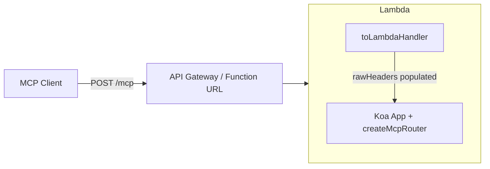

# @ttoss/http-server-mcp

[Model Context Protocol (MCP)](https://modelcontextprotocol.io) server integration for [@ttoss/http-server](https://ttoss.dev/docs/modules/packages/http-server).

## Installation

```bash
pnpm add @ttoss/http-server-mcp
```

## Quick Start

```typescript
import { App, bodyParser, cors } from '@ttoss/http-server';
import {
  createMcpRouter,
  McpServer,
  registerTools,
  z,
} from '@ttoss/http-server-mcp';

// Create MCP server
const mcpServer = new McpServer({
  name: 'my-mcp-server',
  version: '1.0.0',
});

// Register tools
registerTools({
  server: mcpServer,
  tools: [
    {
      name: 'get-weather',
      description: 'Get weather information for a location',
      inputSchema: z.object({ location: z.string().describe('City name') }),
      handler: async ({ location }) => ({
        content: [
          { type: 'text', text: `Weather in ${location}: Sunny, 72°F` },
        ],
      }),
    },
  ],
});

// Create HTTP server
const app = new App();
app.use(cors());
app.use(bodyParser());

// Mount MCP router
const mcpRouter = createMcpRouter(mcpServer);
app.use(mcpRouter.routes());

app.listen(3000, () => {
  console.log('MCP server running on http://localhost:3000/mcp');
});
```

## `apiCall` — Generic HTTP Helper

`apiCall` is a generic HTTP helper for use inside MCP tool handlers. It works with any URL — your own REST API, third-party APIs, public APIs, or services using `x-api-key` or any other header scheme.

Use `getApiHeaders` in `createMcpRouter` to configure which headers from the incoming MCP request are automatically forwarded to every `apiCall`. Tool handlers stay clean and auth-agnostic.

### Bearer token forwarding

```typescript
import { apiCall, createMcpRouter, McpServer } from '@ttoss/http-server-mcp';

const mcpServer = new McpServer({ name: 'my-server', version: '1.0.0' });

mcpServer.registerTool(
  'list-portfolios',
  { description: 'List all portfolios', inputSchema: {} },
  async () => {
    // Bearer token is forwarded automatically — no manual wiring
    const data = await apiCall('GET', '/portfolios');
    return { content: [{ type: 'text', text: JSON.stringify(data) }] };
  }
);

const mcpRouter = createMcpRouter(mcpServer, {
  apiBaseUrl: `http://localhost:${process.env.PORT}/api/v1`,
  // Extract the caller's Bearer token and inject it into every apiCall
  getApiHeaders: (ctx) => ({ Authorization: ctx.headers.authorization ?? '' }),
});
```

### x-api-key forwarding

```typescript
const mcpRouter = createMcpRouter(mcpServer, {
  apiBaseUrl: 'https://internal-service/api',
  getApiHeaders: (ctx) => ({
    'x-api-key': ctx.headers['x-api-key'] as string,
  }),
});
```

### Third-party or public APIs (full URL, no context required)

```typescript
mcpServer.registerTool(
  'get-rates',
  { description: 'Currency rates', inputSchema: {} },
  async () => {
    // Full URL — works entirely outside any context
    const rates = await apiCall('GET', 'https://api.exchangerate.host/latest');
    return { content: [{ type: 'text', text: JSON.stringify(rates) }] };
  }
);
```

### POST with a body

```typescript
const result = await apiCall('POST', '/portfolios', {
  body: { name: 'Growth Fund' },
});
```

### Per-call header override

```typescript
// Context-injected headers are merged; per-call headers take precedence
const data = await apiCall('GET', 'https://partner.api.com/data', {
  headers: { Authorization: 'Bearer fixed-service-token' },
});
```

`apiCall` throws with a clear message when called with a relative path and no `apiBaseUrl` is configured in the context.

### Errors

A non-2xx response throws, with the message read off the error body — `{ error: 'text' }` and `{ error: { code, message } }` both work, the latter as `code: message`. A body naming neither falls back to `HTTP <status>`.

```typescript
// { "error": { "code": "plan_limit_reached", "message": "Upgrade to add more." } }
// → Error: plan_limit_reached: Upgrade to add more.
```

Inside a tool handler the thrown message is what the MCP SDK returns to the client, so it is the whole answer the calling model acts on.

### Using your own HTTP client

A handler that does not use `apiCall` can still reuse its two request-scoped pieces: `getApiHeaders()` returns the headers `getApiHeaders` produced for the current MCP request, and `errorBodyMessage(body)` renders an error body exactly as `apiCall` does.

```typescript
import { errorBodyMessage, getApiHeaders } from '@ttoss/http-server-mcp';

const response = await fetch(url, { headers: getApiHeaders() });
if (!response.ok) {
  const body = await response.json().catch(() => undefined);
  throw new Error(errorBodyMessage(body) ?? `HTTP ${response.status}`);
}
```

## Authentication

`createMcpRouter` supports OAuth 2.0 Bearer token authentication via the `auth` option. Incoming MCP requests must include a valid `Authorization: Bearer <token>` header — invalid or missing tokens receive a `401 Unauthorized` response. The MCP lifecycle methods `initialize` and `tools/list` are exempt by default so clients can discover the server before authenticating (see [Public methods and discovery](#public-methods-and-discovery)).

```mermaid
sequenceDiagram
    participant Client
    participant MCP Server
    participant Verifier

    Client->>MCP Server: POST /mcp + Authorization: Bearer &lt;token&gt;
    MCP Server->>Verifier: verify(token)
    alt valid token
        Verifier-->>MCP Server: identity payload
        MCP Server->>MCP Server: run tool (identity available via getIdentity())
        MCP Server-->>Client: 200 OK
    else invalid or missing token
        Verifier-->>MCP Server: error
        MCP Server-->>Client: 401 Unauthorized
    end
```

### Amazon Cognito

Pass `cognitoUserPool` and the router creates a `CognitoJwtVerifier` (from `@ttoss/auth-core`) internally:

```typescript
import { createMcpRouter, McpServer } from '@ttoss/http-server-mcp';

const mcpRouter = createMcpRouter(mcpServer, {
  auth: {
    cognitoUserPool: {
      userPoolId: process.env.COGNITO_USER_POOL_ID!,
      clientId: process.env.COGNITO_CLIENT_ID!,
      tokenUse: 'access', // default
    },
  },
});
```

### Custom verifier

Pass an async `verifyToken` function for any provider — JWT-based or opaque. The contract is simply: resolve with an identity payload on success, or throw on failure.

```typescript
import { createMcpRouter } from '@ttoss/http-server-mcp';
import { jwtVerify, createRemoteJWKSet } from 'jose';

const JWKS = createRemoteJWKSet(
  new URL('https://your-auth-server/.well-known/jwks.json')
);

const mcpRouter = createMcpRouter(mcpServer, {
  auth: {
    verifyToken: async (token) => {
      const { payload } = await jwtVerify(token, JWKS);
      return payload;
    },
  },
});
```

**Opaque token (database lookup):** `verifyToken` does not have to be JWT-based — a plain API-key lookup works equally well:

```typescript
const mcpRouter = createMcpRouter(mcpServer, {
  auth: {
    verifyToken: async (token) => {
      // Look up the hashed token in your database
      const record = await db.apiKeys.findByHash(sha256(token));
      if (!record || record.revokedAt) {
        throw new Error('Invalid API key');
      }
      return { sub: record.userId, scope: record.scopes.join(' ') };
    },
  },
});
```

The router emits `401 Unauthorized` whenever `verifyToken` throws, regardless of whether you are using JWTs or opaque tokens.

### Accessing the verified identity

Inside any tool handler, call `getIdentity()` to retrieve the verified JWT payload:

```typescript
import {
  getIdentity,
  createMcpRouter,
  McpServer,
} from '@ttoss/http-server-mcp';

mcpServer.registerTool(
  'get-profile',
  { description: "Return the caller's profile", inputSchema: {} },
  async () => {
    const identity = getIdentity<{ sub: string; email: string }>();
    return {
      content: [{ type: 'text', text: `Hello, ${identity?.email}` }],
    };
  }
);
```

### Scope enforcement

Scopes can be enforced at two levels.

**Router-level** — gate the entire MCP endpoint. Any token missing a required scope receives a `403 Forbidden` before any tool runs:

```typescript
createMcpRouter(mcpServer, {
  auth: {
    cognitoUserPool: { userPoolId: '...', clientId: '...' },
    requiredScopes: ['mcp:access'],
  },
});
```

**Per-tool** — use `checkScopes()` inside individual handlers for fine-grained control. It throws an error that the MCP SDK returns as a tool error to the client:

```typescript
import { checkScopes, getIdentity } from '@ttoss/http-server-mcp';

mcpServer.registerTool(
  'delete-user',
  { description: 'Delete a user', inputSchema: { userId: z.string() } },
  async ({ userId }) => {
    checkScopes(['admin', 'write:users']); // throws if either scope is missing

    const identity = getIdentity<{ sub: string }>();
    // proceed with deletion...
    return { content: [{ type: 'text', text: `Deleted ${userId}` }] };
  }
);
```

Cognito encodes scopes as a space-separated string in `payload.scope` (e.g. `"openid mcp:access admin"`).

### Resource indicator validation (RFC 8707)

`requiredScopes` checks _what_ a token can do; `resourceIndicator` checks that the token was minted _for this server_ in the first place. Without it, a token issued by your authorization server for a different resource (another API, another MCP server) would still pass verification here as long as the signature checks out — the classic confused-deputy risk RFC 8707 exists to close.

```typescript
createMcpRouter(mcpServer, {
  auth: {
    cognitoUserPool: { userPoolId: '...', clientId: '...' },
    resourceIndicator: 'https://mcp.example.com',
  },
});
```

The verified token's `aud` claim must include at least one of the configured values (a single string or an array of strings, for servers reachable under multiple hostnames), or the request receives `401 Unauthorized`. This applies uniformly regardless of the verification method — `cognitoUserPool`, a custom `verifyToken`, or `@ttoss/auth-core/oidc`'s `createOidcVerifier` below.

### OIDC providers (Entra ID, Okta, Auth0, …)

For any standards-compliant OIDC provider beyond Cognito, use `createOidcVerifier` from `@ttoss/auth-core/oidc`. It discovers the provider's signing keys from its `/.well-known/openid-configuration` document — no manual JWKS URL, no hand-rolled discovery:

```typescript
import { createOidcVerifier } from '@ttoss/auth-core/oidc';
import { createMcpRouter } from '@ttoss/http-server-mcp';

const mcpRouter = createMcpRouter(mcpServer, {
  auth: {
    verifyToken: createOidcVerifier({
      issuer: 'https://login.microsoftonline.com/<tenant>/v2.0',
    }),
    resourceIndicator: 'https://mcp.example.com',
  },
});
```

`createOidcVerifier` deliberately does not validate `aud` itself — pass `resourceIndicator` alongside it, as shown, so audience validation stays consistent across every auth method this router supports. See the [`@ttoss/auth-core` README](https://ttoss.dev/docs/modules/packages/auth-core) for details on key caching and rotation.

### OAuth Protected Resource Metadata

MCP clients (Claude, Cursor, etc.) fetch `/.well-known/oauth-protected-resource` to discover which authorization server issues tokens for your MCP server. The endpoint must be **unauthenticated** — MCP clients call it before they have a token.

The document is served at **two** locations, both unauthenticated:

| Location                                      | Who fetches it                                                                                                                                                     |
| --------------------------------------------- | ------------------------------------------------------------------------------------------------------------------------------------------------------------------ |
| `/.well-known/oauth-protected-resource`       | Clients following the `resource_metadata` value in the `WWW-Authenticate` header                                                                                   |
| `/.well-known/oauth-protected-resource<path>` | Clients applying RFC 9728 §3.1, which derives the URL from the resource identifier's path — e.g. `/.well-known/oauth-protected-resource/mcp` for the default mount |

Serving only the root location makes a spec-following client fail discovery outright. When `path` is `'/'` the derivation produces the root itself, so only one route is registered.

Both the locations and the document come from `protectedResourceMetadataPaths` / `protectedResourceMetadataDocument` in [`@ttoss/auth-core`](https://ttoss.dev/docs/modules/packages/auth-core), which every package here shares — so this router, `oauthServer`, `createProtectedResourceMetadataMiddleware`, and `getWwwAuthenticateHeader` cannot disagree about where the document lives.

**With the built-in `auth` option** — add `resourceServerUrl` and `authorizationServerUrl`:

```typescript
createMcpRouter(mcpServer, {
  auth: {
    cognitoUserPool: { userPoolId: '...', clientId: '...' },
    resourceServerUrl: 'https://mcp.example.com',
    authorizationServerUrl:
      'https://cognito-idp.us-east-1.amazonaws.com/us-east-1_xxx',
  },
});
```

The `resource` field in the metadata document is automatically set to `resourceServerUrl + path` (e.g. `https://mcp.example.com/mcp` for the default path). This means MCP clients that follow `resource` to connect will land on the actual MCP endpoint rather than the bare origin.

**With your own auth middleware** — use `createProtectedResourceMetadataMiddleware` as a standalone middleware, mounted _before_ your auth layer so discovery stays unauthenticated:

```typescript
import {
  createProtectedResourceMetadataMiddleware,
  getWwwAuthenticateHeader,
} from '@ttoss/http-server-mcp';

// Mount the discovery endpoint before your own auth middleware
app.use(
  createProtectedResourceMetadataMiddleware({
    resource: 'https://mcp.example.com',
    authorizationServers: ['https://api.example.com'],
  })
);

// Your own auth middleware — emit the spec-compliant WWW-Authenticate header on 401s
app.use(async (ctx, next) => {
  const token = ctx.headers.authorization?.replace('Bearer ', '');
  if (!token || !(await myVerify(token))) {
    ctx.status = 401;
    ctx.set(
      'WWW-Authenticate',
      getWwwAuthenticateHeader({ resource: 'https://mcp.example.com' })
    );
    ctx.body = 'Unauthorized';
    return;
  }
  await next();
});

app.use(createMcpRouter(mcpServer).routes());
```

The `WWW-Authenticate: Bearer resource_metadata="…"` header is how MCP clients bootstrap OAuth discovery after their first unauthorized request.

### Public methods and discovery

The two behaviors the [MCP authorization spec](https://spec.modelcontextprotocol.io/specification/2025-03-26/basic/authorization/) requires for client bootstrapping are built into the `auth` option, so you no longer need the hand-rolled middleware shown above:

- **`publicMethods`** — JSON-RPC methods that bypass verification, read from the request body's `method` field. Defaults to `['initialize', 'server/discover']` — the lifecycle handshake of each protocol era, which the spec sanctions so a client can complete it before it can discover the authorization server. Pass `[]` to require a token for every method, or a custom list to change the exempt set. Adding `tools/list` serves the full tool catalogue — every tool name, description, and input schema — to unauthenticated callers; see [`publicMethods` and OAuth clients](#publicmethods-and-oauth-clients) before doing so.
- **`resourceMetadataUrl`** — the URL a `401` advertises as `WWW-Authenticate: Bearer resource_metadata="<url>"` (RFC 9728) instead of a bare `Bearer`, pointing MCP clients at the protected-resource metadata document. **You normally do not set it**: when the document is served — i.e. both `resourceServerUrl` and `authorizationServerUrl` are configured — it defaults to the RFC 9728 location this router serves it at, so the header and the routes cannot drift apart. When the document is not served, the header stays a bare `Bearer` rather than naming a location with no route. The field exists for the one configuration where this router deliberately does not serve the document — an `oauthServer()` in the same deployment already answers that path, so this router is mounted without `resourceServerUrl`/`authorizationServerUrl` to avoid two routers on one path, and has nothing to derive from. Compute the value with `protectedResourceMetadataUrl` from [`@ttoss/auth-core`](https://ttoss.dev/docs/modules/packages/auth-core) rather than typing it, so both halves apply the same §3.1 rule.

```typescript
createMcpRouter(mcpServer, {
  auth: {
    cognitoUserPool: { userPoolId: '...', clientId: '...' },
    // Serves the metadata document (unauthenticated) and points 401s at it
    // for auto-discovery — resourceMetadataUrl is derived from these two.
    resourceServerUrl: 'https://mcp.example.com',
    authorizationServerUrl:
      'https://cognito-idp.us-east-1.amazonaws.com/us-east-1_xxx',
    // publicMethods defaults to ['initialize', 'server/discover'].
  },
});
```

Every field is optional.

### Supporting clients that connect to the bare origin

Some MCP clients always POST to the bare origin (`/`) regardless of the `resource` value in the metadata. To serve both behaviors from the same router, use the `aliases` option:

```typescript
createMcpRouter(mcpServer, {
  // The primary endpoint — also the value advertised as `resource` in metadata.
  path: '/mcp',
  // Additionally handle requests at the bare root for clients that ignore `resource`.
  aliases: ['/'],
  auth: {
    verifyToken: async (token) => myVerify(token),
    resourceServerUrl: 'https://mcp.example.com',
    authorizationServerUrl: 'https://auth.example.com',
  },
});
```

The discovery endpoints (both locations above) remain publicly accessible even when `aliases` includes `'/'`. Aliases themselves get no derived location — the metadata `resource` always names the primary `path`.

## Tools

A `Tool` is what a tool is and how it answers, independent of how a server exposes it: `name`, `description`, `inputSchema`, `handler`, and optionally `title`, `outputSchema`, `annotations`, `tags`, `summary` and `_meta`. `registerTools` registers a list of them.

```typescript
import { defineTool, registerTools, z } from '@ttoss/http-server-mcp';

registerTools({
  server,
  tools: [
    {
      name: 'get-project',
      description: 'Get a project by ID',
      inputSchema: z.object({ id: z.string() }),
      handler: async ({ id }) => ({
        content: [{ type: 'text', text: `Project: ${id}` }],
      }),
    },
    // defineTool: answer with data; null answers "Not found" as an error.
    defineTool({
      name: 'list-campaigns',
      description: 'List the caller campaigns.',
      inputSchema: z.object({ limit: z.number().optional() }),
      method: ({ limit }) => fetchCampaigns(limit),
    }),
  ],
});
```

`inputSchema` is either a Standard Schema (Zod 4's `z.object(...)`), always enforced, with the handler receiving its parsed output; or a plain JSON Schema, forwarded verbatim and enforced only with `validateArguments` — see [Argument validation](#argument-validation). A plain JSON Schema keeps one definition shareable with an AI SDK agent, whose `tool()` helper takes the same object.

### Catalog for large tool sets

Every tool definition ships to the model on every turn, so a few hundred tools overflow a client's context, and some providers cap the number of tools per request. `catalog` registers the same tools behind three:

| Tool       | Input                     | Returns                                                                                        |
| ---------- | ------------------------- | ---------------------------------------------------------------------------------------------- |
| `search`   | `query`, `tag?`, `limit?` | Name, one-line `summary` and `tags` of the best matches                                        |
| `describe` | `names`                   | Each tool's full definition, including `inputSchema`; unknown names come back with suggestions |
| `call`     | `name`, `arguments`       | Exactly what the tool answers                                                                  |

```typescript
registerTools({ server: fullServer, tools });
registerTools({ server: catalogServer, tools, catalog: true });
```

A schema enters the model's context only for the tools it is about to use. `call` enforces the tool's schema as a direct call would, and its errors help the model recover: an unknown name answers suggestions, and invalid arguments, a tool's own error result, or a thrown error carry the input schema, so a `call` made without `describe` corrects itself in one retry.

Pass options instead of `true` to tune it:

- `direct` — tools also registered standalone. Defaults to those linked to an [MCP Apps](#mcp-apps-interactive-uis) view, since a host finds a view through the tool's own `tools/list` entry.
- `visible` — runs on every catalog call; a tool it rejects is absent from all three. Direct tools stay listed.
- `search` — replaces the default ranking, `rankTools`, e.g. with embeddings.
- `searchLimit` (default `10`) and `names` (default `search` / `describe` / `call`).

A gate (below) sees each call with the tool's own name and arguments, so authorization stays per tool behind the catalog.

### Gating tools

`createToolGate` returns a gate: a function that wraps a `Tool` so every call passes the same authentication and authorization pipeline before its handler runs. The gated tool is an ordinary `Tool`.

1. Resolves the caller's identity (defaults to `getIdentity()` from the request context).
2. Checks that the caller holds the tool's `requiredScope` — returns an `isError` result (not a throw) when the scope is absent.
3. Runs global `gates` then the tool's `gates` in order; a throwing gate rejects the call. Both receive `ToolCallContext` (identity **and** the validated call args).
4. Merges `buildContext` output into the handler args.
5. Calls `onError` on handler throw before rethrowing, for telemetry. Gate/scope failures do **not** trigger `onError`.

```typescript
import {
  createToolGate,
  defineTool,
  getIdentity,
  registerTools,
  z,
} from '@ttoss/http-server-mcp';

const gate = createToolGate({
  resolveIdentity: () => {
    const jwt = getIdentity<{ sub: string; scope: string }>();
    const scopes = jwt?.scope?.split(' ') ?? [];
    return { userId: jwt!.sub, scopes };
  },
  buildContext: ({ identity }) => ({ tenantId: lookupTenant(identity.userId) }),
  onError: (err, { handler, identity }) => {
    logger.error({ err, handler, userId: identity.userId });
  },
});

registerTools({
  server,
  tools: [
    gate({
      requiredScope: 'accounts:write',
      // arg-conditional gate: activating requires more checks than deactivating
      gates: [
        ({ args }) =>
          args.isActive
            ? checkSubscriptionGates([
                'mustNotExceedMaxActive',
                'mustHaveBudget',
              ])
            : checkSubscriptionGates(['mustIncludeService']),
      ],
      tool: defineTool({
        name: 'activate-ad-account',
        description: 'Activate or deactivate an ad account.',
        inputSchema: z.object({ accountId: z.number(), isActive: z.boolean() }),
        method: ({ tenantId, accountId, isActive }) =>
          toggleAdAccount(tenantId, accountId, isActive),
      }),
    }),
  ],
});
```

### Localized refusals and errors

Pass `i18n` to render a [`LocalizedError`](https://ttoss.dev/docs/modules/packages/i18n-core/) thrown by a **gate** or by the **handler** as an `isError` result `{ "error": "<message>", "code": "<CODE>" }` in the caller's locale. Gates run outside the handler, so the gate is the one place that covers both.

```ts
const gate = createToolGate({
  gates: [subscriptionGate],
  i18n: {
    catalog,
    // Default: the MCP request's Accept-Language (`getRequestLocale()`).
    // Pin the agent contract to one language instead:
    getLocale: () => 'en',
  },
});
```

`onError` still runs for a handler error before it is rendered. Errors that are not localized behave exactly as without the option.

## MCP Apps (interactive UIs)

The [`io.modelcontextprotocol/ui`](https://github.com/modelcontextprotocol/ext-apps) extension lets a tool result render as an interactive view instead of text. The view is a `ui://` resource holding an HTML document, which the host loads into a sandboxed iframe and talks to over `postMessage`; the tool points at it through its `_meta`.

The extension asks nothing of the transport, so `createMcpRouter` serves it as-is on both protocol revisions. `registerAppResource` owns the parts that are easy to get wrong — the `ui://` scheme, the exact MIME type, `_meta.ui` on both the declaration and the read result, and the deprecated flat linkage key that is still legal until the extension reaches GA.

```typescript
import {
  McpServer,
  registerAppResource,
  UI_EXTENSION_ID,
  UI_RESOURCE_MIME_TYPE,
  z,
} from '@ttoss/http-server-mcp';

const server = new McpServer(
  { name: 'weather', version: '1.0.0' },
  {
    capabilities: {
      extensions: { [UI_EXTENSION_ID]: { mimeTypes: [UI_RESOURCE_MIME_TYPE] } },
    },
  }
);

const dashboard = registerAppResource({
  server,
  name: 'weather_dashboard',
  uri: 'ui://weather/dashboard',
  description: 'Interactive weather dashboard',
  html: dashboardHtml, // a string, or ({ uri }) => string built per read
  ui: {
    csp: { connectDomains: ['https://api.openweathermap.org'] },
    prefersBorder: true,
  },
});

registerTools({
  server,
  tools: [
    {
      name: 'get-weather',
      description: 'Get the weather for a location',
      inputSchema: z.object({ location: z.string() }),
      _meta: dashboard.toolMeta(),
      handler: async ({ location }) => {
        const forecast = await fetchForecast(location);
        return {
          // Text stays meaningful: it is what a host without Apps renders.
          content: [{ type: 'text', text: summarise(forecast) }],
          structuredContent: forecast,
        };
      },
    },
    {
      name: 'refresh-dashboard',
      description: 'Refresh dashboard data',
      // Callable by the view, hidden from the model.
      _meta: dashboard.toolMeta({ visibility: ['app'] }),
      handler: async () => ({ content: [{ type: 'text', text: 'refreshed' }] }),
    },
  ],
});
```

`toolMeta()` is the linkage for every registration path: a `Tool`'s `_meta`, or the SDK's `registerTool`. Behind a [catalog](#catalog-for-large-tool-sets), view-linked tools stay registered standalone by default.

### Register the linkage unconditionally

The spec suggests checking the client's declared capability before registering UI-enabled tools. Do not: that read is only reliable on the `2026-07-28` revision, where the capability arrives in each request's envelope. In this package's default [stateless mode](#stateless-vs-stateful-mode) there is no remembered `initialize` for a 2025-era client, so a capability-gated registration silently drops the view for every one of them.

Declaring it always is also strictly more compatible — a host without Apps support ignores `_meta` and renders the tool's `content`, which is the extension's own graceful-degradation contract. Keep every tool's text result meaningful on its own and the fallback takes care of itself.

### Writing the view

A view is plain HTML; a raw `postMessage` client is enough, no SDK needed. Tools generated from OpenAPI link to a view through [`toolMeta` and `toStructuredContent`](https://github.com/ttoss/ttoss/tree/main/packages/http-server-mcp-openapi#mcp-apps-views). The parts that only fail inside a host:

- **The view speaks first.** It sends `ui/initialize` (`appInfo`, `appCapabilities`, `protocolVersion`), then `ui/notifications/initialized`, and reads the result from `ui/notifications/tool-result` — `structuredContent` when the tool sets it, else the text.
- **Buttons call tools through the host** with `tools/call`, and the host may ask the person to confirm. `ui/notifications/tool-input` carries the original arguments, which is what a button needs to repeat or extend the call.
- **Fonts and scripts load only from origins in `ui.csp.resourceDomains`.** The host's default CSP is `font-src 'self'`, so a `data:` font is blocked.
- **Report size from `document.body`**, not `document.documentElement`: the document is never shorter than the iframe, so the view would grow but never shrink.
- **Set every value from a tool result with `textContent`.** It is data a model or a user produced.
- **Theme from `hostContext.theme`**, updated by `ui/notifications/host-context-changed`.

To see a view, render it in a host: ext-apps' `AppBridge` in a browser works, connected before the iframe's `srcdoc` is set because the view speaks first. An agent CLI such as Claude Code is an MCP client but not an Apps host, so it never renders one.

## Issuing tokens for MCP clients

The `auth` option above covers the **resource-server** half of MCP authorization — it verifies tokens issued by an external authorization server (Cognito, Auth0, …). To make your own first-party server _issue_ the tokens an MCP client runs the full OAuth flow against, add the [`@ttoss/http-server-auth`](https://ttoss.dev/docs/modules/packages/http-server-auth) plugin's `oauthServer()` and pair it with `createMcpRouter({ auth: { verifyToken } })` so one deployment both issues and verifies tokens. See the [OAuth Authorization Server](https://ttoss.dev/docs/engineering/guidelines/oauth-authorization-server) guideline.

## API Reference

### `createMcpRouter(server, options?)`

Creates a Koa router configured to handle MCP protocol requests.

**Parameters:**

- `server` (`McpServer`) — MCP server instance with registered tools and resources
- `options` (`McpRouterOptions`) — Optional configuration
  - `path` (`string`) — HTTP path for MCP endpoint (default: `'/mcp'`)
  - `aliases` (`string[]`) — Additional paths where the MCP handler is also mounted; use `['/']` to also handle requests at the bare root (default: `[]`)
  - `sessionIdGenerator` (`() => string`) — Session ID generator for stateful servers (default: `undefined` for stateless)
  - `createMcpServer` (`McpServerFactory`) — Per-request factory serving the `2026-07-28` revision; see [Serving the `2026-07-28` revision](#serving-the-2026-07-28-revision)
  - `bus` (`ServerEventBus`) — Change-event bus `subscriptions/listen` streams subscribe to (default: in-process); see [Change notifications and shutdown](#change-notifications-and-shutdown)
  - `keepAliveMs` (`number`) — SSE keepalive interval for `2026-07-28` streams (default: `15000`)
  - `apiBaseUrl` (`string`) — Base URL prepended to relative paths in `apiCall`
  - `getApiHeaders` (`(ctx: Context) => Record<string, string>`) — Return headers to inject into every `apiCall` for this request
  - `auth` (`McpAuthOptions`) — OAuth/JWT authentication; see [Authentication](#authentication)
    - `auth.cognitoUserPool` — Cognito user pool config (`userPoolId`, `clientId`, `tokenUse`)
    - `auth.verifyToken` — Custom async token verifier `(token: string) => Promise<unknown>`
    - `auth.requiredScopes` — Router-level scope guard; returns 403 if any scope is missing
    - `auth.resourceServerUrl` + `auth.authorizationServerUrl` — Enable the protected-resource metadata document, served at both `/.well-known/oauth-protected-resource` and the RFC 9728 path-derived `/.well-known/oauth-protected-resource<path>`; the metadata `resource` is set to `resourceServerUrl + path` so clients following `resource` land on the actual MCP endpoint
    - `auth.publicMethods` — JSON-RPC methods that bypass verification (default `['initialize', 'server/discover']`)
    - `auth.resourceMetadataUrl` — URL advertised in the RFC 9728 `WWW-Authenticate: Bearer resource_metadata="…"` header on a 401. Defaults to the location derived from `resourceServerUrl` + `path` (the one this router serves), so the header cannot drift from the routes; set it only when a separate `oauthServer()` serves the document and this router is mounted without `resourceServerUrl`/`authorizationServerUrl`
    - `auth.resourceIndicator` — Expected `aud` value(s) (RFC 8707); rejects tokens minted for a different resource. See [Resource indicator validation](#resource-indicator-validation-rfc-8707)

**Returns:** `McpRouter` — the Koa router, plus `notify` (publish `list_changed` notifications to open `subscriptions/listen` streams) and `close()` (announce that the lists may have changed, then end every open `2026-07-28` exchange)

### `apiCall(method, url, options?)`

Generic HTTP helper for use inside MCP tool handlers.

**Parameters:**

- `method` (`string`) — HTTP method (`'GET'`, `'POST'`, `'PUT'`, `'DELETE'`, …)
- `url` (`string`) — Full URL **or** a path starting with `/` (prepended with `apiBaseUrl`)
- `options.body` (`unknown`, optional) — Request body, serialised as JSON
- `options.headers` (`Record<string, string>`, optional) — Per-call header overrides; merged on top of context-injected headers

**Returns:** `Promise<unknown>` — Parsed JSON response body

**Throws:** `Error` on a non-2xx response, carrying the error body's message (see [Errors](#errors))

### `getApiHeaders()`

Returns a copy of the headers `createMcpRouter`'s `getApiHeaders` option produced for the current MCP request — the same headers `apiCall` injects.

**Returns:** `Record<string, string>` — `{}` outside a request or when `getApiHeaders` is not configured

### `errorBodyMessage(body)`

Reads the message off a REST error body — `{ error: 'text' }` or `{ error: { code?, message? } }` (rendered `code: message`).

**Returns:** `string | undefined` — `undefined` when the body carries no message

### `getIdentity<T>()`

Returns the verified JWT payload for the current MCP request. Only available inside a tool handler when `auth` is configured. Returns `undefined` when called outside an authenticated context.

Accepts an optional type parameter so tool handlers can avoid manual casts:
`getIdentity<{ sub: string; scope: string }>()` returns `T | undefined` instead of `unknown`.

**Returns:** `T | undefined` — Verified token payload typed as `T` (defaults to `unknown`)

### `checkScopes(required)`

Asserts that the current request token contains all required scopes. Throws `Error: Insufficient scopes. Required: …` if any scope is missing — the MCP SDK catches this and returns a tool error to the client.

**Parameters:**

- `required` (`string[]`) — Scope strings that must all be present in `payload.scope`

### `createProtectedResourceMetadataMiddleware(args)`

Creates a standalone Koa middleware that serves `GET /.well-known/oauth-protected-resource` (RFC 9728). Use this when you have your own auth middleware and don't want to tie the discovery endpoint to the built-in `auth` option.

**Parameters:**

- `args.resource` (`string`) — The protected resource's identifier URI (your MCP server URL)
- `args.authorizationServers` (`string[]`) — Issuer URIs of the authorization servers that protect this resource

**Returns:** `Koa.Middleware`

### `getWwwAuthenticateHeader(args)`

Returns the `WWW-Authenticate` header value for a 401 response, formatted per the MCP auth spec: `Bearer resource_metadata="<resource>/.well-known/oauth-protected-resource"`.

**Parameters:**

- `args.resource` (`string`) — The protected resource URL (trailing slash is stripped automatically)

**Returns:** `string` — The full `WWW-Authenticate` header value

### `registerTools(params)`

Registers `Tool`s on an MCP server. See [Tools](#tools).

**Parameters (`params`):**

- `server` (`McpServer`) — The MCP server to register on.
- `tools` (`Tool[]`) — The tools.
- `catalog` (`boolean | ToolCatalogOptions`, optional, default `false`) — Expose the tools behind `search` / `describe` / `call`; see [Catalog for large tool sets](#catalog-for-large-tool-sets) for the options.

**`Tool`:**

- `name` (`string`) — Unique tool name.
- `description` (`string`) — What the tool does, written for the model.
- `inputSchema` (`JsonObjectSchema | StandardSchemaWithJSON`, optional) — Defaults to `{ type: 'object', properties: {} }`.
- `validateArguments` (`boolean`, optional, default `false`) — Enforce a JSON Schema `inputSchema`; see [Argument validation](#argument-validation).
- `outputSchema` (same types as `inputSchema`, optional) — Advertised on `tools/list`; `structuredContent` is validated against it.
- `title`, `annotations`, `_meta` (optional) — Forwarded on `tools/list`.
- `tags`, `summary` (optional) — Read by a catalog's `search`; never sent on `tools/list`.
- `handler` (`(args) => CallToolResult | Promise<CallToolResult>`) — Answers a call.

**Returns:** `void`

#### Argument validation

By default, a JSON Schema `inputSchema` is **advertised but not enforced**: it round-trips verbatim over `tools/list` so clients know what to send, while arguments reach your handler unchecked. Set `validateArguments: true` to reject mismatched calls before the handler runs.

Enable it once you're confident `inputSchema` describes every value the tool genuinely accepts. Schemas derived from an OpenAPI document are a common source of _incomplete_ ones — a field a client may send as `null` to clear it, or one that accepts several shapes, is easily emitted as a bare `{ type: 'string' }`. Validating against a schema like that rejects calls the underlying API would have accepted. To describe those cases accurately, use `{ type: ['string', 'null'] }` for a nullable field and forward `oneOf`/`anyOf` verbatim rather than collapsing to one type.

### `defineTool(params)`

Builds a `Tool` from a `method` that returns data: JSON text, plus `structuredContent` when `outputSchema` is set. `null`/`undefined` answers `notFoundMessage` (default `"Not found"`) as an `isError` result. Takes every `Tool` field but `handler`.

### `createToolGate(options?)`

Returns a gate, `({ tool, requiredScope, gates? }) => Tool`, that wraps a tool in the pipeline described in [Gating tools](#gating-tools).

**Parameters (`options`):**

- `resolveIdentity` (`() => ToolIdentity`, optional) — Called once per invocation to resolve `{ userId, scopes? }`. Defaults to `getIdentity()` from the request context.
- `gates` (`ToolCallGate[]`, optional) — Global guards run after the scope check, in order, before any per-tool gates. Each receives `{ identity, args, handler }`. Throw to reject the call.
- `enforceScope` (`boolean`, optional, default `true`) — When `true`, checks `requiredScope` against `identity.scopes` and returns an `isError` result on mismatch. Set to `false` when all authorization is handled by `gates`.
- `buildContext` (`(ctx: ToolCallContext) => Record<string, unknown>`, optional) — Produces extra key-value pairs merged into every handler's args.
- `onError` (`(error, ctx: ToolCallContext) => void | Promise<void>`, optional) — Called when the handler throws, before the error is rethrown. Gate/scope failures do **not** trigger this hook.
- `i18n` (optional) — See [Localized refusals and errors](#localized-refusals-and-errors).

**`ToolCallContext`** is the object passed to gates, `buildContext`, and `onError`:

- `identity` (`ToolIdentity`) — The resolved caller identity (`{ userId, scopes? }`).
- `args` (`Record<string, unknown>`) — The validated tool input.
- `handler` (`string`) — The tool name, for error attribution.

### `rankTools(args)`

The catalog's default search, exported as a fallback for a custom one: scores `tools` by the terms of `query` — weighted name > summary > tags > description, plural and singular alike, a word's prefix at half weight — filters by `tag`, and returns up to `limit`, ties in the tools' order.

### `registerAppResource(params)`

Registers an [MCP Apps](#mcp-apps-interactive-uis) view: a `ui://` resource whose HTML a host renders for a linked tool's result.

**Parameters (`params`):**

- `server` (`McpServer`) — The MCP server to register the resource on.
- `name` (`string`) — Resource name, as listed by `resources/list`.
- `uri` (`string`) — Resource URI. Must use the `ui://` scheme, or the call throws.
- `description` (`string`, optional) — What the view does and when a host should render it.
- `html` (`string | ({ uri: URL }) => string | Promise<string>`) — The view's HTML5 document, or a builder invoked per `resources/read`.
- `ui` (`UiResourceMeta`, optional) — Rendering and security configuration relayed to the host as `_meta.ui`:
  - `csp` (`UiResourceCsp`) — Origins the view may reach, mapped onto the iframe's Content Security Policy: `connectDomains` (`connect-src`), `resourceDomains` (scripts/styles/images/fonts/media), `frameDomains` (`frame-src`), `baseUriDomains` (`base-uri`). An omitted list is the restrictive default, not "no restriction".
  - `permissions` (`UiResourcePermissions`) — Browser capabilities requested for the view (`camera`, `microphone`, `geolocation`, `clipboardWrite`), each as `{}`. A host _may_ grant them, so feature-detect in the view rather than assuming.
  - `domain` (`string`) — Dedicated sandbox origin, for views needing a stable one (OAuth callbacks, CORS, API key allowlists). The format is host-specific.
  - `prefersBorder` (`boolean`) — Whether the host should draw a border and background around the view.

**Returns:** `RegisteredAppResource`

- `uri` (`string`) — The URI tools link to.
- `resource` (`RegisteredResource`) — The SDK's registration handle, for `update`/`disable`/`remove`.
- `toolMeta(params?)` — Builds the `_meta` bag linking a tool to this view, writing both `_meta.ui.resourceUri` and the deprecated flat `_meta['ui/resourceUri']`. Takes `visibility` (`Array<'model' | 'app'>`, optional — the spec's default is both) and `_meta` (`Record<string, unknown>`, optional) to merge further entries in.

### `UI_EXTENSION_ID` / `UI_RESOURCE_MIME_TYPE`

`'io.modelcontextprotocol/ui'` and `'text/html;profile=mcp-app'`. Use the first as the `capabilities.extensions` key when advertising Apps support on the `McpServer`, and the second as the MIME type a host negotiates.

## Examples

### Single source of truth across MCP and AI SDK

A JSON Schema `inputSchema` is forwarded verbatim — `anyOf`, `$ref`, `pattern` survive — so one definition feeds both:

```typescript
// lib/tools.ts — shared tool definition
export const getProjectTool = {
  name: 'get-project',
  description: 'Get a project by ID',
  inputSchema: {
    type: 'object' as const,
    properties: {
      id: { type: 'string' },
      status: { anyOf: [{ type: 'string' }, { type: 'null' }] },
    },
    required: ['id'],
  },
};

// MCP server
registerTools({
  server: mcpServer,
  tools: [
    {
      ...getProjectTool,
      handler: async ({ id }) => {
        /* ... */
      },
    },
  ],
});

// AI SDK agent
import { jsonSchema, tool } from 'ai';
const agentTool = tool({
  description: getProjectTool.description,
  parameters: jsonSchema(getProjectTool.inputSchema),
  execute: async ({ id }) => {
    /* same logic */
  },
});
```

### Basic Tool

```typescript
import { McpServer, z } from '@ttoss/http-server-mcp';

const server = new McpServer({
  name: 'calculator',
  version: '1.0.0',
});

server.registerTool(
  'add',
  {
    description: 'Add two numbers',
    inputSchema: {
      a: z.number().describe('First number'),
      b: z.number().describe('Second number'),
    },
  },
  async ({ a, b }) => ({
    content: [
      {
        type: 'text',
        text: `${a} + ${b} = ${a + b}`,
      },
    ],
  })
);
```

### Multiple Tools

```typescript
server.registerTool(
  'multiply',
  {
    description: 'Multiply two numbers',
    inputSchema: {
      a: z.number(),
      b: z.number(),
    },
  },
  async ({ a, b }) => ({
    content: [{ type: 'text', text: String(a * b) }],
  })
);

server.registerTool(
  'divide',
  {
    description: 'Divide two numbers',
    inputSchema: {
      a: z.number(),
      b: z.number(),
    },
  },
  async ({ a, b }) => {
    if (b === 0) {
      throw new Error('Division by zero');
    }
    return {
      content: [{ type: 'text', text: String(a / b) }],
    };
  }
);
```

### Custom Path

```typescript
const router = createMcpRouter(server, {
  path: '/api/mcp',
});
```

### Resources

```typescript
server.resource(
  'config://app',
  'Application configuration',
  'application/json',
  async () => ({
    contents: [
      {
        uri: 'config://app',
        mimeType: 'application/json',
        text: JSON.stringify({ version: '1.0.0', env: 'production' }),
      },
    ],
  })
);
```

### With CORS and Multiple Endpoints

```typescript
import { App, bodyParser, cors, Router } from '@ttoss/http-server';
import { createMcpRouter } from '@ttoss/http-server-mcp';

const app = new App();
app.use(cors());
app.use(bodyParser());

// Health check endpoint
const healthRouter = new Router();
healthRouter.get('/health', (ctx) => {
  ctx.body = { status: 'ok' };
});

// MCP endpoint
const mcpRouter = createMcpRouter(mcpServer);

app.use(healthRouter.routes());
app.use(mcpRouter.routes());

app.listen(3000);
```

## Protocol Details

This package implements the [Model Context Protocol](https://spec.modelcontextprotocol.io/) over HTTP using JSON responses — SSE only for `2026-07-28` `subscriptions/listen` streams — and serves each request over the protocol revision it actually speaks.

Requests are classified once at the boundary, and the classifier's answer is three-way. Traffic from today's MCP clients is served over `NodeStreamableHTTPServerTransport` with `enableJsonResponse: true`, adapting Koa's context-based middleware to the SDK's Node.js request/response expectations. Requests carrying the `2026-07-28` revision's per-request envelope are served by that revision's stateless core (`createMcpHandler`). Requests the classifier refuses outright are answered with its own rejection — the status, code, message and data it chose — rather than passed to either era's handler.

### Serving the `2026-07-28` revision

Set `createMcpServer` to a factory returning an `McpServer` with the same tools registered:

```typescript
const buildServer = () => {
  const mcpServer = new McpServer({ name: 'my-server', version: '1.0.0' });
  registerEverything(mcpServer);
  return mcpServer;
};

const mcpRouter = createMcpRouter(buildServer(), {
  createMcpServer: buildServer,
});
```

It has to be a factory, and cannot default to the server the router was given, because the negotiated revision is instance state: serving one `2026-07-28` request marks that `McpServer` modern for good, and it then validates every later message against that revision. One instance serving both eras is pinned by the first client to speak the newer one, after which every 2025-era request is answered `-32602 Request is missing the required _meta envelope…` at HTTP 200 for the life of the process. The SDK's own serving entries take a factory and call it once per request for the same reason.

Without `createMcpServer`, `2026-07-28` requests get the unsupported-protocol-version error listing the revisions this endpoint does serve, so that client renegotiates and no other client is affected.

### Change notifications and shutdown

A `2026-07-28` client learns about a changed tool list over a `subscriptions/listen` stream it holds open. The router serves those streams; `notify` publishes to them. Call `notify.toolsChanged()` after registering or removing a tool at runtime:

```typescript
const mcpRouter = createMcpRouter(buildServer(), {
  createMcpServer: buildServer,
});

mcpRouter.notify.toolsChanged();
```

A deploy changes the surface too, and the new process cannot know what a client cached — so the old one says so on its way out. Call `close()` on shutdown, before the HTTP server's own `close()`. It tells every open stream that the tool, prompt and resource lists may have changed, then ends the streams. That order matters twice: a client that does not re-list on reconnect learns to, and `server.close()` — which waits for every open request — is no longer held open by streams that never finish on their own, which would otherwise make every graceful shutdown wait out its whole grace period.

```typescript
process.on('SIGTERM', async () => {
  await mcpRouter.close();
  httpServer.close();
});
```

The default bus is in-process, so `notify` reaches the streams this process holds. Behind several replicas, pass a `bus` implementing `ServerEventBus` over a shared pub/sub. Keep `keepAliveMs` below the idle timeout of anything in front of the server, or a quiet stream is cut there. 2025-era traffic is served statelessly, so it holds no stream to notify.

**Supported HTTP methods:**

- `POST /mcp` - Send JSON-RPC requests/notifications
- `DELETE /mcp` - Terminate session (optional)

**Client requirements (per MCP spec):**

- `Content-Type: application/json`
- `Accept: application/json, text/event-stream`

### Stateless vs stateful mode

The router runs **stateless by default**: each request creates a fresh transport, and no `Mcp-Session-Id` is issued. This is the right mode for Bearer/API-token auth, serverless functions, and any multi-instance deployment, because every request carries its own identity through `auth.verifyToken` — there is no session to coordinate across instances.

Pass `sessionIdGenerator` only when you have a genuine session requirement: server-initiated events over SSE, or streaming that must preserve context across multiple requests. Stateful mode keeps a single shared transport per session, so it needs session affinity (or shared state) when running behind more than one instance.

If you authenticate with `auth.verifyToken`, you do not need `sessionIdGenerator`. The identity is resolved from the token on every request, so adding session tracking only adds coordination cost. Mixing the two — stateful transport plus per-request token auth — is the common source of "tools/call fails after initialize" bugs: the client binds to a session the auth layer never consults.

| Mode                            | When                                          | Trade-off                             |
| ------------------------------- | --------------------------------------------- | ------------------------------------- |
| Stateless (default)             | Bearer/API tokens, serverless, multi-instance | DB/verify hit per request             |
| Stateful (`sessionIdGenerator`) | SSE events, context-preserving streams        | Needs session affinity / shared state |

The `2026-07-28` revision has no session concept in its core, so requests speaking that revision are always served statelessly regardless of `sessionIdGenerator`.

## Testing an MCP server

MCP requests are plain JSON-RPC POSTs to the router path. The `initialize` and `tools/list` methods are public by default, so they need no auth header; `tools/call` runs through `auth.verifyToken`. The client must send `Accept: application/json, text/event-stream` — the transport rejects requests that do not accept the event-stream media type.

```typescript
const res = await request(app.callback())
  .post('/mcp')
  .set('Content-Type', 'application/json')
  .set('Accept', 'application/json, text/event-stream')
  .send({
    jsonrpc: '2.0',
    id: 1,
    method: 'initialize',
    params: {
      protocolVersion: '2025-06-18',
      capabilities: {},
      clientInfo: { name: 'test', version: '1.0.0' },
    },
  });
expect(res.status).toBe(200);
// Stateless mode (default): no session header is issued.
// Stateful mode (sessionIdGenerator set): assert the header instead.
expect(res.headers['mcp-session-id']).toBeUndefined();

// A tool call carries identity through the Authorization header, not a session.
const call = await request(app.callback())
  .post('/mcp')
  .set('Content-Type', 'application/json')
  .set('Accept', 'application/json, text/event-stream')
  .set('Authorization', `Bearer ${token}`)
  .send({
    jsonrpc: '2.0',
    id: 2,
    method: 'tools/call',
    params: { name: 'my-tool', arguments: {} },
  });
expect(call.status).toBe(200);
```

### `publicMethods` and OAuth clients

`auth.publicMethods` defaults to `['initialize', 'server/discover']`: the lifecycle handshake is reachable without a token, nothing else is. There are two entries because the exemption is about _the handshake_, not the method name — `initialize` is the 2025-era handshake and `server/discover` its `2026-07-28` replacement, since that revision removed `initialize` outright. Naming only one leaves the other era unable to negotiate at all.

**Adding `tools/list` is a deliberate exposure.** It serves the full tool catalogue — every name, description, and input schema — to anyone who can reach the endpoint. Those leak internal resource names and domain vocabulary, and for an OpenAPI-derived server the schemas mirror the REST surface, so the catalogue becomes an unauthenticated map of the whole API including operations the caller could never invoke. It buys an OAuth client nothing, because the `401` is what starts the authorization flow and a client that lists tools anonymously still cannot call one. Open it only to serve callers that will never authenticate:

```typescript
publicMethods: ['initialize', 'tools/list'],
```

**Whether `initialize` should be public depends on how tokens are issued.** Keep the default when token auth is handled outside the OAuth flow (Cognito, API keys, Bearer tokens minted elsewhere). Set `publicMethods: []` when you want OAuth clients to authenticate before anything else — `initialize` then returns `401` + `WWW-Authenticate` on the very first request, so discovery starts there rather than one step later.

Either way the authorization flow works. Driving the official MCP client SDK against this router shows the RFC 9728 challenge resolving to the protected-resource document, the authorization server, and the redirect, whether the `401` arrives on `initialize` (`publicMethods: []`) or on the request after it (the default). `tests/unit/tests/oauth-client-flow.test.ts` asserts it.

**Whether the handshake should be public at all is a separate question.** `publicMethods: []` closes both eras, and the authorization flow still works — RFC 9728 discovery is driven by the challenge itself, so a client authenticates from its very first request instead of one step later.

## AWS Lambda Deployment

The default **stateless** mode (see [Stateless vs stateful mode](#stateless-vs-stateful-mode)) is built for serverless: a fresh transport is created per request, nothing is kept in memory between invocations, and responses are plain JSON (no SSE) — exactly the request/response shape API Gateway and Lambda Function URLs expect.

Use [`@ttoss/http-server-serverless`](https://github.com/ttoss/ttoss/tree/main/packages/http-server-serverless) as the Lambda adapter. It wraps `serverless-http` and additionally populates `req.rawHeaders` from the API Gateway event before the request reaches Koa. Without this step, the adapter sitting between Koa and the MCP transport can drop all headers (including `Accept`), making every `initialize` request return HTTP 406.


```mermaid
flowchart LR
    Client[MCP Client] -->|POST /mcp| GW[API Gateway / Function URL]
    GW --> L[Lambda]
    subgraph L[Lambda]
        H[toLambdaHandler] -->|rawHeaders populated| App[Koa App + createMcpRouter]
    end
```

```typescript
import { App, bodyParser } from '@ttoss/http-server';
import { createMcpRouter, McpServer, z } from '@ttoss/http-server-mcp';
import { toLambdaHandler } from '@ttoss/http-server-serverless';

const mcpServer = new McpServer({ name: 'my-mcp-server', version: '1.0.0' });

mcpServer.registerTool(
  'get-weather',
  {
    description: 'Get weather for a location',
    inputSchema: { location: z.string() },
  },
  async ({ location }) => ({
    content: [{ type: 'text', text: `Weather in ${location}: Sunny` }],
  })
);

const app = new App();
app.use(bodyParser());
// Stateless by default — no sessionIdGenerator
app.use(createMcpRouter(mcpServer).routes());

export const handler = toLambdaHandler(app);
```

Keep the following in mind:

- **Do not pass `sessionIdGenerator`.** Stateful mode relies on a shared in-memory transport that does not survive across Lambda containers; each invocation may land on a different one.
- **Authentication** via the [`auth`](#authentication) option (Cognito or a custom `verifyToken`) runs inside the handler and pairs naturally with API Gateway — you can also delegate to a Gateway authorizer.
- **SSE streaming is not used** (`enableJsonResponse: true`), so a standard API Gateway integration is enough; Function URL response streaming is not required.

> This differs from [`awslabs/run-model-context-protocol-servers-with-aws-lambda`](https://github.com/awslabs/run-model-context-protocol-servers-with-aws-lambda), which wraps **stdio**-based MCP servers into Lambda by spawning a child process per invocation. `@ttoss/http-server-mcp` already speaks Streamable HTTP, so that wrapper is unnecessary — you deploy it like any other HTTP handler.

## Migrations

Breaking changes and what they require of consumers are listed in
[MIGRATIONS.md](https://github.com/ttoss/ttoss/blob/main/packages/http-server-mcp/MIGRATIONS.md),
newest first.

## Related Packages

- [@ttoss/http-server](https://ttoss.dev/docs/modules/packages/http-server) - HTTP server foundation
- [@ttoss/http-server-serverless](https://github.com/ttoss/ttoss/tree/main/packages/http-server-serverless) - AWS Lambda adapter (required for MCP on Lambda)
- [@modelcontextprotocol/server](https://github.com/modelcontextprotocol/typescript-sdk) - MCP server SDK (2026-07-28 core)
- [@modelcontextprotocol/node](https://github.com/modelcontextprotocol/typescript-sdk) - Node.js request/response bridge for the SDK's fetch-based handler

## Resources

- [MCP Documentation](https://modelcontextprotocol.io)
- [MCP Specification](https://spec.modelcontextprotocol.io/)
- [MCP SDK TypeScript](https://github.com/modelcontextprotocol/typescript-sdk)
- [MCP Apps extension (`io.modelcontextprotocol/ui`)](https://github.com/modelcontextprotocol/ext-apps)
