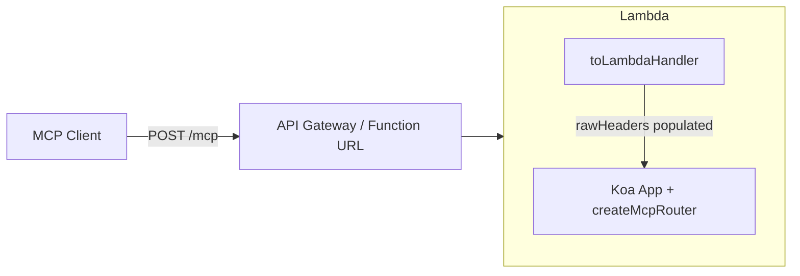

# @ttoss/http-server-serverless

AWS Lambda adapter for [@ttoss/http-server](https://github.com/ttoss/ttoss/tree/main/packages/http-server) applications.

## The problem

When you wrap a Koa app with `serverless-http` and front it with API Gateway, routes that go through `@hono/node-server` — including the MCP transport in `@ttoss/http-server-mcp` — return **HTTP 406 Not Acceptable** on every request, even when the client sends correct headers.

The root cause is that `@hono/node-server` builds its internal Web `Request` object exclusively from `req.rawHeaders` (`newHeadersFromIncoming`), but `serverless-http`'s synthetic `IncomingMessage` populates `req.headers` and leaves `req.rawHeaders` as an empty array. Every header is dropped in translation, so the `Accept: application/json, text/event-stream` header that MCP requires is never seen by the transport.

## The solution

`@ttoss/http-server-serverless` wraps `serverless-http` and reconstructs `req.rawHeaders` from the original API Gateway event before the request enters the Koa pipeline, where the original headers are still available.

## Installation

```bash
pnpm add @ttoss/http-server-serverless
```

## Usage

```typescript
import { App, bodyParser } from '@ttoss/http-server';
import { toLambdaHandler } from '@ttoss/http-server-serverless';

const app = new App();
app.use(bodyParser());
// ... add routes

export const handler = toLambdaHandler(app);
```

### MCP on Lambda

```typescript
import { App, bodyParser } from '@ttoss/http-server';
import { createMcpRouter, McpServer, z } from '@ttoss/http-server-mcp';
import { toLambdaHandler } from '@ttoss/http-server-serverless';

const mcpServer = new McpServer({ name: 'my-mcp-server', version: '1.0.0' });

mcpServer.registerTool(
  'get-weather',
  {
    description: 'Get weather for a location',
    inputSchema: { location: z.string() },
  },
  async ({ location }) => ({
    content: [{ type: 'text', text: `Weather in ${location}: Sunny` }],
  })
);

const app = new App();
app.use(bodyParser());
// Stateless by default — do not pass sessionIdGenerator on Lambda
app.use(createMcpRouter(mcpServer).routes());

export const handler = toLambdaHandler(app);
```



## API

### `toLambdaHandler(app)`

Wraps a Koa `App` in an AWS Lambda handler compatible with API Gateway HTTP API (v2), API Gateway REST API (v1), and Lambda Function URLs.

| Parameter | Type  | Description                        |
| --------- | ----- | ---------------------------------- |
| `app`     | `App` | A `@ttoss/http-server` application |

Returns an async Lambda handler `(event, context) => Promise<Response>`.

### `buildRawHeaders(event)`

Builds a flat `[name, value, name, value, ...]` array from an API Gateway event, suitable for assigning to `req.rawHeaders`.

Handles:

- **v1** (`event.multiValueHeaders`) — preserves original casing and genuine duplicates
- **v2** (`event.headers` + `event.cookies[]`) — reconstructs combined headers and separate cookie entries

## Notes

- Use **stateless mode** (no `sessionIdGenerator`) — stateful mode keeps an in-memory transport that does not survive across Lambda containers.
- Authentication via the `@ttoss/http-server-auth` or `@ttoss/http-server-mcp` `auth` option works normally and pairs naturally with API Gateway authorizers.
- SSE streaming is not used in stateless MCP mode, so a standard API Gateway integration is sufficient.

## Related packages

- [@ttoss/http-server](https://github.com/ttoss/ttoss/tree/main/packages/http-server) — HTTP server foundation
- [@ttoss/http-server-mcp](https://github.com/ttoss/ttoss/tree/main/packages/http-server-mcp) — MCP integration
- [@ttoss/http-server-auth](https://github.com/ttoss/ttoss/tree/main/packages/http-server-auth) — Authentication middleware
