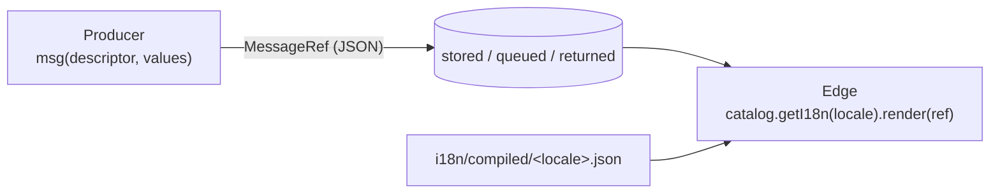

# @ttoss/i18n-core

Framework-agnostic i18n for any JavaScript runtime — Lambdas, HTTP servers, workers, MCP servers — on the same FormatJS/ICU stack as [`@ttoss/react-i18n`](https://ttoss.dev/docs/modules/packages/react-i18n/).

## Installation

```sh
pnpm add @ttoss/i18n-core
pnpm add -D @ttoss/i18n-cli
```

## The idea: produce references, render at the edge

Code that **produces** text usually does not know who will read it: a core function throwing a validation error, or a job notifying an ad account three people share. So it does not format a string. It returns a **message reference** — plain JSON that can be returned, stored in a database or put on a queue — and whatever knows the reader **renders** it: the React tree, an HTTP/GraphQL/MCP boundary, or a channel sender.



## Usage

### Declare messages

Messages are declared with `defineMessages`, exactly as in React. [`@ttoss/config`](https://ttoss.dev/docs/modules/packages/config/)'s build and Jest presets inject the ids; `ttoss-i18n` extracts them.

```ts
// src/notifications.persisted.messages.ts
import { defineMessages } from '@ttoss/i18n-core';

export const messages = defineMessages({
  budgetExhausted: {
    // An explicit id: this reference is stored, so its id must not change
    // when the copy is edited.
    id: 'notifications.budgetExhausted',
    defaultMessage:
      'Campaign {campaign} spent {amount} and was paused on {date}.',
    description: 'Budget exhausted notification body',
  },
});
```

Hashed ids are fine for text rendered immediately. A reference that is **persisted** needs an explicit `id`: a content-hash id changes whenever the source text changes, which would orphan every stored reference. Keep those messages in `*.persisted.messages.ts` files: [`@ttoss/eslint-config`](https://ttoss.dev/docs/modules/packages/eslint-config/) turns `formatjs/no-id` off there (and only there), and `ttoss-i18n --explicit-ids '**/*.persisted.messages.ts'` fails extraction when one of them relies on a hashed id.

### Produce a reference

```ts
import { fmt, msg } from '@ttoss/i18n-core';

const body = msg(messages.budgetExhausted, {
  campaign: 'Black Friday',
  amount: fmt.currency({ value: 1234.5, currency: 'USD' }),
  date: fmt.date({ value: new Date(), timeZone: 'America/Sao_Paulo' }),
});

await db.notifications.insert({ body }); // plain JSON
```

`fmt.*` defers formatting to render time, so the amount is formatted in the **reader's** locale while keeping **its own** currency and time zone: `US$ 1.234,50` for a pt-BR reader, `$1,234.50` for an English one.

| Formatter                                                | Renders                              |
| -------------------------------------------------------- | ------------------------------------ |
| `fmt.currency({ value, currency })`                      | An amount in that currency           |
| `fmt.number({ value, options? })`                        | A number; `options` is JSON-safe     |
| `fmt.percent({ ratio, maximumFractionDigits? })`         | `0.125` → `12.5%`                    |
| `fmt.date({ value, timeZone?, dateStyle?, timeStyle? })` | A date and/or time in that time zone |
| `fmt.date({ value, timeZone?, day?, month?, year? })`    | Only the date components asked for   |
| `fmt.relativeTime({ value })`                            | `yesterday`, `in 3 hours`            |

`fmt.date` takes either a style (`dateStyle` / `timeStyle`, `dateStyle: 'short'` when neither is given) or components (`day`: `numeric` | `2-digit`; `month`: `numeric` | `2-digit` | `long` | `short` | `narrow`; `year`: `numeric` | `2-digit`), never both — `Intl.DateTimeFormat` rejects the mix, so it is a type error and throws a `TypeError`. `fmt.date({ value, timeZone: 'UTC', day: '2-digit', month: '2-digit' })` renders `26/08` for a pt-BR reader and `08/26` for an English one.

A value may also be a string, number, boolean, `null` or another reference, which renders in the same locale.

### Render at the edge

```ts
import { createCatalog } from '@ttoss/i18n-core';

const catalog = createCatalog({
  supported: ['pt-BR', 'en'],
  fallback: 'pt-BR',
  defaultLocale: 'pt-BR', // the language your defaultMessages are written in
  load: async (locale) => {
    return (await import(`../i18n/compiled/${locale}.json`)).default;
  },
});

const i18n = await catalog.getI18n(
  user.locale ?? request.headers['accept-language']
);

i18n.render(body); // plain text: WhatsApp, push, logs
i18n.renderHtml(body); // email: values escaped, <b>/<i>/<p>/<br>… kept
```

A message may use `b`, `strong`, `i`, `em`, `u`, `s`, `small`, `code`, `p`, `div`, `h1`–`h6`, `ul`, `ol`, `li` and `br`. `renderHtml` emits them as written; `render` drops the markup and keeps the text, turning `br` into a line break. ICU tags carry no attributes, so none of them can smuggle any in.

`createCatalog` loads each locale once per process and retries a load that failed. `createI18n({ locale, messages, defaultLocale })` is the same thing without the cache, and both return a full FormatJS `IntlShape`, so `formatMessage`, `formatNumber` and the rest are there too. `render` passes a plain string through unchanged, so rows written before references existed keep rendering.

`render` falls back to a reference's `defaultMessage` silently when the catalog lacks its id. To record which language was actually served, for a stored rendering or a wrong-locale alert, ask first. `isTranslated` is true when every message in the reference has an entry in the catalog, nested references included, and is always true in the source locale:

```ts
const served = i18n.isTranslated(body) ? i18n.locale : i18n.defaultLocale;
```

With react-intl, `isMessageRefTranslated({ intl: useIntl(), ref })` gives the same answer.

### Negotiate a locale

```ts
import { negotiateLocale } from '@ttoss/i18n-core';

negotiateLocale({
  requested: 'fr-CA,fr;q=0.9,es;q=0.8', // a preference, a list, or an Accept-Language header
  supported: ['en', 'pt-BR', 'es'],
  fallback: 'en',
}); // → 'es'
```

For each requested locale, in preference order: an exact match, then the locale with subtags dropped (`pt-BR` → `pt`), then any supported locale of the same language (`pt-PT` → `pt-BR`). `fallback` applies only when nothing matches. Omit it to learn whether anything matched at all, for example before saving a browser's language as a user preference: the result is then `undefined` when nothing does.

### Localized errors

```ts
import { isLocalizedError, LocalizedError, msg } from '@ttoss/i18n-core';

throw new LocalizedError({
  code: 'META_ACCESS_LOST',
  message: msg(messages.accessLost, { account: account.name }),
});

// at the boundary
if (isLocalizedError(error)) {
  return { code: error.code, message: i18n.render(error.messageRef) };
}
```

`code` is for machines and never changes with the copy; `messageRef` is rendered in the request locale; `error.message` holds the source text, for logs. `isLocalizedError` checks the **shape** (`code` string plus `messageRef`), not the class, so an errors package that must stay dependency-free can produce compatible errors, and errors that crossed a bundle boundary are still recognized.

## Boundary adapters

These render a thrown `LocalizedError` at the edge, so producers never need a locale:

- `@ttoss/appsync-api`: `createAppSyncI18nMiddleware`
- `@ttoss/http-server`: `i18nMiddleware`
- `@ttoss/http-server-mcp`: `createGatedToolRegistrar({ i18n })`
- `@ttoss/react-i18n`: `LocalizedText` / `useMessageRef`

## Testing with Jest

`@formatjs/intl` ships ESM only. If your Jest config does not transform `node_modules`, let it transform FormatJS:

```ts
transformIgnorePatterns: ['/node_modules/(?!(\\.pnpm/)?(@formatjs|intl-messageformat))'],
```

## API

| Export                                                                   | What it is                                                                         |
| ------------------------------------------------------------------------ | ---------------------------------------------------------------------------------- |
| `defineMessage`, `defineMessages`                                        | FormatJS authoring, re-exported                                                    |
| `msg(descriptor, values?)`                                               | Create a `MessageRef`; throws on a descriptor without id or text                   |
| `isMessageRef(value)`                                                    | Structural check, survives JSON                                                    |
| `fmt.*`, `isFormatValue(value)`                                          | Deferred formatting                                                                |
| `createI18n({ locale, messages, defaultLocale?, onError? })`             | `IntlShape` plus `render`, `renderHtml`, `formatValue`, `isTranslated`             |
| `isMessageRefTranslated({ intl, ref })`                                  | Whether a reference renders in `intl.locale` without falling back                  |
| `createCatalog({ supported, fallback, load, defaultLocale?, onError? })` | `{ getI18n, negotiate, supported, fallback }`                                      |
| `negotiateLocale({ requested, supported, fallback? })`                   | Best supported locale; `undefined` when nothing matches and there is no `fallback` |
| `LocalizedError`, `isLocalizedError(error)`                              | Errors with a stable code and a reference                                          |
| `DEFAULT_LOCALE`                                                         | `'en'`, the source locale of every `@ttoss/*` package                              |
