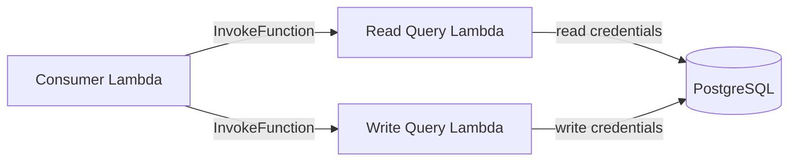

# @ttoss/lambda-postgres-query

Create an AWS Lambda function to securely query a PostgreSQL database in a private VPC subnet without exposing the database to the internet.

## When to Use

Use this package when Lambdas outside your database VPC need to query PostgreSQL. Instead of adding NAT gateways or moving every consumer into the VPC, deploy one or more small query Lambdas inside the VPC and invoke the right one from each consumer.



The best setup is usually multiple query Lambdas from the same code artifact: one for read-only traffic, one for writes, and more when teams, tenants, or schemas need isolated credentials.

## Installation

```bash
pnpm install @ttoss/lambda-postgres-query
```

## Multiple Lambda Setup

This flow creates two query Lambdas, each with dedicated database credentials and CloudFormation outputs that consumers can use as Lambda function names.

### CloudFormation Template

Create `src/cloudformation.ts`:

```typescript
import { createLambdaPostgresQueryTemplate } from '@ttoss/lambda-postgres-query/cloudformation';

const queryLambdas = {
  read: 'LambdaPostgresReadQueryFunction',
  write: 'LambdaPostgresWriteQueryFunction',
} as const;

const databaseParameters = ({ prefix }: { prefix: 'Read' | 'Write' }) => ({
  host: `${prefix}DatabaseHost`,
  name: `${prefix}DatabaseName`,
  username: `${prefix}DatabaseUsername`,
  password: `${prefix}DatabasePassword`,
  port: `${prefix}DatabasePort`,
});

export default createLambdaPostgresQueryTemplate({
  functions: Object.entries(queryLambdas).map(([target, logicalId]) => {
    const prefix = target === 'read' ? 'Read' : 'Write';

    return {
      logicalId,
      databaseParameters: databaseParameters({ prefix }),
      outputArnName: `${logicalId}Arn`,
    };
  }),
});
```

Each `logicalId` is the CloudFormation resource ID for one Lambda. The template does not set `FunctionName`, so AWS creates the physical function name. The template creates two outputs per Lambda: one output named like the logical ID with the physical Lambda function name, and one ARN output named by `outputArnName`.

### Lambda Handler

Create `src/handler.ts`:

```typescript
export { handler } from '@ttoss/lambda-postgres-query/cloudformation';
```

The default handler is `handler.handler`, so the entry file should compile to `handler.js` and export `handler`. If you use another file or export name, set `handler` in the function definition.

### Carlin Configuration

Create `carlin.ts` to map each environment to the CloudFormation parameters used by the template:

```typescript
import { defineConfig, requiredEnv } from 'carlin/config';

type DatabaseConfig = {
  host: string;
  name: string;
  usernameEnv: string;
  passwordEnv: string;
  port?: string;
};

type EnvironmentConfig = {
  securityGroupIds: string[];
  subnetIds: string[];
  databases: {
    read: DatabaseConfig;
    write: DatabaseConfig;
  };
};

const environments = {
  Staging: {
    securityGroupIds: ['sg-staging'],
    subnetIds: ['subnet-staging-a', 'subnet-staging-b'],
    databases: {
      read: {
        host: 'staging-reader.cluster-ro.example.us-east-1.rds.amazonaws.com',
        name: 'app_staging',
        usernameEnv: 'STAGING_READ_DATABASE_USERNAME',
        passwordEnv: 'STAGING_READ_DATABASE_PASSWORD',
      },
      write: {
        host: 'staging-writer.cluster.example.us-east-1.rds.amazonaws.com',
        name: 'app_staging',
        usernameEnv: 'STAGING_WRITE_DATABASE_USERNAME',
        passwordEnv: 'STAGING_WRITE_DATABASE_PASSWORD',
      },
    },
  },
  Production: {
    securityGroupIds: ['sg-production'],
    subnetIds: ['subnet-production-a', 'subnet-production-b'],
    databases: {
      read: {
        host: 'production-reader.cluster-ro.example.us-east-1.rds.amazonaws.com',
        name: 'app_production',
        usernameEnv: 'PRODUCTION_READ_DATABASE_USERNAME',
        passwordEnv: 'PRODUCTION_READ_DATABASE_PASSWORD',
      },
      write: {
        host: 'production-writer.cluster.example.us-east-1.rds.amazonaws.com',
        name: 'app_production',
        usernameEnv: 'PRODUCTION_WRITE_DATABASE_USERNAME',
        passwordEnv: 'PRODUCTION_WRITE_DATABASE_PASSWORD',
      },
    },
  },
} satisfies Record<string, EnvironmentConfig>;

type EnvironmentName = keyof typeof environments;

const databaseParameters = ({
  database,
  prefix,
}: {
  database: DatabaseConfig;
  prefix: 'Read' | 'Write';
}) => ({
  [`${prefix}DatabaseHost`]: database.host,
  [`${prefix}DatabaseName`]: database.name,
  [`${prefix}DatabaseUsername`]: requiredEnv({ name: database.usernameEnv }),
  [`${prefix}DatabasePassword`]: requiredEnv({ name: database.passwordEnv }),
  [`${prefix}DatabasePort`]: database.port || '5432',
});

const getEnvironmentName = ({ environment }: { environment?: string }) => {
  if (!environment || !(environment in environments)) {
    throw new Error(
      `Use --environment with one of: ${Object.keys(environments).join(', ')}`
    );
  }

  return environment as EnvironmentName;
};

const parametersForEnvironment = ({
  environment,
}: {
  environment: EnvironmentName;
}) => {
  const config = environments[environment];

  return {
    SecurityGroupIds: config.securityGroupIds.join(','),
    SubnetIds: config.subnetIds.join(','),
    ...databaseParameters({ database: config.databases.read, prefix: 'Read' }),
    ...databaseParameters({
      database: config.databases.write,
      prefix: 'Write',
    }),
  };
};

export default defineConfig(({ environment }) => {
  const selectedEnvironment = getEnvironmentName({ environment });

  return {
    lambdaFormat: 'cjs',
    parameters: parametersForEnvironment({ environment: selectedEnvironment }),
  };
});
```

Keep secrets in `.env` or CI variables, and keep non-secret environment values in `environments`. This config resolves secrets only for the selected `--environment`, so a staging deploy does not require production credentials. The keys returned by `databaseParameters` must match the parameter names used in `src/cloudformation.ts`.

### Deploy

Add a deploy script:

```json
{
  "scripts": {
    "deploy": "carlin deploy"
  }
}
```

Deploy one environment:

```bash
pnpm deploy --environment Staging
```

Set `lambdaFormat: 'cjs'` because `pg` requires CommonJS in this package.

## Runtime Parameters

The template creates these stack parameters:

- `SecurityGroupIds` and `SubnetIds`: VPC config shared by all query Lambdas.
- `ReadDatabase*`: credentials injected only into the read query Lambda.
- `WriteDatabase*`: credentials injected only into the write query Lambda.

Each query Lambda receives only database runtime variables:

```env
DATABASE_HOST=...
DATABASE_NAME=...
DATABASE_USERNAME=...
DATABASE_PASSWORD=...
DATABASE_PORT=5432
```

`SecurityGroupIds` and `SubnetIds` configure `VpcConfig`; they are not Lambda environment variables.

## Usage

### Query from a Consumer Lambda

Use the CloudFormation output value to configure the consumer. For example, set `LAMBDA_POSTGRES_QUERY_FUNCTION_NAME` to the `LambdaPostgresReadQueryFunction` output for read traffic:

```typescript
import { query } from '@ttoss/lambda-postgres-query';
import type { Handler } from 'aws-lambda';

export const handler: Handler = async () => {
  const result = await query('SELECT * FROM users');

  return result.rows;
};
```

Pass `functionName` when a consumer can use more than one query Lambda:

```typescript
import { query } from '@ttoss/lambda-postgres-query';

const users = await query({
  text: 'SELECT * FROM users WHERE active = $1',
  values: [true],
  functionName: process.env.LAMBDA_POSTGRES_READ_QUERY_FUNCTION_NAME,
});

const updatedUser = await query({
  text: 'UPDATE users SET last_seen_at = now() WHERE id = $1 RETURNING *',
  values: [userId],
  functionName: process.env.LAMBDA_POSTGRES_WRITE_QUERY_FUNCTION_NAME,
});
```

### Advanced Query Options

```typescript
import { query } from '@ttoss/lambda-postgres-query';

// Query with parameters
const result = await query({
  text: 'SELECT * FROM users WHERE id = $1',
  values: [userId],
});

// Disable automatic camelCase conversion
const result = await query({
  text: 'SELECT * FROM users',
  camelCaseKeys: false, // Defaults to true
});
```

## Security: Isolating Access Per Lambda

Each function in `createLambdaPostgresQueryTemplate` can use different `databaseParameters`, so each deployed Lambda can receive different credentials. Use read-only database credentials for read consumers, write credentials only where writes are required, and separate IAM permissions by Lambda ARN.

Grant each consumer `lambda:InvokeFunction` only for the ARN output it needs, such as `LambdaPostgresReadQueryFunctionArn` for read-only consumers.

ARN outputs are exported with this CloudFormation export name pattern:

- `${AWS::StackName}-${outputArnName}`

The practical reason to export these names is also deletion safety: when another stack imports an ARN export, CloudFormation blocks deleting the producer stack resource until that import is removed.

For example, `LambdaPostgresReadQueryFunctionArn` is exported as `${AWS::StackName}-LambdaPostgresReadQueryFunctionArn`.

In a consumer stack, define a parameter with that export name and import it using `importValueFromParameter`:

```typescript
import { importValueFromParameter } from '@ttoss/cloudformation';

const resources = {
  InvokePermission: {
    Type: 'AWS::Lambda::Permission',
    Properties: {
      FunctionName: importValueFromParameter('ReadQueryFunctionArnExportName'),
      Action: 'lambda:InvokeFunction',
      Principal: 'apigateway.amazonaws.com',
    },
  },
};
```

## API Reference

### `createLambdaPostgresQueryTemplate(options?)`

Creates a CloudFormation template for one or more PostgreSQL query Lambdas.

#### Parameters

- `functions` (array, optional): Lambda definitions. Each item supports:
  - `logicalId` (string, optional): CloudFormation logical ID and function-name output key. Default: `LAMBDA_POSTGRES_QUERY_FUNCTION_DEFAULT_NAME`
  - `name` (string, optional): Backward-compatible alias for `logicalId`. It does not set the AWS physical function name
  - `handler` (string, optional): Handler function. Default: `'handler.handler'`
  - `databaseParameters` (object, optional): CloudFormation parameter names used to inject database settings into that Lambda
  - `outputArnName` (string, optional): Output key for the function ARN. Default: `${name}Arn`
    - The ARN output is exported with `Export.Name = ${AWS::StackName}-${outputArnName}`
- `memorySize` (number, optional): Lambda memory size in MB. Default: `128`
- `timeout` (number, optional): Lambda timeout in seconds. Default: `30`
- `deletionProtection` (boolean, optional): Adds `DeletionPolicy: Retain` and `UpdateReplacePolicy: Retain` to each Lambda resource so stack updates/deletes do not remove functions. Default: `false`

#### Returns

A CloudFormation template object.

### `query(params)`

Queries the PostgreSQL database by invoking the VPC Lambda function.

#### Parameters

Accepts either a SQL string or an options object extending [`QueryConfig`](https://node-postgres.com/apis/client#queryconfig) with additional properties:

- `text` (string): SQL query text
- `values` (array, optional): Query parameter values
- `functionName` (string, optional): Physical query Lambda name or ARN. Default: `process.env.LAMBDA_POSTGRES_QUERY_FUNCTION_NAME`
- `camelCaseKeys` (boolean, optional): Convert snake_case column names to camelCase. Default: `true`

#### Returns

A [`QueryResult`](https://node-postgres.com/apis/result) object with transformed rows.

### `handler`

AWS Lambda handler for processing database queries inside the VPC. It reads `DATABASE_NAME`, `DATABASE_USERNAME`, `DATABASE_PASSWORD`, `DATABASE_HOST`, and `DATABASE_PORT` from the Lambda environment. Those variables are injected from each function's `databaseParameters` mapping.
