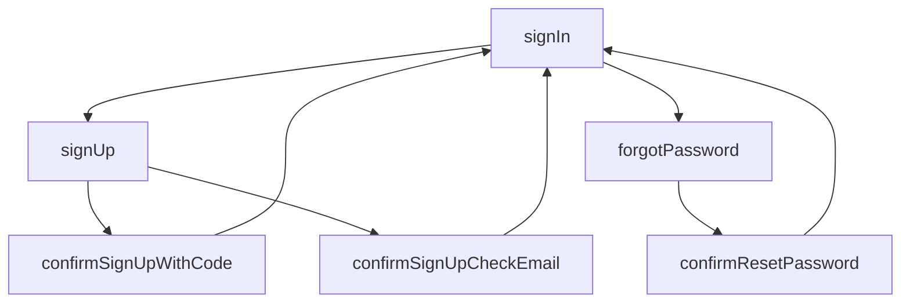

# @ttoss/react-auth-core

Provider-agnostic authentication components and abstractions for React applications with screen-based flow management.

## Installation

```bash
pnpm add @ttoss/react-auth-core
```

## Quickstart

```tsx
import {
  AuthProvider,
  Auth,
  useAuth,
  useAuthScreen,
} from '@ttoss/react-auth-core';

// 1. Wrap your app with AuthProvider
function App() {
  return (
    <AuthProvider signOut={async () => await myAuthService.signOut()}>
      <AuthenticatedApp />
    </AuthProvider>
  );
}

// 2. Create auth flow with handlers
function LoginPage() {
  const { screen, setScreen } = useAuthScreen();

  return (
    <Auth
      screen={screen}
      setScreen={setScreen}
      onSignIn={async ({ email, password }) => {
        await myAuthService.signIn(email, password);
      }}
      onSignUp={async ({ email, password }) => {
        await myAuthService.signUp(email, password);
        setScreen({ value: 'confirmSignUpCheckEmail' });
      }}
    />
  );
}

// 3. Use authentication state
function AuthenticatedApp() {
  const { isAuthenticated, user, signOut } = useAuth();

  if (!isAuthenticated) {
    return <LoginPage />;
  }

  return (
    <div>
      <p>Welcome, {user?.email}</p>
      <button onClick={signOut}>Sign Out</button>
    </div>
  );
}
```

## Features

- **Screen-based flows**: Manages authentication through distinct screens (signIn, signUp, forgotPassword, etc.)
- **Provider agnostic**: Works with any authentication service - you provide the handlers
- **Type-safe**: Full TypeScript support with comprehensive type definitions
- **UI components**: Pre-built forms and layouts for common authentication flows
- **Error handling**: Built-in error boundaries and proper error management

## Core Concepts

### Authentication Screens



### Provider Pattern

The package uses React Context to manage authentication state across your application. You provide the authentication logic, and the components handle the UI and flow management.

## API Reference

### AuthProvider

Wraps your application to provide authentication context.

```tsx
<AuthProvider
  getAuthData={() => Promise<AuthData>} // Optional: fetch initial auth state
  signOut={() => Promise<void>} // Required: sign out handler
>
  {children}
</AuthProvider>
```

### useAuth Hook

Access authentication state and actions.

```tsx
const {
  isAuthenticated, // boolean
  user, // AuthUser | null
  tokens, // AuthTokens | null
  signOut, // () => Promise<void>
  setAuthData, // Update auth state manually
} = useAuth();
```

### Auth Component

Main authentication flow component.

```tsx
<Auth
  screen={screen} // Current screen state
  setScreen={setScreen} // Screen navigation function
  onSignIn={handleSignIn} // Sign in handler
  onSignUp={handleSignUp} // Sign up handler (optional)
  onForgotPassword={handleForgotPassword} // Forgot password handler (optional)
  passwordMinimumLength={8} // Password validation (optional)
  logo={<MyLogo />} // Custom logo (optional)
  layout={{
    // Layout configuration (optional)
    fullScreen: true,
    sideContent: <BrandingContent />,
    sideContentPosition: 'left',
  }}
/>
```

### useAuthScreen Hook

Manages authentication screen state and transitions.

```tsx
const { screen, setScreen } = useAuthScreen({
  value: 'signIn', // Initial screen (optional, defaults to 'signIn')
});
```

## TypeScript Types

Key type definitions for implementing authentication handlers:

```tsx
type AuthUser = {
  id: string;
  email: string;
  emailVerified?: boolean;
};

type AuthTokens = {
  accessToken: string;
  refreshToken?: string;
  idToken?: string;
  expiresIn?: number;
  expiresAt?: number;
};

type OnSignIn = (params: { email: string; password: string }) => Promise<void>;
type OnSignUp = (params: { email: string; password: string }) => Promise<void>;
type OnForgotPassword = (params: { email: string }) => Promise<void>;
```
