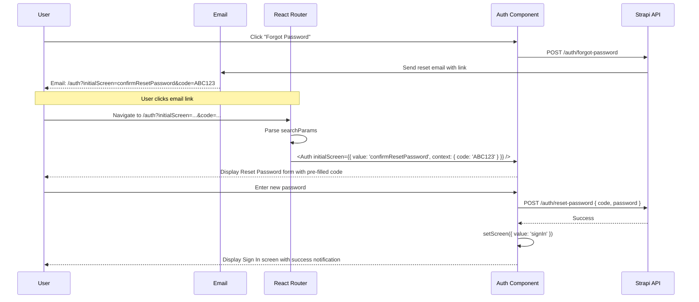

# @ttoss/react-auth-strapi

Pre-configured authentication components for React applications using Strapi CMS backend with [strapi-plugin-refresh-token](https://github.com/redon2/strapi-plugin-refresh-token).

## Installation

```bash
pnpm add @ttoss/react-auth-strapi @ttoss/react-notifications
```

## Quickstart

```tsx
import { AuthProvider, Auth, useAuth } from '@ttoss/react-auth-strapi';
import { NotificationProvider } from '@ttoss/react-notifications';

// 1. Wrap your app with providers
function App() {
  return (
    <NotificationProvider>
      <AuthProvider apiUrl="https://your-strapi-api.com/api">
        <AuthenticatedApp />
      </AuthProvider>
    </NotificationProvider>
  );
}

// 2. Use the pre-built Auth component
function LoginPage() {
  return <Auth />;
}

// 3. Access authentication state
function AuthenticatedApp() {
  const { isAuthenticated, user, signOut } = useAuth();

  if (!isAuthenticated) {
    return <LoginPage />;
  }

  return (
    <div>
      <p>Welcome, {user?.email}</p>
      <button onClick={signOut}>Sign Out</button>
    </div>
  );
}
```

## Features

- **Zero configuration**: Pre-configured Strapi authentication handlers
- **Complete auth flows**: Sign in, sign up, forgot password, email confirmation
- **Token management**: Automatic refresh token handling with secure storage
- **Error handling**: Built-in notifications for authentication errors
- **Email verification**: Automatic resend confirmation emails for unverified accounts

## Strapi Backend Setup

This package requires Strapi with specific plugins and configuration:

### Required Strapi Plugins

1. **Users & Permissions plugin** (built-in)
2. **[strapi-plugin-refresh-token](https://github.com/redon2/strapi-plugin-refresh-token)** for token refresh functionality

```bash
npm install strapi-plugin-refresh-token
```

### Strapi API Endpoints

The package expects these Strapi endpoints to be available:


- `POST /auth/local` - Sign in with email/password
- `POST /auth/local/register` - User registration
- `POST /auth/forgot-password` - Request password reset
- `POST /auth/send-email-confirmation` - Resend email confirmation
- `POST /auth/local/refresh` - Refresh access token
- `GET /users/me` - Get current user profile

## API Reference

### AuthProvider

```tsx
<AuthProvider
  apiUrl="https://your-strapi-api.com/api" // Your Strapi API base URL
>
  {children}
</AuthProvider>
```

The provider automatically:

- Manages refresh tokens in localStorage
- Handles token refresh on app startup
- Provides authentication context to child components

### Auth Component

Pre-configured authentication flow with all handlers implemented:

```tsx
<Auth />
```

The component automatically handles:

- **Sign in**: Authenticates with Strapi local strategy
- **Sign up**: Registers new users and triggers email confirmation
- **Forgot password**: Initiates password reset flow
- **Email confirmation**: Manages email verification process
- **Error notifications**: Shows user-friendly error messages

#### Props

```tsx
<Auth
  initialScreen={{ value: 'signUp' }} // Optional: start on a specific screen
  logo={<MyLogo />} // Optional: custom logo
  layout={{
    // Optional: layout configuration
    fullScreen: true,
    sideContent: <BrandingContent />,
    sideContentPosition: 'left',
  }}
/>
```

**initialScreen**: Set the initial authentication screen to display. Useful for:

- Deep linking to specific auth flows (e.g., `/auth/signup` → `{ value: 'signUp' }`)
- Redirecting users to password reset from email links
- Pre-selecting sign up vs sign in based on user context

Available screens:

- `{ value: 'signIn' }` - Sign in screen (default)
- `{ value: 'signUp' }` - Sign up screen
- `{ value: 'forgotPassword' }` - Forgot password screen
- `{ value: 'confirmSignUpCheckEmail' }` - Email confirmation reminder
- `{ value: 'confirmResetPassword', context: { email: string } }` - Password reset screen

### useAuth Hook

Enhanced version of the core useAuth hook with Strapi-specific context:

```tsx
const {
  isAuthenticated, // boolean
  user, // { id: string, email: string, emailVerified?: boolean }
  tokens, // { accessToken: string, refreshToken: string }
  signOut, // () => Promise<void>
  setAuthData, // Update auth state manually
  apiUrl, // Strapi API URL from context
} = useAuth();
```

## Authentication Flow


## Password Reset Flow with Email Links

### Email Template Configuration

When configuring the password reset email template in Strapi, use this URL format to enable deep linking:

```html
<p>We received a request to reset your password.</p>
<p>If it was you, click the link below to create a new password:</p>
<p><%= URL %>/auth?initialScreen=confirmResetPassword&code=<%= TOKEN %></p>
<p>If it wasn't you, ignore this email. Your account will remain secure.</p>
<p>Thank you,</p>
<p>Team</p>
```

### React Router Integration

To handle password reset links from email, configure your route to parse URL parameters and pass them to the Auth component:

```tsx
import { useSearchParams } from 'react-router-dom';
import { Auth, type AuthScreen } from '@ttoss/react-auth-strapi';

function AuthPage() {
  const [searchParams] = useSearchParams();

  // Parse URL parameters from email link
  const initialScreenParam = searchParams.get('initialScreen');
  const code = searchParams.get('code');

  // Build the initialScreen object
  let initialScreen: AuthScreen | undefined;

  if (initialScreenParam === 'confirmResetPassword' && code) {
    initialScreen = {
      value: 'confirmResetPassword',
      context: { code },
    };
  } else if (initialScreenParam) {
    // Handle other screen types without context
    initialScreen = { value: initialScreenParam };
  }

  return <Auth initialScreen={initialScreen} />;
}
```

### Route Configuration

```tsx
import { BrowserRouter, Routes, Route, Navigate } from 'react-router-dom';
import { AuthProvider } from '@ttoss/react-auth-strapi';
import { NotificationProvider } from '@ttoss/react-notifications';

function App() {
  return (
    <NotificationProvider>
      <AuthProvider apiUrl="https://your-strapi-api.com/api">
        <BrowserRouter>
          <Routes>
            <Route path="/auth" element={<AuthPage />} />
            <Route path="/" element={<HomePage />} />
          </Routes>
        </BrowserRouter>
      </AuthProvider>
    </NotificationProvider>
  );
}
```

### Complete Flow



## Error Handling

The package integrates with `@ttoss/react-notifications` to display authentication errors:

- **Invalid credentials**: "Sign in failed" notification
- **Unconfirmed email**: Automatically resends confirmation email
- **Registration errors**: "Sign up failed" with specific error message
- **Network errors**: Generic error messages for API failures

## Token Security

### Refresh Token Storage

- Refresh tokens are stored in `localStorage` with the key `ttoss-strapi-auth-refresh-token`
- Access tokens are kept in memory only (React state)
- Tokens are automatically cleared on sign out or authentication errors

### Automatic Token Refresh

- On app startup, attempts to refresh tokens if a refresh token exists
- If refresh fails, user is automatically signed out
- No manual token management required

## Dependencies

- `@ttoss/react-auth-core`: Core authentication abstractions
- `@ttoss/react-notifications`: Error and success notifications

## Type Definitions

```tsx
type StrapiUser = {
  id: string;
  email: string;
  emailVerified?: boolean;
};

type StrapiTokens = {
  accessToken: string; // JWT from Strapi
  refreshToken: string; // Refresh token from plugin
};

type StrapiAuthResponse = {
  jwt: string;
  refreshToken: string;
  user: {
    id: string;
    email: string;
    confirmed: boolean;
  };
};
```
