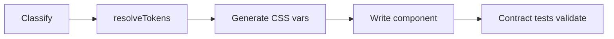

# @ttoss/ui2 — Semantic Contract as Code

Every major component library ships tokens and components. None of them ships the **contract between them** — the explicit layer that defines how meaning flows from tokens to components to applications. That is [the missing layer](https://ttoss.dev/blog/2026/03/09/the-missing-layer-in-design-systems-semantic-contract) in design systems.

ui2 makes that contract **formal, queryable, and enforceable**.

## How Libraries Compare

| Capability               | Tailwind  | Shadcn/UI          | Chakra UI             | Material UI             | Park UI      | **ui2**                                |
| ------------------------ | --------- | ------------------ | --------------------- | ----------------------- | ------------ | -------------------------------------- |
| **Design tokens**        | Utilities | CSS vars           | Theme object          | Theme object            | Panda tokens | **Two-layer (core → semantic)**        |
| **Token semantics**      | None      | Naming conventions | Partial (colorScheme) | Partial (palette roles) | Partial      | **Per-category semantic grammars**     |
| **Component model**      | None      | Implicit           | Implicit              | Partial (spec slots)    | Implicit     | **Formal: Responsibility + Host.Role** |
| **Queryable contract**   | No        | No                 | No                    | No                      | No           | **Yes — `resolveTokens()`**            |
| **AI-ready**             | No        | No                 | No                    | No                      | No           | **Yes — deterministic resolution**     |
| **Contract enforcement** | No        | No                 | No                    | No                      | No           | **Yes — generic contract tests**       |

## What ui2 Does Differently

### 1. Formal Component Model

Every component is classified by three dimensions: **Responsibility** (what it _is_), **Host** (what composition it participates in), and **Role** (what it does inside that composition).

A `Button` is always `Action`. Inside a dialog footer, it becomes `Action` + `ActionSet.primary`. Context refines behavior, not identity.

```ts
// Responsibility: Action (always)
// Inside a dialog footer: ActionSet.primary
// As a secondary action: ActionSet.secondary
// As a dismiss action: ActionSet.dismiss
```

No other library formalizes this. Every library leaves it implicit:

```tsx
// Target meaning in ui2 terms:
// Responsibility: Action
// Host.Role: ActionSet.primary | ActionSet.secondary | ActionSet.dismiss

// Tailwind — ad-hoc classes can imitate visuals, but not encode ActionSet semantics
<button className="bg-blue-600 text-white">Save</button>
<button className="border border-gray-300">Cancel</button>
<button className="text-gray-500">Close</button>
// Which one is ActionSet.dismiss vs secondary? No structural contract.

// Shadcn/UI — semantic-looking variants still remain local conventions
<Button variant="primary">Save</Button>
<Button variant="secondary">Cancel</Button>
<Button variant="ghost">Close</Button>
// "primary/secondary/ghost" do not guarantee Action + ActionSet.* semantics across components.

// Chakra UI — even with semantic names, intent is not bound to compositional host
<Button variant="solid" colorScheme="blue">Save</Button>
<Button variant="outline" colorScheme="blue">Cancel</Button>
<Button variant="ghost" colorScheme="gray">Close</Button>
// Visual API can mirror roles, but nothing enforces ActionSet.primary/secondary/dismiss.

// Material UI — same issue with contained/outlined/text (or custom semantic variants)
<Button variant="contained" color="primary">Save</Button>
<Button variant="outlined" color="primary">Cancel</Button>
<Button variant="text" color="inherit">Close</Button>
// Can look correct, but Host.Role meaning is implicit and can drift per team/screen.

// Park UI — supports variants, but Host.Role contract is still convention-only
<Button variant="solid">Save</Button>
<Button variant="outline">Cancel</Button>
<Button variant="ghost">Close</Button>
// Even if renamed to primary/secondary/dismiss, mapping remains ad-hoc unless formally modeled.
```

In all cases, APIs can express appearance and even role-like labels, but they do not encode the full semantic contract (`Action` + `ActionSet.primary|secondary|dismiss`) as a first-class model. In ui2, composition is explicit and queryable: `ActionSet.primary` means "main action of this set" regardless of visual style, and token resolution follows that contract deterministically.

### 2. Queryable Semantic Contract

`resolveTokens()` returns exactly which tokens a component should consume given its classification:

```ts
import { resolveTokens } from '@ttoss/ui2';

resolveTokens({ responsibility: 'Action' });
// → { color: 'action.primary', textStyle: 'label.md', spacing: 'inset.control', ... }

resolveTokens({
  responsibility: 'Action',
  host: 'ActionSet',
  role: 'secondary',
});
// → { color: 'action.secondary', textStyle: 'label.md', ... }

resolveTokens({
  responsibility: 'Structure',
  host: 'FieldFrame',
  role: 'label',
});
// → { color: 'content.primary', textStyle: 'label.md', ... }
```

Developers query the model instead of memorizing token paths. AI agents resolve tokens deterministically instead of inferring from examples.

### 3. Semantic Token Engine (theme-v2)

[`@ttoss/theme2`](https://ttoss.dev/docs/design/design-system-v2/design-tokens) powers ui2 with a two-layer token architecture (core → semantic) where each token category has its own semantic grammar:

| Category       | Grammar                           | Example                           |
| -------------- | --------------------------------- | --------------------------------- |
| **Color**      | `{ux}.{role}.{dimension}.{state}` | `action.primary.background.hover` |
| **Typography** | `text.{family}.{step}`            | `text.label.md`                   |
| **Spacing**    | `{pattern}.{context}.{step}`      | `inset.control.md`                |
| **Elevation**  | `elevation.{context}`             | `elevation.modal`                 |
| **Radii**      | `radii.semantic.{alias}`          | `radii.semantic.control`          |

Components never consume core tokens. Every token name encodes **intent**, not appearance — a red element is `action.negative.background.default` (destructive action) or `feedback.negative.text.default` (error message), never just "red."

theme-v2 delivers this through three universal outputs: CSS Custom Properties (`toCssVars`), Flat Token Map (`toFlatTokens`), and W3C DTCG (`toDTCG`). Built-in themes, runtime theme/mode switching, and SSR support come out of the box. ui2 components consume the CSS Custom Properties layer — any framework-specific adapter is a trivial reshaping of the same token data.

### 4. CSS Custom Property Bridge

Token specs map deterministically to `--tt-*` CSS custom properties:

```ts
colorVar('action.primary', 'background'); // '--tt-action-primary-background-default'
colorVar('action.primary', 'background', 'hover'); // '--tt-action-primary-background-hover'
textStyleVars('label.md'); // { fontFamily: '--tt-text-label-md-fontFamily', ... }
spacingVar('inset.control', 'md'); // '--tt-spacing-inset-control-md'
```

No gap between model and implementation — the model produces the exact CSS variable names components consume.

### 5. Generic Contract Tests

Architectural tests validate **every component automatically** against structural invariants: export/registry sync, render safety, CSS class presence, className merging, BEM convention, and token consistency with the resolved `TokenSpec`.

Adding a new component requires a single registry entry. Contract tests run automatically.

```ts
// componentRegistry.tsx — one entry per component
{ name: 'Button', responsibility: 'Action', render: () => <Button>Click</Button>, ... }

// componentContracts.test.tsx — validates ALL registered components
```

### 6. Deterministic AI Workflow



Each step is deterministic: classify the component, query the model, generate CSS variable names, write the implementation, validate with contract tests. Compare this to other libraries where an agent infers token usage probabilistically from examples — with no structural verification. See [why this matters for AI](https://ttoss.dev/blog/2026/03/09/the-missing-layer-in-design-systems-semantic-contract#why-this-matters-even-more-with-ai).

## Why This Matters

**For developers** — "which token should I use?" is a function call, not a documentation search.

**For AI agents** — deterministic resolution replaces probabilistic inference. Contract tests catch violations automatically.

**For scale** — the semantic contract is the durable layer. Themes change, frameworks migrate, implementations evolve — the contract remains stable.

**For multi-brand** — the same component works across brands. The contract defines _what_ to consume; themes define _which values_ flow through.

## Architecture

```
Core Tokens → Semantic Tokens → Component Model → Components → Patterns → Applications
(values)      (intent)          (contract)        (implementation)
```

The Component Model is the explicit layer between tokens and components that every other design system leaves implicit.
